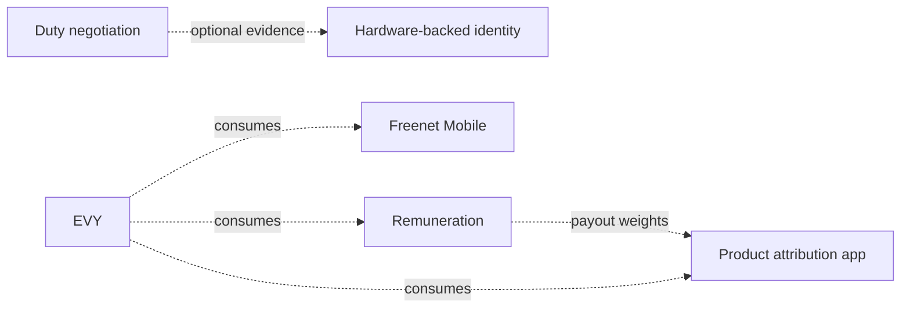

# Freenet plans

Plans for building on [Freenet](https://freenet.org), a decentralized network where the devices of the people using it store the data and move the messages. There are no central servers, so problems servers normally solve (identity, capacity, credit, payments) each need their own design.

## Five independent plans

Each folder below is one plan: reviewed, approved, and built on its own. No product or other plan requires any of them; every arrow between them is an optional integration, never a prerequisite.

| Plan | What it delivers |
| --- | --- |
| [Hardware-backed identity](hardware-identity/README.md) | Proof that a key lives in real security hardware on a genuine device, so creating identities costs something |
| [Duty negotiation](duty-negotiation/README.md) | A protocol for peers to request lighter network duties in exchange for a metered allowance, sized by locally computed reputation |
| [Freenet Mobile](freenet-mobile/README.md) | The Freenet engine inside iOS and Android apps, connected as a peer that does no work for others |
| [Product attribution app](attribution/README.md) | A verifiable record of who contributed what to a product, with no authority able to grant or deny credit |
| [Remuneration](remuneration/README.md) | Currency-agnostic payments: Freenet holds the auditable books while external rails (cards, banks, crypto, cash) move the money |

Dashed arrows are optional consumption: duty negotiation works without hardware identity (Ghost Keys and a floor tier suffice), remuneration works without attribution (fixed recipients), and Freenet Mobile works without duty negotiation (an unmetered role).

## EVY

Everything else lives in the [EVY folder](evy/README.md): the plans for the EVY everything-app and the reusable AppKit blocks it is assembled from. Those blocks contribute toward EVY and are reviewed there, not independently.

## Reference material

- [Freenet whitepaper source](https://github.com/freenet/paper-1)
- [Freenet Core](https://github.com/freenet/freenet-core)
- [Freenet contracts](https://freenet.org/build/manual/components/contracts/), [delegates](https://freenet.org/build/manual/components/delegates/), [user interfaces](https://freenet.org/build/manual/components/ui/), [TypeScript SDK](https://freenet.org/build/manual/typescript-sdk/)
- [Ghost Keys](https://freenet.org/ghostkey/) and the [ghostkeys repository](https://github.com/freenet/ghostkeys)
- [Atlas discovery RFC](https://github.com/freenet/atlas), [River](https://github.com/freenet/river), [Harvest](https://github.com/freenet/harvest)
- [EVY](https://github.com/EVY-Platform/evy)
