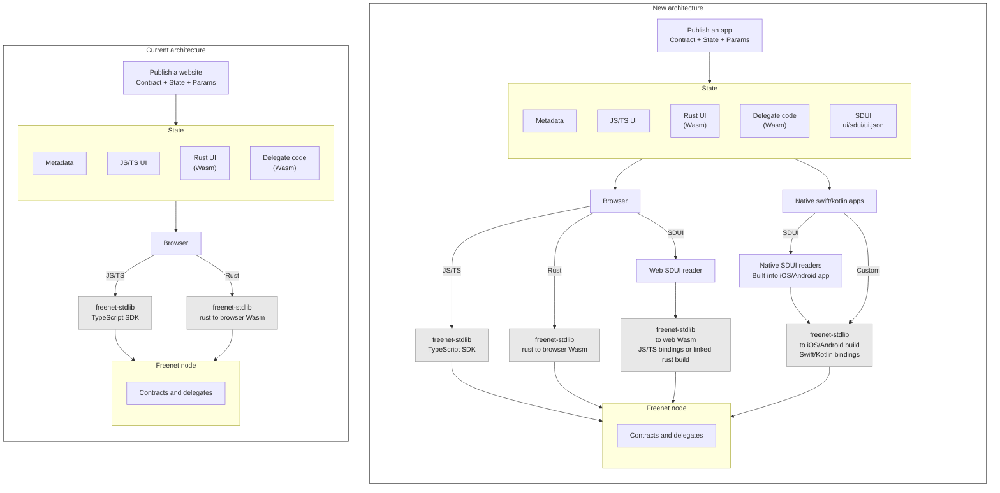
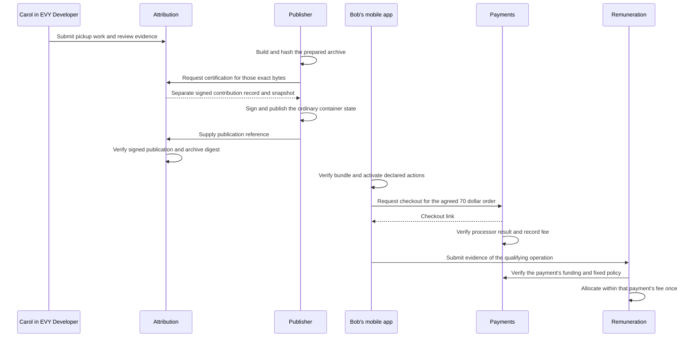

# EVY + Freenet <3

## EVY's vision

Imagine smartphones and the internet built by the people, for the people. We want to enable anyone to connect consumers to services, free from gatekeepers taking a cut, and compensate contributors fairly.

A driver could deliver food without a middleman taking 30%. You could sell your skateboard without your data being used to target you with ads. Bringing these services together in one open platform means you can use the same identity and payment setup, instead of downloading another app, signing up and entering your details each time.

That is the vision for EVY. Its code and data are open for anyone to inspect, so people can verify how it works. Private data is readable only by the parties who need it, such as a delivery address that only the driver making the delivery can decrypt.

EVY starts with a simple idea: a super app on your phone that acts as your identity and your key. The app is community built, and those contributors get paid when an in-app transaction uses their functionality, giving them a reason to build useful features.

A server-driven UI system lets contributors develop, test and release functionality that people can use as it becomes available. Shared components and themes give the app a consistent design and familiar controls across services.

The launch product is a Marketplace for buying and selling locally. It arranges pickup, delivery and shipping as signed structured terms, and it shows the exact address only to the two people meeting.

**Why Freenet fits EVY very well**: Freenet distributes applications through its peer network with verified authorship, this means the app is distributed by the community, not a single entity. Its delegate system keeps private data and signing keys on the device, exactly as EVY intended with it's device-only privacy.

## The approach at a glance

Developers can build JavaScript/TypeScript or Rust clients today. These plans add SDUI readers and reusable Swift/Kotlin integrations for native mobile applications.

#### From a developer's change to a contributor payment

A contributor payment needs a paid operation, so this diagram follows the Marketplace sale, the one flow in these plans that carries money. The [running example](#running-example) below covers everything else.

## Roadmap

| Plan | What for |
| --- | --- |
| [Application bundles](appkit/bundles.md) | Bob opens a signed Freenet container holding definitions, screens and domain artifacts. |
| [Hosts](appkit/hosts.md) | The host verifies bundles, manages installed copies and asks for access in a trusted screen. |
| [Identity and recovery](identity/README.md) | Alice recovers the keys and private records that hold her rooms. |
| [Freenet mobile app](freenet-mobile-app/README.md) | People discover and open compatible Freenet applications in one mobile app. |
| [Marketplace](marketplace/README.md) | People buy and sell nearby, arrange fulfillment and pay through the shared platform. |
| [SDUI](appkit/sdui.md) | A publisher describes screens once. Readers display them using browser, iPhone and Android controls. |
| [Actions and delegates](appkit/actions-and-delegates.md) | A tap on a declared action runs bounded steps and asks the application's delegate to prepare the result. |
| [Data and pending operations](appkit/data-and-operations.md) | Screens read verified views, keep drafts offline and track each submitted update to its outcome. |
| [Payments](payment/README.md) | The payment service signs the payment result for the agreed order. |
| [EVY Developer platform](evy/README.md) | Developers build SDUI screens, publish bundles and manage contributions and earnings. |
| [Attribution](attribution/README.md) | Accepted contributions have recorded authors, reviews and allocation weights. |
| [Remuneration](remuneration/README.md) | The service allocates funded contributor fees once and accounts for refunds. |
| [Freenet mobile SDK](freenet-mobile/README.md) | A phone embeds Freenet, reconnects and follows the contracts its apps use. |
| [Upgrades and migration](migration/README.md) | Contracts, delegate secrets and publisher keys survive code and key changes. |
| [Atlas sample](atlas-sample/README.md) | Atlas search and publication work through web, SDUI and custom native interfaces. |
| [Peer reputation](reputation-proofs/README.md) | A person proves a supported application claim while limiting disclosure. |

## Risks and limitations

1. SDUI readers and native apps share Rust stdlib through platform adapters and generated bindings. The feasibility stage measures overhead and supported operations before any wider SDK consolidation. Custom JS/TS apps keep the TypeScript SDK.
2. SDUI applications must fit the supported components and action steps. New executor primitives require a reader update. Typed application delegate interfaces are proposed work and need an Atlas proof.
3. Mobile packages contain native libraries and Core's contract/delegate runtime. Device testing and distribution review apply to the complete package.

## Sources

- [Freenet Core](https://github.com/freenet/freenet-core)
- [whitepaper](https://github.com/freenet/paper-1)
- [UI security discussion](https://github.com/freenet/freenet-core/discussions/5380)
- [Atlas](https://github.com/freenet/atlas)
- [Harvest](https://github.com/freenet/harvest)

Shared-library sources: [Rust client API](https://github.com/freenet/freenet-stdlib/blob/main/rust/src/client_api.rs), [TypeScript package](https://github.com/freenet/freenet-stdlib/blob/main/typescript/package.json), [UniFFI](https://mozilla.github.io/uniffi-rs/latest/).
