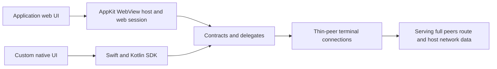
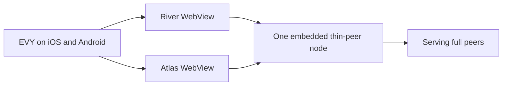
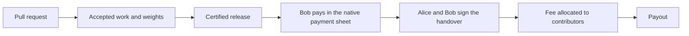
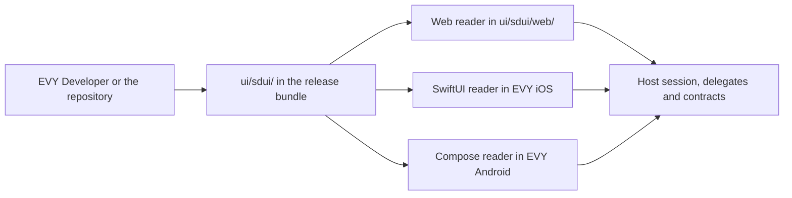

# EVY + Freenet <3

## EVY's vision

Imagine smartphones and the internet built by the people, for the people. We want to enable anyone to connect consumers to services, free from gatekeepers taking a cut, and compensate contributors fairly.

A driver could deliver food without a middleman taking 30%. You could sell your skateboard without your data being used to target you with ads. Bringing these services together in one open platform means you can use the same identity and payment setup, instead of downloading another app, signing up and entering your details each time.

That is the vision for EVY. Its code and data are open for anyone to inspect, so people can verify how it works. Private data is readable only by the parties who need it, such as a delivery address that only the driver making the delivery can decrypt.

EVY starts with a simple idea: a super app on your phone that acts as your identity and your key. The app is community built, and those contributors get paid when an in-app transaction uses their functionality, giving them a reason to build useful features.

A server-driven UI system ensures consistent design and allows contributors and agents to quickly create applications and release them to customers in realtime instead of going through app store release cycles.

The launch product is a Marketplace for buying and selling locally. It arranges pickup as signed structured terms, and it shows the exact address only to the two people meeting.

Freenet fits EVY well. It distributes applications through its peer network with verified authorship, so the community distributes each app, not a single company. Its delegates keep private data and signing keys on the device, which is the device-only privacy EVY needs.

## Roadmap

Start with River running on a reusable mobile AppKit, then extend it into EVY, a host that runs River and Atlas. The last piece before going live is contribution and payment services with a Marketplace pickup pilot. At that point we can go live to real customers with an MVP. The next milestones are optional, but they build pieces of the EVY ecosystem that we should build shortly after.

### 1. Freenet mobile AppKit

Package River for iOS and Android as one mobile app. River's web UI runs in an in-app WebView served by the embedded node, and developers can build custom Swift and Kotlin screens against the SDK.

```mermaid
flowchart LR
    Web[Application web UI] --> Host[AppKit WebView host and web session]
    Native[Custom native UI] --> SDK[Swift and Kotlin SDK]
    Host --> Core[Contracts and delegates]
    SDK --> Core
    Core --> Thin[Thin-peer terminal connections]
    Thin --> Full[Serving full peers route and host network data]
```

- [1.1 Mobile feasibility and supported profiles](1-freenet-mobile-appkit/01-feasibility.md)
- [1.2 Embedded node and mobile SDK](1-freenet-mobile-appkit/02-sdk.md)
- [1.3 Single-application host](1-freenet-mobile-appkit/03-host.md)
- [1.4 Application bundles](1-freenet-mobile-appkit/04-bundles.md)
- [1.5 Identity, keys and local protection](1-freenet-mobile-appkit/05-identity.md)
- [1.6 Application protocols, data and operations](1-freenet-mobile-appkit/06-data-and-operations.md)
- [1.7 Upgrades and migration](1-freenet-mobile-appkit/07-migration.md)
- [1.8 Thin-peer role and cellular data budgets](1-freenet-mobile-appkit/08-thin-peer.md)
- [1.9 Testing and release](1-freenet-mobile-appkit/09-testing-and-release.md)

### 2. EVY mobile app

Rebuild EVY's iOS app and build its Android app on the AppKit from milestone 1 (Freenet mobile AppKit). EVY lists River and Atlas and opens each in its own in-app WebView. Both apps run on one embedded thin-peer node inside EVY.

```mermaid
flowchart LR
    EVY[EVY on iOS and Android] --> River[River WebView]
    EVY --> Atlas[Atlas WebView]
    River --> Node[One embedded thin-peer node]
    Atlas --> Node
    Node --> Full[Serving full peers]
```

- [2.1 EVY shell and curated catalogue](2-evy-mobile-app/01-catalogue.md)
- [2.2 Two apps on one node](2-evy-mobile-app/02-shared-node.md)
- [2.3 Testing and release](2-evy-mobile-app/03-testing-and-release.md)

### 3. Attribution, remuneration and payment

Pay contributors when their code is used in a paid sale. Carol's pull request that reworks River's "Invite member" screen earns her attribution units. Marketplace then runs the first paid flow. Alice sells a skateboard to Bob for 70 dollars, and the 1% contributor fee of 0.70 dollars pays the contributors whose code the sale used.

```mermaid
flowchart LR
    PR[Pull request] --> Accepted[Accepted work and weights]
    Accepted --> Release[Certified release]
    Release --> Checkout[Bob pays in the native payment sheet]
    Checkout --> Handover[Alice and Bob sign the handover]
    Handover --> Allocation[Fee allocated to contributors]
    Allocation --> Payout[Payout]
```

- [3.1 Contributor registration and attribution](3-attribution-remuneration-payment/01-attribution.md)
- [3.2 Release certification](3-attribution-remuneration-payment/02-certification.md)
- [3.3 Marketplace pickup protocol](3-attribution-remuneration-payment/03-marketplace-protocol.md)
- [3.4 Payments and checkout](3-attribution-remuneration-payment/04-payment.md)
- [3.5 Remuneration and payouts](3-attribution-remuneration-payment/05-remuneration.md)
- [3.6 EVY Developer contribution workspace](3-attribution-remuneration-payment/06-developer.md)
- [3.7 Operating readiness](3-attribution-remuneration-payment/07-operations.md)
- [3.8 Marketplace pickup pilot](3-attribution-remuneration-payment/08-marketplace-pilot.md)

### 4. SDUI

Describe screens as data. One screen then runs in the web reader that ships in the app's release bundle and in the native readers built into EVY on iOS and Android. Carol rebuilds River's "Invite member" screen as an SDUI screen in EVY Developer, River publishes it in its next release, and Alice opens it in a browser and in EVY on iOS and Android.

```mermaid
flowchart LR
    Dev[EVY Developer or the repository] --> Files[ui/sdui/ in the release bundle]
    Files --> Web[Web reader in ui/sdui/web/]
    Files --> iOS[SwiftUI reader in EVY iOS]
    Files --> Android[Compose reader in EVY Android]
    Web --> Host[Host session, delegates and contracts]
    iOS --> Host
    Android --> Host
```

- [4.1 SDUI format](4-sdui/01-format.md)
- [4.2 SDUI readers](4-sdui/02-readers.md)
- [4.3 SDUI actions and data](4-sdui/03-actions-and-data.md)
- [4.4 SDUI bundles and publication](4-sdui/04-bundles.md)
- [4.5 EVY Developer visual authoring](4-sdui/05-developer.md)
- [4.6 SDUI testing and release](4-sdui/06-testing-and-release.md)

### 5. Optional extensions

Short plans cover work with a clear next user. Idea notes record research and wait until an app shows the need.

- [5.1 Automated backup](5-optional-extensions/01-backup.md)
- [5.2 Catalogue updates and Atlas search](5-optional-extensions/02-catalogue.md)
- [5.3 Device sync](5-optional-extensions/03-sync.md)
- [5.4 Peer reputation](5-optional-extensions/04-reputation.md) (idea note)
- [5.5 Live authoring collaboration](5-optional-extensions/05-collaboration.md) (idea note)
- [5.6 Shared identity and payment](5-optional-extensions/06-identity-and-payment.md) (idea note)

## Upstream suggestions

The plans need these changes in projects EVY does not own. Each plan's Repositories table lists the new code in Core's `crates/mobile`. The [admission table in 1.3 Single-application host](1-freenet-mobile-appkit/03-host.md#freenet-issues-being-worked-on-that-are-required) lists the Core issues already in progress that each release checks.

### Freenet Core, stdlib and freenet-migrate

| Change | Repository | Issue | Needed by |
| --- | --- | --- | --- |
| Request IDs on client API replies. The client sets an ID on each contract request, and the node copies it into the reply | [freenet-stdlib](https://github.com/freenet/freenet-stdlib), with node support in [freenet-core](https://github.com/freenet/freenet-core) | [freenet-stdlib#106](https://github.com/freenet/freenet-stdlib/issues/106) | [1.2 Embedded node and mobile SDK](1-freenet-mobile-appkit/02-sdk.md#matching-replies-to-requests) |
| Resolve each gateway hostname in the join loop, so the node starts offline | [freenet-core](https://github.com/freenet/freenet-core) | To file | [1.2 Embedded node and mobile SDK](1-freenet-mobile-appkit/02-sdk.md#start-stop-and-reconnect) |
| Accept local UPDATE and Subscribe for stored contracts before the first join, and send them on join | [freenet-core](https://github.com/freenet/freenet-core) | To file | [1.2 Embedded node and mobile SDK](1-freenet-mobile-appkit/02-sdk.md#start-stop-and-reconnect), [1.6 Application protocols, data and operations](1-freenet-mobile-appkit/06-data-and-operations.md#sending-updates) |
| Look up each Wasm instance's memory address again after every contract and delegate call. Host functions already do it ([#3248](https://github.com/freenet/freenet-core/issues/3248)) | [freenet-core](https://github.com/freenet/freenet-core) | To file | [1.2 Embedded node and mobile SDK](1-freenet-mobile-appkit/02-sdk.md#running-wasm) |
| Keychain and Keystore backends for the node encryption key as new `KekBackendKind` variants. The Android build refuses the keyring backend | [freenet-core](https://github.com/freenet/freenet-core) | To file under [#4137](https://github.com/freenet/freenet-core/issues/4137) | [1.2 Embedded node and mobile SDK](1-freenet-mobile-appkit/02-sdk.md#keys), [1.5 Identity, keys and local protection](1-freenet-mobile-appkit/05-identity.md#node-encryption-key) |
| An embedder supplies the `UserInputPrompter`, and Core never spawns a browser on iOS or Android | [freenet-core](https://github.com/freenet/freenet-core) | To file | [1.3 Single-application host](1-freenet-mobile-appkit/03-host.md#background-runs-and-delegate-prompts) |
| A grant table code for each app permission, a call that sets a grant and a public Rust API. Core lists and revokes grants today ([#5730](https://github.com/freenet/freenet-core/pull/5730), [#5744](https://github.com/freenet/freenet-core/pull/5744)) | [freenet-core](https://github.com/freenet/freenet-core) | To file | [1.3 Single-application host](1-freenet-mobile-appkit/03-host.md#base-authorization-and-device-access) |
| Lock and unlock on `SecretsStore`, with a test that checks the zeroizing buffers are wiped ([#5599](https://github.com/freenet/freenet-core/issues/5599)) | [freenet-core](https://github.com/freenet/freenet-core) | To file | [1.5 Identity, keys and local protection](1-freenet-mobile-appkit/05-identity.md#locking-and-unlocking) |
| Thin-peer role and cellular budget enforcement | [freenet-core](https://github.com/freenet/freenet-core) | To file | [1.8 Thin-peer role and cellular data budgets](1-freenet-mobile-appkit/08-thin-peer.md#upstream-work-and-carrier-evidence) |
| Client UPDATEs sent as deltas. Core deferred the raw-delta wire format in [#4072](https://github.com/freenet/freenet-core/pull/4072) | [freenet-core](https://github.com/freenet/freenet-core) | To file | [1.8 Thin-peer role and cellular data budgets](1-freenet-mobile-appkit/08-thin-peer.md#upstream-work-and-carrier-evidence) |
| A user scope on a connection without hosted mode | [freenet-core](https://github.com/freenet/freenet-core) | To file | [2.2 Two apps on one node](2-evy-mobile-app/02-shared-node.md#core-needs) |
| A per-app user scope in notification, lifecycle, wake-up and inter-delegate runs | [freenet-core](https://github.com/freenet/freenet-core) | [#5736](https://github.com/freenet/freenet-core/issues/5736) | [2.2 Two apps on one node](2-evy-mobile-app/02-shared-node.md#core-needs), [5.3 Device sync](5-optional-extensions/03-sync.md#what-core-still-needs) |
| Core moves delegate secrets to a new delegate key | [freenet-core](https://github.com/freenet/freenet-core) | [RFC #5255](https://github.com/freenet/freenet-core/issues/5255) | [4.4 SDUI bundles and publication](4-sdui/04-bundles.md#migration-in-native-readers) |
| Agreement on the sync design that River's sync library follows | [freenet-core](https://github.com/freenet/freenet-core) | [RFC #5587](https://github.com/freenet/freenet-core/issues/5587) | [5.3 Device sync](5-optional-extensions/03-sync.md#what-core-still-needs) |
| Delegates update contracts they do not yet hold | [freenet-core](https://github.com/freenet/freenet-core) | [#5542](https://github.com/freenet/freenet-core/issues/5542) | [5.3 Device sync](5-optional-extensions/03-sync.md#what-core-still-needs) |
| Delegate subscriptions keep the contracts they watch hosted | [freenet-core](https://github.com/freenet/freenet-core) | [#4669](https://github.com/freenet/freenet-core/issues/4669) | [5.3 Device sync](5-optional-extensions/03-sync.md#what-core-still-needs) |
| A delegate GET tells a missing contract from a failed lookup | [freenet-stdlib](https://github.com/freenet/freenet-stdlib) | [freenet-stdlib#131](https://github.com/freenet/freenet-stdlib/issues/131) | [5.3 Device sync](5-optional-extensions/03-sync.md#what-core-still-needs) |

### River

| Change | Issue | Needed by |
| --- | --- | --- |
| The release build ships `app_definition.json` | To file | [1.4 Application bundles](1-freenet-mobile-appkit/04-bundles.md#the-archive-and-its-definition) |
| The release build publishes through the packaging CLI with `--contract-wasm` and River's own `published-contract/web_container_contract.wasm`, so the container key stays the same. River's publisher copies River's signing key into fdev's key file, `~/.config/freenet/website-keys/<name>.toml` | To file | [1.4 Application bundles](1-freenet-mobile-appkit/04-bundles.md#saved-copies-and-recovery) |
| River agrees to one upward version jump, from its counter (30000392) to the Unix seconds that `fdev website publish` stamps | To file | [1.4 Application bundles](1-freenet-mobile-appkit/04-bundles.md#the-archive-and-its-definition) |
| The chat delegate saves drafts and signed messages waiting to be sent. River keeps signing in the page, because delegate calls queue behind contract merges ([river#512](https://github.com/freenet/river/issues/512)) | To file | [1.6 Application protocols, data and operations](1-freenet-mobile-appkit/06-data-and-operations.md#reads-and-local-data) |
| River reclaims old chat delegate copies and unregisters old delegate keys after a migration completes | [river#586](https://github.com/freenet/river/issues/586) | [1.7 Upgrades and migration](1-freenet-mobile-appkit/07-migration.md#retiring-the-old-version) |
| Reporting, blocking, a default content filter and terms before the first post in River's UI. A published support URL and child-safety standards | [river#461](https://github.com/freenet/river/issues/461), [river#371](https://github.com/freenet/river/issues/371) | [1.9 Testing and release](1-freenet-mobile-appkit/09-testing-and-release.md#store-requirements) |
| Invite links built from the share-link base the host supplies, so Alice's invite reads `https://<EVY link domain>/open#raAq.../?invitation=<code>` | To file | [2.1 EVY shell and curated catalogue](2-evy-mobile-app/01-catalogue.md#opening-links-and-alerts) |
| `app_definition.json` declares `river.member.invite`, and the release build rebuilds to the same file digests | [river#678](https://github.com/freenet/river/issues/678) | [3.2 Release certification](3-attribution-remuneration-payment/02-certification.md#certifying-a-version) |
| Chat delegate messages `CreateInvitation` and `PrepareMessage`, with schemas in `ui/sdui/schemas/`. Adding them changes the chat delegate key, so River moves its secrets with freenet-migrate | To file | [4.3 SDUI actions and data](4-sdui/03-actions-and-data.md#calling-a-delegate) |
| A sync library that follows [RFC #5587](https://github.com/freenet/freenet-core/issues/5587), compiled into the chat delegate | To file | [5.3 Device sync](5-optional-extensions/03-sync.md#purpose) |
| Unhides saved in `outbound_dms`, a merge of two concurrent copies of each record and a "Link a device" page | To file, tracking [river#420](https://github.com/freenet/river/issues/420) | [5.3 Device sync](5-optional-extensions/03-sync.md#resolving-conflicts) |

### Atlas

| Change | Issue | Needed by |
| --- | --- | --- |
| `app_definition.json`, publication through the packaging CLI, a Report button on each entry and a support page. Users report entries in Atlas's River room today | [atlas#52](https://github.com/freenet/atlas/issues/52) | [2.1 EVY shell and curated catalogue](2-evy-mobile-app/01-catalogue.md#atlas-in-evy) |
| A starting search query read from `#q=` in the URL. Core's shell already passes the URL fragment to the app | To file | [5.2 Catalogue updates and Atlas search](5-optional-extensions/02-catalogue.md#searching-from-evy-home) |

Core auto-closes feature PRs that have no approved issue ([#4311](https://github.com/freenet/freenet-core/pull/4311)) and ranks issues by what they unblock ([D4412](https://github.com/freenet/freenet-core/discussions/4412)). So we file each row as an issue that names what it unblocks before we open any PR.

## Sources

- [Freenet Core](https://github.com/freenet/freenet-core)
- [freenet-stdlib](https://github.com/freenet/freenet-stdlib)
- [whitepaper](https://github.com/freenet/paper-1)
- [River](https://github.com/freenet/river)
- [Atlas](https://github.com/freenet/atlas)
- [Harvest](https://github.com/freenet/harvest)
- [Delta](https://github.com/freenet/delta)
- [Ghostkeys](https://github.com/freenet/ghostkeys)
- [freenet-migrate](https://github.com/freenet/freenet-migrate)
- [freenet-agent-skills](https://github.com/freenet/freenet-agent-skills)
- [freenet-test-network](https://github.com/freenet/freenet-test-network)
- [freenet-bitcoin](https://github.com/freenet/freenet-bitcoin)
- [freenet-wiki](https://github.com/freenet/freenet-wiki)
- [freenet.org website](https://github.com/freenet/web)
- The related discussions, issues, pull requests and RFCs
