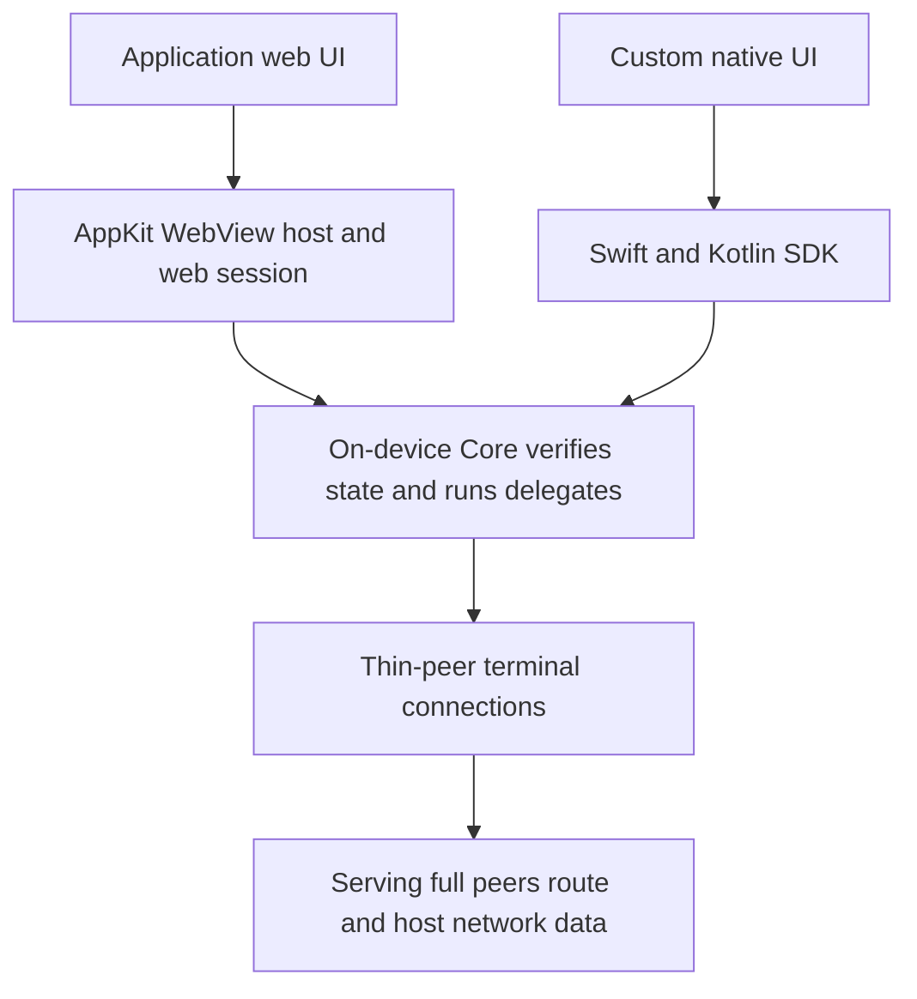

# EVY + Freenet <3

## EVY's vision

Imagine smartphones and the internet built by the people, for the people. We want to enable anyone to connect consumers to services, free from gatekeepers taking a cut, and compensate contributors fairly.

A driver could deliver food without a middleman taking 30%. You could sell your skateboard without your data being used to target you with ads. Bringing these services together in one open platform means you can use the same identity and payment setup, instead of downloading another app, signing up and entering your details each time.

That is the vision for EVY. Its code and data are open for anyone to inspect, so people can verify how it works. Private data is readable only by the parties who need it, such as a delivery address that only the driver making the delivery can decrypt.

EVY starts with a simple idea: a super app on your phone that acts as your identity and your key. The app is community built, and those contributors get paid when an in-app transaction uses their functionality, giving them a reason to build useful features.

A server-driven UI system lets contributors develop, test and release functionality that people can use as it becomes available. Shared components and themes give the app a consistent design and familiar controls across services.

The launch product is a Marketplace for buying and selling locally. It arranges pickup, delivery and shipping as signed structured terms, and it shows the exact address only to the two people meeting.

**Why Freenet fits EVY very well**: Freenet distributes applications through its peer network with verified authorship, this means the app is distributed by the community, not a single entity. Its delegate system keeps private data and signing keys on the device, exactly as EVY intended with it's device-only privacy.

## Roadmap

Start with River running on a reusable mobile AppKit. Build EVY's River-and-Atlas host on that foundation, then add contribution and payment services with a Marketplace pickup pilot. These first three milestones use application-authored web or native interfaces. SDUI and visual authoring form an optional fourth milestone. Other optional extensions have independent adoption gates.

Each milestone has one directory containing its detailed plans. This README owns the milestone scopes, plan indexes, dependencies and release requirements. The 38 detailed plans use zero-padded filenames such as `01-feasibility.md` and `10-thin-peer.md`. Their plan IDs remain `milestone.plan`, so these files represent plans 1.1 and 1.10 within milestone 1.

Each requirement has one owner. Later plans link to that requirement and describe their additions. Plan numbering identifies scope rather than a strict implementation sequence.

### 1. Freenet mobile AppKit

Package one defined application for iOS and Android. River's signed web UI runs in an in-app WebView served by the embedded node. Developers can also build custom Swift/Kotlin screens against the SDK. Each application owns its presentation, orchestration and existing domain protocols. The supported-profile tests in 1.1 establish device and API coverage for each route.

#### Mobile execution

```mermaid
flowchart TD
    Web[Application web UI] --> Host[AppKit WebView host and web session]
    Native[Custom native UI] --> SDK[Swift and Kotlin SDK]
    Host --> Core[On-device Core verifies state and runs delegates]
    SDK --> Core
    Core --> Thin[Thin-peer terminal connections]
    Thin --> Full[Serving full peers route and host network data]
```

[Host admission](1-freenet-mobile-appkit/03-host.md) owns caller authentication, [identity](1-freenet-mobile-appkit/05-identity.md) owns key protection, and [multi-app sessions](2-evy-mobile-app/02-sessions.md) later extend isolation across River and Atlas.

| Plan | Specification |
| --- | --- |
| 1.1 | [Mobile feasibility and supported profiles](1-freenet-mobile-appkit/01-feasibility.md) |
| 1.2 | [Embedded node and mobile SDK](1-freenet-mobile-appkit/02-sdk.md) |
| 1.3 | [Single-application host](1-freenet-mobile-appkit/03-host.md) |
| 1.4 | [Application bundles](1-freenet-mobile-appkit/04-bundles.md) |
| 1.5 | [Identity, keys and local protection](1-freenet-mobile-appkit/05-identity.md) |
| 1.6 | [Application protocols, data and operations](1-freenet-mobile-appkit/06-data-and-operations.md) |
| 1.7 | [Upgrades and migration](1-freenet-mobile-appkit/07-migration.md) |
| 1.8 | [Reference apps and compatibility fixtures](1-freenet-mobile-appkit/08-reference-apps.md) |
| 1.9 | [Developer package and release acceptance](1-freenet-mobile-appkit/09-release.md) |
| 1.10 | [Thin-peer role and cellular data budgets](1-freenet-mobile-appkit/10-thin-peer.md) |

#### Mobile release

Develop the device profile, SDK and Core thin role together. Plan 1.9 requires accepted plans 1.1-1.8 and implemented thin-peer support with approved, passing cellular budgets in 1.10. Numerical release budgets await measurement and approval. Later mobile milestones inherit these limits. Full-peer operation supports controlled development fixtures with separate storage.

River is the single-app release gate, including its installation and update path. Atlas supplies bounded compatibility fixtures in 1.8. Atlas's hosted product flows and concurrent River/Atlas tests belong to the [milestone 2 acceptance suite](2-evy-mobile-app/07-acceptance.md).

### 2. EVY mobile app

Build a curated multi-application host on the released AppKit. Ship hardcoded full application IDs for River and Atlas. Each resolves to a verified signed website with its own UI in a separate, isolated in-app WebView session. Both apps share one embedded thin node.

Application code owns screens and orchestration over its existing protocols. The foundation supplies SDK operations, trusted sessions, base authorization, per-app installation and durable storage. This milestone composes those interfaces across River and Atlas.

| Plan | Specification |
| --- | --- |
| 2.1 | [EVY shell and curated catalogue](2-evy-mobile-app/01-catalogue.md) |
| 2.2 | [Multi-application sessions and authority](2-evy-mobile-app/02-sessions.md) |
| 2.3 | [Installation and updates](2-evy-mobile-app/03-installation-and-updates.md) |
| 2.4 | [Identity, permissions and device access](2-evy-mobile-app/04-permissions.md) |
| 2.5 | [Shared node, data and lifecycle](2-evy-mobile-app/05-lifecycle.md) |
| 2.6 | [Navigation and application management](2-evy-mobile-app/06-navigation.md) |
| 2.7 | [Multi-application acceptance](2-evy-mobile-app/07-acceptance.md) |

#### Two-app release

Release requires milestone 1 acceptance, completed plans 2.1-2.6, and the River-and-Atlas device suite in 2.7. The host verifies application updates and preserves each app's pending work within the shared cellular budget. Development can use pinned fixtures while those gates complete.

[Discovery 5.4](5-optional-extensions/04-discovery.md) separately adds search providers to EVY's home, including Atlas, and signed catalogue updates. Financial features and SDUI have their own gates in milestones 3 and 4.

### 3. Attribution, remuneration and payment

Connect repository work to certified application releases, paid usage and contributor payouts. EVY Developer supports code-based contribution and release workflows. Applications use custom web or native code and concrete domain protocols. Attribution can support publishing independently. The Marketplace pickup pilot requires the full commercial flow.

| Plan | Owned scope |
| --- | --- |
| [3.1 Product and contributor registration](3-attribution-remuneration-payment/01-registration.md) | Product authority, contributor identity, ownership evidence and roles |
| [3.2 Attribution workflow and allocation weights](3-attribution-remuneration-payment/02-attribution.md) | Proposals, reviews, size decisions, challenges, acceptances and exact weights |
| [3.3 Artifact certification and publication evidence](3-attribution-remuneration-payment/03-certification.md) | Source-to-artifact mappings, contribution records, snapshots and paid eligibility |
| [3.4 Payments and checkout adapters](3-attribution-remuneration-payment/04-payment.md) | Trusted checkout, contributor-fee collection, cash adjustments and signed status |
| [3.5 Usage evidence, remuneration and payouts](3-attribution-remuneration-payment/05-remuneration.md) | Usage claims, allocations, fee-return calculations, balances and payouts |
| [3.6 Contribution and release workspace](3-attribution-remuneration-payment/06-developer.md) | EVY Developer, repository and CLI/CI workflows |
| [3.7 Operating readiness](3-attribution-remuneration-payment/07-operations.md) | Financial service operations, backups, restore drills, queues and key recovery |
| [3.8 Paid application pilot and commercial acceptance](3-attribution-remuneration-payment/08-marketplace.md) | Marketplace pickup pilot, bounded fulfillment protocol and expansion gates |

#### Commercial dependencies and release

Milestone 1 supplies the SDK and trusted host. [1.4](1-freenet-mobile-appkit/04-bundles.md) owns publication references, [1.5](1-freenet-mobile-appkit/05-identity.md) owns protected identity, and [1.6](1-freenet-mobile-appkit/06-data-and-operations.md) owns operation IDs and journals. Marketplace uses milestone 2's curated host and [2.2's authenticated multi-app sessions](2-evy-mobile-app/02-sessions.md).

Registration precedes attribution and certification. Payment and remuneration develop their settlement interface together. Service, workspace and application work can proceed in parallel against these interfaces.

Complete each plan's acceptance and retain the tested revisions and results. [3.7 operating readiness](3-attribution-remuneration-payment/07-operations.md#acceptance) must pass before live money. [3.8 pilot acceptance](3-attribution-remuneration-payment/08-marketplace.md#acceptance) requires both release-role approvals and one certified custom web release completing checkout, pickup, allocation, payout and refund reconciliation on iOS and Android. The historical transaction must pass the restore drill. Each added fulfillment mode needs its own [expansion approval](3-attribution-remuneration-payment/08-marketplace.md#expansion-acceptance).

### 4. Optional SDUI

Add screen definitions, readers and visual authoring to the released platform. Applications choose SDUI for complete interfaces or selected pages, with readers for browsers, iOS and Android. Repository-authored SDUI uses CLI/CI publication independently of visual authoring.

Generic readers use the domain delegates and typed protocols owned by 4.5. Plan 4.8 owns visual editing and durable checkpoints. Optional live collaboration has a separate [5.3 gate](5-optional-extensions/03-sync-and-collaboration.md#optional-real-time-collaboration-53).

| Plan | Scope |
| --- | --- |
| [4.1 Format and compatibility](4-sdui/01-format.md) | Screens, components, navigation and accessibility |
| [4.2 Bundles and publication](4-sdui/02-bundles.md) | SDUI artifacts, schema packaging and bundled web reader |
| [4.3 Hosts and readers](4-sdui/03-readers.md) | Browser, SwiftUI and Compose readers and SDK adapters |
| [4.4 Identity and permissions](4-sdui/04-identity.md) | Reader bindings to host sessions, grants and protected operations |
| [4.5 Actions and delegates](4-sdui/05-actions.md) | Declared-action executor and typed domain convention |
| [4.6 Data and operations](4-sdui/06-data.md) | Views, forms, local state and operation-status presentation |
| [4.7 Commerce and attribution](4-sdui/07-commerce.md) | Optional checkout, domain evidence and artifact integration |
| [4.8 Visual authoring](4-sdui/08-developer.md) | Canvas, schema editors, preview, import and durable checkpoints |
| [4.9 Migration and conformance](4-sdui/09-migration-and-conformance.md) | Form upgrades, reader compatibility and cross-target tests |

#### SDUI dependencies and release

Readers use the released [SDK](1-freenet-mobile-appkit/02-sdk.md), [host admission](1-freenet-mobile-appkit/03-host.md), [bundles](1-freenet-mobile-appkit/04-bundles.md), [identity](1-freenet-mobile-appkit/05-identity.md), [application protocols and journals](1-freenet-mobile-appkit/06-data-and-operations.md), and [migration](1-freenet-mobile-appkit/07-migration.md). Multi-app readers use [sessions](2-evy-mobile-app/02-sessions.md), [permissions](2-evy-mobile-app/04-permissions.md) and [shared-node lifecycle](2-evy-mobile-app/05-lifecycle.md). Commercial integration uses milestone 3, and visual authoring extends [Developer 3.6](3-attribution-remuneration-payment/06-developer.md).

The [4.9 conformance gate](4-sdui/09-migration-and-conformance.md#acceptance) tests rendering, accessibility, upgrades and equivalent domain results across readers and custom interfaces. [4.3](4-sdui/03-readers.md#browser-sdk-measurement-gate) measures the proposed reusable Rust-backed browser SDK before adoption. Commercial flows add [4.7 acceptance](4-sdui/07-commerce.md#acceptance). Visual authoring adds [editor](4-sdui/08-developer.md#acceptance) and [checkpoint acceptance](4-sdui/08-developer.md#checkpoint-acceptance), independently of live collaboration.

### 5. Optional extensions

Reputation, broader customer recovery, synchronization, collaboration and discovery have separate adoption decisions and release gates. Applications select the extensions they need once their specific foundations are ready.

| Plan | Scope | Prerequisites |
| --- | --- | --- |
| [5.1 Peer reputation](5-optional-extensions/01-reputation.md) | Private evidence, purpose-bound proofs and disclosure policy | Protected identity, authenticated host access and application-defined evidence |
| [5.2 Backup and recovery](5-optional-extensions/02-recovery.md) | Automated backups, selected destinations and cross-app recovery | App-specific recovery, durable operations and supported migrations |
| [5.3 Sync and collaboration](5-optional-extensions/03-sync-and-collaboration.md) | Consumer device sync and opt-in authoring sessions, with separate gates | Identity, durable operations and verified Core sync support for consumer sync. Released 4.8 visual authoring and checkpoints for collaboration |
| [5.4 Discovery and catalogue extensions](5-optional-extensions/04-discovery.md) | Replaceable search providers and signed catalogue updates | Milestone 2 installation, sessions, permissions, lifecycle and navigation, plus 1.8 Atlas fixtures |

[Milestone 2's catalogue](2-evy-mobile-app/01-catalogue.md) includes the installed Atlas application. Plan 5.4 adds provider-based search. Consumer sync can ship independently of visual authoring, and the 4.8 editing and checkpoint suite runs independently of live collaboration.

#### Extension release gates

Record each selected extension's dependencies, supported versions, workload limits and acceptance results. Use [5.1's privacy and cost profile](5-optional-extensions/01-reputation.md#implementation-and-acceptance), [5.2's recovery drills](5-optional-extensions/02-recovery.md#acceptance), the separate [consumer sync](5-optional-extensions/03-sync-and-collaboration.md#3-delivery-and-acceptance) and [collaboration](5-optional-extensions/03-sync-and-collaboration.md#collaboration-acceptance) gates, and [5.4's provider acceptance](5-optional-extensions/04-discovery.md#acceptance).

## Sources

- [Freenet Core](https://github.com/freenet/freenet-core) and [whitepaper](https://github.com/freenet/paper-1)
- [River](https://github.com/freenet/river), the first mobile application
- [Atlas](https://github.com/freenet/atlas), the second EVY application and a source of compatibility fixtures
- [Harvest](https://github.com/freenet/harvest), a reference for Marketplace protocols

The numbered plans link GitHub issues, source files and platform documentation beside the requirements they support. Source references guide implementation. Pinned builds, device runs and operational tests establish release support.
