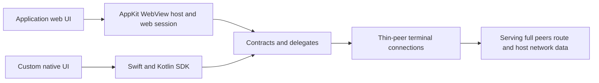

# EVY + Freenet <3

## EVY's vision

Imagine smartphones and the internet built by the people, for the people. We want to enable anyone to connect consumers to services, free from gatekeepers taking a cut, and compensate contributors fairly.

A driver could deliver food without a middleman taking 30%. You could sell your skateboard without your data being used to target you with ads. Bringing these services together in one open platform means you can use the same identity and payment setup, instead of downloading another app, signing up and entering your details each time.

That is the vision for EVY. Its code and data are open for anyone to inspect, so people can verify how it works. Private data is readable only by the parties who need it, such as a delivery address that only the driver making the delivery can decrypt.

EVY starts with a simple idea: a super app on your phone that acts as your identity and your key. The app is community built, and those contributors get paid when an in-app transaction uses their functionality, giving them a reason to build useful features.

A server-driven UI system ensures consistent design and allows contributors and agents to quickly create applications and release them to customers in realtime instead of going through app store release cycles.

The launch product is a Marketplace for buying and selling locally. It arranges pickup as signed structured terms, and it shows the exact address only to the two people meeting.

**Why Freenet fits EVY very well**: Freenet distributes applications through its peer network with verified authorship, this means the app is distributed by the community, not a single entity. Its delegate system keeps private data and signing keys on the device, exactly as EVY intended with its device-only privacy.

## Roadmap

Start with River running on a reusable mobile AppKit, then extend it into a host that runs River and Atlas. The last piece before we can go live is to add contribution and payment services with a Marketplace pickup pilot. At this point we should be able to go live to real customers with an MVP! The next milestones are optional but build important pieces on the EVY ecosystem that we should build shortly after.

### 1. Freenet mobile AppKit

Package a single defined application for iOS and Android. As MVP we will use river's signed web UI run in an in-app WebView served by the embedded node but enable developers to build custom Swift/Kotlin screens against the SDK.

1.8 Thin-peer role and cellular data budgets makes the phone a thin peer. 1.9 Testing and release then tests River and Atlas on it and releases the developer package.

```mermaid
flowchart LR
    Web[Application web UI] --> Host[AppKit WebView host and web session]
    Native[Custom native UI] --> SDK[Swift and Kotlin SDK]
    Host --> Core[Contracts and delegates]
    SDK --> Core
    Core --> Thin[Thin-peer terminal connections]
    Thin --> Full[Serving full peers route and host network data]
```

- [1.1 Mobile feasibility and supported profiles](1-freenet-mobile-appkit/01-feasibility.md)
- [1.2 Embedded node and mobile SDK](1-freenet-mobile-appkit/02-sdk.md)
- [1.3 Single-application host](1-freenet-mobile-appkit/03-host.md)
- [1.4 Application bundles](1-freenet-mobile-appkit/04-bundles.md)
- [1.5 Identity, keys and local protection](1-freenet-mobile-appkit/05-identity.md)
- [1.6 Application protocols, data and operations](1-freenet-mobile-appkit/06-data-and-operations.md)
- [1.7 Upgrades and migration](1-freenet-mobile-appkit/07-migration.md)
- [1.8 Thin-peer role and cellular data budgets](1-freenet-mobile-appkit/08-thin-peer.md)
- [1.9 Testing and release](1-freenet-mobile-appkit/09-testing-and-release.md)

### 2. EVY mobile app

Build a curated multi-application host on the released AppKit. Ship hardcoded full application IDs for River and Atlas. Each resolves to a verified signed website with its own UI in a separate, isolated in-app WebView session. Both apps share one embedded thin node.

- [2.1 EVY shell and curated catalogue](2-evy-mobile-app/01-catalogue.md)
- [2.2 Multi-application sessions and authority](2-evy-mobile-app/02-sessions.md)
- [2.3 Installation and updates](2-evy-mobile-app/03-installation-and-updates.md)
- [2.4 Identity, permissions and device access](2-evy-mobile-app/04-permissions.md)
- [2.5 Shared node, data and lifecycle](2-evy-mobile-app/05-lifecycle.md)
- [2.6 Navigation and application management](2-evy-mobile-app/06-navigation.md)
- [2.7 Multi-application acceptance](2-evy-mobile-app/07-acceptance.md)

### 3. Attribution, remuneration and payment

Connect repository work to certified application releases, paid usage and contributor payouts. EVY Developer supports code-based contribution and release workflows. Applications use custom web or native code and concrete domain protocols. Attribution can support publishing independently. The Marketplace pickup pilot requires the full commercial flow.

| Plan | Owned scope |
| --- | --- |
| [3.1 Product and contributor registration](3-attribution-remuneration-payment/01-registration.md) | Product authority, contributor identity, ownership evidence and roles |
| [3.2 Attribution workflow and allocation weights](3-attribution-remuneration-payment/02-attribution.md) | Proposals, reviews, size decisions, challenges, acceptances and exact weights |
| [3.3 Artifact certification and publication evidence](3-attribution-remuneration-payment/03-certification.md) | Source-to-artifact mappings, contribution records, snapshots and paid eligibility |
| [3.4 Payments and checkout adapters](3-attribution-remuneration-payment/04-payment.md) | Trusted checkout, contributor-fee collection, cash adjustments and signed status |
| [3.5 Usage evidence, remuneration and payouts](3-attribution-remuneration-payment/05-remuneration.md) | Usage claims, allocations, fee-return calculations, balances and payouts |
| [3.6 Contribution and release workspace](3-attribution-remuneration-payment/06-developer.md) | EVY Developer, repository and CLI/CI workflows |
| [3.7 Operating readiness](3-attribution-remuneration-payment/07-operations.md) | Financial service operations, backups, restore drills, queues and key recovery |
| [3.8 Paid application pilot and commercial acceptance](3-attribution-remuneration-payment/08-marketplace.md) | Marketplace pickup pilot, bounded fulfillment protocol and expansion gates |

### 4. SDUI

Add screen definitions, readers and visual authoring to the released platform. Applications choose SDUI for complete interfaces or selected pages, with readers for browsers, iOS and Android. Repository-authored SDUI uses CLI/CI publication independently of visual authoring.

| Plan | Scope |
| --- | --- |
| [4.1 SDUI format and compatibility](4-sdui/01-format.md) | Screens, components, navigation and accessibility |
| [4.2 SDUI bundles and publication](4-sdui/02-bundles.md) | SDUI artifacts, schema packaging and publication |
| [4.3 SDUI hosts and readers](4-sdui/03-readers.md) | Browser, SwiftUI and Compose readers, web reader packaging and SDK adapters |
| [4.4 SDUI identity and permissions](4-sdui/04-identity.md) | Reader bindings to host sessions, grants and protected operations |
| [4.5 SDUI actions and delegate protocols](4-sdui/05-actions.md) | Declared-action executor and typed domain convention |
| [4.6 SDUI data and operation presentation](4-sdui/06-data.md) | Views, forms, local state and operation-status presentation |
| [4.7 SDUI commerce and attribution](4-sdui/07-commerce.md) | Optional checkout, domain evidence and artifact integration |
| [4.8 EVY Developer visual authoring](4-sdui/08-developer.md) | Canvas, schema editors, preview, import and durable checkpoints |
| [4.9 SDUI migration and conformance](4-sdui/09-migration-and-conformance.md) | Form upgrades, reader compatibility and cross-target tests |

### 5. Optional extensions

| Plan | Scope | Prerequisites |
| --- | --- | --- |
| [5.1 Peer reputation](5-optional-extensions/01-reputation.md) | Private evidence, purpose-bound proofs and disclosure policy | Protected identity in 1.5 Identity, keys and local protection, authenticated host access in 1.3 Single-application host and application-defined evidence |
| [5.2 Extended customer backup and recovery](5-optional-extensions/02-recovery.md) | Automated backups, selected destinations and cross-app recovery | App-specific recovery, offline sends, supported migrations, 2.2 Multi-application sessions and authority, and 2.4 Identity, permissions and device access |
| [5.3 Device sync and authoring collaboration](5-optional-extensions/03-sync-and-collaboration.md) | Consumer device sync and opt-in authoring sessions, with separate gates | Identity, offline sends, 2.2 Multi-application sessions and authority, 2.4 Identity, permissions and device access, and verified Core sync support for consumer sync. Released 4.8 EVY Developer visual authoring and checkpoints for collaboration |
| [5.4 Discovery and catalogue extensions](5-optional-extensions/04-discovery.md) | Replaceable search providers and signed catalogue updates | Milestone 2 (EVY mobile app) installation, sessions, permissions, lifecycle and navigation, plus the Atlas fixtures in 1.9 Testing and release |

#### Upstream suggestions

| Suggestion | Repository | What it enables |
| --- | --- | --- |
| Request IDs on client API replies: the client sets an ID on each contract request, and the node copies it into the reply | [freenet-stdlib](https://github.com/freenet/freenet-stdlib), with node support in [freenet-core](https://github.com/freenet/freenet-core) | The SDK in [1.2 Embedded node and mobile SDK](1-freenet-mobile-appkit/02-sdk.md#matching-replies-to-requests) sends parallel requests of the same type for one contract, where today it queues them |

## Sources

- [Freenet Core](https://github.com/freenet/freenet-core)
- [whitepaper](https://github.com/freenet/paper-1)
- [River](https://github.com/freenet/river)
- [Atlas](https://github.com/freenet/atlas)
- [Harvest](https://github.com/freenet/harvest)
- And every associated discussions, issues, PRs and RFCs
