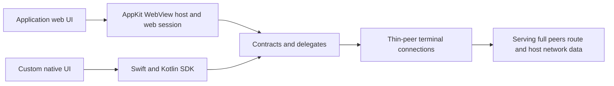
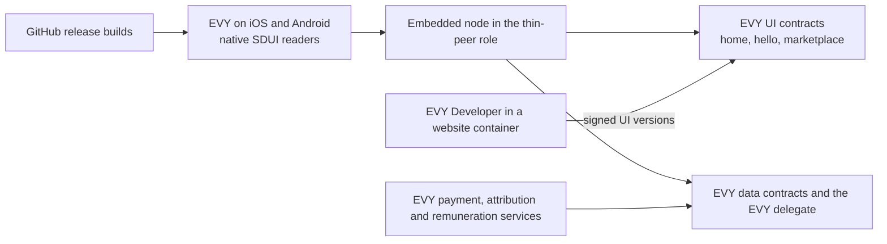

# EVY + Freenet <3

## EVY's vision

EVY connects people to services and pays the people who build them. Anyone can contribute code, create a service or inspect how it works.

A driver could deliver food without a middleman taking 30%. You could sell your skateboard without your data being used to target you with ads. Bringing these services together in one open platform means you can use the same identity and payment setup, instead of downloading another app, signing up and entering your details each time.

That is the vision for EVY. Its code and data are open for anyone to inspect, so people can verify how it works. Private data stays protected and is shared only with the parties who need it, such as an address sent directly to the driver making a delivery, not to the cloud.

EVY starts with a simple idea: a super app on your phone that acts as your identity and your key. The app is community built, and those contributors get paid when an in-app transaction uses their functionality, giving them a reason to build useful features.

A server-driven UI system ensures consistent design and allows contributors and agents to quickly create applications and release them to customers in realtime instead of going through app store release cycles.

The initial launch product is a Marketplace (facebook/craigslist style) because we believe we can build a 10x better product than what is out there.

EVY fits with Freenet perfectly as it's peer network distributes applications and verifies who published them, and its delegates keep private data and signing keys on the device.

## Roadmap

The roadmap has three milestones:

| Milestone | Result |
| --- | --- |
| milestone 1 (Freenet mobile AppKit) | River runs on iOS and Android with a reusable mobile SDK and host. |
| milestone 2 (EVY on Freenet) | EVY runs on iOS and Android, reads UI documents from Freenet contracts, takes Marketplace payments and pays contributors. Real customers complete paid sales. |
| milestone 3 (Optional extensions) | Add backup and device sync, then develop the remaining ideas as customers need them. |

### 1. Freenet mobile AppKit

Package River as matching iOS and Android apps. River's web UI runs in an in-app WebView served by the embedded node. Developers can also build Swift and Kotlin screens with the SDK.

```mermaid
flowchart LR
    Web[Application web UI] --> Host[AppKit WebView host and web session]
    Native[Custom native UI] --> SDK[Swift and Kotlin SDK]
    Host --> Core[Contracts and delegates]
    SDK --> Core
    Core --> Thin[Thin-peer terminal connections]
    Thin --> Full[Serving full peers route and host network data]
```

- [1.1 Mobile feasibility and supported profiles](1-freenet-mobile-appkit/01-feasibility.md)
- [1.2 Embedded node and mobile SDK](1-freenet-mobile-appkit/02-sdk.md)
- [1.3 Single-application host](1-freenet-mobile-appkit/03-host.md)
- [1.4 Application bundles](1-freenet-mobile-appkit/04-bundles.md)
- [1.5 Identity, keys and local protection](1-freenet-mobile-appkit/05-identity.md)
- [1.6 Application protocols, data and operations](1-freenet-mobile-appkit/06-data-and-operations.md)
- [1.7 Upgrades and migration](1-freenet-mobile-appkit/07-migration.md)
- [1.8 Thin-peer role and cellular data budgets](1-freenet-mobile-appkit/08-thin-peer.md)
- [1.9 Testing and release](1-freenet-mobile-appkit/09-testing-and-release.md)

### 2. EVY on Freenet

Build EVY's iOS and Android apps on the AppKit from milestone 1 (Freenet mobile AppKit). GitHub produces store builds with native server-driven UI (SDUI) readers. Each screen comes from an EVY UI document stored in a Freenet contract. The home service lists the other services. Publishing a compatible UI version updates phones through Freenet. EVY Developer, the web authoring tool, ships as a Freenet website container.

Home, Hello and Marketplace use the [shared EVY catalogue in 2.4 SDUI data and actions](2-evy-on-freenet/04-data-and-actions.md#shared-evy-catalogue):

- Common UI readers and resource adapters.
- Shared interfaces for purchases, messages, private addresses and files.
- One EVY delegate per user installation.
- One purchase instance per sale and one file instance per content object.

Payment, attribution and payout services record each operation's originating service and participant permissions.

```mermaid
flowchart LR
    GH[GitHub release builds] --> Apps[EVY on iOS and Android<br>native SDUI readers]
    Apps --> Node[Embedded node in the thin-peer role]
    Node --> UI[EVY UI contracts<br>home, hello, marketplace]
    Node --> Data[EVY data contracts and the EVY delegate]
    Dev[EVY Developer in a website container] -->|signed UI versions| UI
    Svc[EVY payment, attribution and remuneration services] --> Data
```

| Step | Result | Plans |
| --- | --- | --- |
| Proof of concept | Alice and Bob open EVY and read "Hello EVY world" from an EVY contract. | [2.1 Hello EVY world](2-evy-on-freenet/01-hello-evy-world.md) |
| SDUI | The home and hello screens come from UI contracts. Alice signs the hello guestbook. | [2.2 EVY UI contracts and publishing](2-evy-on-freenet/02-ui-contracts.md), [2.3 Native SDUI readers](2-evy-on-freenet/03-readers.md), [2.4 SDUI data and actions](2-evy-on-freenet/04-data-and-actions.md), [2.5 EVY Developer on Freenet](2-evy-on-freenet/05-developer.md) |
| Payments and Marketplace | Bob buys Alice's skateboard for 70 dollars, pays in the native payment sheet and picks it up on Saturday. | [2.6 Payments](2-evy-on-freenet/06-payments.md), [2.7 EVY Marketplace](2-evy-on-freenet/07-marketplace.md) |
| Attribution and remuneration | Carol improves Marketplace's "Create item" flow and earns part of the 0.70-dollar contributor fee. | [2.8 Attribution](2-evy-on-freenet/08-attribution.md), [2.9 Remuneration and payouts](2-evy-on-freenet/09-remuneration.md) |
| Release | Customers complete the first paid sale on real iOS and Android phones. | [2.10 Testing and release](2-evy-on-freenet/10-testing-and-release.md) |

### 3. Optional extensions

Backup and device sync have implementation plans. The other extensions have research notes and criteria for starting work.

- [3.1 Automated backup](3-optional-extensions/01-backup.md)
- [3.2 Device sync](3-optional-extensions/02-sync.md)
- [3.3 Peer reputation](3-optional-extensions/03-reputation.md) (idea note)
- [3.4 Live authoring collaboration](3-optional-extensions/04-collaboration.md) (idea note)
- [3.5 Saved payment methods](3-optional-extensions/05-payment-methods.md) (idea note)
- [3.6 EVY services for Freenet apps](3-optional-extensions/06-shared-services.md) (idea note)

## Upstream suggestions

The plans need changes in Freenet Core, freenet-stdlib, freenet-migrate and River. [Upstream issues](UPSTREAM_ISSUES.md) lists the filed issues and drafts, with the plans each change unblocks.

## Sources

- [EVY](https://github.com/EVY-Platform/evy)
- [Freenet Core](https://github.com/freenet/freenet-core)
- [freenet-stdlib](https://github.com/freenet/freenet-stdlib)
- [whitepaper](https://github.com/freenet/paper-1)
- [River](https://github.com/freenet/river)
- [Atlas](https://github.com/freenet/atlas)
- [Harvest](https://github.com/freenet/harvest)
- [Delta](https://github.com/freenet/delta)
- [Ghostkeys](https://github.com/freenet/ghostkeys)
- [freenet-migrate](https://github.com/freenet/freenet-migrate)
- [freenet-agent-skills](https://github.com/freenet/freenet-agent-skills)
- [freenet-test-network](https://github.com/freenet/freenet-test-network)
- [freenet-bitcoin](https://github.com/freenet/freenet-bitcoin)
- [freenet-wiki](https://github.com/freenet/freenet-wiki)
- [freenet.org website](https://github.com/freenet/web)
- The related discussions, issues, pull requests and RFCs
