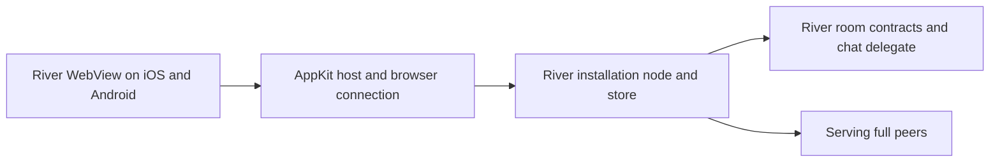
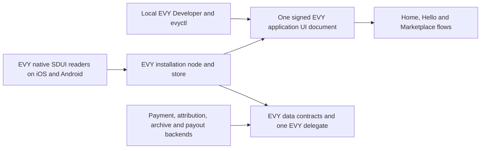

# EVY + Freenet <3

## EVY's vision

Imagine smartphones and the internet built by the people, for the people. We want to enable anyone to connect consumers to services, free from gatekeepers taking a cut, and compensate contributors fairly.

A driver could deliver food without a middleman taking 30%. You could sell your skateboard without your data being used to target you with ads. Bringing these services together in one open platform means you can use the same identity and payment setup, instead of downloading another app, signing up and entering your details each time.

That is the vision for EVY. Its code and data are open for anyone to inspect, so people can verify how it works. Private data stays protected and is shared only with the parties who need it, such as an address sent directly to the driver making a delivery, not to the cloud.

EVY starts with a simple idea: a super app on your phone that acts as your identity and your key. The app is community built, and those contributors get paid when an in-app transaction uses their functionality, giving them a reason to build useful features.

A server-driven UI system ensures consistent design and allows contributors and agents to quickly create applications and release them to customers in realtime instead of going through app store release cycles.

The initial launch product is a Marketplace (facebook/craigslist style) because we believe we can build a 10x better product than what is out there.

EVY fits with Freenet perfectly as it's peer network distributes applications and verifies who published them, and its delegates keep private data and signing keys on the device.

## Roadmap

### Milestone 1 (Freenet mobile AppKit)

Use River as the AppKit test application on iOS and Android. Its signed web UI runs in one WebView served by the installation's embedded node. Its existing room contracts and chat delegate exercise the mobile lifecycle, network, permissions and recovery paths.

```mermaid
flowchart LR
    River[River WebView on iOS and Android] --> Host[AppKit host and browser connection]
    Host --> Node[River installation node and store]
    Node --> Data[River room contracts and chat delegate]
    Node --> Full[Serving full peers]
```

- [1.1 Mobile feasibility and supported profiles](1-freenet-mobile-appkit/01-feasibility.md)
- [1.2 Embedded node and mobile SDK](1-freenet-mobile-appkit/02-sdk.md)
- [1.3 Single-application host](1-freenet-mobile-appkit/03-host.md)
- [1.4 Application bundles](1-freenet-mobile-appkit/04-bundles.md)
- [1.5 Identity, keys and local protection](1-freenet-mobile-appkit/05-identity.md)
- [1.6 Application protocols, data and operations](1-freenet-mobile-appkit/06-data-and-operations.md)
- [1.7 Upgrades and migration](1-freenet-mobile-appkit/07-migration.md)
- [1.8 Thin-peer protocol](1-freenet-mobile-appkit/08-thin-peer.md)
- [1.9 Testing and release](1-freenet-mobile-appkit/09-testing-and-release.md)
- [1.10 Backup and restore](1-freenet-mobile-appkit/10-backup-and-restore.md)
- [1.11 Cellular data and resource budgets](1-freenet-mobile-appkit/11-cellular-data-and-resource-budgets.md)

### Milestone 2 (EVY on Freenet)

Build EVY as one published Freenet application on iOS and Android, with native SDUI readers. MVP of EVY Developer editor is also part of this milestone, along with attribution and remuneration.

```mermaid
flowchart LR
    Author[Local EVY Developer and evyctl] --> Publication[One signed EVY application UI document]
    Apps[EVY native SDUI readers on iOS and Android] --> Node[EVY installation node and store]
    Node --> Publication
    Node --> Data[EVY data contracts and one EVY delegate]
    Publication --> Flows[Home, Hello and Marketplace flows]
    Backend[Payment, attribution, archive and payout backends] --> Data
```

- [2.1 Hello EVY world](2-evy-on-freenet/01-hello-evy-world.md)
- [2.2 EVY UI contracts and publishing](2-evy-on-freenet/02-ui-contracts.md)
- [2.3 Native SDUI readers](2-evy-on-freenet/03-readers.md)
- [2.4 SDUI data and actions](2-evy-on-freenet/04-data-and-actions.md)
- [2.5 EVY authoring and publishing](2-evy-on-freenet/05-developer.md)
- [2.6 Payments](2-evy-on-freenet/06-payments.md)
- [2.7 EVY Marketplace](2-evy-on-freenet/07-marketplace.md)
- [2.8 Attribution](2-evy-on-freenet/08-attribution.md)
- [2.9 Remuneration and payouts](2-evy-on-freenet/09-remuneration.md)
- [2.10 Testing and release](2-evy-on-freenet/10-testing-and-release.md)
- [2.11 EVY delegate and private records](2-evy-on-freenet/11-delegate-and-private-records.md)
- [2.12 Listings and purchases](2-evy-on-freenet/12-listings-and-purchases.md)
- [2.13 Release archive and policy evidence](2-evy-on-freenet/13-release-archive-and-policy-evidence.md)
- [2.14 Backend operations and recovery](2-evy-on-freenet/14-backend-operations-and-recovery.md)

### Milestone 3 (Optional extensions)

- [3.1 Automated backup](3-optional-extensions/01-backup.md)
- [3.2 Device sync](3-optional-extensions/02-sync.md)
- [3.3 Peer reputation](3-optional-extensions/03-reputation.md) (idea note)
- [3.4 Live authoring collaboration](3-optional-extensions/04-collaboration.md) (idea note)
- [3.5 Saved payment methods](3-optional-extensions/05-payment-methods.md) (idea note)
- [3.6 EVY services for Freenet apps](3-optional-extensions/06-evy-services-for-freenet-apps.md) (idea note)
- [3.7 Bitcoin payments](3-optional-extensions/07-bitcoin-payments.md) (idea note)

## Decision gates

| Repo | Today | Proposal | Detailed plan |
| --- | --- | --- | --- |
| [core](https://github.com/freenet/freenet-core) | The mobile prototype exposes start, stop, status and contract bindings. | Move the mobile prototype into maintained Freenet code for iOS and Android. | [1.2 Embedded node and mobile SDK](1-freenet-mobile-appkit/02-sdk.md#what-to-build) |
| [core](https://github.com/freenet/freenet-core), [stdlib](https://github.com/freenet/freenet-stdlib) | The browser client exposes contract methods and delegate message types. | Let River request invitation signatures and receive the right reply when several requests are pending. | [1.2 Embedded node and mobile SDK](1-freenet-mobile-appkit/02-sdk.md#application-connections), [1.2 Embedded node and mobile SDK](1-freenet-mobile-appkit/02-sdk.md#matching-replies-to-requests) |
| [core](https://github.com/freenet/freenet-core) | Core authenticates client connections and routes delegate events by connection. | Give each app access only to its own private replies, with permissions users can revoke. | [1.3 Single-application host](1-freenet-mobile-appkit/03-host.md#freenet-issues-being-worked-on-that-are-required) |
| [core](https://github.com/freenet/freenet-core) | Core handles delegate prompts and capability consent. | Show Freenet permission requests in the phone's own app screens. | [1.3 Single-application host](1-freenet-mobile-appkit/03-host.md#background-runs-and-delegate-prompts) |
| [core](https://github.com/freenet/freenet-core) | Node configuration resolves gateway hostnames during startup. | Open River's saved rooms in Airplane Mode, then connect when the phone has a signal. | [1.2 Embedded node and mobile SDK](1-freenet-mobile-appkit/02-sdk.md#gateway-hostnames) |
| [core](https://github.com/freenet/freenet-core) | The checked Core API returns `PeerNotJoined` for UPDATE, PUT and Subscribe before joining. | Let Alice write messages before Freenet connects; send them once it connects. | [1.2 Embedded node and mobile SDK](1-freenet-mobile-appkit/02-sdk.md#local-operations-before-the-first-join) |
| [core](https://github.com/freenet/freenet-core) | Mobile build-defined execution policy is planned. | Have each iOS and Android build list the code it permits for normal use, upgrades and recovery. | [1.4 Application bundles](1-freenet-mobile-appkit/04-bundles.md#execution-policy) |
| [core](https://github.com/freenet/freenet-core) | Core supports file, systemd and desktop keyring backends. | Use protected key storage on iOS and Android to unlock private data. | [1.5 Identity, keys and local protection](1-freenet-mobile-appkit/05-identity.md#node-encryption-key) |
| [core](https://github.com/freenet/freenet-core) | Core encrypts secrets and loads their keys into memory. | Stop signing and clear decrypted data when the phone locks. Reload after unlock. | [1.5 Identity, keys and local protection](1-freenet-mobile-appkit/05-identity.md#locking-and-unlocking) |
| [migrate](https://github.com/freenet/freenet-migrate), [core](https://github.com/freenet/freenet-core) | Applications use freenet-migrate through Rust runners and application adapters. | Keep Alice's keys, drafts and rooms when upgrading the iOS and Android apps. | [1.7 Upgrades and migration](1-freenet-mobile-appkit/07-migration.md#compatible-migration-library), [1.7 Upgrades and migration](1-freenet-mobile-appkit/07-migration.md#mobile-migration-interface) |
| [core](https://github.com/freenet/freenet-core) | FNSX exports encrypted secrets; executable-inclusive backup is proposed in #4035. | Include the code needed to restore earlier backups on a new phone. | [1.10 Backup and restore](1-freenet-mobile-appkit/10-backup-and-restore.md#the-backup-file) |
| [core](https://github.com/freenet/freenet-core) | A complete application snapshot covering delegate and host records is planned. | Back up keys, drafts and pending messages together, even while Alice uses the app. | [1.10 Backup and restore](1-freenet-mobile-appkit/10-backup-and-restore.md#export) |
| [core](https://github.com/freenet/freenet-core) | Core imports records through per-entry writes. | Prepare and check a restore before switching to it, so an interruption preserves usable data. | [1.10 Backup and restore](1-freenet-mobile-appkit/10-backup-and-restore.md#staged-restore-transaction) |
| [core](https://github.com/freenet/freenet-core) | The feasibility runs use full peers; a negotiated thin role is planned. | Make phones handle their user's traffic; other peers carry traffic for the wider network. | [1.8 Thin-peer protocol](1-freenet-mobile-appkit/08-thin-peer.md#scope-and-trust-boundary), [1.8 Thin-peer protocol](1-freenet-mobile-appkit/08-thin-peer.md#upstream-work-and-carrier-evidence) |
| [core](https://github.com/freenet/freenet-core) | Core counts socket uploads and authenticated downloads. | Count all Freenet cellular traffic and stop it at the user's data limit. | [1.11 Cellular data and resource budgets](1-freenet-mobile-appkit/11-cellular-data-and-resource-budgets.md#cellular-budget-contract) |
| [core](https://github.com/freenet/freenet-core), [river](https://github.com/freenet/river) | One command prepares and uploads the release. | Save a release before uploading, so a failed upload can retry the same signed files. | [1.4 Application bundles](1-freenet-mobile-appkit/04-bundles.md#prepare-and-submit), [1.4 Application bundles](1-freenet-mobile-appkit/04-bundles.md#river-publication) |
| [river](https://github.com/freenet/river), [appkit](https://github.com/glesage/freenet-appkit) | River bundles its web UI and contract/delegate files. | Include a file listing the code, permissions and recovery information needed for each River release. | [1.4 Application bundles](1-freenet-mobile-appkit/04-bundles.md#reference-adapter-and-digest-encodings), [1.4 Application bundles](1-freenet-mobile-appkit/04-bundles.md#river-release-metadata) |
| [river](https://github.com/freenet/river) | River signs messages in its page. | Keep Bob's draft and signed message after he closes River, then resume sending when he returns. | [1.6 Application protocols, data and operations](1-freenet-mobile-appkit/06-data-and-operations.md#bobs-saved-draft) |

### Optional and conditional decisions

| Change | Trigger and decision | Detailed plan |
| --- | --- | --- |
| Smaller Wasm reservations | Core maintainers agree memory-address refresh; use default executor/Store limits after device fixtures pass. | [1.2 Embedded node and mobile SDK](1-freenet-mobile-appkit/02-sdk.md#running-wasm) |
| Client UPDATE deltas and bandwidth optimizations | Core maintainers agree wire/version changes; measured cap results determine which optimizations the release profile needs. | [1.11 Cellular data and resource budgets](1-freenet-mobile-appkit/11-cellular-data-and-resource-budgets.md#client-update-deltas), [1.8 Thin-peer protocol](1-freenet-mobile-appkit/08-thin-peer.md#upstream-work-and-carrier-evidence) |
| Stronger contract retention and offline delivery | Core maintainers decide #5041, #4651 and #4785; adopt guarantees after eviction/restart fixtures pass. | [1.6 Application protocols, data and operations](1-freenet-mobile-appkit/06-data-and-operations.md#core-retention-and-offline-delivery) |
| Core-assisted delegate migration | Agree #5255 and adopt after provenance, transfer and record-preservation checks pass. | [1.7 Upgrades and migration](1-freenet-mobile-appkit/07-migration.md#core-assisted-migration) |
| Passkey recovery | Core maintainers and AppKit recovery lead agree #5764 integration; enable after cross-platform unwrap and trusted-context fixtures pass. | [1.10 Backup and restore](1-freenet-mobile-appkit/10-backup-and-restore.md#optional-passkey-recovery) |
| Core device-sync interfaces | Agree the sync protocol and protected device-key operations with Core maintainers under #5587. | [3.2 Device sync](3-optional-extensions/02-sync.md#membership-and-authority), [3.2 Device sync](3-optional-extensions/02-sync.md#what-core-still-needs) |

## Sources

- [freenet/freenet-core](https://github.com/freenet/freenet-core): checked commit [`e7d0b06c9326f377d250bf8344baaac2ba2658c6`](https://github.com/freenet/freenet-core/commit/e7d0b06c9326f377d250bf8344baaac2ba2658c6)
- [freenet/river](https://github.com/freenet/river): checked commit [`8cf54dd7799514851da7eab051e4cc43f797208d`](https://github.com/freenet/river/commit/8cf54dd7799514851da7eab051e4cc43f797208d)
- [freenet/freenet-migrate](https://github.com/freenet/freenet-migrate): checked commit [`74aed27eaec8a4347b47fa2665ea511d2fd14175`](https://github.com/freenet/freenet-migrate/commit/74aed27eaec8a4347b47fa2665ea511d2fd14175)
- [freenet/freenet-stdlib](https://github.com/freenet/freenet-stdlib): checked commit [`fca0848b78b12942f77422309bb07f76108940d6`](https://github.com/freenet/freenet-stdlib/commit/fca0848b78b12942f77422309bb07f76108940d6)
- [EVY-Platform/evy](https://github.com/EVY-Platform/evy): checked commit [`d0fb7e6475f1dfc5c74325e37d4e92aed88d84ed`](https://github.com/EVY-Platform/evy/commit/d0fb7e6475f1dfc5c74325e37d4e92aed88d84ed)
- [freenet/delta](https://github.com/freenet/delta): checked commit [`6e8c96031642e03f9cdcbe1bea71059b03699b1d`](https://github.com/freenet/delta/commit/6e8c96031642e03f9cdcbe1bea71059b03699b1d)
- [freenet/harvest](https://github.com/freenet/harvest): checked commit [`9eb4a04ed30e75c478df0b89f38f68044bbd947c`](https://github.com/freenet/harvest/commit/9eb4a04ed30e75c478df0b89f38f68044bbd947c)
- [freenet/atlas](https://github.com/freenet/atlas): checked commit [`051e38033e81a4232341ffa4360af94232e7809b`](https://github.com/freenet/atlas/commit/051e38033e81a4232341ffa4360af94232e7809b)
- [glesage/freenet-appkit](https://github.com/glesage/freenet-appkit): checked commit [`1988c5cbdfc5c1f88065382de2a4f86093948b6e`](https://github.com/glesage/freenet-appkit/commit/1988c5cbdfc5c1f88065382de2a4f86093948b6e)
- [freenet/paper-1](https://github.com/freenet/paper-1): checked commit [`bff15702759800a003ffbfce639fe859f57d966d`](https://github.com/freenet/paper-1/commit/bff15702759800a003ffbfce639fe859f57d966d)
- [freenet/freenet-agent-skills](https://github.com/freenet/freenet-agent-skills): checked commit [`890ad1b20c03ee99dd0a0ae89ec3e3b17c19eac4`](https://github.com/freenet/freenet-agent-skills/commit/890ad1b20c03ee99dd0a0ae89ec3e3b17c19eac4)
- [Ghostkeys](https://github.com/freenet/ghostkeys)
- [freenet-test-network](https://github.com/freenet/freenet-test-network)
- [freenet-bitcoin](https://github.com/freenet/freenet-bitcoin)
- [freenet-wiki](https://github.com/freenet/freenet-wiki)
- [freenet.org website](https://github.com/freenet/web)

Sources also include related discussions, issues, pull requests and RFCs.
