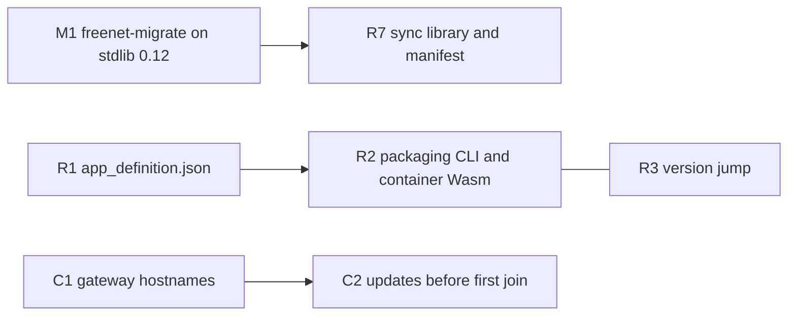

# Upstream issues

The plans need these changes in projects EVY does not own. Each plan's Repositories table lists the new code in Core's `crates/mobile`. The [admission table in 1.3 Single-application host](1-freenet-mobile-appkit/03-host.md#freenet-issues-being-worked-on-that-are-required) lists the Core issues already in progress that each release checks.

Core auto-closes feature pull requests that have no approved issue ([#4311](https://github.com/freenet/freenet-core/pull/4311)), and it ranks issues by what they unblock ([D4412](https://github.com/freenet/freenet-core/discussions/4412)). So each issue names the plan it unblocks, and we open a pull request only once its issue is approved.

## Filed

| Change | Issue | Needed by |
| --- | --- | --- |
| Request IDs on client API replies. The client sets an ID on each contract request, and the node copies it into the reply | [freenet-stdlib#106](https://github.com/freenet/freenet-stdlib/issues/106) | [1.2 Embedded node and mobile SDK](1-freenet-mobile-appkit/02-sdk.md#matching-replies-to-requests) |
| A per-app user scope in notification, lifecycle, wake-up and inter-delegate runs | [freenet-core#5736](https://github.com/freenet/freenet-core/issues/5736) | [2.1 EVY catalogue and app hosting](2-evy-mobile-app/01-catalogue-and-hosting.md#core-and-appkit-requirements), [5.3 Device sync](5-optional-extensions/03-sync.md#what-core-still-needs) |
| Core moves delegate secrets to a new delegate key | [freenet-core RFC #5255](https://github.com/freenet/freenet-core/issues/5255) | [4.4 SDUI bundles and publication](4-sdui/04-bundles.md#migration-in-native-readers) |
| Agreement on the sync design that River's sync library follows | [freenet-core RFC #5587](https://github.com/freenet/freenet-core/issues/5587) | [5.3 Device sync](5-optional-extensions/03-sync.md#what-core-still-needs) |
| Delegates update contracts they do not yet hold | [freenet-core#5542](https://github.com/freenet/freenet-core/issues/5542) | [5.3 Device sync](5-optional-extensions/03-sync.md#what-core-still-needs) |
| Delegate subscriptions keep the contracts they watch hosted | [freenet-core#4669](https://github.com/freenet/freenet-core/issues/4669) | [1.6 Application protocols, data and operations](1-freenet-mobile-appkit/06-data-and-operations.md#lost-network-state), [5.3 Device sync](5-optional-extensions/03-sync.md#what-core-still-needs) |
| A delegate GET tells a missing contract from a failed lookup | [freenet-stdlib#131](https://github.com/freenet/freenet-stdlib/issues/131) | [5.3 Device sync](5-optional-extensions/03-sync.md#what-core-still-needs) |
| River reclaims old chat delegate copies and unregisters old delegate keys after a migration completes | [river#586](https://github.com/freenet/river/issues/586) | [1.7 Upgrades and migration](1-freenet-mobile-appkit/07-migration.md#retiring-the-old-version) |
| Reporting, blocking, a default content filter and terms before the first post in River's UI. A published support URL and child-safety standards | [river#461](https://github.com/freenet/river/issues/461), [river#371](https://github.com/freenet/river/issues/371) | [1.9 Testing and release](1-freenet-mobile-appkit/09-testing-and-release.md#store-requirements) |
| `app_definition.json` declares `river.member.invite`, and the release build rebuilds to the same file digests | [river#678](https://github.com/freenet/river/issues/678) | [3.2 Release certification](3-attribution-remuneration-payment/02-certification.md#certifying-a-version) |

## To file

We file the Core entries first, because the River and freenet-migrate entries build on them.

| # | Issue | Repository | Unblocks |
| --- | --- | --- | --- |
| C1 | [Resolve gateway hostnames in the join loop](#c1-resolve-gateway-hostnames-in-the-join-loop) | freenet-core | [1.2 Embedded node and mobile SDK](1-freenet-mobile-appkit/02-sdk.md#start-stop-and-reconnect) |
| C2 | [Accept local updates and subscriptions before the first join](#c2-accept-local-updates-and-subscriptions-before-the-first-join) | freenet-core | [1.2 Embedded node and mobile SDK](1-freenet-mobile-appkit/02-sdk.md#start-stop-and-reconnect), [1.6 Application protocols, data and operations](1-freenet-mobile-appkit/06-data-and-operations.md#sending-updates) |
| C3 | [Re-read the Wasm memory address after each guest call](#c3-re-read-the-wasm-memory-address-after-each-guest-call) | freenet-core | [1.2 Embedded node and mobile SDK](1-freenet-mobile-appkit/02-sdk.md#running-wasm) |
| C4 | [Keychain and Keystore backends for the node encryption key](#c4-keychain-and-keystore-backends-for-the-node-encryption-key) | freenet-core, under [#4137](https://github.com/freenet/freenet-core/issues/4137) | [1.2 Embedded node and mobile SDK](1-freenet-mobile-appkit/02-sdk.md#keys), [1.5 Identity, keys and local protection](1-freenet-mobile-appkit/05-identity.md#node-encryption-key) |
| C5 | [Let an embedder supply the `UserInputPrompter`](#c5-let-an-embedder-supply-the-userinputprompter) | freenet-core | [1.3 Single-application host](1-freenet-mobile-appkit/03-host.md#background-runs-and-delegate-prompts) |
| C6 | [Permission codes, a set call and a public API for app grants](#c6-permission-codes-a-set-call-and-a-public-api-for-app-grants) | freenet-core | [1.3 Single-application host](1-freenet-mobile-appkit/03-host.md#base-authorization-and-device-access) |
| C7 | [Lock and unlock on `SecretsStore`](#c7-lock-and-unlock-on-secretsstore) | freenet-core | [1.5 Identity, keys and local protection](1-freenet-mobile-appkit/05-identity.md#locking-and-unlocking) |
| C8 | [Thin-peer role and cellular budgets](#c8-thin-peer-role-and-cellular-budgets) | freenet-core | [1.8 Thin-peer role and cellular data budgets](1-freenet-mobile-appkit/08-thin-peer.md#upstream-work-and-carrier-evidence) |
| C9 | [Send client updates as deltas](#c9-send-client-updates-as-deltas) | freenet-core | [1.8 Thin-peer role and cellular data budgets](1-freenet-mobile-appkit/08-thin-peer.md#upstream-work-and-carrier-evidence) |
| C10 | [A user scope on a connection without hosted mode](#c10-a-user-scope-on-a-connection-without-hosted-mode) | freenet-core | [2.1 EVY catalogue and app hosting](2-evy-mobile-app/01-catalogue-and-hosting.md#core-and-appkit-requirements) |
| M1 | [Release freenet-migrate on freenet-stdlib 0.12](#m1-release-freenet-migrate-on-freenet-stdlib-012) | freenet-migrate | [5.3 Device sync](5-optional-extensions/03-sync.md#what-core-still-needs) |
| R1 | [Ship `app_definition.json` in the release build](#r1-ship-app_definitionjson-in-the-release-build) | river | [1.4 Application bundles](1-freenet-mobile-appkit/04-bundles.md#the-archive-and-its-definition) |
| R2 | [Publish with the packaging CLI and River's own container Wasm](#r2-publish-with-the-packaging-cli-and-rivers-own-container-wasm) | river | [1.4 Application bundles](1-freenet-mobile-appkit/04-bundles.md#saved-copies-and-recovery) |
| R3 | [One upward jump to Unix-second versions](#r3-one-upward-jump-to-unix-second-versions) | river | [1.4 Application bundles](1-freenet-mobile-appkit/04-bundles.md#the-archive-and-its-definition) |
| R4 | [Save drafts and pending signed messages in the chat delegate](#r4-save-drafts-and-pending-signed-messages-in-the-chat-delegate) | river | [1.6 Application protocols, data and operations](1-freenet-mobile-appkit/06-data-and-operations.md#reads-and-local-data) |
| R5 | [Build invite links from a link base the host supplies](#r5-build-invite-links-from-a-link-base-the-host-supplies) | river | [2.1 EVY catalogue and app hosting](2-evy-mobile-app/01-catalogue-and-hosting.md#opening-links-and-alerts) |
| R6 | [Chat delegate messages `CreateInvitation` and `PrepareMessage`](#r6-chat-delegate-messages-createinvitation-and-preparemessage) | river | [4.3 SDUI actions and data](4-sdui/03-actions-and-data.md#calling-a-delegate) |
| R7 | [A sync library and a manifest for the chat delegate](#r7-a-sync-library-and-a-manifest-for-the-chat-delegate) | river | [5.3 Device sync](5-optional-extensions/03-sync.md#purpose) |
| R8 | [Saved unhides, record merges and a "Link a device" page](#r8-saved-unhides-record-merges-and-a-link-a-device-page) | river | [5.3 Device sync](5-optional-extensions/03-sync.md#resolving-conflicts) |
| A1 | [App definition, packaging CLI, Report button and support page](#a1-app-definition-packaging-cli-report-button-and-support-page) | atlas | [2.1 EVY catalogue and app hosting](2-evy-mobile-app/01-catalogue-and-hosting.md#atlas-in-evy) |
| A2 | [Read a starting search query from `#q=`](#a2-read-a-starting-search-query-from-q) | atlas | [5.2 Catalogue updates and Atlas search](5-optional-extensions/02-catalogue.md#searching-from-evy-home) |

### freenet-core

#### C1 Resolve gateway hostnames in the join loop

The node resolves every gateway hostname while it builds its config. A failed DNS lookup ends the start, so a phone that opens River on the subway can't start its node. The public gateway index uses hostnames ([gateways.toml](https://github.com/freenet/web/blob/main/hugo-site/static/keys/gateways.toml)), and the node fetches it at every start.

We ask Core to resolve each hostname inside the join loop and retry it there, so the node starts with no network and joins once a lookup works.

Sources: [node.rs](https://github.com/freenet/freenet-core/blob/main/crates/core/src/node.rs) (`parse_socket_addr`), [#1119](https://github.com/freenet/freenet-core/pull/1119) added the lookup at start, and [the node cannot start offline in network mode](https://github.com/glesage/freenet-appkit/blob/main/docs/findings.md#the-node-cannot-start-offline-in-network-mode). The community Android build ships fallback gateways to work around it ([river#319](https://github.com/freenet/river/issues/319)).

#### C2 Accept local updates and subscriptions before the first join

Until the node's first successful handshake, Core answers PUT, UPDATE and Subscribe with `PeerNotJoined`. A GET without `subscribe` reads the local copy. So once C1 lets the node start offline, River shows Bob's rooms but can't save "Skate session Saturday?" to the room or subscribe.

We ask Core to merge local updates and record subscriptions for contracts the node already stores before the first join, then send them on join.

Sources: `ensure_peer_ready` in [error.rs](https://github.com/freenet/freenet-core/blob/main/crates/core/src/client_events/error.rs), its callers in [client_events.rs](https://github.com/freenet/freenet-core/blob/main/crates/core/src/client_events.rs), and [#2385](https://github.com/freenet/freenet-core/pull/2385).

Depends on C1.

#### C3 Re-read the Wasm memory address after each guest call

Core reserves 256 MiB of address space for each Wasm instance, and the iPhone refused those reservations after 22 calls. Core can't use smaller reservations, because its host code keeps the memory address from before a guest call and reads through it afterwards. So iOS runs provisional limits: a new Store after 4 instances, and 2 executors.

We ask Core to look up each instance's memory address again after every contract and delegate call returns. Host functions already do this ([#3248](https://github.com/freenet/freenet-core/issues/3248), [#3270](https://github.com/freenet/freenet-core/pull/3270)). Each instance can then reserve only the memory it uses.

Sources: [contract.rs](https://github.com/freenet/freenet-core/blob/main/crates/core/src/wasm_runtime/contract.rs), the 256 MiB default from [#3990](https://github.com/freenet/freenet-core/pull/3990), [the iPhone refused Core's Wasm memory reservations](https://github.com/glesage/freenet-appkit/blob/main/docs/findings.md#the-iphone-refused-cores-wasm-memory-reservations) and the [recommended fix](https://github.com/glesage/freenet-appkit/blob/main/docs/findings.md#recommendation-core-re-reads-the-memory-address-after-each-guest-call).

#### C4 Keychain and Keystore backends for the node encryption key

The node encryption key backends are a closed list: systemd, file and keyring. The keyring backend refuses only Linux, so an Android build would fall back to the keyring crate's in-memory mock store and lose every secret at each restart.

We ask Core to add iOS Keychain and Android Keystore backends as `KekBackendKind` variants, and make the Android build refuse the keyring backend. File it as a sub-issue of [#4137](https://github.com/freenet/freenet-core/issues/4137), which already lists a hardware-backed tier.

Sources: [kek.rs](https://github.com/freenet/freenet-core/blob/main/crates/core/src/config/kek.rs), [#4140](https://github.com/freenet/freenet-core/issues/4140) and the per-version Android settings in [Node encryption key in 1.5 Identity, keys and local protection](1-freenet-mobile-appkit/05-identity.md#node-encryption-key).

#### C5 Let an embedder supply the `UserInputPrompter`

The node always builds its own `DashboardPrompter`, and the `user_input` module is crate-private. With no dashboard tab open, that prompter spawns `xdg-open`, which fails on iOS and Android. The phone host needs to show delegate prompts and Core's `Background` consent (`prompt_capability`) in its own trusted screens.

We ask Core for a public `UserInputPrompter` that the embedder passes to the node, and for no browser spawn on iOS or Android.

Sources: [p2p_impl.rs](https://github.com/freenet/freenet-core/blob/main/crates/core/src/node/p2p_impl.rs), [user_input.rs](https://github.com/freenet/freenet-core/blob/main/crates/core/src/contract/user_input.rs), and [#5749](https://github.com/freenet/freenet-core/issues/5749) on prompts from runs nobody started.

#### C6 Permission codes, a set call and a public API for app grants

Core's grant table keys each grant by user scope, app and permission code. Today `Background` is the only code. Loopback routes list and revoke grants, but nothing sets one except Core's own prompt, and the Rust API is crate-private. The phone host stores Bob's `notifications` answer from River's first run in this table.

We ask Core for a code for each app permission, starting with `notifications`, a call that sets a grant, and a public Rust API that `crates/mobile` can use.

Sources: [delegate_capabilities.rs](https://github.com/freenet/freenet-core/blob/main/crates/core/src/contract/delegate_capabilities.rs), [permission_prompts.rs](https://github.com/freenet/freenet-core/blob/main/crates/core/src/server/client_api/permission_prompts.rs), [#5730](https://github.com/freenet/freenet-core/pull/5730), [#5744](https://github.com/freenet/freenet-core/pull/5744) and [#4014](https://github.com/freenet/freenet-core/issues/4014).

#### C7 Lock and unlock on `SecretsStore`

`SecretsStore` keeps its keys in memory for as long as the node runs. When Alice's phone locks, the host has to wipe the node encryption key and every derived key from memory, then load them again on unlock.

We ask Core for `lock` and `unlock` on `SecretsStore`, plus a test that the zeroizing buffers are wiped. Today no test checks this ([#5599](https://github.com/freenet/freenet-core/issues/5599)).

Sources: [store.rs](https://github.com/freenet/freenet-core/blob/main/crates/core/src/wasm_runtime/secrets_store/store.rs) and [Locking and unlocking in 1.5 Identity, keys and local protection](1-freenet-mobile-appkit/05-identity.md#locking-and-unlocking).

#### C8 Thin-peer role and cellular budgets

A phone joins as a full peer. It routes and hosts for others, and that costs about 60 KiB/s each way on Wi-Fi. Core caps rate per connection and per node, but not total bytes. A phone on cellular needs a role that routes nothing for others and a byte budget Core enforces.

We ask Core for a thin-peer role that uses serving full peers without routing or hosting for others, and per-day upload and download caps. The issue must answer how a thin peer pays back the full peers that serve it ([D136](https://github.com/freenet/freenet-core/discussions/136), [D137](https://github.com/freenet/freenet-core/discussions/137), [D893](https://github.com/freenet/freenet-core/discussions/893)).

Sources: [phones are full peers on the public network](https://github.com/glesage/freenet-appkit/blob/main/docs/findings.md#phones-are-full-peers-on-the-public-network), [D420](https://github.com/freenet/freenet-core/discussions/420) (the only maintainer statement on a limited node on a phone), and the cost issues [#5643](https://github.com/freenet/freenet-core/issues/5643), [#5707](https://github.com/freenet/freenet-core/issues/5707), [#4965](https://github.com/freenet/freenet-core/issues/4965), [#5157](https://github.com/freenet/freenet-core/issues/5157) and [#3336](https://github.com/freenet/freenet-core/issues/3336).

#### C9 Send client updates as deltas

A client UPDATE merges on the phone and then goes to the serving peer as the whole merged state. Each message Bob sends to "Skate club" costs the full room state on cellular.

We ask Core to send the client's delta, computed against what the receiving peer holds, as Core's broadcasts already do.

Sources: [#4072](https://github.com/freenet/freenet-core/pull/4072) deferred the raw-delta wire format, `RequestUpdate` in [op_ctx_task.rs](https://github.com/freenet/freenet-core/blob/main/crates/core/src/operations/update/op_ctx_task.rs), and [#2427](https://github.com/freenet/freenet-core/pull/2427) on why deltas must use the receiver's summary.

#### C10 A user scope on a connection without hosted mode

EVY runs River and Atlas on one node, and each app needs its own secret scope. Core attaches a `SecretScope::User` to a connection only in hosted mode, from a loopback source with `X-Forwarded-Proto: https`. Hosted mode also turns delegate capabilities off.

We ask Core to let an embedder bind a user scope to a connection without hosted mode. The 4 MiB quota and 30-day cleanup stay configurable as they are today (`--per-user-secret-quota`, `--per-user-inactive-ttl`).

Sources: [websocket.rs](https://github.com/freenet/freenet-core/blob/main/crates/core/src/client_events/websocket.rs), [user.rs](https://github.com/freenet/freenet-core/blob/main/crates/core/src/wasm_runtime/secrets_store/user.rs), [#4381](https://github.com/freenet/freenet-core/issues/4381) and [#4561](https://github.com/freenet/freenet-core/issues/4561). Background runs in that scope are [#5736](https://github.com/freenet/freenet-core/issues/5736), which is already filed.

### freenet-migrate

#### M1 Release freenet-migrate on freenet-stdlib 0.12

Freenet-migrate builds on freenet-stdlib 0.8.2, but delegate manifests need stdlib 0.12. An app that uses freenet-migrate can't declare lifecycle runs or wake-ups. Harvest writes its manifest section by hand.

We ask for a freenet-migrate release on freenet-stdlib 0.12.

Sources: [Cargo.toml](https://github.com/freenet/freenet-migrate/blob/main/freenet-migrate/Cargo.toml), [stdlib #136](https://github.com/freenet/freenet-stdlib/pull/136), [stdlib #137](https://github.com/freenet/freenet-stdlib/pull/137) and Harvest's [node_glue.rs](https://github.com/freenet/harvest/blob/main/delegates/harvest-delegate/src/node_glue.rs).

### river

#### R1 Ship `app_definition.json` in the release build

The AppKit host and the packaging CLI read River's components, protocols and permissions from `app_definition.json` in the release archive. River's archive has no such file.

River's release build writes `app_definition.json` as [The archive and its definition in 1.4 Application bundles](1-freenet-mobile-appkit/04-bundles.md#the-archive-and-its-definition) shows, with River's room contract, chat delegate and the `notifications` permission.

#### R2 Publish with the packaging CLI and River's own container Wasm

River signs its web container with its own tool and publishes with `fdev network publish`. The packaging CLI wraps `fdev website publish`, which embeds a different container Wasm. Without River's own Wasm, River's container key `raAq...` changes.

River publishes through the packaging CLI with `--contract-wasm published-contract/web_container_contract.wasm`. River's publisher copies River's signing key into fdev's key file, `~/.config/freenet/website-keys/<name>.toml`, and backs it up.

Sources: River's [Makefile.toml](https://github.com/freenet/river/blob/main/Makefile.toml), [river-publish.md](https://github.com/freenet/river/blob/main/.claude/rules/river-publish.md), [website.rs](https://github.com/freenet/freenet-core/blob/main/crates/fdev/src/website.rs) and [publish-readback.sh](https://github.com/freenet/river/blob/main/scripts/publish-readback.sh).

Depends on R1. File together with R3.

#### R3 One upward jump to Unix-second versions

River versions its container with a counter (30000392 today), and its publish rules forbid wall-clock versions. `fdev website publish` stamps Unix seconds and has no version flag.

River's first release through the packaging CLI moves once from the counter to Unix seconds. That jump is upward, so peers accept it, and every later release keeps rising.

Sources: [contract-version.txt](https://github.com/freenet/river/blob/main/published-contract/contract-version.txt), [river-publish.md](https://github.com/freenet/river/blob/main/.claude/rules/river-publish.md) and fdev's second-precision versions ([#4761](https://github.com/freenet/freenet-core/pull/4761)).

#### R4 Save drafts and pending signed messages in the chat delegate

River keeps Bob's unsent draft only in the page. When River restarts, or the phone stops the node in the background, the draft is lost, and so is a signed message Core hasn't answered.

River saves the draft and the signed message in the chat delegate's store with `GetVersionedRequest` and `CasStoreRequest`, beside the send. River keeps signing in the page, and the send never waits for the delegate store, because delegate calls queue behind contract merges ([river#512](https://github.com/freenet/river/issues/512)).

Sources: [river#345](https://github.com/freenet/river/issues/345) (CAS requests), Mail's per-device drafts delegate ([mail#56](https://github.com/freenet/mail/pull/56)) and [Sending updates in 1.6 Application protocols, data and operations](1-freenet-mobile-appkit/06-data-and-operations.md#sending-updates).

#### R5 Build invite links from a link base the host supplies

River builds invite links from `window.location`. Inside EVY that is the node's loopback address, which nobody else can open.

River takes its link base from the host bridge when the host supplies one, so Alice's invite reads `https://<EVY link domain>/open#raAq.../?invitation=<code>`. The invite stays in the URL fragment, so no server receives it.

Sources: [invite_member_modal.rs](https://github.com/freenet/river/blob/main/ui/src/components/members/invite_member_modal.rs), Core's share links ([#5726](https://github.com/freenet/freenet-core/issues/5726), [#5753](https://github.com/freenet/freenet-core/pull/5753), [share links manual](https://freenet.org/build/manual/share-links/)) and [river#566](https://github.com/freenet/river/issues/566).

#### R6 Chat delegate messages `CreateInvitation` and `PrepareMessage`

River's SDUI screens run in a generic executor that never sees River's keys. So the delegate must build Alice's invitation and sign Bob's message.

We ask River for two chat delegate messages, with schemas in `ui/sdui/schemas/`. `CreateInvitation` takes a seed and a link base and returns the invite. `PrepareMessage` signs and saves Bob's message before it replies. Both read Alice's signing key from `signing_key:` and rebuild a private room's secret from `room:<owner key>`. Adding them changes the chat delegate key, so River moves its secrets with freenet-migrate.

Sources: [Calling a delegate in 4.3 SDUI actions and data](4-sdui/03-actions-and-data.md#calling-a-delegate), [invitation_builder.rs](https://github.com/freenet/river/blob/main/ui/src/components/members/invitation_builder.rs) and [chat_delegate.rs](https://github.com/freenet/river/blob/main/common/src/chat_delegate.rs).

#### R7 A sync library and a manifest for the chat delegate

Alice's hidden DM threads and other private records live only in the chat delegate on each device. Core drops River's secret scope on delegate-to-delegate calls and blocks those calls in background runs, so a separate sync delegate can't work.

We ask River for a sync library that follows the design proposed in [RFC #5587](https://github.com/freenet/freenet-core/issues/5587), compiled into the chat delegate. The chat delegate also gets a Wasm manifest with lifecycle runs, a wake-up and `Background`, so Alice's laptop syncs with River's tab closed.

Sources: [5.3 Device sync](5-optional-extensions/03-sync.md), [stdlib #136](https://github.com/freenet/freenet-stdlib/pull/136) and [#5747](https://github.com/freenet/freenet-core/pull/5747).

Depends on M1, and agreement on RFC #5587.

#### R8 Saved unhides, record merges and a "Link a device" page

When Alice unhides a DM thread, River remembers it only for the session. Two devices that each change a record have no merge rule, and River has no page to link a second device.

River saves unhides in `outbound_dms`, merges two concurrent copies of each record by reusing `merge_outbound_dms`, and gets a "Link a device" page.

Sources: [Resolving conflicts in 5.3 Device sync](5-optional-extensions/03-sync.md#resolving-conflicts), [river#420](https://github.com/freenet/river/issues/420) (identity conflicts across tabs and devices) and [river#433](https://github.com/freenet/river/pull/433) (portable sent DMs).

### atlas

#### A1 App definition, packaging CLI, Report button and support page

EVY lists Atlas in its catalogue. The store rules then need a way to report an entry and a published support page. Users report entries in Atlas's River room today ([atlas#52](https://github.com/freenet/atlas/issues/52)), and the curator removes them with `atlasctl remove`. Atlas's container version is typed by hand ([atlas#53](https://github.com/freenet/atlas/issues/53)).

Atlas ships `app_definition.json` and publishes through the packaging CLI with `--contract-wasm` and its own container Wasm. It adds a Report button on each entry and a support page.

Sources: [Atlas in EVY in 2.1 EVY catalogue and app hosting](2-evy-mobile-app/01-catalogue-and-hosting.md#atlas-in-evy) and Atlas's [web-container](https://github.com/freenet/atlas/tree/main/contracts/web-container).

#### A2 Read a starting search query from `#q=`

EVY's home search opens Atlas with Bob's query. Atlas starts with an empty search box.

Atlas reads `#q=` from its URL at startup and runs that search. Core's shell already forwards the URL fragment into the app's frame ([shell_bridge.js](https://github.com/freenet/freenet-core/blob/main/crates/core/src/server/path_handlers/assets/shell_bridge.js)), so this is a change in Atlas only.

Sources: [Searching from EVY home in 5.2 Catalogue updates and Atlas search](5-optional-extensions/02-catalogue.md#searching-from-evy-home) and Atlas's [main.rs](https://github.com/freenet/atlas/blob/main/ui/src/main.rs).

