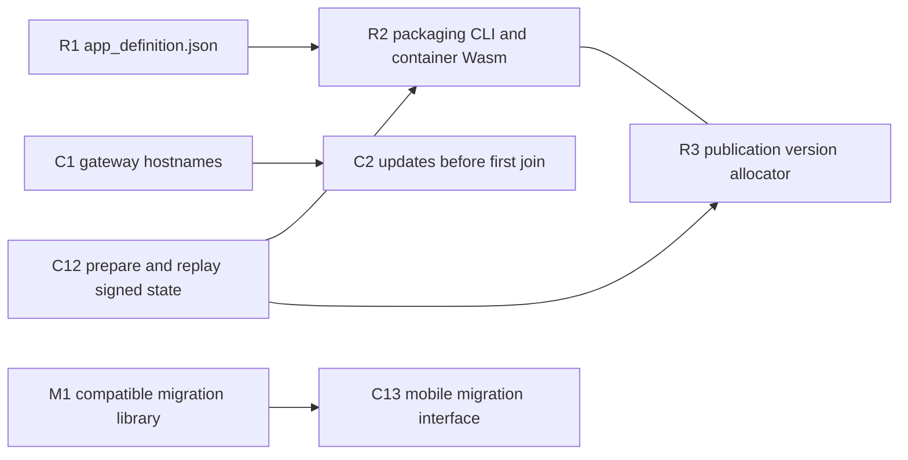

# Upstream issues

The plans need these changes in projects EVY does not own. Each plan's Repositories table lists the new code in Core's `crates/mobile`. The [admission table in 1.3 Single-application host](1-freenet-mobile-appkit/03-host.md#freenet-issues-being-worked-on-that-are-required) lists the Core issues already in progress that each release checks.

Core auto-closes feature pull requests that have no approved issue ([#4311](https://github.com/freenet/freenet-core/pull/4311)), and it ranks issues by what they unblock ([D4412](https://github.com/freenet/freenet-core/discussions/4412)). So each issue names the plan it unblocks, and we open a pull request only once its issue is approved.

## Filed

| Change | Issue | Needed by |
| --- | --- | --- |
| Request IDs on client API success and error replies. The client sets an ID on each request, and Core and stdlib preserve it through every reply path for the request types enabled for parallel execution. The SDK uses one submitted request per connection until this coverage passes conformance tests | [freenet-stdlib#106](https://github.com/freenet/freenet-stdlib/issues/106), [freenet-core#5724](https://github.com/freenet/freenet-core/issues/5724) | [1.2 Embedded node and mobile SDK](1-freenet-mobile-appkit/02-sdk.md#matching-replies-to-requests), [2.6 Payments](2-evy-on-freenet/06-payments.md#paying-on-a-phone) |
| Core backup includes delegate Wasm and exact registration parameters, then installs and registers them during restore. #4035 is open and unassigned as checked 2026-10-07; the mobile export and import surface must expose the capability | [freenet-core#4035](https://github.com/freenet/freenet-core/issues/4035) | [1.5 Identity, keys and local protection](1-freenet-mobile-appkit/05-identity.md#the-backup-file), [1.7 Upgrades and migration](1-freenet-mobile-appkit/07-migration.md#delegate-secret-export-and-import), [3.1 Automated backup](3-optional-extensions/01-backup.md#the-backup-file) |
| Agreement on the sync design that the EVY delegate's sync library follows | [freenet-core RFC #5587](https://github.com/freenet/freenet-core/issues/5587) | [3.2 Device sync](3-optional-extensions/02-sync.md#what-core-still-needs) |
| Delegates update contracts they do not yet hold | [freenet-core#5542](https://github.com/freenet/freenet-core/issues/5542) | [3.2 Device sync](3-optional-extensions/02-sync.md#what-core-still-needs) |
| Delegate subscriptions register hosting demand on a running node and restore subscriptions after restart | [freenet-core#4669](https://github.com/freenet/freenet-core/issues/4669) | [1.6 Application protocols, data and operations](1-freenet-mobile-appkit/06-data-and-operations.md#lost-network-state), [3.2 Device sync](3-optional-extensions/02-sync.md#what-core-still-needs) |
| A delegate GET tells a missing contract from a failed lookup | [freenet-stdlib#131](https://github.com/freenet/freenet-stdlib/issues/131) | [3.2 Device sync](3-optional-extensions/02-sync.md#what-core-still-needs) |
| River reclaims old chat delegate copies and unregisters old delegate keys after a migration completes | [river#586](https://github.com/freenet/river/issues/586) | [1.7 Upgrades and migration](1-freenet-mobile-appkit/07-migration.md#retiring-the-old-version) |
| Persistent DM blocking and leaving a DM | [river#461](https://github.com/freenet/river/issues/461) | The DM part of blocking in [1.9 Testing and release](1-freenet-mobile-appkit/09-testing-and-release.md#store-requirements) |

## Future Core migration work

| Proposal | Scope | Adoption |
| --- | --- | --- |
| [freenet-core RFC #5255](https://github.com/freenet/freenet-core/issues/5255) | Author-bound delegate provenance and Core-mediated secret transfer to a successor delegate | Evaluate when the provenance checks and secret-deposit path are implemented and tested. |

EVY uses application-driven `migrate_delegate_secrets` with its own export and import adapters, as [1.7 Upgrades and migration](1-freenet-mobile-appkit/07-migration.md#delegate-secret-export-and-import) specifies. Its release requirements are the compatible library release in [M1](#m1-release-freenet-migrate-on-the-freenet-stdlib-that-core-pins), the mobile SDK interface in [C13](#c13-expose-application-driven-delegate-migration-to-mobile-hosts) and the migration fixtures in [2.4 SDUI data and actions](2-evy-on-freenet/04-data-and-actions.md#updating-the-evy-delegate).

## Core retention and delivery research

Durable offline delivery across contract eviction belongs to separate Core work. Milestone 1 (Freenet mobile AppKit) and milestone 2 (EVY on Freenet) test reconnect delivery with contract state retained within the pinned Core build's hosting budget. The milestones and [3.2 Device sync](3-optional-extensions/02-sync.md#traffic-and-lifecycle) adopt stronger retention and delivery guarantees when they ship in Core, including availability while all linked mobile nodes are stopped.

| Thread | Scope | Status checked 2026-10-07 |
| --- | --- | --- |
| [#5041 Bounded local contract pin](https://github.com/freenet/freenet-core/issues/5041) | A quota-bounded API for retaining selected contracts on the user's node through normal demand eviction | Open design proposal with an exploratory fork; awaiting approach approval |
| [#4651 Contract storage design](https://github.com/freenet/freenet-core/issues/4651) | Evaluates on-disk persistence and a targeted backstop for newly published contracts until a second replica exists | Open design question |
| [#4785 Persist hosting demand across restart](https://github.com/freenet/freenet-core/issues/4785) | Restores live subscriptions for contracts with prior client demand after a node restart | Open follow-up proposal |
| [#3465 PUT propagation reliability](https://github.com/freenet/freenet-core/issues/3465) | Tracks locally applied PUTs whose reported results or remote propagation are unreliable | Open; assigned to iduartgomez |
| [#3611 PUT forwarding acknowledgements and retries](https://github.com/freenet/freenet-core/pull/3611) | Adds hop-level forwarding acknowledgements and retries for in-flight PUT operations | Merged 2026-03-21 |
| [#5515 Repair dropped broadcast UPDATEs](https://github.com/freenet/freenet-core/pull/5515) | Adds resynchronization for rate-limited broadcasts; [#5527](https://github.com/freenet/freenet-core/issues/5527) tracks repair latency when a throttle window suppresses another request | Merged 2026-09-02; latency follow-up open |

Local retention, live subscription recovery and in-flight retries address separate parts of offline recovery. The open proposals establish the upstream threads for evaluating future Core releases. [#3626](https://github.com/freenet/freenet-core/pull/3626) defines the client PUT response as local persistence, with propagation continuing asynchronously.

## To file

We file the Core entries first, because the River entries build on them.

| # | Issue | Repository | Unblocks |
| --- | --- | --- | --- |
| C1 | [Resolve gateway hostnames in the join loop](#c1-resolve-gateway-hostnames-in-the-join-loop) | freenet-core | [1.2 Embedded node and mobile SDK](1-freenet-mobile-appkit/02-sdk.md#start-stop-and-reconnect) |
| C2 | [Accept local updates and subscriptions before the first join](#c2-accept-local-updates-and-subscriptions-before-the-first-join) | freenet-core | [1.2 Embedded node and mobile SDK](1-freenet-mobile-appkit/02-sdk.md#start-stop-and-reconnect), [1.6 Application protocols, data and operations](1-freenet-mobile-appkit/06-data-and-operations.md#sending-updates) |
| C3 | [Re-read the Wasm memory address after each guest call](#c3-re-read-the-wasm-memory-address-after-each-guest-call) | freenet-core | [1.2 Embedded node and mobile SDK](1-freenet-mobile-appkit/02-sdk.md#running-wasm) |
| C4 | [Keychain and Keystore backends for the node encryption key](#c4-keychain-and-keystore-backends-for-the-node-encryption-key) | freenet-core, under [#4137](https://github.com/freenet/freenet-core/issues/4137) | [1.2 Embedded node and mobile SDK](1-freenet-mobile-appkit/02-sdk.md#keys), [1.5 Identity, keys and local protection](1-freenet-mobile-appkit/05-identity.md#node-encryption-key) |
| C5 | [Let an embedder supply the `UserInputPrompter`](#c5-let-an-embedder-supply-the-userinputprompter) | freenet-core | [1.3 Single-application host](1-freenet-mobile-appkit/03-host.md#background-runs-and-delegate-prompts) |
| C6 | [Permission codes, a set call and a public API for app grants](#c6-permission-codes-a-set-call-and-a-public-api-for-app-grants) | freenet-core | [1.3 Single-application host](1-freenet-mobile-appkit/03-host.md#base-authorization-and-device-access) |
| C7 | [Lock and unlock on `SecretsStore`](#c7-lock-and-unlock-on-secretsstore) | freenet-core | [1.5 Identity, keys and local protection](1-freenet-mobile-appkit/05-identity.md#locking-and-unlocking) |
| C8 | [Thin-peer role and cellular budgets](#c8-thin-peer-role-and-cellular-budgets) | freenet-core | [1.8 Thin-peer role and cellular data budgets](1-freenet-mobile-appkit/08-thin-peer.md#upstream-work-and-carrier-evidence) |
| C9 | [Send client updates as deltas](#c9-send-client-updates-as-deltas) | freenet-core | [1.8 Thin-peer role and cellular data budgets](1-freenet-mobile-appkit/08-thin-peer.md#upstream-work-and-carrier-evidence) |
| C10 | [Stage and activate a complete app restore](#c10-stage-and-activate-a-complete-app-restore) | freenet-core | [1.2 Embedded node and mobile SDK](1-freenet-mobile-appkit/02-sdk.md#what-to-build), [1.5 Identity, keys and local protection](1-freenet-mobile-appkit/05-identity.md#staged-restore-transaction), [3.1 Automated backup](3-optional-extensions/01-backup.md#restoring-on-a-new-phone) |
| C11 | [Scope private-data operations on a shared node](#c11-scope-private-data-operations-on-a-shared-node) | freenet-core | [1.3 Single-application host](1-freenet-mobile-appkit/03-host.md#shared-node-and-key-scope), [1.5 Identity, keys and local protection](1-freenet-mobile-appkit/05-identity.md#app-specific-export-and-import), [3.1 Automated backup](3-optional-extensions/01-backup.md#the-backup-file) |
| C12 | [Prepare and replay signed website publications](#c12-prepare-and-replay-signed-website-publications) | freenet-core | [1.4 Application bundles](1-freenet-mobile-appkit/04-bundles.md#publishing-and-evidence) |
| C13 | [Expose application-driven delegate migration to mobile hosts](#c13-expose-application-driven-delegate-migration-to-mobile-hosts) | freenet-core | [1.2 Embedded node and mobile SDK](1-freenet-mobile-appkit/02-sdk.md#what-to-build), [1.7 Upgrades and migration](1-freenet-mobile-appkit/07-migration.md#delegate-secret-export-and-import), [2.4 SDUI data and actions](2-evy-on-freenet/04-data-and-actions.md#updating-the-evy-delegate) |
| S1 | [A public delegate call in the TypeScript client](#s1-a-public-delegate-call-in-the-typescript-client) | freenet-stdlib | [2.5 EVY Developer on Freenet](2-evy-on-freenet/05-developer.md#the-evy-developer-bundle) |
| M1 | [Release freenet-migrate on the freenet-stdlib that Core pins](#m1-release-freenet-migrate-on-the-freenet-stdlib-that-core-pins) | freenet-migrate | [2.4 SDUI data and actions](2-evy-on-freenet/04-data-and-actions.md#updating-the-evy-delegate) |
| R1 | [Ship `app_definition.json` in the release build](#r1-ship-app_definitionjson-in-the-release-build) | river | [1.4 Application bundles](1-freenet-mobile-appkit/04-bundles.md#the-archive-and-its-definition) |
| R2 | [Publish with the packaging CLI and River's own container Wasm](#r2-publish-with-the-packaging-cli-and-rivers-own-container-wasm) | river | [1.4 Application bundles](1-freenet-mobile-appkit/04-bundles.md#saved-copies-and-recovery) |
| R3 | [Use the common publication version allocator](#r3-use-the-common-publication-version-allocator) | river | [1.4 Application bundles](1-freenet-mobile-appkit/04-bundles.md#the-archive-and-its-definition) |
| R4 | [Save drafts and pending signed messages in the chat delegate](#r4-save-drafts-and-pending-signed-messages-in-the-chat-delegate) | river | [1.6 Application protocols, data and operations](1-freenet-mobile-appkit/06-data-and-operations.md#reads-and-local-data) |
| R5 | [Complete River's store-release requirements](#r5-complete-rivers-store-release-requirements) | river | [1.9 Testing and release](1-freenet-mobile-appkit/09-testing-and-release.md#store-requirements) |

### freenet-core

#### C1 Resolve gateway hostnames in the join loop

The node resolves every gateway hostname while it builds its config. A failed DNS lookup ends the start, so a phone that opens River on the subway can't start its node. The public gateway index uses hostnames ([gateways.toml](https://github.com/freenet/web/blob/main/hugo-site/static/keys/gateways.toml)), and the node fetches it at every start.

We ask Core to resolve each hostname inside the join loop and retry it there, so the node starts with no network and joins once a lookup works.

Sources: [node.rs](https://github.com/freenet/freenet-core/blob/main/crates/core/src/node.rs) (`parse_socket_addr`), [#1119](https://github.com/freenet/freenet-core/pull/1119) added the lookup at start, and [the node cannot start offline in network mode](https://github.com/glesage/freenet-appkit/blob/main/docs/findings.md#the-node-cannot-start-offline-in-network-mode). The community Android build ships fallback gateways to work around it ([river#319](https://github.com/freenet/river/issues/319)).

#### C2 Accept local updates and subscriptions before the first join

Until the node's first successful handshake, Core answers PUT, UPDATE and Subscribe with `PeerNotJoined`. A GET without `subscribe` reads the local copy. So once C1 lets the node start offline, River shows Bob's rooms but can't save "Skate session Saturday?" to the room or subscribe.

We ask Core to merge local updates and record subscriptions for contracts the node already stores before the first join, then send them on join.

Sources: `ensure_peer_ready` in [error.rs](https://github.com/freenet/freenet-core/blob/main/crates/core/src/client_events/error.rs), its callers in [client_events.rs](https://github.com/freenet/freenet-core/blob/main/crates/core/src/client_events.rs), and [#2385](https://github.com/freenet/freenet-core/pull/2385).

Depends on C1.

#### C3 Re-read the Wasm memory address after each guest call

Core reserves 256 MiB of address space for each Wasm instance, and the iPhone refused those reservations after 22 calls. Core can't use smaller reservations, because its host code keeps the memory address from before a guest call and reads through it afterwards. So iOS runs provisional limits: a new Store after 4 instances, and 2 executors.

We ask Core to look up each instance's memory address again after every contract and delegate call returns. Host functions already do this ([#3248](https://github.com/freenet/freenet-core/issues/3248), [#3270](https://github.com/freenet/freenet-core/pull/3270)). Each instance can then reserve only the memory it uses.

Sources: [contract.rs](https://github.com/freenet/freenet-core/blob/main/crates/core/src/wasm_runtime/contract.rs), the 256 MiB default from [#3990](https://github.com/freenet/freenet-core/pull/3990), [the iPhone refused Core's Wasm memory reservations](https://github.com/glesage/freenet-appkit/blob/main/docs/findings.md#the-iphone-refused-cores-wasm-memory-reservations) and the [recommended fix](https://github.com/glesage/freenet-appkit/blob/main/docs/findings.md#recommendation-core-re-reads-the-memory-address-after-each-guest-call).

#### C4 Keychain and Keystore backends for the node encryption key

The node encryption key backends are a closed list: systemd, file and keyring. The keyring backend refuses only Linux, so an Android build would fall back to the keyring crate's in-memory mock store and lose every secret at each restart.

We ask Core to add iOS Keychain and Android Keystore backends as `KekBackendKind` variants, and make the Android build refuse the keyring backend. File it as a sub-issue of [#4137](https://github.com/freenet/freenet-core/issues/4137), which already lists a hardware-backed tier.

Sources: [kek.rs](https://github.com/freenet/freenet-core/blob/main/crates/core/src/config/kek.rs), [#4140](https://github.com/freenet/freenet-core/issues/4140) and the per-version Android settings in [Node encryption key in 1.5 Identity, keys and local protection](1-freenet-mobile-appkit/05-identity.md#node-encryption-key).

#### C5 Let an embedder supply the `UserInputPrompter`

The node always builds its own `DashboardPrompter`, and the `user_input` module is crate-private. With no dashboard tab open, that prompter spawns `xdg-open`, which fails on iOS and Android. The phone host needs to show delegate prompts and Core's `Background` consent (`prompt_capability`) in its own trusted screens.

We ask Core for a public `UserInputPrompter` that the embedder passes to the node, and for no browser spawn on iOS or Android.

Sources: [p2p_impl.rs](https://github.com/freenet/freenet-core/blob/main/crates/core/src/node/p2p_impl.rs), [user_input.rs](https://github.com/freenet/freenet-core/blob/main/crates/core/src/contract/user_input.rs), and [#5749](https://github.com/freenet/freenet-core/issues/5749) on prompts from runs nobody started.

#### C6 Permission codes, a set call and a public API for app grants

Core's grant table keys each grant by user scope, app and permission code. Today `Background` is the only code. Loopback routes list and revoke grants, but nothing sets one except Core's own prompt, and the Rust API is crate-private. The phone host stores Bob's `notifications` answer from River's first run in this table.

We ask Core for a code for each app permission, starting with `notifications`, a call that sets a grant, and a public Rust API that `crates/mobile` can use.

Sources: [delegate_capabilities.rs](https://github.com/freenet/freenet-core/blob/main/crates/core/src/contract/delegate_capabilities.rs), [permission_prompts.rs](https://github.com/freenet/freenet-core/blob/main/crates/core/src/server/client_api/permission_prompts.rs), [#5730](https://github.com/freenet/freenet-core/pull/5730), [#5744](https://github.com/freenet/freenet-core/pull/5744) and [#4014](https://github.com/freenet/freenet-core/issues/4014).

#### C7 Lock and unlock on `SecretsStore`

`SecretsStore` keeps its keys in memory for as long as the node runs. When Alice's phone locks, the host has to wipe the node encryption key and every derived key from memory, then load them again on unlock.

We ask Core for `lock` and `unlock` on `SecretsStore`, plus a test that the zeroizing buffers are wiped. Today no test checks this ([#5599](https://github.com/freenet/freenet-core/issues/5599)).

Sources: [store.rs](https://github.com/freenet/freenet-core/blob/main/crates/core/src/wasm_runtime/secrets_store/store.rs) and [Locking and unlocking in 1.5 Identity, keys and local protection](1-freenet-mobile-appkit/05-identity.md#locking-and-unlocking).

#### C8 Thin-peer role and cellular budgets

A phone joins as a full peer. It routes and hosts for others, and that costs about 60 KiB/s each way on Wi-Fi. Core caps rate per connection and per node, but not total bytes. A phone on cellular needs a role that routes nothing for others and a byte budget Core enforces.

We ask Core for a thin-peer role that uses serving full peers without routing or hosting for others, and per-day upload and download caps. The issue must answer how a thin peer pays back the full peers that serve it ([D136](https://github.com/freenet/freenet-core/discussions/136), [D137](https://github.com/freenet/freenet-core/discussions/137), [D893](https://github.com/freenet/freenet-core/discussions/893)).

Sources: [phones are full peers on the public network](https://github.com/glesage/freenet-appkit/blob/main/docs/findings.md#phones-are-full-peers-on-the-public-network), [D420](https://github.com/freenet/freenet-core/discussions/420) (the only maintainer statement on a limited node on a phone), and the cost issues [#5643](https://github.com/freenet/freenet-core/issues/5643), [#5707](https://github.com/freenet/freenet-core/issues/5707), [#4965](https://github.com/freenet/freenet-core/issues/4965), [#5157](https://github.com/freenet/freenet-core/issues/5157) and [#3336](https://github.com/freenet/freenet-core/issues/3336).

#### C9 Send client updates as deltas

A client UPDATE merges on the phone and then goes to the serving peer as the whole merged state. Each message Bob sends to "Skate club" costs the full room state on cellular.

We ask Core to send the client's delta, computed against what the receiving peer holds, as Core's broadcasts already do.

Sources: [#4072](https://github.com/freenet/freenet-core/pull/4072) deferred the raw-delta wire format, `RequestUpdate` in [op_ctx_task.rs](https://github.com/freenet/freenet-core/blob/main/crates/core/src/operations/update/op_ctx_task.rs), and [#2427](https://github.com/freenet/freenet-core/pull/2427) on why deltas must use the receiver's summary.

#### C10 Stage and activate a complete app restore

Core and `crates/mobile` provide isolated restore stores and a durable activation record for one app's complete data generation. The transaction stages delegate Wasm, exact registrations, secrets and declared host records, runs local migration adapters, verifies successor readback and selects the complete generation in one recoverable activation step. Staged delegates run only the restore adapters; network activity resumes after activation. Other applications retain their data under the shared node KEK. Activation also replaces the sessions of consumers whose shared namespace changes. Lost-KEK recovery creates one replacement KEK and retains each affected application's old encrypted generation in quarantine until its own recovery completes.

The mobile SDK exposes the transaction to Swift and Kotlin, and startup recovery selects a complete generation before opening sessions. Tests on iOS and Android inject write failures, full storage, migration failures and termination before and after activation. This work follows the [staged restore transaction in 1.5 Identity, keys and local protection](1-freenet-mobile-appkit/05-identity.md#staged-restore-transaction) and uses the executable-inclusive backup capability proposed in [#4035](https://github.com/freenet/freenet-core/issues/4035).

#### C11 Scope private-data operations on a shared node

Core and `crates/mobile` accept a host-authorized application ownership selection for executable-inclusive export, staged import and private-data deletion. The selection includes exact current and supported predecessor delegate namespaces and declared host-record sets. Core checks the selection before reading, writing or deleting records. Shared component access follows ownership and grants; an application releases its grant while the owning component and remaining consumers retain their data.

The shared node keeps one KEK across applications. Application Forget removes selected private records, registrations and grants. Whole-node reset closes all sessions, deletes the KEK and clears the shared store. The host exposes these as separate operations with explicit coverage reports. Tests on iOS and Android export, restore and forget one application while a second keeps its records and working sessions, reject ownership substitution and verify whole-node reset. [1.3 Single-application host](1-freenet-mobile-appkit/03-host.md#shared-node-and-key-scope) and [1.5 Identity, keys and local protection](1-freenet-mobile-appkit/05-identity.md#forget) define these rules.

#### C12 Prepare and replay signed website publications

fdev exposes separate preparation and submission capabilities. Preparation takes the release directory, explicit unsigned 32-bit version, publisher key and pinned container Wasm, and returns the exact archive and complete signed container state without network submission. Submission sends saved state with the same container Wasm and parameters. The packaging CLI saves those bytes durably before sending and replays them unchanged after an uncertain result.

The packaging CLI owns the per-container journal, version reservation and release-job serialization defined in [1.4 Application bundles](1-freenet-mobile-appkit/04-bundles.md#publishing-and-evidence). fdev supplies the archive and signing encoding and validates the supplied version and state. Fixtures cover preparation without submission, exact replay after termination and readback through a second node. This is proposed fdev work in Core.

#### C13 Expose application-driven delegate migration to mobile hosts

Core's `crates/mobile` runs freenet-migrate's `migrate_delegate_secrets` in Rust and exposes it to Swift and Kotlin. The app supplies its predecessor registry, walk policy and export, import and verification adapters. The host authorizes the selected application and delegate namespaces before migration starts, using the ownership rules in C11.

The runner holds other calls to the successor until imported records pass readback verification. An interrupted run retains the predecessor records and resumes on the next start. Retirement follows [1.7 Upgrades and migration](1-freenet-mobile-appkit/07-migration.md#retiring-the-old-version). Backup restore runs the same adapters inside the staging transaction in C10.

Fixtures on iOS and Android cover normal upgrades, skipped supported generations, interruption, failed imports, successor readback and isolation from another application's records. EVY fixtures preserve `root_seed`, derived public keys, addresses and pending signed operations. This is proposed mobile SDK work and depends on M1.

### freenet-stdlib

#### S1 A public delegate call in the TypeScript client

EVY Developer runs in a browser and keeps the service publisher key in its own delegate, so the page asks the delegate to sign each UI version. freenet-stdlib's TypeScript `FreenetWsApi` makes only `put`, `update`, `get`, `subscribe` and `disconnect` public. Its `sendRequest` is private, so a web app can't send `RegisterDelegate` or `ApplicationMessages` or read the delegate's reply.

We ask for public calls that register a delegate and send it application messages, and that return the delegate's outbound messages.

Sources: [websocket-interface.ts](https://github.com/freenet/freenet-stdlib/blob/main/typescript/src/websocket-interface.ts), which already imports the delegate request and response types.

### freenet-migrate

#### M1 Release freenet-migrate on the freenet-stdlib that Core pins

freenet-migrate 0.7.0 builds on freenet-stdlib 0.8.2, and the Core that the SDK pins uses freenet-stdlib 0.12.1. EVY's app moves the EVY delegate's records with freenet-migrate's `migrate_delegate_secrets`, which `crates/mobile` runs for the Swift and Kotlin SDK, so both must build on one stdlib.

We ask for a freenet-migrate release on the freenet-stdlib that Core pins. The selected Core, stdlib and freenet-migrate versions build together in the mobile SDK, and the migration fixtures run on that exact dependency set before release. C13 exposes the runner to Swift and Kotlin.

Sources: [Cargo.toml](https://github.com/freenet/freenet-migrate/blob/main/freenet-migrate/Cargo.toml), [stdlib #136](https://github.com/freenet/freenet-stdlib/pull/136) and [stdlib #137](https://github.com/freenet/freenet-stdlib/pull/137).

### river

#### R1 Ship `app_definition.json` in the release build

The AppKit host and the packaging CLI read River's components, protocols and permissions from `app_definition.json` in the release archive. River's archive has no such file.

River's release build writes `app_definition.json` as [The archive and its definition in 1.4 Application bundles](1-freenet-mobile-appkit/04-bundles.md#the-archive-and-its-definition) shows, with River's room contract, chat delegate and the `notifications` permission.

#### R2 Publish with the packaging CLI and River's own container Wasm

River publishes through the packaging CLI with `--contract-wasm published-contract/web_container_contract.wasm`. Preparation and submission both use that pinned Wasm and River's existing publisher key, preserving the container key `raAqMhMG7KUpXBU2SxgCQ3Vh4PYjttxdSWd9ftV7RLv`. River's publisher copies the signing key into fdev's key file, `~/.config/freenet/website-keys/<name>.toml`, and backs it up with the publication journal and prepared signed states.

Sources: River's [Makefile.toml](https://github.com/freenet/river/blob/main/Makefile.toml), [river-publish.md](https://github.com/freenet/river/blob/main/.claude/rules/river-publish.md), [website.rs](https://github.com/freenet/freenet-core/blob/main/crates/fdev/src/website.rs) and [publish-readback.sh](https://github.com/freenet/river/blob/main/scripts/publish-readback.sh).

Depends on R1 and C12. File together with R3.

#### R3 Use the common publication version allocator

River release jobs use the packaging CLI's per-container journal and lock. Each new publication reserves a version higher than the journal's highest reservation and the verified network version, with Unix seconds as a starting floor. Retries retain the exact prepared signed state and its version. River's publish rules and CI route releases through this common publisher workspace.

The first release reconciles the existing container version before reservation. Recovery restores the journal and prepared states alongside the publisher key, then reconciles pending attempts before preparing another release. [1.4 Application bundles](1-freenet-mobile-appkit/04-bundles.md#publishing-and-evidence) defines the allocator and readback rules.

Depends on C12. File together with R2.

#### R4 Save drafts and pending signed messages in the chat delegate

River keeps Bob's unsent draft only in the page. When River restarts, or the phone stops the node in the background, the draft is lost, and so is a signed message Core hasn't answered.

River saves the draft and the signed message in the chat delegate's store with `GetVersionedRequest` and `CasStoreRequest`, beside the send. River keeps signing in the page, and the send never waits for the delegate store, because delegate calls queue behind contract merges ([river#512](https://github.com/freenet/river/issues/512)).

Sources: [river#345](https://github.com/freenet/river/issues/345) (CAS requests), Mail's per-device drafts delegate ([mail#56](https://github.com/freenet/mail/pull/56)) and [Sending updates in 1.6 Application protocols, data and operations](1-freenet-mobile-appkit/06-data-and-operations.md#sending-updates).

#### R5 Complete River's store-release requirements

File a River release issue for the following work from [1.9 Testing and release](1-freenet-mobile-appkit/09-testing-and-release.md#store-requirements). Each row needs an owner and completion evidence before the iOS and Android store submissions.

| Work | Completion evidence |
| --- | --- |
| Reporting | River's UI reports a message or member to a monitored River-team inbox. A test report reaches the inbox, and the team publishes its response deadline on the support page. |
| Room-wide blocking | A user can block a member and hide that member's room messages. The block survives restart and new messages. Combined room and DM tests use the DM blocking work tracked in [river#461](https://github.com/freenet/river/issues/461). |
| Default content filter | River's UI filters objectionable messages by default, with acceptance fixtures covering the release's filter behavior. |
| Terms before posting | River shows its terms and requires acceptance before the user's first post. Tests cover acceptance and reopening the app. |
| Support page and listings | A published support page gives contact details and the report-response deadline. The iOS and Android store listings link to it. |
| Child-safety materials | River publishes its child-safety standards and completes the Play Console declaration. The release checklist records the published URL and declaration. |

River's invite-only release uses its room-owner and deputy ban controls. Related design work includes room membership and delegated moderation in [river#371](https://github.com/freenet/river/issues/371), and a recent-actions admin panel in [river#492](https://github.com/freenet/river/issues/492). R5 tracks the store-release work above and links the existing DM issue for its blocking checks.
