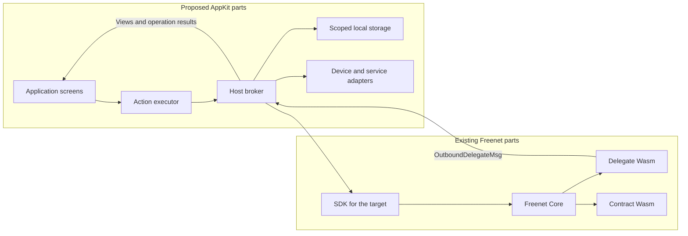

# Actions and delegates

This plan owns AppKit's declared actions, the delegate convention and the limits the executor runs under. [Data and pending operations](data-and-operations.md) owns reads, local storage and submitted updates. [Hosts](hosts.md) install applications and check permissions, [SDUI](sdui.md) defines screens, and [Bundles](bundles.md) define the signed archive that carries the definitions.

Bob's Send button invokes the declared action `river.sendMessage` with his draft text. The host saves the operation ID, reads the room state and sends the record and typed arguments to the application's delegate. The chat delegate signs the message with Bob's member key and prepares the update. The host saves the exact prepared bytes, checks submission permission and submits them to the room contract. A subsequent read or subscription supplies evidence of the result.

| Section | What Freenet provides today | What AppKit proposes |
| --- | --- | --- |
| [1](#1-who-does-what) | Core's contract and delegate runtimes and delegate secret namespaces | The action executor, the host broker and the application delegate convention |
| [2](#2-declared-actions) | Application code that calls the client API directly | Versioned action definitions with bounded steps, run by the installed executor |
| [3](#3-delegate-requests-and-results) | `ApplicationMessages` with opaque payload bytes and a runtime-attested `MessageOrigin` | A typed request and result protocol inside the payload, with fixtures and correlation |
| [4](#4-limits-and-security) | Core's Wasm state, context and deadline limits | Host limits for actions, views, subscriptions and storage, plus session authority |

## 1. Who does what

### What Freenet provides today

Freenet Core runs contract Wasm through `ContractInterface` and delegate Wasm through `DelegateInterface::process`. A contract's `validate_state` and `update_state` decide which shared state is valid and how updates merge. A delegate receives one inbound message with its attested origin and returns outbound messages. Core owns delegate secret namespaces, as [identity section 2](../identity/README.md#2-protected-keys-and-records) describes.

| Part | Runs in | Responsibility |
| --- | --- | --- |
| Contract | Core's Wasm runtime on every peer that holds the state | Validate and merge shared state |
| Delegate | Core's Wasm runtime on the local node | Hold secrets and answer application messages under its own policy |

### What AppKit proposes

| Part | Runs in | Responsibility |
| --- | --- | --- |
| Action executor | Installed with the host | Evaluate bounded action steps and deliver typed results to the screen |
| Host | Core's shell on the browser target, or the native application | Sessions, permissions, storage, operation journals and device and service adapters |
| Application delegate convention | The application's delegate Wasm | Typed requests and results for domain decoding, projections, update preparation and private operations |
| Custom application | Browser or native application | Its own presentation and orchestration over the same domain protocols |
| Memory preview | [EVY Developer preview](../evy/README.md#6-preview) | Deterministic host adapters running the same executor with typed delegate fixtures |

Host databases hold caches and pending operations, and the application delegate's secret store holds drafts and private records. [Identity and recovery](../identity/README.md) specifies protected key storage, enrollment and migration.

Example: Bob taps Send. The executor runs the declared steps, the host checks River's grant, Core runs the chat delegate, and peers validate the message under the room contract.

## 2. Declared actions

### What Freenet provides today

A web application orchestrates its own requests. Its JavaScript or Rust code sends `ClientRequest::ContractOp` and `ClientRequest::DelegateOp` over the client API and matches the responses itself. The website container holds `index.html` and the code it loads, per [bundles section 1](bundles.md#1-the-archive-and-its-definition).

### What AppKit proposes

Action definitions live in the bundle's `ui/sdui/actions/` directory. Each names its resources, input and output schemas and the step versions it needs. Definitions allow bounded sequences and conditional branches, with caps on steps, input sizes, expression depth and concurrent requests. A new action assembled from supported steps arrives in a bundle. A new executor primitive requires a host update.

| Step | Returns | Detailed in |
| --- | --- | --- |
| Invoke action | The action's typed result, correlated by the operation ID from the [data plan](data-and-operations.md#3-submitting-updates-and-pending-operations) | This section |
| Read or observe | A verified snapshot, subscription events and the host-recorded response time | [Data plan section 1](data-and-operations.md#1-reads-views-and-freshness) |
| Call delegate | A typed projection, prepared operation bytes or a defined error | [Section 3](#3-delegate-requests-and-results) |
| Submit | Merged locally, observed, superseded or unresolved | [Data plan section 3](data-and-operations.md#3-submitting-updates-and-pending-operations) |
| Local read, write or observe | Host-side records such as preferences and session values, and the transaction outcome | [Data plan section 2](data-and-operations.md#2-values-and-local-storage) |
| Device or service operation | A scoped handle, a typed result, or a typed denial or unavailable result | [Hosts section 5](hosts.md#5-permissions-and-device-access) |
| Time and randomness | Host-supplied values, with deterministic substitutes in tests | [Data plan section 2](data-and-operations.md#2-values-and-local-storage) |
| Cancel or close | Cancellable work stopped, host-side demand released and the session invalidated | [Data plan section 3](data-and-operations.md#3-submitting-updates-and-pending-operations) |

Definitions and schemas load from one verified archive snapshot. A session records the exact delegate code, parameters and protocol versions it selected. Hosts adopt updates after the [installation checks](hosts.md#3-installing-and-updating). Atlas proves the definitions before other products adopt them.

Example: Carol's Invite member screen names `river.inviteMember` with the room and the invitee. The action's steps read the [`members` view](data-and-operations.md#1-reads-views-and-freshness) and call the chat delegate. For `river.createRoom`, the chat delegate prepares the room and asks Core to `Put` the new room contract with the owner's key as parameter, as [section 3](#3-delegate-requests-and-results) allows. Carol ships a "Set nickname" action, `river.setNickname`, from the same steps in the next bundle. A step that opens the camera needs a host update first. The [SDUI plan](sdui.md#2-connecting-controls-to-data-and-actions) shows how a screen control binds to this action.

## 3. Delegate requests and results

### What Freenet provides today

`DelegateRequest::ApplicationMessages` carries the delegate key, its parameters and a list of inbound messages. An `ApplicationMessage` holds opaque payload bytes, a `DelegateContext` of at most 409,600 bytes and a processed flag. The application and its delegate agree on what the payload means.

The delegate's `process` function receives an `Option<MessageOrigin>`. `WebApp(contract id)` names the calling web app when Core resolved its session token. `Delegate(key)` names a calling delegate and replaces any web app origin for that call.

The delegate replies with `OutboundDelegateMsg` values, which reach the client as `HostResponse::DelegateResponse`. It can also ask Core to get, put, update, subscribe to and unsubscribe from contracts, message another delegate and prompt the user with `RequestUserInput`.

Core delivers a delegate's output to local clients by locality, so two unattested local clients on one node see the same output. Core-authenticated app sessions are open work in [#5264](https://github.com/freenet/freenet-core/issues/5264). The mobile crate exposes no delegate operation yet, and the [mobile plan](../freenet-mobile/README.md#2-embedded-node-and-native-api) lists it as a feasibility deliverable.

### What AppKit proposes

A typed request and result convention inside the payload bytes:

| Field | Request | Result |
| --- | --- | --- |
| Protocol version | The delegate protocol the session selected | Echoed |
| Request ID | Unique within the session | Echoed |
| Body | Typed arguments and bounded record bytes the host read | A typed projection, prepared operation bytes or a defined error |

Fixtures define the exact encodings. Each language binding specifies deterministic encoding, typed errors, request correlation and ownership of transferred bytes. Bound large payloads and measure copying across bindings. Reject conflicting request ID reuse, unknown handles and completions from expired sessions.

Delegate policy keys on the `MessageOrigin` contract id. The host assigns the container identity, verified content reference, user, installation and session generation, as [hosts section 1](hosts.md#1-who-controls-what) and [bundles section 4](bundles.md#4-installing-a-copy) describe, and enforces them before a request reaches Core. A delegate treats copies of those fields inside the payload as unverified data.

Application adapters supply domain codecs, canonical signing inputs and view projections, and validate the source identities and signatures each domain requires. A delegate's prepared update still passes host authorization and contract validation.

Example: River's chat delegate already correlates requests this way. Bob's send is a [`SignMessage`](https://github.com/freenet/river/blob/main/common/src/chat_delegate.rs) request with request ID 17, the room key (Alice's owner key) and the serialized `MessageV1` holding "Skate session Saturday?". The delegate signs it with the key it stores for that room and returns `SignResponse` with the same request ID and the 64-byte signature. The action combines both into an [`AuthorizedMessageV1`](https://github.com/freenet/river/blob/main/common/src/room_state/message.rs) and submits it to the room contract. Core stamps the request with `WebApp(River container contract id)`. When the delegate holds no key for the room, `SignResponse` carries an error string, which the conversation screen shows. The convention above adds a protocol version and a typed error to this exchange.

## 4. Limits and security

### What Freenet provides today

| Limit | Value | Where |
| --- | --- | --- |
| Contract state | 50 MiB | Core's state store |
| Delegate context | 409,600 bytes | stdlib `DelegateContext::MAX_SIZE` |
| Guest execution | A wall-clock deadline | Core's Wasm runtime |
| Memory per Wasm instance and module cache | Listed in the [mobile plan](../freenet-mobile/README.md#3-runtime-and-packaging) | Core's engine configuration |

The contract sandbox policy and `Authenticate { token }` bound what a web app reaches. Core delivers delegate output by locality, and Core-authenticated sessions wait on [#5264](https://github.com/freenet/freenet-core/issues/5264).

### What AppKit proposes

The installed executor runs declarative steps under host limits for memory, input and output sizes, subscriptions, storage, action steps, view complexity and event frequency. Schedule bounded work away from the UI thread. Cancel overdue sequences. A failure ends the affected operation or session and preserves its durable journal.

Every protected operation uses host-assigned session authority and current grants. Delegates apply their own policy to approved calls. Platform networking, native objects and private keys stay behind host interfaces.

Treat definitions and delegate results as untrusted input. Validate action arguments, delegate results, outgoing view data, returned targets and prepared bytes before any side effect. Resource-limit tests cover declarative evaluation and Core execution.

Example: a bundle declares an action with ten thousand steps. Validation rejects it before the executor runs anything. A delegate returns prepared bytes for a contract the definition never declared. The host rejects the submit step and journals the failure.

## 5. Reference recap

| Reference | Status | Names | Explained in |
| --- | --- | --- | --- |
| `MessageOrigin` | Existing | The attested caller of a delegate message | [Section 3](#3-delegate-requests-and-results) |
| Action definition and step version | Proposed | One declared action and the executor primitives it uses | [Section 2](#2-declared-actions) |
| Delegate protocol version and request ID | Proposed | One typed delegate exchange | [Section 3](#3-delegate-requests-and-results) |

Views, storage namespaces and the operation ID belong to the [data plan recap](data-and-operations.md#4-reference-recap). The container `ContractKey`, `publication_ref` and the installation and session identifiers belong to the [bundle recap](bundles.md#6-reference-recap). Contract and delegate keys belong to the [migration plan](../migration/README.md#5-reference-recap).

## 6. Acceptance

- One Atlas action runs through a declared action and a custom native control with the typed delegate convention, per the [Atlas sample](../atlas-sample/README.md#2-feasibility-and-application-responsibilities).
- Real delegate integration tests run alongside deterministic previews, and a new action built from supported steps runs on the installed executor without an executor update.
- Hosts reject cross-app access, forged caller IDs, malformed delegate results, undeclared targets and excessive action work.

References: [Rust client API](https://github.com/freenet/freenet-stdlib/blob/main/rust/src/client_api.rs), [delegate interface](https://github.com/freenet/freenet-stdlib/blob/main/rust/src/delegate_interface.rs).
