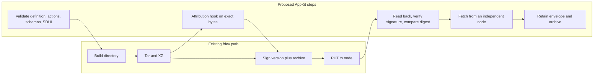

# Application bundles

A publisher packages an application in a Freenet website container, a signed and compressed archive that the publisher's key authorizes and a version number orders. Today the archive holds an entry page, contract Wasm and web assets, and a browser runs whatever code the entry page loads. A mobile host runs only its own code, so AppKit adds an application definition to the archive that tells the host what the bundle contains and what to set up before the first screen opens.

1. [Identity and discovery](#1-identity-and-discovery): `app_ref`, the container version and how a host finds and trusts an application
2. [The archive and its definition](#2-the-archive-and-its-definition): archive entries, definition fields and interfaces
3. [Contracts, delegates and initialization](#3-contracts-delegates-and-initialization): declared components, key derivation and the setup the host runs
4. [Publishing and evidence](#4-publishing-and-evidence): certify, publish, read back, `publication_ref` and `application_content_ref`
5. [Installing a copy](#5-installing-a-copy): archive checks, limits, artifact digests and installation identifiers
6. [Retention and recovery](#6-retention-and-recovery): what each owner keeps
7. [Reference recap](#7-reference-recap) and [Acceptance](#8-acceptance)

## 1. Identity and discovery

A website container is a Freenet contract: Its parameter is the publisher's signing key, one per application, and its state is the signed archive with its version. `app_ref` is Core's `ContractKey` for the container, the hash of the container Wasm plus the publisher's key. It stays the same for every version the publisher ships, so publishers keep the exact container Wasm they published with. The node accepts a publication only when its version is higher than the one it holds, and `fdev` writes the publication time as the version.

This plan proposes that a host finds and trusts an application through its `app_ref` alone. The host fetches the container behind it, checks the publisher's signature, and treats any name or icon the link carries as a label until the verified archive confirms it. When Bob scans the QR code on Alice's skateboard listing, his phone reads the Marketplace, fetches the container, verifies it, and then shows the name and icon from the archive. Because the `app_ref` stays the same across releases, a later Marketplace publication updates the application Bob already has. A publisher changing its key or validator follows the mutually acknowledged transfer in the [migration plan](../migration/README.md#4-publisher-continuity), and hosts keep the transfer evidence and ask before moving private access.

## 2. The archive and its definition

fdev writes:

```text
index.html            # required by fdev. Web entry or informational landing page
contracts/            # contract Wasm from fdev build
web/assets/           # browser code and assets
delegates/            # new: delegate Wasm
app_definition.json   # new: the application definition, fields below
actions/              # new: declarative actions and data bindings
schemas/              # new: action, view and delegate protocols
ui/                   # new: main.sdui.json, assets, locales
```

The definition is the file every host reads first.

| Definition field | Purpose |
| --- | --- |
| Format version | Selects the schema the host understands |
| Interfaces | Web, informational, SDUI and native entry points and their required files |
| Protocols | Reader steps, typed inputs/results and domain protocol versions |
| Contract/delegate references | Every contract and delegate the bundle ships and the initialization actions, see [section 3](#3-contracts-delegates-and-initialization) |
| Permissions | Scoped contract, delegate, storage, device and external-service operations |
| Storage compatibility | Supported schemas and migration entry points |
| External dependencies | Files fetched from outside the archive, see [section 5](#5-installing-a-copy) |
| Product metadata, native links, publisher transfer | Optional links to attribution, platform apps and the identity plan |
| Status | `active` or `withdrawn`, with optional reason and successor |

The Interfaces field declares the entry points a bundle offers, and each host opens the one it supports.

| Interface | Entry | What a host does with it |
| --- | --- | --- |
| Web | `index.html` | A browser loads the page and runs the code it references, as today |
| Informational | `index.html` as a static landing page | Every host displays the page and nothing more. fdev requires the file, so a mobile-only bundle ships the landing page there |
| SDUI | `ui/main.sdui.json` | The reader draws the declared screens |
| Native | The store link in the native links field | A host that finds the endorsed app installed hands over to it. A host that does not shows the store link |

When Bob opens the Marketplace `app_ref` on his laptop, the node serves the landing page, which names the application and links to the Freenet mobile app. On his phone, the host skips the informational entry and opens the SDUI entry, so he lands on the listing screen.

Validation covers the definition, actions, schemas and SDUI together, before publication and before a host opens an interface. A host picks an interface first, then checks that interface's requirements, so an unsupported SDUI component still leaves the web interface open. Custom web applications bring their own presentation and use the browser SDK. SDUI needs compatible reader steps, schemas and delegate protocols. Hosts ask before switching execution contexts.

The status field sits inside the signed archive, so the container signature authenticates it with the rest of the bundle. [Hosts](hosts.md#6-installing-and-updating-applications) own status observation, installation and withdrawal, and payment services own checkout eligibility.

## 3. Contracts, delegates and initialization

`fdev build` writes each contract's Wasm to `contracts/<code_hash>.wasm` with `dependencies.json`, and contract and delegate keys derive from code and parameters the same way as `app_ref`, as the [migration plan](../migration/README.md#1-component-identity-and-re-keying) details. This plan proposes a contract/delegate references field in the definition that lists each contract under `contracts/` and each delegate under `delegates/` with its code, parameter rules and supported protocols. The Marketplace offer contract's key is the hash of its Wasm plus its parameter bytes, so Bob's phone and Alice's laptop derive the same key from the bundle before either sends an offer, and shared fixtures check that every host agrees. The migration plan fixes parameter encodings, resolves successor pointers and carries state across re-keys, and Core tracks the upstream side in [#2776](https://github.com/freenet/freenet-core/issues/2776).

The same field declares the initialization actions. A web application's code creates its contracts with `Put` and installs its delegates with `RegisterDelegate` when it first runs. A mobile-only bundle ships no code of its own, so the definition lists those calls with their parameters, and the host runs them before the first screen opens and again after an update that changes them. When Bob installs Marketplace on his phone and taps "Offer $40", his offers contract and the signing delegate already exist, because the definition told the host to create the contract and register `delegates/sign.wasm` before the reader drew the offer form.

The install screen is the consent for setup. It lists the definition's permissions, including each delegate the bundle registers, and accepting it authorizes the declared initialization actions.

| Initialization action | What it does | Consent |
| --- | --- | --- |
| `Put` of the application's own contract | Creates a record on the user's node | The storage budget |
| `RegisterDelegate` | Installs code that signs in the user's name whenever an action asks | Listed on the install screen. A changed delegate shows it again |

A silent delegate swap would hand new code the user's signing power. When a Marketplace update replaces `delegates/sign.wasm`, Bob's phone keeps the installed copy, shows the install screen with the changed delegate, and switches copies after he accepts. Core's manifest permissions for browser capabilities, [#4014](https://github.com/freenet/freenet-core/issues/4014), set the same two requirements: a new prompt when the declared manifest changes and a way to revoke a grant. [Hosts](hosts.md#3-browser-hosting) tracks that gate.

Core's [RFC #5255](https://github.com/freenet/freenet-core/issues/5255) proposes shipping delegate Wasm as the state of a signed container, the same pattern as the website container, and asks whether `RegisterDelegate` grows an install-from-container variant. If it lands, the `delegates/` entry references that container instead of bundling the Wasm, the host runs the registration path Core ships, and the definition field stays the same.

## 4. Publishing and evidence



`fdev website publish` reads the current container version and publishes a higher one, and Core serves GET from local cache. This plan proposes three additions around that path: certify the archive before signing, read the container back after the PUT, and record two references that name what was published. One release, the Marketplace version that carries Carol's "Make offer" screen, goes through the steps in order.

Marketplace claims attribution, so the tool validates the bundle, builds the archive once and gets the signed [contribution record](../attribution/README.md#4-bundle-integration) for those exact bytes. Any later change to the archive, even a rebuild of the same source, needs a new record.

`fdev website publish` signs version 1758500000 and PUTs it. The PUT times out. A blind retry would sign a rebuilt archive under the same version, so the tool reads the container back first, verifies the signature and compares the digest with what it signed. The node returns the certified digest, so the tool skips the retry. That readback came from the publisher's own cache, so it proves acceptance there and nothing more. The tool marks the publication distributed once an independent node returns the same digest, attribution records that observation, and the publisher retains the envelope and archive under [section 6](#6-retention-and-recovery).

`publication_ref` names the exact archive that Bob's phone installs.

| Field | Value in the example |
| --- | --- |
| `app_ref` | The Marketplace container key |
| Container version | 1758500000, verified against the signature |
| Hash algorithm and digest | The certified archive digest |

If the phone later sees the same version with a different digest, it keeps the accepted copy and the conflict evidence, as [Hosts](hosts.md#6-installing-and-updating-applications) describes.

`application_content_ref` names the code a payment ran against. Bob pays through the SDUI reader on his phone. Alice confirms the sale in the publisher's iOS app, which ships through the App Store. Each event carries a reference with a `kind` tag.

| Kind | Reference | Example |
| --- | --- | --- |
| `publication` | A `publication_ref` | Bob's payment points at version 1758500000 |
| `native` | Platform identity, build identity, hash algorithm and build digest | Alice's confirmation points at the App Store build |

Payment stores the reference with the contribution record. A client-reported digest is a claim until the service verifies it. A native build links to the container only with the publisher's endorsement, and attribution certifies it through its own artifact record. Both references get a fixed encoding and a format version.

## 5. Installing a copy

The node checks an archive when it stores it. This plan proposes that the host that installs the archive runs the same checks again on the device and adds its own.

| Check | Who runs it |
| --- | --- |
| Signature and increasing version | Container contract, then the host |
| 50 MiB state limit | Node |
| Absolute paths, parent segments, symlinks and hardlinks rejected | Node unpack, then the host |
| Duplicate paths and undeclared executables rejected | Host |
| File count, memory, decompressed size and download size caps | Host, and the packaging tool at build time so a bundle that would fail on a host never publishes |

An artifact digest that extends the signature's guarantee to a file that stays outside the archive. The definition's external dependencies field declares the hash algorithm, the hash of the file's exact bytes, the file's length and its retrieval location. The host verifies the digest before first use and again for cached and mirrored copies. The pickup map for Alice's area is a 30 MiB tile pack, too large for the archive, so the definition lists its digest, length and mirror location. Bob's host downloads it once, checks the digest and rejects a copy that differs by one byte.

The host assigns a local installation identifier to each installed copy and a session identifier to each run of it. Those identifiers scope isolation, callback delivery and cancellation. They stay on the device, shared state and delegate messages carry neither, and a delegate treats any copy inside message bytes as unverified data. A session keeps one verified definition snapshot and records the exact artifact identities it runs. Definitions and artifacts update through container publication, new reader primitives arrive through platform app updates, and a native build packages its platform SDK and declares the schemas and protocols it supports. When Bob's phone updates Marketplace while his offer on Alice's skateboard is pending, the host commits the new copy, starts a fresh session and drops callbacks from the previous session. The pending offer keeps its operation ID and completes under the new session. [Hosts](hosts.md#6-installing-and-updating-applications) own the install and update flow around these identifiers.

## 6. Retention and recovery

The node webapp cache is ephemeral, so a node may drop an archive after serving it. This plan proposes that each owner keeps its own evidence.

| Owner | Retained evidence |
| --- | --- |
| Publisher | Exact archives, signed envelopes, validator Wasm and parameters, publication references |
| Host | Working copy, a recovery copy where practical, evidence for unresolved operations |
| Attribution | Contribution records, weight snapshots, reviewed source mapping |
| Payment/remuneration | Publication or native artifact references, contribution records, accounting evidence |

Index archives by digest, and verify mirrored copies against the retained envelope and container identity. Each owner declares retention periods, repair duty and storage budget before launch, and keeps evidence for unresolved operations until resolution and through the product's evidence period. Hosts clear old archives and keep the items in the table. Reopening an earlier copy requires compatibility with current local and shared state, and restoration verifies bytes, signature and container identity. Hosts report when they last checked for updates and whether required files are present.

## 7. Reference recap

| Reference | Status | Names | Explained in |
| --- | --- | --- | --- |
| `app_ref` | Existing | The application, across all its versions | [Section 1](#1-identity-and-discovery) |
| Container version | Existing | Which publication is newer | [Section 1](#1-identity-and-discovery) |
| Contract or delegate identity | Existing | One contract or delegate the application calls | [Section 3](#3-contracts-delegates-and-initialization) |
| `publication_ref` | Proposed | One exact signed archive | [Section 4](#4-publishing-and-evidence) |
| `application_content_ref` | Proposed | The code a payment ran against, bundle or native | [Section 4](#4-publishing-and-evidence) |
| Artifact digest | Proposed | One file fetched from outside the archive | [Section 5](#5-installing-a-copy) |
| Installation/session | Proposed | One installed copy and one run of it | [Section 5](#5-installing-a-copy) |

Product names and display versions are labels, not references. [Attribution](../attribution/README.md) maps containers to each economic `ProductId`.

## 8. Acceptance

- Web, mobile-only and combined bundles publish through the existing container and open their declared interfaces.
- All hosts derive identical container, contract and delegate identities from shared fixtures.
- Validation rejects mismatched actions, unsafe paths and unsupported required interfaces before execution.
- The attribution hook preserves the certified bytes through signing, retry, readback and the independent-node fetch.
- A native client and an SDUI client complete the same order with the same payment bindings.
- Publisher transfer, withdrawal, incompatible updates and recovery pass the host and identity fixtures.
- Restoring a historical archive succeeds after the live container advances.

References: [website publication](https://freenet.org/build/manual/publish-a-website/), [container implementation](https://github.com/freenet/freenet-core/tree/main/crates/website-contract), [migration library](https://github.com/freenet/freenet-migrate), [manifest permissions review findings](https://github.com/freenet/freenet-core/pull/4090), [security architecture discussion](https://github.com/freenet/freenet-core/discussions/5380), [mobile platform discussion](https://github.com/freenet/freenet-core/discussions/811).
