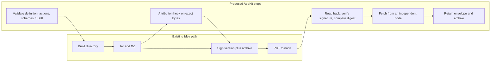

# Application bundles

A publisher ships an application as a Freenet website, a signed archive stored in a container contract. The container's key comes from its code and the publisher's key, and each release is a higher signed version under that key, so the key names the application across releases. River ships this way from `raAqMhMG7KUpXBU2SxgCQ3Vh4PYjttxdSWd9ftV7RLv`, per [FREENET.md](https://github.com/freenet/river/blob/main/FREENET.md).

A browser runs whatever code the archive's entry page loads. A mobile host runs only its own code, so AppKit adds an application definition to the archive that tells the host what the bundle contains and what to set up before the first screen opens. When Bob opens Alice's invite link, his phone reads River's container key from it, verifies the publisher's signature and installs River from the definition.

## 1. The archive and its definition

`fdev build` compiles each contract to `contracts/<code_hash>.wasm` and writes `dependencies.json` beside them. The publisher assembles the directory below around that output and hands it to `fdev website publish`, which requires `index.html`, tars the directory and signs it.

```text
index.html            # the web app, required by fdev website publish. Loads the web reader when the bundle ships SDUI
[anywhere]            # browser code and assets, no convention needed as index.html loads them
contracts/            # contract Wasm and dependencies.json from fdev build
delegates/            # new: delegate Wasm
app_definition.json   # new: the application definition, fields below
ui/sdui/web/          # new: the web SDUI reader build, copied in by the packaging tool
ui/sdui/ui.json       # new: SDUI version and definition
ui/sdui/actions/      # new: declarative actions and data bindings
ui/sdui/schemas/      # new: action, view and delegate protocols
```

| App definition field | Purpose |
| --- | --- |
| Format version | The definition schema this file follows |
| Name | The application name. The install screen and the app list show it |
| Description | Short sentence on what the application does, for app lists, discovery indexes and agents that search for applications |
| Contract/delegate references | Each contract and delegate the bundle ships, with its setup flag and predecessor rows, see [section 2](#2-contracts-delegates-and-initialization) |
| Permissions* | Device capabilities the application may use, each marked required or optional (per [#4014](https://github.com/freenet/freenet-core/issues/4014) & [#5254](https://github.com/freenet/freenet-core/issues/5254)). Hosts decide when to ask (mobile may ask only when needed) |
| Native links | Endorsed platform app builds and their store links, used to verify attribution and other checks |
| Publisher transfer | An optional transfer statement or acknowledgement, per [migration section 4](../migration/README.md#4-publisher-continuity) |

*_An earlier attempt at permissions [#4086](https://github.com/freenet/freenet-core/pull/4086) was reverted in [#4090](https://github.com/freenet/freenet-core/pull/4090) because a changed manifest could widen access silently. The definition therefore requires a fresh prompt whenever a published update adds an entry, and hosts keep grants revocable in their settings._

Versions everywhere! Where and what:
- Container version: Every publish. fdev writes the timestamp
- Format version: AppKit changes the definition file layout
- SDUI interface version: The screens use a new component or step
- Web reader version: The publisher bundles a newer `ui/sdui/web/` build

Web hosts (browsers) read `index.html` which includes either pure HTML/JS UI or SDUI-driven code:
```html
<!doctype html>
<script type="module" src="ui/sdui/web/reader.js"></script>
<freenet-web src="ui/sdui/ui.json"></freenet-web>
```

Native apps read `ui/sdui/ui.json` with its built-in reader, checks the interface version and renders the screens.

## 2. Contracts, delegates and initialization

A web app sets itself up, its own code calls `Put` to create contracts and `RegisterDelegate` to install delegates when it first runs. A reader runs declared actions and no publisher code, so the host runs that setup from the application definition.

- The contract/delegate references field holds one entry per contract or delegate.
- `fdev build` writes an alias and a code hash for each contract to `dependencies.json`. The publisher turns each pair into an entry, fills in the other fields and adds one entry per delegate under `delegates/`.
- The install screen is the user's consent to the setup. The host shows it again when a delegate changes, because a delegate signs in the user's name.

River's two entries, with illustrative field names and delegate alias:

```jsonc
[
  {
    "alias": "river.room",                   // the name actions and views bind to
    "kind": "contract",
    "file": "contracts/<code_hash>.wasm",
    "parameters": "room owner's key",        // host builds ChatRoomParametersV1 { owner }
    "protocols": ["ChatRoomStateV1"],
    "setup": "none",                         // the chat delegate creates one per room
    "predecessors": [/* rows from common/legacy_room_contracts.toml */]
  },
  {
    "alias": "river.chat",
    "kind": "delegate",
    "file": "delegates/chat_delegate.wasm",
    "parameters": "empty",                   // the key is BLAKE3 of the code hash
    "protocols": ["chat delegate: Store, Get, Delete, List"],
    "setup": "register",                     // host installs it at install time
    "predecessors": [/* rows from legacy_delegates.toml */]
  }
]
```

The flow from publishing to updates:

1. The River publisher runs `fdev build`, which writes the room contract Wasm and a `dependencies.json` line for `river.room`. The packaging step turns that line into the room entry, adds the chat delegate entry and copies the predecessor rows from River's two legacy files. `fdev website publish` signs and ships the bundle.
2. Bob opens Alice's invite link. His phone reads the definition and shows the install screen. It lists the chat delegate to register and notifications as an optional permission. Bob accepts. The host sees `register` on the chat delegate, adds the cipher and nonce that `RegisterDelegate` needs and registers the delegate. The first screen opens after that. The room contract says `none`, so the host leaves it to the actions that create rooms.
3. When Alice creates "Skate club", the `river.createRoom` action calls the chat delegate. The delegate asks Core to `Put` a room contract with her key as the parameter. To open the room, Bob's host applies the parameter rule to Alice's key, which the invite carries as `room`, per [members.rs](https://github.com/freenet/river/blob/main/ui/src/components/members.rs). A contract's key comes from its code and its parameters, so this gives the host the room's key.
4. A River release ships new room contract code. The code hash changes, so each room gets a new key, and the "Skate club" state stays under the old key. The new entry lists the old code hash as a predecessor. Bob's host passes the row to `freenet-migrate`, which derives the older keys and probes them, newest first, when the current key has no state. River's web app compiles these rows in at build time. A reader runs the same code for every app, so the rows travel in the definition.
5. A River release replaces `chat_delegate.wasm`. Any change gives the delegate a new key. Bob's phone keeps using the installed copy and shows the install screen again with the changed delegate. It switches copies after Bob accepts. The new entry carries a predecessor row for Bob's old copy, so the host can move his data from the old delegate to the new one.

The web reader runs the same setup from the same flags through the browser SDK.

| Entry field | Source | Notes |
| --- | --- | --- |
| Alias | `dependencies.json` | Actions and views bind to it, per [data section 1](data-and-operations.md#1-reads-views-and-freshness) |
| Kind and file | `dependencies.json` for contracts, the publisher for delegates | Contract or delegate, and the Wasm path |
| Parameter rule | Publisher | How the host builds the parameter bytes. The chat delegate key is BLAKE3 of the code hash alone, per [legacy_delegates.toml](https://github.com/freenet/river/blob/main/legacy_delegates.toml) |
| Protocol versions | Publisher | The delegate protocols the entry answers, as in the chat delegate [README](https://github.com/freenet/river/blob/main/delegates/chat-delegate/README.md), or the record schemas the contract validates |
| Setup | Publisher | `create` with an initial-state rule for a contract, `register` for a delegate, or none when a delegate creates each instance |
| Predecessors | Publisher, the same rows `freenet-migrate-build` reads from `legacy.toml` | Generation and code hash of each earlier version, plus delegate key and parameter hex for a delegate. River's room rows in [common/legacy_room_contracts.toml](https://github.com/freenet/river/blob/main/common/legacy_room_contracts.toml) have `version`, `description`, `date` and `code_hash`. Its delegate rows in [legacy_delegates.toml](https://github.com/freenet/river/blob/main/legacy_delegates.toml) add `delegate_key` and `irregular_key` |

#### Relevant reading and links
- Any change to the chat delegate Wasm re-keys it, per [river-publish.md](https://github.com/freenet/river/blob/main/.claude/rules/river-publish.md).
- Core's manifest permissions for browser capabilities, [#4014](https://github.com/freenet/freenet-core/issues/4014), set the same two requirements: a new prompt when the declared manifest changes and a way to revoke a grant. The [host gates](hosts.md#gates) track it.
- The migration plan fixes parameter encodings, resolves successor pointers and carries state across re-keys. Core tracks the upstream side in [#2776](https://github.com/freenet/freenet-core/issues/2776). [Migration section 1](../migration/README.md#1-component-identity-and-re-keying) owns the registry rules and the build check that requires an entry when component code changes.
- River runs `freenet_migrate_build::codegen()` on its two legacy files at build time, and CI fails a pull request that changes Wasm without a new entry, per [delegate-migration.md](https://github.com/freenet/river/blob/main/.claude/rules/delegate-migration.md). The host passes the definition's rows to the same library.
- Core's [RFC #5255](https://github.com/freenet/freenet-core/issues/5255) proposes shipping delegate Wasm as the state of a signed container and asks whether `RegisterDelegate` grows an install-from-container variant. If it lands, the file field references that container, the host runs the registration path Core ships, and the other entry fields stay the same.

## 3. Publishing and evidence



`fdev website publish` reads the current container version and publishes a higher one, and Core serves GET from local cache. This plan proposes three additions around that path: certify the archive before signing, read the container back after the PUT, and record two references that name what was published. One release, the River version that carries Carol's "Invite member" screen, goes through the steps in order.

The River publisher claims attribution for Carol's screen, so the tool validates the bundle, builds the archive once and gets the signed [contribution record](../attribution/README.md#4-bundle-integration) for those exact bytes. Any later change to the archive, even a rebuild of the same source, needs a new record.

`fdev website publish` signs version 1758500000 and PUTs it. The PUT times out. A blind retry would sign a rebuilt archive under the same version, so the tool reads the container back first, verifies the signature and compares the digest with what it signed. The node returns the certified digest, so the tool skips the retry. That readback came from the publisher's own cache, so it proves acceptance there and nothing more. The tool marks the publication distributed once an independent node returns the same digest, attribution records that observation, and the publisher retains the envelope and archive under [section 5](#5-retention-and-recovery).

`publication_ref` names the exact archive that Bob's phone installs.

| Field | Value in the example |
| --- | --- |
| Container `ContractKey` | River's container key, `raAqMhMG7KUpXBU2SxgCQ3Vh4PYjttxdSWd9ftV7RLv` |
| Container version | 1758500000, verified against the signature |
| Hash algorithm and digest | The certified archive digest |

If the phone later sees the same version with a different digest, it keeps the accepted copy and the conflict evidence, as [Hosts](hosts.md#3-installing-and-updating) describes.

`application_content_ref` names the code a usage event ran against. Bob sends "Skate session Saturday?" through the SDUI reader on his phone. A message sent from a publisher's native build runs against that build. Each event carries a reference with a `kind` tag.

| Kind | Reference | Example |
| --- | --- | --- |
| `publication` | A `publication_ref` | Bob's `river.message.send` event points at version 1758500000 |
| `native` | Platform identity, build identity, hash algorithm and build digest | An event from a publisher's native build points at that build |

A usage claim stores the reference with the contribution record. Carol's credit for the "Invite member" screen is funded when a product with paid operations records such a claim, per [remuneration](../remuneration/README.md). A client-reported digest is a claim until the service verifies it. A native build links to the container only with the publisher's endorsement, and attribution certifies it through its own artifact record. Both references get a fixed encoding and a format version.

## 4. Installing a copy

The node checks an archive when it stores it. This plan proposes that the host that installs the archive runs the same checks again on the device and adds its own.

| Check | Who runs it |
| --- | --- |
| Signature and increasing version | Container contract, then the host |
| 50 MiB state limit | Node |
| Absolute paths, parent segments, symlinks and hardlinks rejected | Node unpack, then the host |
| Duplicate paths and undeclared executables rejected | Host |
| File count, memory, decompressed size and download size caps | Host, and the packaging tool at build time so a bundle that would fail on a host never publishes |
| The bundled web reader supports the interface version in `ui/sdui/ui.json` | Packaging tool at build time |

Each release resends the whole archive, including every large asset. A content-addressed blob store would keep those assets out of the archive. It belongs in a proposal outside AppKit, which can start from the hash-keyed contract in [#3985](https://github.com/freenet/freenet-core/issues/3985).

The host gives each installed copy an installation ID and each run of it a session ID. It uses them to keep copies apart, route callbacks and cancel work. Neither ID leaves the device, so a delegate treats one found in a message as unverified.

## 5. Retention and recovery

Freenet drops contracts that nobody uses, per the [whitepaper](https://github.com/freenet/paper-1/blob/main/sections/07-status.tex), and a container holds only its latest version. Durable storage is out of scope for these plans. [PR #5493](https://github.com/freenet/freenet-core/pull/5493) lets a delegate subscription keep the latest release in the network. The publisher keeps its exact archives and signed envelopes to verify or restore older releases.

## 6. Reference recap

| Reference | Status | Names | Explained in |
| --- | --- | --- | --- |
| Container `ContractKey` | Existing | The application, across all its versions | [Intro](#application-bundles) |
| Container version | Existing | Which publication is newer | [Intro](#application-bundles) |
| Contract or delegate identity | Existing | One contract or delegate the application calls | [Section 2](#2-contracts-delegates-and-initialization) |
| Format version | Proposed | Which definition schema a bundle follows | [Section 1](#1-the-archive-and-its-definition) |
| `publication_ref` | Proposed | One exact signed archive | [Section 3](#3-publishing-and-evidence) |
| `application_content_ref` | Proposed | The code a usage event ran against, bundle or native | [Section 3](#3-publishing-and-evidence) |
| Installation/session | Proposed | One installed copy and one run of it | [Section 4](#4-installing-a-copy) |

Predecessor entries belong to the [migration plan recap](../migration/README.md#5-reference-recap). [Attribution](../attribution/README.md) maps containers to each economic `ProductId`.

## 7. Acceptance

- Bundles with and without SDUI publish through the unchanged `fdev website publish`, and each host opens the entry point it detects.
- The web reader loaded by `index.html` and the native readers render the same `ui/sdui/ui.json` with equivalent actions and results.
- All hosts derive identical container, contract and delegate identities from shared fixtures, and probe the predecessors each entry lists.
- Validation rejects mismatched actions, unsafe paths and an unsupported format version before execution.
- Validation rejects an action step that requests an access the permissions field does not declare, and an update that adds an entry prompts again before the new access is granted.
- The attribution hook preserves the certified bytes through signing, retry, readback and the independent-node fetch.
- A native client and an SDUI client complete the same `river.sendMessage` action with the same delegate and contract bindings.
- Publisher transfer, incompatible updates and recovery pass the host and identity fixtures.
- Restoring a historical archive succeeds after the live container advances.

References: [website publication](https://freenet.org/build/manual/publish-a-website/), [container implementation](https://github.com/freenet/freenet-core/tree/main/crates/website-contract), [fdev website subcommand](https://github.com/freenet/freenet-core/blob/main/crates/fdev/src/website.rs), [migration library](https://github.com/freenet/freenet-migrate), [manifest permissions review findings](https://github.com/freenet/freenet-core/pull/4090), [security architecture discussion](https://github.com/freenet/freenet-core/discussions/5380), [mobile platform discussion](https://github.com/freenet/freenet-core/discussions/811).
