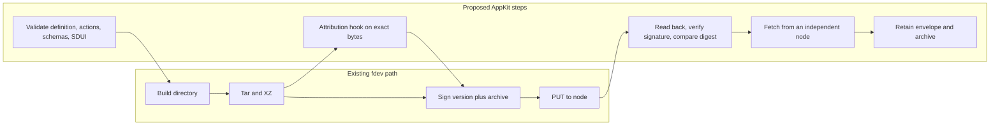

# Application bundles

A publisher packages an application in an ordinary Freenet website container. The signed archive holds the application definition, actions, screens, assets and contract/delegate artifacts. [Hosts](hosts.md) install that content, [Data and actions](data-actions.md) define declarative execution and delegate interfaces, and [SDUI](sdui.md) defines screens.

| Section | What Freenet provides today | What AppKit proposes |
| --- | --- | --- |
| [1](#1-the-website-container) | The website container contract, `app_ref` and the container version | Discovery keyed on `app_ref`, the application definition and new archive entries |
| [2](#2-publishing-and-evidence) | `fdev website publish` | Readback checks, `publication_ref` and `application_content_ref` |
| [3](#3-contracts-and-delegates) | `fdev build` output and key derivation | Delegate location, initialization actions and shared fixtures |
| [4](#4-host-execution-from-the-definition) | The client API | Hosts run initialization actions from the definition |
| [5](#5-archive-checks-and-limits) | Node unpack checks | Host checks, limits and artifact digests |
| [6](#6-retention-and-recovery) | The node webapp cache | Retention rules per owner |

## 1. The website container

### What Freenet provides today

A website container is a Freenet contract. Its parameters are exactly 32 bytes, the publisher's Ed25519 verifying key, one key per application as `fdev website init <name>` creates. Its state is a signed XZ tar archive with a version number in the header. Each publication replaces the whole archive.

`app_ref` is Core's `ContractKey` for the container: the hash of the container Wasm plus the publisher's key as parameters. It stays the same for every version the publisher ships. The container Wasm is committed inside `fdev`. A rebuilt Wasm changes every site's `app_ref`, so publishers keep the exact Wasm they published with and pass it through `fdev website publish --contract-wasm` when needed.

The container version is the u32 in the signed archive header. `fdev` writes unix seconds. The node accepts a PUT only when the version is higher than the one it holds, so the version orders publications.

Example: Carol's "Make offer" release is signed as version 1758500000. A fix the next day is version 1758586400. The node accepts the higher one.

The archive holds these files:

```text
index.html            # required by fdev. Web entry or mobile landing page
contracts/            # contract Wasm from fdev build
web/assets/           # browser code and assets
```

Core reads only `index.html` and whatever application code loads.

### What AppKit proposes

Direct links, QR codes, Atlas and catalogues identify an application by its `app_ref` alone. A host verifies the container behind that value itself and treats any name or icon the link carries as a label.

Example: the QR code on Alice's skateboard listing and every Marketplace release Bob installs name the same `app_ref`. Bob's phone fetches that container and checks its signature before it shows the "Marketplace" label from the code.

[Identity](../identity/README.md#7-publisher-continuity) defines the mutually acknowledged transfer when a publisher changes its key or validator. Hosts keep the transfer evidence and ask before moving private access.

AppKit adds these files to the archive:

```text
delegates/            # delegate Wasm
app_definition.json   # the application definition, fields below
actions/              # declarative actions and data bindings
schemas/              # action, view and delegate protocols
ui/                   # main.sdui.json, assets, locales
```

| Definition field | Purpose |
| --- | --- |
| Format version | Selects the schema the host understands |
| Interfaces | Web, SDUI and native entry points and their required files |
| Protocols | Reader steps, typed inputs/results and domain protocol versions |
| Contract/delegate references | Every contract and delegate the bundle ships, see [section 3](#3-contracts-and-delegates) |
| Permissions | Scoped contract, delegate, storage, device and external-service operations |
| Storage compatibility | Supported schemas and migration entry points |
| External dependencies | Files fetched from outside the archive, see [section 5](#5-archive-checks-and-limits) |
| Product metadata, native links, publisher transfer | Optional links to attribution, platform apps and the identity plan |
| Status | `active` or `withdrawn`, with optional reason and successor |

SDUI owns screen structure, components, themes and languages. A mobile-only bundle holds a static `index.html` landing page, the definition, actions, domain artifacts and SDUI. The landing page explains the application and links to supported hosts. Mark it informational in the interface declaration. A browser shows the landing page. A compatible mobile host opens the SDUI entry point. A dedicated native application uses platform builds, signatures and stores, and the bundle links to the native app the publisher endorses.

## 2. Publishing and evidence



### What Freenet provides today

`fdev website publish` reads the current container version and publishes a higher one. Core serves GET from local cache.

### What AppKit proposes

After the PUT, the publishing tool reads the container back, verifies the signature and compares the digest with the archive it signed. It records whether that readback came from the publishing node or an independent one, and advertises the publication as distributed only after an independent node returns the same archive.

For attributed products, prepare the archive once and obtain the signed [contribution record](../attribution/README.md#4-bundle-integration) for those exact bytes. A changed archive needs a new validation pass and a new contribution record.

`publication_ref` names one exact signed archive. It holds `app_ref`, the container version verified against the signature, the hash algorithm and the digest of the archive bytes. The digest matters because a retry after an uncertain PUT can sign a rebuilt archive under the same version, so check whether publication succeeded before retrying. [Hosts](hosts.md#6-installing-and-updating-applications) keep conflict evidence when they see the same version with a different digest and record the `publication_ref` they installed. After verification, attribution records it against the contribution record.

Example: the marketplace publisher runs `fdev website publish` for the release that carries Carol's "Make offer" screen, version 1758500000. The PUT times out. The tool reads the container back, finds version 1758500000 with the certified digest, and skips the retry. A second node returns the same digest. Bob's phone installs that `publication_ref`, and his later payment evidence points at those exact bytes.

`application_content_ref` records the code a payment or usage event ran against. It carries a `kind` tag, then either a `publication_ref` or a native build reference: platform identity, build identity, hash algorithm and build digest. Payment and remuneration store it with the contribution record. A client-reported digest is a claim, and services verify the artifact mapping themselves. For a native build, verify the publisher's endorsement and obtain enrollment approval before linking the native app to the container. Attribution can certify a native build through a separate artifact record.

Example: Bob pays through the SDUI reader on his phone, so his payment carries kind `publication` and the `publication_ref` above. Alice confirms the sale in the publisher's iOS app, so her record carries kind `native` with the App Store build identity and its digest.

Give `publication_ref` and `application_content_ref` a fixed encoding and a format version, and test them across hosts.

EVY Developer and source projects use this same path. Attribution controls acceptance for participating products. The publisher authorizes container publication.

## 3. Contracts and delegates

### What Freenet provides today

`fdev build` writes each contract's Wasm to `contracts/<code_hash>.wasm` with `dependencies.json`.

Contract and delegate identity uses the same derivation as `app_ref`: Core hashes the component's code and its own parameter bytes. Application contracts and delegates choose their own parameter encoding.

Successor pointers come from `freenet-migrate`, a library outside Core that applications link themselves.

### What AppKit proposes

The definition's contract/delegate references field lists each contract under `contracts/` and each delegate under `delegates/` with its code, parameter rules and supported protocols. It also declares the initialization actions that [section 4](#4-host-execution-from-the-definition) runs.

Fixtures specify each component's parameter encoding, every host derives the same key from those fixtures, and migrations preserve the parameter bytes byte for byte.

Example: the Marketplace offer contract's key is the hash of its Wasm plus its parameter bytes. Bob's phone and Alice's laptop derive the same key from the bundle before either sends an offer, and the shared fixtures check that every host agrees.

Hosts link `freenet-migrate` and resolve the verified code hash with the component's actual parameters, keeping the resolver's minimum accepted version. Applications own their migration adapters, as the [data and actions plan](data-actions.md#10-application-migrations) specifies. A pointer locates a component. The adapter recovers its data.

## 4. Host execution from the definition

### What Freenet provides today

The mobile crate in Core exposes node lifecycle and the client API. Application code issues `Put` and `RegisterDelegate` through that API.

### What AppKit proposes

The host runs `Put` and `RegisterDelegate` from the declared initialization actions, and the user authorizes them. Parse requirements as data before running application code.

Validate definition, actions, schemas and SDUI together before publication and before opening an interface. Custom web applications bring their own presentation and use the browser SDK. SDUI needs compatible reader steps, schemas and delegate protocols. Pick an interface first, then check its requirements, so an unsupported SDUI component still leaves the web interface open. Hosts ask before switching execution contexts.

A running SDUI session keeps one verified definition snapshot and records its exact artifact identities. Definitions and artifacts update through container publication. New reader primitives arrive through platform app updates. A native build packages its platform SDK and declares supported schemas and protocols. Its code calls the SDK directly or runs compatible declarative actions.

The host assigns a local installation identifier to each installed copy and a session identifier to each run of it. Those identifiers scope isolation, callback delivery and cancellation. They stay on the device. Shared state and delegate messages carry neither, and a delegate treats any copy inside message bytes as unverified data.

Example: Bob's phone updates Marketplace while his offer on Alice's skateboard is pending. The host commits the new copy, starts a fresh session and drops callbacks from the previous session. The pending offer keeps its operation ID and completes under the new session.

The definition's status field sits inside the signed archive, so the container signature authenticates it with the rest of the bundle. [Hosts](hosts.md#6-installing-and-updating-applications) own status observation, installation and withdrawal. Payment services own checkout eligibility.

## 5. Archive checks and limits

### What Freenet provides today

| Archive check | Where |
| --- | --- |
| Signature, increasing version, 50 MiB state limit | Container contract and node |
| Absolute paths, `..`, symlinks and hardlinks rejected | Node unpack |

The container signature covers every byte inside the archive. Keep archives small, because a website load downloads the whole compressed archive.

### What AppKit proposes

Hosts run the node unpack checks again on every archive they install and add these:

| Archive check | Where |
| --- | --- |
| Duplicate paths and undeclared executables rejected | Host |
| File count, memory, decompressed size and download limits | Host and packaging tool |

An artifact digest extends the signature's guarantee to a file that stays outside the archive. The definition's external dependencies field declares the hash algorithm, the hash of the file's exact bytes, the file's length and its retrieval location. The host verifies the digest before first use and again for cached and mirrored copies.

Example: the pickup map for Alice's area is a 30 MiB tile pack, too large for the archive. The definition lists its digest, length and mirror location. Bob's host downloads it once, checks the digest and rejects a copy that differs by one byte.

## 6. Retention and recovery

### What Freenet provides today

The node webapp cache is ephemeral, so a node may drop an archive after serving it.

### What AppKit proposes

| Owner | Retained evidence |
| --- | --- |
| Publisher | Exact archives, signed envelopes, validator Wasm and parameters, publication references |
| Host | Working copy, a recovery copy where practical, evidence for unresolved operations |
| Attribution | Contribution records, weight snapshots, reviewed source mapping |
| Payment/remuneration | Publication or native artifact references, contribution records, accounting evidence |

Index archives by digest. Consumers verify mirrored copies against the retained envelope and container identity. Each owner declares retention periods, repair duty and storage budget before launch. Keep evidence for unresolved operations until resolution and through the product's evidence period.

Hosts clear old archives and keep the items in the table. Reopening an earlier copy requires compatibility with current local and shared state. Restoration verifies bytes, signature and container identity. Hosts report when they last checked for updates and whether required files are present.

## 7. Reference recap

| Reference | Status | Names | Explained in |
| --- | --- | --- | --- |
| `app_ref` | Existing | The application, across all its versions | [Section 1](#1-the-website-container) |
| Container version | Existing | Which publication is newer | [Section 1](#1-the-website-container) |
| Contract or delegate identity | Existing | One contract or delegate the application calls | [Section 3](#3-contracts-and-delegates) |
| `publication_ref` | Proposed | One exact signed archive | [Section 2](#2-publishing-and-evidence) |
| `application_content_ref` | Proposed | The code a payment ran against, bundle or native | [Section 2](#2-publishing-and-evidence) |
| Artifact digest | Proposed | One file fetched from outside the archive | [Section 5](#5-archive-checks-and-limits) |
| Installation/session | Proposed | One installed copy and one run of it | [Section 4](#4-host-execution-from-the-definition) |

Product names and display versions are labels, not references. [Attribution](../attribution/README.md) maps containers to each economic `ProductId`.

## 8. Acceptance

- Web, mobile-only and combined bundles publish through the existing container and open their declared interfaces.
- All hosts derive identical container, contract and delegate identities from shared fixtures.
- Validation rejects mismatched actions, unsafe paths and unsupported required interfaces before execution.
- The attribution hook preserves the certified bytes through signing, retry, readback and the independent-node fetch.
- A native client and an SDUI client complete the same order with the same payment bindings.
- Publisher transfer, withdrawal, incompatible updates and recovery pass the host and identity fixtures.
- Restoring a historical archive succeeds after the live container advances.

References: [website publication](https://freenet.org/build/manual/publish-a-website/), [container implementation](https://github.com/freenet/freenet-core/tree/main/crates/website-contract), [migration library](https://github.com/freenet/freenet-migrate).
