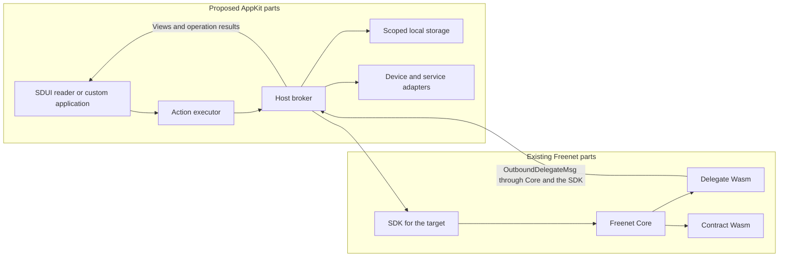
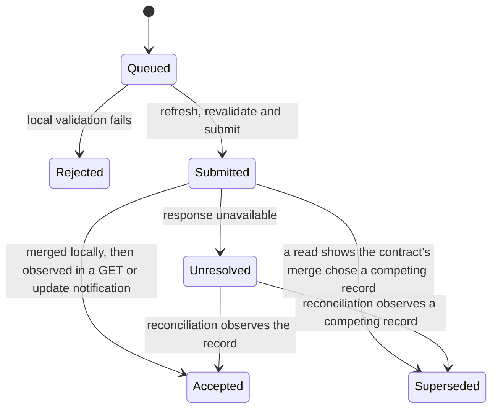

# Application data and actions

This plan owns AppKit's declared actions, data views, delegate convention and operation lifecycle. [Hosts](hosts.md) install applications and check permissions, [SDUI](sdui.md) defines screens, and [Bundles](bundles.md) define the signed archive that carries the definitions.

Bob's Make offer button invokes a declared action with his draft amount. The host saves the operation ID, reads the listing and sends the record and typed arguments to the application's delegate. The delegate checks the terms and prepares the signed offer. The host saves the exact prepared bytes, checks submission permission and submits them through the SDK. A subsequent read or subscription supplies evidence of the result.

Each target has its own SDK path, listed in the [SDK paths table](../freenet-mobile/README.md#0-feasibility-and-existing-evidence). Custom applications can implement their own orchestration through their target's SDK and the same domain protocols.

| Section | What Freenet provides today | What AppKit proposes |
| --- | --- | --- |
| [1](#1-who-does-what) | Per-target SDKs, Core's contract and delegate runtimes, delegate secret namespaces | The action executor, the host broker and the application delegate convention |
| [2](#2-declared-actions) | Application code that calls the client API directly | Versioned action definitions with bounded steps, run by installed readers |
| [3](#3-delegate-requests-and-results) | `ApplicationMessages` with opaque payload bytes and a runtime-attested `MessageOrigin` | A typed request and result protocol inside the payload, with fixtures and correlation |
| [4](#4-reads-views-and-freshness) | `Get`, `Subscribe`, `GetResponse` and `UpdateNotification` keyed by contract, with no timestamps | Logical resources, declared views, value states and host-recorded freshness |
| [5](#5-values-and-local-storage) | Opaque state bytes in Core and the browser storage gates | A shared value model, storage namespaces and cache keys |
| [6](#6-submitting-updates-and-pending-operations) | `Update`, total merge in `update_state` and an `UpdateResponse` summary from the local node | Operation IDs, a durable journal and the lifecycle from Queued to Accepted or Superseded |
| [7](#7-device-and-service-adapters) | The contract sandbox policy and delegate user prompts | Content-addressed blobs, scoped device handles and approved service adapters |
| [8](#8-limits-and-security) | Core's Wasm state, context and deadline limits | Host limits for actions, views, subscriptions and storage, plus session authority |
| [9](#9-application-migrations) | `freenet-migrate` carry-forward, pointer resolution and delegate export and import | Host-coordinated migration with application-owned adapters and per-domain policies |

## 1. Who does what

### What Freenet provides today

Freenet Core runs contract Wasm through `ContractInterface` and delegate Wasm through `DelegateInterface::process`. A contract's `validate_state` and `update_state` decide which shared state is valid and how updates merge. A delegate receives one inbound message with its attested origin and returns outbound messages. Core owns delegate secret namespaces, as [identity section 2](../identity/README.md#2-protected-keys-and-records) describes.

| Part | Runs in | Responsibility |
| --- | --- | --- |
| Freenet SDK | TypeScript SDK, Rust stdlib in browser Wasm, or the native library, by target | Encode client requests, decode responses and deliver subscription events |
| Contract | Core's Wasm runtime on every peer that holds the state | Validate and merge shared state |
| Delegate | Core's Wasm runtime on the local node | Hold secrets and answer application messages under its own policy |

The [SDK paths table](../freenet-mobile/README.md#0-feasibility-and-existing-evidence) names the SDK for each target and its status.

### What AppKit proposes

| Part | Runs in | Responsibility |
| --- | --- | --- |
| SDUI action executor | Installed reader | Evaluate bounded action steps and deliver typed results to controls |
| Host | Core's shell on the browser target, or the native application | Sessions, permissions, storage, operation journals and device and service adapters |
| Application delegate convention | The application's delegate Wasm | Typed requests and results for domain decoding, projections, update preparation and private operations |
| Custom application | Browser or native application | Its own presentation and orchestration through the shared SDK |
| Memory preview | [EVY Developer preview](sdui.md#8-preview-in-evy-developer) | Deterministic host adapters running the same executor with typed delegate fixtures |



Host databases hold drafts, caches and pending operations. [Identity and recovery](../identity/README.md) specifies protected key storage, enrollment and migration.

Example: Bob taps Make offer. The executor runs the declared steps, the host checks Marketplace's grant, the native SDK carries the request, Core runs the Marketplace delegate, and peers validate the offer under the Marketplace contract.

## 2. Declared actions

### What Freenet provides today

A web application orchestrates its own requests. Its JavaScript or Rust code sends `ClientRequest::ContractOp` and `ClientRequest::DelegateOp` over the client API and matches the responses itself. The website container holds `index.html` and the code it loads, per [bundles section 1](bundles.md#1-the-website-container).

### What AppKit proposes

Action definitions live in the bundle's `actions/` directory. Each names its resources, input and output schemas and the step versions it needs. Definitions allow bounded sequences and conditional branches, with caps on steps, input sizes, expression depth and concurrent requests. A new action assembled from supported steps arrives in a bundle. A new executor primitive requires a reader update.

| Step | Returns | Detailed in |
| --- | --- | --- |
| Invoke action | The action's typed result, correlated by the operation ID from [section 6](#6-submitting-updates-and-pending-operations) | This section |
| Read or observe | A verified snapshot, subscription events and the host-recorded response time | [Section 4](#4-reads-views-and-freshness) |
| Call delegate | A typed projection, prepared operation bytes or a defined error | [Section 3](#3-delegate-requests-and-results) |
| Submit | Merged locally, observed, superseded or unresolved | [Section 6](#6-submitting-updates-and-pending-operations) |
| Local read, write or observe | App and user scoped records and the transaction outcome | [Section 5](#5-values-and-local-storage) |
| Blob put or get | A verified content reference or a bounded byte stream | [Section 7](#7-device-and-service-adapters) |
| Device or service operation | A scoped handle, a typed result, or a typed denial or unavailable result | [Section 7](#7-device-and-service-adapters) |
| Time and randomness | Host-supplied values, with deterministic substitutes in tests | [Section 5](#5-values-and-local-storage) |
| Cancel or close | Cancellable work stopped, host-side demand released and the session invalidated | [Section 6](#6-submitting-updates-and-pending-operations) |

Definitions and schemas load from one verified archive snapshot. A session records the exact delegate code, parameters and protocol versions it selected. Hosts adopt updates after the [installation checks](hosts.md#6-installing-and-updating-applications). Atlas proves the definitions before other products adopt them.

Example: Carol's Make offer button names `marketplace.makeOffer` with the listing ID and amount, as the [SDUI binding example](sdui.md#2-connecting-controls-to-data-and-actions) shows. The action's steps read the `listingDetails` view, call the Marketplace delegate to prepare the offer and submit the prepared bytes. Carol ships a "Counter offer" action from the same steps in the next bundle. A step that opens the camera needs a reader update first.

## 3. Delegate requests and results

### What Freenet provides today

`DelegateRequest::ApplicationMessages` carries the delegate key, its parameters and a list of inbound messages. An `ApplicationMessage` holds opaque payload bytes, a `DelegateContext` of at most 409,600 bytes and a processed flag. The application and its delegate agree on what the payload means.

The delegate's `process` function receives an `Option<MessageOrigin>`. `WebApp(contract id)` names the calling web app when Core resolved its session token. `Delegate(key)` names a calling delegate and replaces any web app origin for that call.

The delegate replies with `OutboundDelegateMsg` values, which reach the client as `HostResponse::DelegateResponse`. It can also ask Core to get, put, update, subscribe to and unsubscribe from contracts, message another delegate and prompt the user with `RequestUserInput`.

Core delivers a delegate's output to local clients by locality, so two unattested local clients on one node see the same output. Core-authenticated app sessions are open work in [#5264](https://github.com/freenet/freenet-core/issues/5264). The mobile crate exposes no delegate operation yet, and the [mobile plan](../freenet-mobile/README.md#2-embedded-node-and-native-api) lists it as a feasibility deliverable.

### What AppKit proposes

A typed request and result convention inside the payload bytes:

| Field | Request | Result |
| --- | --- | --- |
| Protocol version | The delegate protocol the session selected | Echoed |
| Request ID | Unique within the session | Echoed |
| Body | Typed arguments and bounded record bytes the host read | A typed projection, prepared operation bytes or a defined error |

Fixtures define the exact encodings. Each language binding specifies deterministic encoding, typed errors, request correlation and ownership of transferred bytes. Bound large payloads and measure copying across bindings. Reject conflicting request ID reuse, unknown handles and completions from expired sessions.

Delegate policy keys on the `MessageOrigin` contract id. The host assigns the container identity, verified content reference, user, installation and session generation, as [hosts section 2](hosts.md#2-who-controls-what) and [bundles section 4](bundles.md#4-host-execution-from-the-definition) describe, and enforces them before a request reaches Core. A delegate treats copies of those fields inside the payload as unverified data.

Application adapters supply domain codecs, canonical signing inputs and view projections, and validate the source identities and signatures each domain requires. A delegate's prepared update still passes host authorization and contract validation.

Example: Bob's request is `prepareOffer` at protocol version 1 with request ID 17, the listing ID, the amount 8000 minor units of USD and the listing record bytes the host read. The Marketplace delegate checks the listing's minimum, signs the offer and returns prepared update bytes. Core stamps the message with `WebApp(Marketplace contract id)`. An amount below the minimum returns the typed error `below_minimum`, which the reader shows on the form.

## 4. Reads, views and freshness

### What Freenet provides today

### What AppKit proposes

Definitions bind logical resources such as `marketplace.listings` and `identity.profile` to declared contracts and delegates. Views such as `listingDetails` declare input and output types. The host performs bounded queries and the domain delegate interprets the returned records. Large search uses bounded region/category index shards. A delegate may return a proposed shard reference, which the host checks against declared resource and query limits before fetching it.

Value states are `loading`, `ready`, `stale`, `missing`, `error` and `permission_required`. `ready` means a verified snapshot received through the selected provider. Permission prompts belong to the host.

Core's get response and update notification carry the key, contract and state. Freshness is therefore the host-recorded time it received the response, or a publisher timestamp the application encodes in contract state and declares in its view schema. A view declares a maximum age. `stale` means the recorded time exceeds that age, so the reader shows the value with its observation time and the host refreshes it.

The host reference-counts underlying subscriptions. Releasing a view releases its demand. Other active views retain their subscriptions. A client subscription to Core ends with the client connection: stdlib 0.10 has Put, Update, Get and Subscribe, and Core lists Unsubscribe as upcoming. When that request ships, the host's reference count decides when to send it. Background shutdown follows the SDK lifecycle and invalidates late callbacks.

## 5. Values and local storage

### What Freenet provides today

### What AppKit proposes

Shared values distinguish null, missing, booleans, integers, decimals, strings, byte references, timestamps, durations, lists and objects. Define numeric ranges, decimal encoding, comparisons and missing-value behavior in shared fixtures. Money remains an application domain object with explicit currency and integer minor units or an equally precise declared representation.

Storage namespaces include user, app identity, installation and schema version. Permission grants live in host-only storage. Route parameters are immutable for a route entry. Session values expire with the session. Drafts survive according to the declared flow policy.

Render cached projections with stale metadata, refresh their backing state and notify only changed views. Cache keys include contract identity and the definition, delegate and schema versions. Encrypt sensitive local data using platform-backed keys. Recovery coverage is explicit in the identity plan.

## 6. Submitting updates and pending operations

### What Freenet provides today

### What AppKit proposes

Allocate and persist the operation ID before delegate preparation or other side effects. Correlate preparation retries with that ID and make any delegate state changes idempotent. Save exact prepared bytes before submission and before showing the operation as locally pending:

```text
operation_id, app_ref, originating_content_ref, action_protocol, delegate_reference
resource_reference, canonical_payload, base_summary_if_required
created_time, retry_policy, status, completion_evidence
```



Merge is total. An update merges into whichever replica receives it, and the client's update response carries only the key and a summary from its own node. Accepted therefore means merged locally and later observed in a GET or update notification. Superseded is the normal outcome when Bob and another buyer submit conflicting offers: the Marketplace contract's merge rule resolves them, and a later read shows which record won. Rejected covers local validation failures before submission, such as an amount below the listing's minimum.

Retrying the same action preserves its operation ID and exact encoded payload. Repair that changes the payload creates a successor operation. The host refreshes state and asks the domain delegate to reconcile the operation before retrying. The host rechecks permissions before queued operations execute.

Example: Alice lowers her skateboard price offline. Her laptop withdraws the listing. On reconnect, the host refreshes the listing, obtains the delegate's conflict result and preserves the draft for repair.

Cancellation stops local cancellable work. A submitted mutation remains tracked until its outcome is known. After navigation or backgrounding, an uncertain submission stays unresolved until a read or notification shows the record or a competing one. Core transport correlation and the durable application operation queue have separate responsibilities.

## 7. Device and service adapters

### What Freenet provides today

### What AppKit proposes

Validate attachment size and media policy before staging. Encrypt bytes when the application requires confidentiality. Store content-addressed bytes, authenticate metadata and return a verified reference. Publish the reference only after required upload evidence exists. Product policy defines availability repair.

File and photo pickers return scoped handles. Granted operations, the session and its lifetime bound application access. Preview, image loading and external URL actions follow broker policy, including implicit network requests.

Applications may declare completion evidence for the [remuneration plan](../remuneration/README.md). The adapter forwards that evidence with the operation's stable ID and the bindings the payment fixed at checkout, which the host retains and remuneration verifies. A newer application version submitting evidence for an older operation uses the original bindings.

Checkout actions request payment sessions through the approved service adapter. On the browser target the host opens the checkout URL in a popup or redirect, the only paths that escape Core's Content Security Policy. Native hosts open the system browser or an in-app browser session. On return, the host refreshes payment state from the service and the order contract. [Payments](../payment/README.md) owns payment status and terms binding.

## 8. Limits and security

### What Freenet provides today

### What AppKit proposes

Installed readers execute declarative steps under host limits. The browser SDK runs as Wasm and the mobile SDK runs as native code. Core executes contract and delegate Wasm under its own limits. Keep platform networking, native objects and private keys behind their owning SDK and host interfaces.

Enforce limits for memory, input/output sizes, subscriptions, storage, action steps, view complexity and event frequency. Schedule bounded work away from the UI thread. Cancel overdue sequences and enforce delegate execution limits through Core. A failure ends the affected operation or session while preserving its durable journal.

Every protected operation uses host-assigned session authority and current grants. Delegates apply their own policy to approved calls. Treat definitions and delegate results as untrusted input. Validate returned targets and prepared bytes before any side effect. Resource-limit tests cover both declarative evaluation and Core execution.

## 9. Application migrations

### What Freenet provides today

### What AppKit proposes

Use `freenet-migrate` and its build-time predecessor registry for contract and delegate upgrades. Record original code hashes, parameter encodings and actual instance references. Add a build check that requires a predecessor entry when component code changes.

The host coordinates migration reads, approved imports, publication and readback through the SDK. Application-owned delegate adapters supply codecs, validation and domain recovery rules, using `freenet-migrate` where its interfaces fit. The Atlas feasibility work must prove this adapter boundary. Custom applications can also use the library from their own compiled domain code.

Select a recovery policy for each domain. Use the library's newest-generation policy for snapshot state. Combining state from several generations requires tests that prove the application's merge and deletion rules support it. Preserve unresolved predecessor reads for retry. Validate recovered state with the successor's rules. Publish it through authorized host operations, then read it back before recording success.

Keep shared-state recovery separate from host database migration and bundle installation. Mixed-version clients must obey the domain's transition rules. Delegate migration is application-controlled, per the [identity plan](../identity/README.md#4-delegate-upgrades): the predecessor delegate answers an export request and the successor imports through the application. Plaintext secrets transit the application during that round trip. Every AppKit delegate implements export and import. A delegate without them strands its secrets on re-key. Use the existing resolver for successor pointers. Retain its minimum accepted version and handle stale, unavailable, conflicting and withdrawn results.

Fixtures cover several skipped versions, late predecessor responses, deletions, conflicting records, interrupted readback and mixed-version participants. Test the selected policy against the domain's actual state model. Reference: [freenet-migrate](https://github.com/freenet/freenet-migrate).

## 10. Reference recap

## 11. Acceptance

Use the [feasibility stage](../freenet-mobile/README.md#0-feasibility-and-existing-evidence) to measure SDK bindings separately from declarative/delegate orchestration. Run real delegate integration tests alongside deterministic previews. Verify a new compatible SDUI definition works without application-specific code compiled into the reader. Equivalent domain behavior across targets comes from shared protocol fixtures rather than from an identical SDK implementation.

Test request correlation, instance-ID updates and subscription repair through the [mobile SDK acceptance cases](../freenet-mobile/README.md#8-acceptance-cases). Acceptance covers canonical records, signing inputs, typed errors, schema mismatches, codec errors, stale caches, duplicate responses, request isolation and late completions. Run property tests for domain conversions and reconciliation. Formatting fixtures supply identical locale, time zone and current time.

Force termination, lock, permission revocation and network change must preserve recoverable drafts and operation identity. Reject cross-app access, forged caller IDs, malformed delegate results, undeclared targets and excessive action work. SDUI and custom native interfaces complete equivalent fixture actions through their target's SDK and the same domain protocols.
