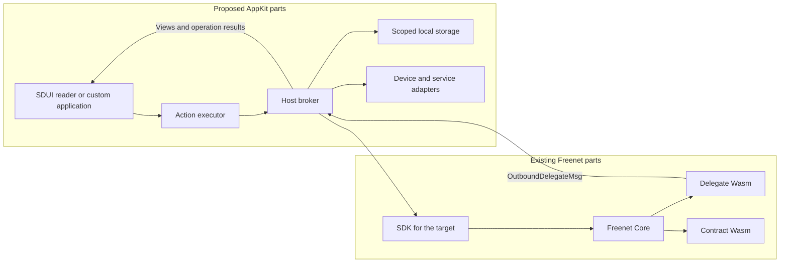
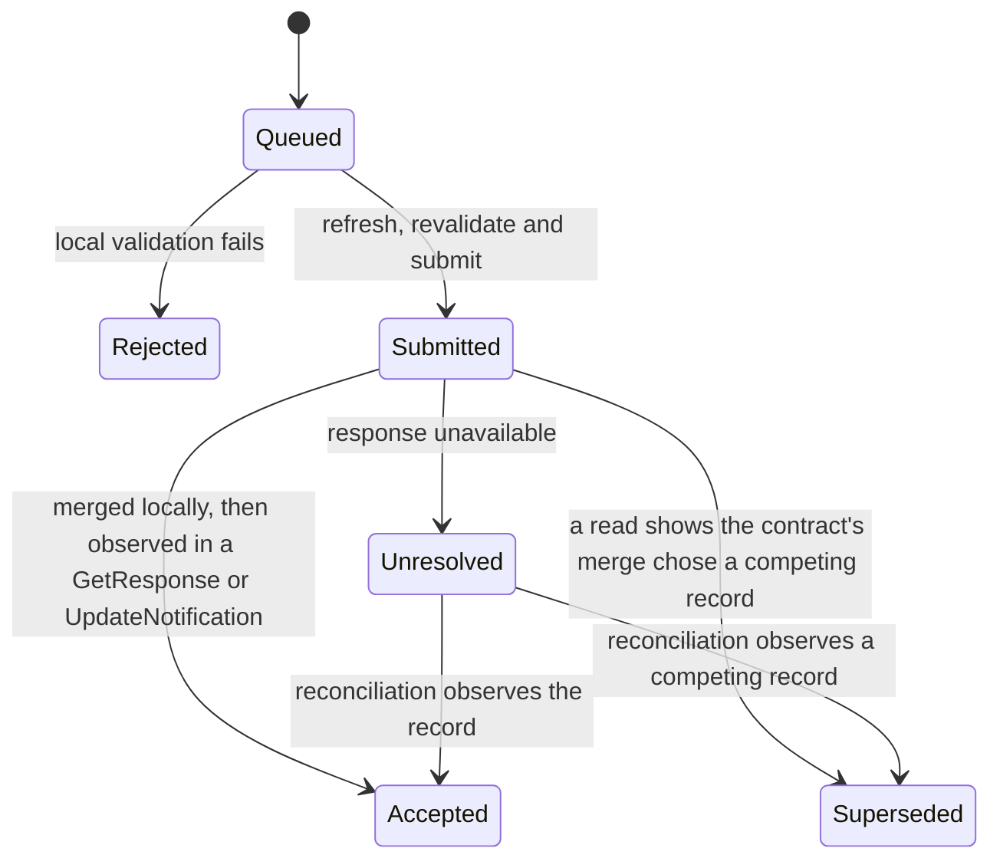

# Application data and actions

This plan owns AppKit's declared actions, data views, delegate convention and operation lifecycle. [Hosts](hosts.md) install applications and check permissions, [SDUI](sdui.md) defines screens, and [Bundles](bundles.md) define the signed archive that carries the definitions.

Bob's Make offer button invokes a declared action with his draft amount. The host saves the operation ID, reads the listing and sends the record and typed arguments to the application's delegate. The delegate checks the terms and prepares the signed offer. The host saves the exact prepared bytes, checks submission permission and submits them. A subsequent read or subscription supplies evidence of the result.

| Section | What Freenet provides today | What AppKit proposes |
| --- | --- | --- |
| [1](#1-who-does-what) | Core's contract and delegate runtimes and delegate secret namespaces | The action executor, the host broker and the application delegate convention |
| [2](#2-declared-actions) | Application code that calls the client API directly | Versioned action definitions with bounded steps, run by installed readers |
| [3](#3-delegate-requests-and-results) | `ApplicationMessages` with opaque payload bytes and a runtime-attested `MessageOrigin` | A typed request and result protocol inside the payload, with fixtures and correlation |
| [4](#4-reads-views-and-freshness) | `Get`, `Subscribe`, `GetResponse` and `UpdateNotification` keyed by contract, with no timestamps | Logical resources, declared views, value states and host-recorded freshness |
| [5](#5-values-and-local-storage) | Opaque state bytes in Core and the browser storage gates | A shared value model, storage namespaces and cache keys |
| [6](#6-submitting-updates-and-pending-operations) | `Update`, total merge in `update_state` and an `UpdateResponse` summary from the local node | Operation IDs, a durable journal and the lifecycle from Queued to Accepted or Superseded |
| [7](#7-device-and-service-adapters) | The contract sandbox policy and delegate user prompts | Content-addressed blobs, scoped device handles and approved service adapters |
| [8](#8-limits-and-security) | Core's Wasm state, context and deadline limits | Host limits for actions, views, subscriptions and storage, plus session authority |
| [9](#9-application-migrations) | `freenet-migrate` carry-forward, pointer resolution and delegate export and import | Host-coordinated migration with application-owned adapters and per-domain policies |

## 1. Who does what

### What Freenet provides today

Freenet Core runs contract Wasm through `ContractInterface` and delegate Wasm through `DelegateInterface::process`. A contract's `validate_state` and `update_state` decide which shared state is valid and how updates merge. A delegate receives one inbound message with its attested origin and returns outbound messages. Core owns delegate secret namespaces, as [identity section 2](../identity/README.md#2-protected-keys-and-records) describes.

| Part | Runs in | Responsibility |
| --- | --- | --- |
| Contract | Core's Wasm runtime on every peer that holds the state | Validate and merge shared state |
| Delegate | Core's Wasm runtime on the local node | Hold secrets and answer application messages under its own policy |

### What AppKit proposes

| Part | Runs in | Responsibility |
| --- | --- | --- |
| SDUI action executor | Installed reader | Evaluate bounded action steps and deliver typed results to controls |
| Host | Core's shell on the browser target, or the native application | Sessions, permissions, storage, operation journals and device and service adapters |
| Application delegate convention | The application's delegate Wasm | Typed requests and results for domain decoding, projections, update preparation and private operations |
| Custom application | Browser or native application | Its own presentation and orchestration over the same domain protocols |
| Memory preview | [EVY Developer preview](sdui.md#8-preview-in-evy-developer) | Deterministic host adapters running the same executor with typed delegate fixtures |



Host databases hold drafts, caches and pending operations. [Identity and recovery](../identity/README.md) specifies protected key storage, enrollment and migration.

Example: Bob taps Make offer. The executor runs the declared steps, the host checks Marketplace's grant, Core runs the Marketplace delegate, and peers validate the offer under the Marketplace contract.

## 2. Declared actions

### What Freenet provides today

A web application orchestrates its own requests. Its JavaScript or Rust code sends `ClientRequest::ContractOp` and `ClientRequest::DelegateOp` over the client API and matches the responses itself. The website container holds `index.html` and the code it loads, per [bundles section 1](bundles.md#1-the-website-container).

### What AppKit proposes

Action definitions live in the bundle's `actions/` directory. Each names its resources, input and output schemas and the step versions it needs. Definitions allow bounded sequences and conditional branches, with caps on steps, input sizes, expression depth and concurrent requests. A new action assembled from supported steps arrives in a bundle. A new executor primitive requires a reader update.

| Step | Returns | Detailed in |
| --- | --- | --- |
| Invoke action | The action's typed result, correlated by the operation ID from [section 6](#6-submitting-updates-and-pending-operations) | This section |
| Read or observe | A verified snapshot, subscription events and the host-recorded response time | [Section 4](#4-reads-views-and-freshness) |
| Call delegate | A typed projection, prepared operation bytes or a defined error | [Section 3](#3-delegate-requests-and-results) |
| Submit | Merged locally, observed, superseded or unresolved | [Section 6](#6-submitting-updates-and-pending-operations) |
| Local read, write or observe | App and user scoped records and the transaction outcome | [Section 5](#5-values-and-local-storage) |
| Blob put or get | A verified content reference or a bounded byte stream | [Section 7](#7-device-and-service-adapters) |
| Device or service operation | A scoped handle, a typed result, or a typed denial or unavailable result | [Section 7](#7-device-and-service-adapters) |
| Time and randomness | Host-supplied values, with deterministic substitutes in tests | [Section 5](#5-values-and-local-storage) |
| Cancel or close | Cancellable work stopped, host-side demand released and the session invalidated | [Section 6](#6-submitting-updates-and-pending-operations) |

Definitions and schemas load from one verified archive snapshot. A session records the exact delegate code, parameters and protocol versions it selected. Hosts adopt updates after the [installation checks](hosts.md#6-installing-and-updating-applications). Atlas proves the definitions before other products adopt them.

Example: Carol's Make offer button names `marketplace.makeOffer` with the listing ID and amount, as the [SDUI binding example](sdui.md#2-connecting-controls-to-data-and-actions) shows. The action's steps read the `listingDetails` view, call the Marketplace delegate to prepare the offer and submit the prepared bytes. Carol ships a "Counter offer" action from the same steps in the next bundle. A step that opens the camera needs a reader update first.

## 3. Delegate requests and results

### What Freenet provides today

`DelegateRequest::ApplicationMessages` carries the delegate key, its parameters and a list of inbound messages. An `ApplicationMessage` holds opaque payload bytes, a `DelegateContext` of at most 409,600 bytes and a processed flag. The application and its delegate agree on what the payload means.

The delegate's `process` function receives an `Option<MessageOrigin>`. `WebApp(contract id)` names the calling web app when Core resolved its session token. `Delegate(key)` names a calling delegate and replaces any web app origin for that call.

The delegate replies with `OutboundDelegateMsg` values, which reach the client as `HostResponse::DelegateResponse`. It can also ask Core to get, put, update, subscribe to and unsubscribe from contracts, message another delegate and prompt the user with `RequestUserInput`.

Core delivers a delegate's output to local clients by locality, so two unattested local clients on one node see the same output. Core-authenticated app sessions are open work in [#5264](https://github.com/freenet/freenet-core/issues/5264). The mobile crate exposes no delegate operation yet, and the [mobile plan](../freenet-mobile/README.md#2-embedded-node-and-native-api) lists it as a feasibility deliverable.

### What AppKit proposes

A typed request and result convention inside the payload bytes:

| Field | Request | Result |
| --- | --- | --- |
| Protocol version | The delegate protocol the session selected | Echoed |
| Request ID | Unique within the session | Echoed |
| Body | Typed arguments and bounded record bytes the host read | A typed projection, prepared operation bytes or a defined error |

Fixtures define the exact encodings. Each language binding specifies deterministic encoding, typed errors, request correlation and ownership of transferred bytes. Bound large payloads and measure copying across bindings. Reject conflicting request ID reuse, unknown handles and completions from expired sessions.

Delegate policy keys on the `MessageOrigin` contract id. The host assigns the container identity, verified content reference, user, installation and session generation, as [hosts section 2](hosts.md#2-who-controls-what) and [bundles section 4](bundles.md#4-host-execution-from-the-definition) describe, and enforces them before a request reaches Core. A delegate treats copies of those fields inside the payload as unverified data.

Application adapters supply domain codecs, canonical signing inputs and view projections, and validate the source identities and signatures each domain requires. A delegate's prepared update still passes host authorization and contract validation.

Example: Bob's request is `prepareOffer` at protocol version 1 with request ID 17, the listing ID, the amount 8000 minor units of USD and the listing record bytes the host read. The Marketplace delegate checks the listing's minimum, signs the offer and returns prepared update bytes. Core stamps the message with `WebApp(Marketplace contract id)`. An amount below the minimum returns the typed error `below_minimum`, which the reader shows on the form.

## 4. Reads, views and freshness

### What Freenet provides today

`Get { key, return_contract_code, subscribe }` returns `GetResponse { key, contract, state }`. `Subscribe { key, summary }` returns `SubscribeResponse`, then an `UpdateNotification { key, update }` for each change. `NotFound` reports a missing instance. No response carries a timestamp, so freshness is whatever the client records. Responses match requests by variant and contract key, with no request ID ([#5048](https://github.com/freenet/freenet-core/issues/5048)).

A subscription ends with the client connection. Core lists `ContractRequest::Unsubscribe` as upcoming, and its delegate-side unsubscribe variants trace to [#5600](https://github.com/freenet/freenet-core/issues/5600). Core serves `Get` from local cache when it holds the state, as the [mobile plan](../freenet-mobile/README.md#6-storage-and-recovery) records.

### What AppKit proposes

Definitions bind logical resources such as `marketplace.listings` and `identity.profile` to declared contracts and delegates. Views such as `listingDetails` declare input and output types and a maximum age. The host performs bounded queries and the domain delegate interprets the returned records. Large search uses bounded region and category index shards. A delegate may return a proposed shard reference, which the host checks against declared resource and query limits before fetching it.

| Value state | Meaning | Alice sees on her listing |
| --- | --- | --- |
| `loading` | The first read is in flight | A placeholder where the price goes |
| `ready` | A verified snapshot arrived through the selected provider | The current price |
| `stale` | The host-recorded time exceeds the view's maximum age | The price with "seen 7 minutes ago" |
| `missing` | The contract or record is absent | "Listing not found" |
| `error` | The read failed after the declared retries | A retry control |
| `permission_required` | The host needs a grant before reading | The host's permission prompt |

Freshness is the host-recorded time it received the response, or a publisher timestamp the application encodes in contract state and declares in the view schema. `stale` means that time exceeds the maximum age, so the reader shows the value with its observation time and the host refreshes it. Permission prompts belong to the host.

The host reference-counts subscriptions. Releasing a view releases its demand, and other active views keep theirs. When Unsubscribe ships, the reference count decides when to send it. Background shutdown follows the [SDK lifecycle](../freenet-mobile/README.md#5-connectivity-and-lifecycle) and invalidates late callbacks.

Example: `listingDetails` declares a maximum age of five minutes. Alice opens her skateboard listing on the train. The host last received the listing seven minutes ago, so the reader shows the price with "seen 7 minutes ago" and the host refreshes when the network returns.

## 5. Values and local storage

### What Freenet provides today

Contract state, deltas and summaries are byte wrappers. Their meaning belongs to the contract and the application. Core stores contract state up to 50 MiB per contract, plus delegate state and secrets. The browser sandbox gains durable storage through [#5165](https://github.com/freenet/freenet-core/issues/5165) and [#5254](https://github.com/freenet/freenet-core/issues/5254), per [hosts section 3](hosts.md#3-browser-hosting). Native stores use host-supplied paths, per the [mobile plan](../freenet-mobile/README.md#2-embedded-node-and-native-api).

### What AppKit proposes

| Shared value | Example |
| --- | --- |
| Null and missing | A listing with an empty description, and a listing whose description field is absent |
| Booleans, integers, decimals and strings | `true`, `3`, `12.5` and `"skateboard"` |
| Byte references | The verified reference of Alice's photo |
| Timestamps and durations | The offer time and the five minute maximum age |
| Lists and objects | The offers on a listing, and the listing itself |
| Money | An application object such as `{ currency: "USD", minor: 8000 }` |

Shared fixtures define numeric ranges, decimal encoding, comparisons and missing-value behavior. Time and randomness come from the host, with deterministic substitutes in tests.

| Local storage | Scope | Lifetime |
| --- | --- | --- |
| Permission grants | Host only | Until revoked |
| Route parameters | One route entry | Immutable for that entry |
| Session values | One session | Expire with the session |
| Drafts and pending operations | User, app identity, installation and schema version | The declared flow policy |
| Cached projections | The same namespace, keyed by contract identity and the definition, delegate and schema versions | Until refreshed or evicted |

Cached projections render with stale metadata. The host refreshes their backing state and notifies only changed views. Platform-backed keys encrypt sensitive local data. The [identity plan](../identity/README.md#2-protected-keys-and-records) states recovery coverage.

Example: Alice's 80 dollar price is `{ currency: "USD", minor: 8000 }`. Her draft lives under her user, the Marketplace `app_ref`, her phone's installation ID and schema version 3. A schema version 4 update migrates the draft during installation, per [hosts section 6](hosts.md#6-installing-and-updating-applications).

## 6. Submitting updates and pending operations

### What Freenet provides today

`Update { key, data }` sends `UpdateData` as a state, a delta or both. The contract's `update_state` merges it and returns `UpdateModification`. Merge is total: an update merges into whichever replica receives it. `UpdateResponse { key, summary }` carries a summary the local node computed, and subscribers receive an `UpdateNotification`. A delegate can send `UpdateContractRequest` and receive `UpdateContractResponse`. A timeout after remote acceptance leaves the outcome unknown ([#3465](https://github.com/freenet/freenet-core/issues/3465)), and responses carry no request ID ([#5048](https://github.com/freenet/freenet-core/issues/5048)).

### What AppKit proposes

Allocate and persist the operation ID before delegate preparation or any other side effect. Correlate retries with that ID and make delegate state changes idempotent. Save the exact prepared bytes before submission and before showing the operation as locally pending:

```text
operation_id, app_ref, originating_content_ref, action_protocol, delegate_reference
resource_reference, canonical_payload, base_summary_if_required
created_time, retry_policy, status, completion_evidence
```

`app_ref` and the originating content reference come from [bundles section 2](bundles.md#2-publishing-and-evidence). The operation ID identifies one user action across retries, restarts and device recovery. The [mobile plan](../freenet-mobile/README.md#2-embedded-node-and-native-api) keeps SDK request correlation separate from it.



| Status | Meaning |
| --- | --- |
| Rejected | Local validation failed before submission, such as an amount below the listing's minimum |
| Accepted | Merged locally and later observed in a `GetResponse` or `UpdateNotification` |
| Superseded | A read shows the contract's merge chose a competing record |
| Unresolved | No response arrived, so reconciliation waits for the record or a competitor |

Retrying the same action preserves its operation ID and exact payload. Repair that changes the payload creates a successor operation. The host refreshes state and asks the domain delegate to reconcile before retrying, and rechecks permissions before queued operations run.

Cancellation stops local cancellable work. A submitted mutation stays tracked until its outcome is known. After navigation or backgrounding, an uncertain submission stays unresolved until a read or notification shows the record or a competing one.

Examples: Bob and another buyer submit conflicting offers. The Marketplace contract's merge rule picks one, and the other buyer's read shows Superseded. Alice lowers her skateboard price offline while her laptop withdraws the listing. On reconnect, the host refreshes the listing, obtains the delegate's conflict result and preserves her draft for repair as a successor operation.

## 7. Device and service adapters

### What Freenet provides today

Content served from a contract runs under Core's sandbox policy. It loads bytes from the node origin, `blob:` and `data:`, and only popups reach another origin. [Hosts section 7](hosts.md#7-photos-files-and-external-services) holds the network policy per target. Contract state is capped at 50 MiB. Core prompts the user for delegate `RequestUserInput` requests and shows the attested caller. Device access belongs to the host on every target.

### What AppKit proposes

| Adapter | Browser target | Native target |
| --- | --- | --- |
| Media and blobs | Bundled in the archive or served by the node | Loaded through the approved adapter |
| Photo and file pickers | The browser's picker inside the sandbox | The platform picker behind the host |
| Checkout | Popup or redirect | System browser or in-app browser session |
| Completion evidence | Approved service adapter | Approved service adapter |

For attachments, validate size and media policy before staging. Encrypt the bytes when the application requires confidentiality. Store content-addressed bytes, authenticate the metadata and return a verified content reference. Publish the reference only after required upload evidence exists. Product policy defines availability repair.

Pickers return scoped handles. The granted operations, the session and its lifetime bound application access. Preview, image loading and external URL actions follow broker policy, including implicit network requests.

Checkout actions request a payment session through the approved service adapter. On return, the host refreshes payment state from the service and the order contract. [Payments](../payment/README.md) owns payment status and terms binding.

Applications may declare completion evidence for the [remuneration plan](../remuneration/README.md). The adapter forwards that evidence with the operation ID and the bindings the payment fixed at checkout, which the host retains and remuneration verifies. A newer application version submitting evidence for an older operation uses the original bindings.

Example: Alice adds a skateboard photo. The host validates it, stores it as a content-addressed blob the node serves and returns a verified reference the listing embeds. Bob pays through a popup. On return the host reads the order contract and forwards completion evidence with Bob's operation ID.

## 8. Limits and security

### What Freenet provides today

| Limit | Value | Where |
| --- | --- | --- |
| Contract state | 50 MiB | Core's state store |
| Delegate context | 409,600 bytes | stdlib `DelegateContext::MAX_SIZE` |
| Guest execution | A wall-clock deadline | Core's Wasm runtime |
| Memory per Wasm instance and module cache | Listed in the [mobile plan](../freenet-mobile/README.md#3-runtime-and-packaging) | Core's engine configuration |

The contract sandbox policy and `Authenticate { token }` bound what a web app reaches. Core delivers delegate output by locality, and Core-authenticated sessions wait on [#5264](https://github.com/freenet/freenet-core/issues/5264).

### What AppKit proposes

Installed readers execute declarative steps under host limits for memory, input and output sizes, subscriptions, storage, action steps, view complexity and event frequency. Schedule bounded work away from the UI thread. Cancel overdue sequences. A failure ends the affected operation or session and preserves its durable journal.

Every protected operation uses host-assigned session authority and current grants. Delegates apply their own policy to approved calls. Platform networking, native objects and private keys stay behind host interfaces.

Treat definitions and delegate results as untrusted input. Validate action arguments, delegate results, outgoing view data, returned targets and prepared bytes before any side effect. Resource-limit tests cover declarative evaluation and Core execution.

Example: a bundle declares an action with ten thousand steps. Validation rejects it before the reader runs anything. A delegate returns prepared bytes for a contract the definition never declared. The host rejects the submit step and journals the failure.

## 9. Application migrations

### What Freenet provides today

A contract or delegate key is BLAKE3 over the code hash and parameter bytes, so a rebuild creates a new key and leaves state under the old one.

| Library item | What it does |
| --- | --- |
| `freenet-migrate-build` | Generates the lineage registry from a TOML file at build time. River's build fails when the table is empty |
| `predecessor_ids`, `ProbeDriver` and `migrate_contract` | Rebuild predecessor IDs from code hash and parameters and probe them newest first under a `SelectionPolicy` |
| `CarryForward` and `policy_check` | Run `verify()` after `merge()`, and assert commutative, idempotent and order-invariant merges |
| `migrate_delegate_secrets` and `register_delegate_with_migration` | Run the export and import round trip through `PredecessorSecretsIo` and `SuccessorSecretsIo` under a `MigrationAuthorization` |
| `resolve_app_pointer` | Reads the frozen pointer contract from [#5194](https://github.com/freenet/freenet-core/issues/5194) and answers which code hash is current |

[PR #5199](https://github.com/freenet/freenet-core/pull/5199) disabled Core's copy-forward of secrets, and stdlib 0.9.0 removed the predecessor-registering request. Core's secret export caps plaintext at 256 MiB. The [mobile plan](../freenet-mobile/README.md#0-feasibility-and-existing-evidence) records the stdlib compatibility check the library needs.

### What AppKit proposes

Record original code hashes, parameter encodings and actual instance references in the registry. Add a build check that requires a predecessor entry when component code changes.

The host coordinates migration reads, approved imports, publication and readback. Application-owned adapters implement `PredecessorSecretsIo`, `SuccessorSecretsIo` and the contract probe I/O with domain codecs, validation and recovery rules. Atlas proves this adapter boundary. Custom applications link the library from their own code.

| Recovery policy | Use it for | Required proof |
| --- | --- | --- |
| Newest generation | Snapshot state such as a listing | The successor's validation rules accept the recovered state |
| Combined generations | Event histories with deletions and conflicts | `policy_check` assertions pass against the domain's real state model |

Preserve unresolved predecessor reads for retry. Validate recovered state with the successor's rules, publish it through authorized host operations, then read it back before recording success.

Shared-state recovery stays separate from host database migration and bundle installation. Mixed-version clients obey the domain's transition rules. Every AppKit delegate implements export and import, per [identity section 4](../identity/README.md#4-delegate-upgrades), so its secrets survive re-key. Plaintext secrets transit the application during that round trip. Use the resolver for successor pointers with its minimum accepted version, and handle stale, unavailable, conflicting and withdrawn results.

Fixtures cover several skipped versions, late predecessor responses, deletions, conflicting records, interrupted readback and mixed-version participants.

Example: the Marketplace publisher rebuilds the offer contract. The build fails until the registry gains the old code hash. Bob's phone installs the new bundle, probes the predecessor key newest first, carries Alice's listing forward, validates it under the new rules and reads it back. Alice approves the delegate upgrade, the old delegate exports her seller key, and the new one imports it through the Marketplace adapter.

## 10. Reference recap

| Reference | Status | Names | Explained in |
| --- | --- | --- | --- |
| Contract and delegate key | Existing | One contract or delegate, from its code hash and parameters | [Section 9](#9-application-migrations) |
| `MessageOrigin` | Existing | The attested caller of a delegate message | [Section 3](#3-delegate-requests-and-results) |
| `UpdateResponse` summary | Existing | The local node's view after a merge | [Section 6](#6-submitting-updates-and-pending-operations) |
| Action definition and step version | Proposed | One declared action and the executor primitives it uses | [Section 2](#2-declared-actions) |
| Delegate protocol version and request ID | Proposed | One typed delegate exchange | [Section 3](#3-delegate-requests-and-results) |
| Logical resource and view | Proposed | A declared contract binding and a typed read over it | [Section 4](#4-reads-views-and-freshness) |
| Storage namespace | Proposed | Where one app's local data for one user and installation lives | [Section 5](#5-values-and-local-storage) |
| Operation ID | Proposed | One user action across retries, restarts and recovery | [Section 6](#6-submitting-updates-and-pending-operations) |
| Verified content reference | Proposed | One content-addressed blob | [Section 7](#7-device-and-service-adapters) |
| Completion evidence | Proposed | Proof of a qualifying operation for remuneration | [Section 7](#7-device-and-service-adapters) |
| Recovery policy | Proposed | How one domain carries state across generations | [Section 9](#9-application-migrations) |

`app_ref`, `publication_ref` and the installation and session identifiers belong to the [bundle recap](bundles.md#7-reference-recap).

## 11. Acceptance

- One Atlas action runs through declarative SDUI and a custom native control with the typed delegate convention, per the [Atlas sample](../atlas-sample/README.md#2-feasibility-and-application-responsibilities).
- Real delegate integration tests run alongside deterministic previews, and a new compatible SDUI definition works without application-specific code compiled into the reader.
- Request correlation, instance ID updates and subscription repair pass the [mobile SDK acceptance cases](../freenet-mobile/README.md#8-acceptance-cases).
- Fixtures cover canonical records, signing inputs, typed errors, schema mismatches, codec errors, stale caches, duplicate responses, request isolation and late completions. Property tests cover domain conversions and reconciliation. Formatting fixtures supply identical locale, time zone and current time.
- Force termination, lock, permission revocation and network change preserve recoverable drafts and operation identity.
- Hosts reject cross-app access, forged caller IDs, malformed delegate results, undeclared targets and excessive action work.
- SDUI and custom native interfaces complete equivalent fixture actions through the same domain protocols.
- Migration fixtures pass for skipped versions, late predecessors, deletions, conflicts, interrupted readback and mixed-version participants.

References: [Rust client API](https://github.com/freenet/freenet-stdlib/blob/main/rust/src/client_api.rs), [delegate interface](https://github.com/freenet/freenet-stdlib/blob/main/rust/src/delegate_interface.rs), [freenet-migrate](https://github.com/freenet/freenet-migrate).
