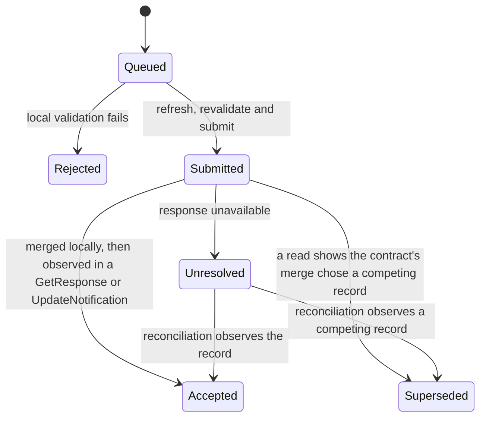

# Data and pending operations

This plan owns how an application reads shared state, keeps local values and drafts, and submits updates it can track to an outcome. [Actions and delegates](actions-and-delegates.md) owns the declared actions that invoke these reads and submissions. [Hosts](hosts.md) own permissions, installation and the session lifecycle.

Alice opens her skateboard listing on the train and the screen shows a price seen seven minutes ago. She lowers the price while offline, her laptop withdraws the listing at the same time, and on reconnect the host keeps her draft for repair. Sections 1 and 3 work through both cases.

| Section | What Freenet provides today | What AppKit proposes |
| --- | --- | --- |
| [1](#1-reads-views-and-freshness) | `Get`, `Subscribe`, `GetResponse` and `UpdateNotification` keyed by contract, with no timestamps | Logical resources, declared views, value states and host-recorded freshness |
| [2](#2-values-and-local-storage) | Opaque state bytes in Core and the browser storage gates | A shared value model, storage namespaces and cache keys |
| [3](#3-submitting-updates-and-pending-operations) | `Update`, total merge in `update_state` and an `UpdateResponse` summary from the local node | Operation IDs, a durable journal and the lifecycle from Queued to Accepted or Superseded |

## 1. Reads, views and freshness

### What Freenet provides today

`Get { key, return_contract_code, subscribe }` returns `GetResponse { key, contract, state }`. `Subscribe { key, summary }` returns `SubscribeResponse`, then an `UpdateNotification { key, update }` for each change. `NotFound` reports a missing instance. No response carries a timestamp, so freshness is whatever the client records. Responses match requests by variant and contract key, because `ContractRequest` in stdlib 0.10.0 carries no request id field. [#5048](https://github.com/freenet/freenet-core/issues/5048), which tracked the TypeScript SDK's arrival-order matching, closed as completed on 2026-08-31.

A subscription ends with the client connection. Core lists the client `ContractRequest::Unsubscribe` as upcoming. The delegate-side unsubscribe handler landed under [#5600](https://github.com/freenet/freenet-core/issues/5600), closed on 2026-09-10. Core serves `Get` from local cache when it holds the state, as the [mobile plan](../freenet-mobile/README.md#6-storage-and-recovery) records.

### What AppKit proposes

Definitions bind logical resources such as `marketplace.listings` and `identity.profile` to declared contracts and delegates. Views such as `listingDetails` declare input and output types and a maximum age. The host performs bounded queries and the domain delegate interprets the returned records. Large search uses bounded region and category index shards. A delegate may return a proposed shard reference, which the host checks against declared resource and query limits before fetching it.

| Value state | Meaning | Alice sees on her listing |
| --- | --- | --- |
| `loading` | The first read is in flight | A placeholder where the price goes |
| `ready` | A verified snapshot arrived through the selected provider | The current price |
| `stale` | The host-recorded time exceeds the view's maximum age | The price with "seen 7 minutes ago" |
| `missing` | The contract or record is absent | "Listing not found" |
| `error` | The read failed after the declared retries | A retry control |
| `permission_required` | The host needs a grant before reading | The host's permission prompt |

Freshness is the host-recorded time it received the response, or a publisher timestamp the application encodes in contract state and declares in the view schema. `stale` means that time exceeds the maximum age, so the screen shows the value with its observation time and the host refreshes it. Permission prompts belong to the host.

The host reference-counts subscriptions. Releasing a view releases its demand, and other active views keep theirs. When Unsubscribe ships, the reference count decides when to send it. Background shutdown follows the [SDK lifecycle](../freenet-mobile/README.md#5-connectivity-and-lifecycle) and invalidates late callbacks.

Example: `listingDetails` declares a maximum age of five minutes. Alice opens her skateboard listing on the train. The host last received the listing seven minutes ago, so the screen shows the price with "seen 7 minutes ago" and the host refreshes when the network returns.

## 2. Values and local storage

### What Freenet provides today

Contract state, deltas and summaries are byte wrappers. Their meaning belongs to the contract and the application. Core stores contract state up to 50 MiB per contract, plus delegate state and secrets. The browser sandbox gains durable storage through [#5165](https://github.com/freenet/freenet-core/issues/5165) and [#5254](https://github.com/freenet/freenet-core/issues/5254), per [hosts section 3](hosts.md#3-browser-hosting). Native stores use host-supplied paths, per the [mobile plan](../freenet-mobile/README.md#2-embedded-node-and-native-api).

### What AppKit proposes

| Shared value | Example |
| --- | --- |
| Null and missing | A listing with an empty description, and a listing whose description field is absent |
| Booleans, integers, decimals and strings | `true`, `3`, `12.5` and `"skateboard"` |
| Byte references | The verified reference of Alice's photo |
| Timestamps and durations | The offer time and the five minute maximum age |
| Lists and objects | The offers on a listing, and the listing itself |
| Money | An application object such as `{ currency: "USD", minor: 8000 }` |

Shared fixtures define numeric ranges, decimal encoding, comparisons and missing-value behavior. Time and randomness come from the host, with deterministic substitutes in tests.

| Local storage | Scope | Lifetime |
| --- | --- | --- |
| Permission grants | Host only | Until revoked |
| Route parameters | One route entry | Immutable for that entry |
| Session values | One session | Expire with the session |
| Drafts and pending operations | User, app identity, installation and schema version | The declared flow policy |
| Cached projections | The same namespace, keyed by contract identity and the definition, delegate and schema versions | Until refreshed or evicted |

Cached projections render with stale metadata. The host refreshes their backing state and notifies only changed views. Platform-backed keys encrypt sensitive local data. The [identity plan](../identity/README.md#2-protected-keys-and-records) states recovery coverage.

Example: Alice's 80 dollar price is `{ currency: "USD", minor: 8000 }`. Her draft lives under her user, the Marketplace `app_ref`, her phone's installation ID and schema version 3. A schema version 4 update migrates the draft during installation, per [hosts section 6](hosts.md#6-installing-and-updating-applications).

## 3. Submitting updates and pending operations

### What Freenet provides today

`Update { key, data }` sends `UpdateData` as a state, a delta or both. The contract's `update_state` merges it and returns `UpdateModification`. Merge is total: an update merges into whichever replica receives it. `UpdateResponse { key, summary }` carries a summary the local node computed, and subscribers receive an `UpdateNotification`. A delegate can send `UpdateContractRequest` and receive `UpdateContractResponse`. A timeout after remote acceptance leaves the outcome unknown ([#3465](https://github.com/freenet/freenet-core/issues/3465)), and the client correlates responses by key and variant, as [section 1](#1-reads-views-and-freshness) describes.

### What AppKit proposes

Allocate and persist the operation ID before delegate preparation or any other side effect. Correlate retries with that ID and make delegate state changes idempotent. Save the exact prepared bytes before submission and before showing the operation as locally pending:

```text
operation_id, app_ref, originating_content_ref, action_protocol, delegate_reference
resource_reference, canonical_payload, base_summary_if_required
created_time, retry_policy, status, completion_evidence
```

`app_ref` and the originating content reference come from [bundles section 4](bundles.md#4-publishing-and-evidence). The operation ID identifies one user action across retries, restarts and device recovery. The [mobile plan](../freenet-mobile/README.md#2-embedded-node-and-native-api) keeps SDK request correlation separate from it.



| Status | Meaning |
| --- | --- |
| Rejected | Local validation failed before submission, such as an amount below the listing's minimum |
| Accepted | Merged locally and later observed in a `GetResponse` or `UpdateNotification` |
| Superseded | A read shows the contract's merge chose a competing record |
| Unresolved | No response arrived, so reconciliation waits for the record or a competitor |

Retrying the same action preserves its operation ID and exact payload. Repair that changes the payload creates a successor operation. The host refreshes state and asks the domain delegate to reconcile before retrying, and rechecks permissions before queued operations run.

Cancellation stops local cancellable work. A submitted mutation stays tracked until its outcome is known. After navigation or backgrounding, an uncertain submission stays unresolved until a read or notification shows the record or a competing one.

Examples: Bob and another buyer submit conflicting offers. The Marketplace contract's merge rule picks one, and the other buyer's read shows Superseded. Alice lowers her skateboard price offline while her laptop withdraws the listing. On reconnect, the host refreshes the listing, obtains the delegate's conflict result and preserves her draft for repair as a successor operation.

## 4. Reference recap

| Reference | Status | Names | Explained in |
| --- | --- | --- | --- |
| `UpdateResponse` summary | Existing | The local node's view after a merge | [Section 3](#3-submitting-updates-and-pending-operations) |
| Logical resource and view | Proposed | A declared contract binding and a typed read over it | [Section 1](#1-reads-views-and-freshness) |
| Storage namespace | Proposed | Where one app's local data for one user and installation lives | [Section 2](#2-values-and-local-storage) |
| Operation ID | Proposed | One user action across retries, restarts and recovery | [Section 3](#3-submitting-updates-and-pending-operations) |

Action definitions and the delegate protocol belong to the [actions plan recap](actions-and-delegates.md#5-reference-recap). `app_ref`, `publication_ref` and the installation and session identifiers belong to the [bundle recap](bundles.md#7-reference-recap).

## 5. Acceptance

- Request correlation, instance ID updates and subscription repair pass the [mobile SDK acceptance cases](../freenet-mobile/README.md#8-acceptance-cases).
- Fixtures cover canonical records, signing inputs, typed errors, schema mismatches, codec errors, stale caches, duplicate responses, request isolation and late completions. Property tests cover domain conversions and reconciliation. Formatting fixtures supply identical locale, time zone and current time.
- Force termination, lock, permission revocation and network change preserve recoverable drafts and operation identity.

References: [Rust client API](https://github.com/freenet/freenet-stdlib/blob/main/rust/src/client_api.rs).
