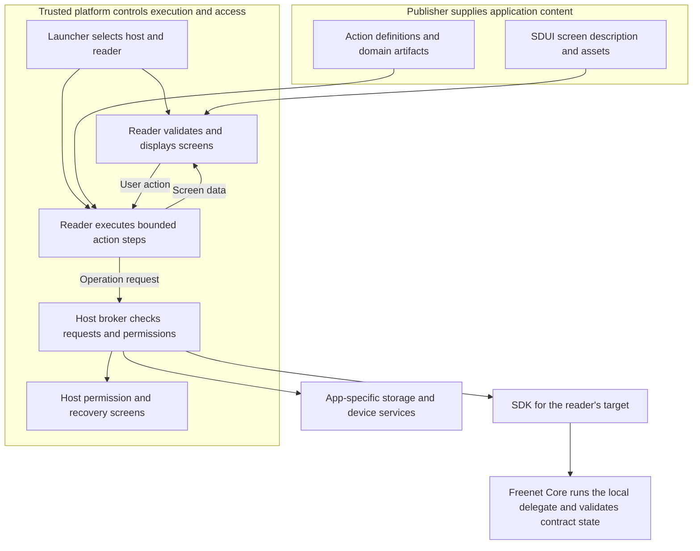
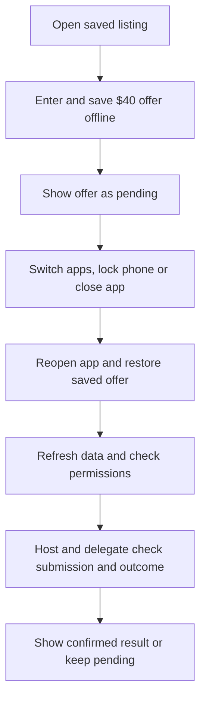
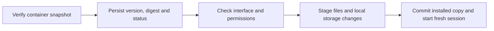

# AppKit hosts

Dependencies: [bundles](bundles.md), [data and actions](data-actions.md), [SDUI](sdui.md), [mobile SDK](../freenet-mobile/README.md).

An AppKit host coordinates an application's declared actions, checks its permissions and saves its local data. It verifies the installed copy before starting the application. A reader turns the application's SDUI screen description into controls people can use.

For example, Alice opens Marketplace on her phone and offers $40 for a skateboard. The reader displays the offer form. The application delegate checks her amount and prepares the offer. The host checks the app's permission to submit the offer and saves the pending operation. Freenet Core handles the requested shared-state update.

These are reusable parts. The [Freenet mobile app](../freenet-mobile-app/README.md) combines them with discovery and onboarding. [EVY Developer](../evy/README.md) uses them to preview applications. A dedicated native application can provide its own screens and use the same native SDK and domain protocols.

## 1. How the parts fit together

| Part | Responsibility | Example |
| --- | --- | --- |
| SDUI document | Describes screens and connects controls to actions | An amount field and a Make offer button |
| Reader | Displays those screens, handles navigation and supports accessibility | Shows the form using browser, iPhone or Android controls |
| Action executor and application delegate | Execute declared steps and apply domain rules | The delegate prepares the offer. The executor supplies its result to the screen |
| Host | Installs definitions, coordinates requests, checks access and saves local data | Saves Alice's pending offer and checks permission before sending it |
| Platform SDK | Carry authorized Freenet requests and responses | Submit the prepared offer and follow its status |
| Freenet Core | Runs the local delegate and validates shared state | The local delegate prepares the offer. Peers validate and merge it under the Marketplace contract |
| Identity subsystem | Protects keys and defines account recovery | Uses the device's protected key storage |
| Consumer product | Provides discovery, the installed app list and onboarding | Lets Alice find and open Marketplace |

A contract defines rules for shared data. A delegate performs approved private operations, such as signing. The broker checks application requests before passing them to Core, local storage or device services.

The [SDUI plan](sdui.md) defines screen descriptions and readers. The [data and actions plan](data-actions.md) defines application actions and pending-operation rules. The [bundle plan](bundles.md) defines packaged metadata and Freenet publication. This plan owns installation, update selection, execution and access.

## 2. Who controls what

For an SDUI application, the publisher supplies screens, images, action definitions and contract/delegate artifacts. The launcher selects the installed host and reader. The web reader uses the Rust-backed browser SDK. Native readers use the native library with Swift or Kotlin bindings. The [SDK paths table](../freenet-mobile/README.md#0-feasibility-and-existing-evidence) lists every target's SDK and measures the proposed bindings.

Arrows show data or requests. The host validates publisher definitions and checks each requested operation. The host protects the app identity display, permission prompts, external-link approval, recovery controls, access revocation and application diagnostics from application changes.

The host records which app and user made each request, then checks their permissions. Each app session records the verified container identity, publisher, content reference, user, installation, allowed operations and generation number. The generation number identifies the current session. The broker attaches this information to requests. The application supplies the action data and requested resource.

Core attaches one caller identity to a delegate message: the originating web app's contract id, or another delegate's key. Delegate policy can key on that attested app contract id only. User, installation and session generation are host bookkeeping. The host enforces them before a request reaches Core, and a delegate treats any copy of them inside message bytes as unverified data. Whether the app contract id itself is trustworthy depends on the Core-authenticated admission path in [section 3](#3-browser-hosting).

At every protected operation, the host checks permissions and contract or delegate parameter rules. Removing permission ends active access. Queued work must pass a new permission check before execution. Delegates also apply their own operation rules. Installed dedicated native applications have their own trust and account-enrollment requirements.

## 3. Browser hosting

A publisher can offer several ways to open an application. Each is an application interface with its own compatibility and access requirements.

| Browser target | What supplies the screen | How it runs |
| --- | --- | --- |
| Custom web | The publisher's HTML, JavaScript and browser Wasm | A Core web container with browser restrictions and approved web API access |
| Web SDUI | A reader served from a contract displays the publisher's SDUI. It is sandboxed like any other web app | Core's shell page is its host. The reader executes declared steps through the Rust-backed browser SDK |

Custom JS/TS web applications use the existing TypeScript SDK. Rust browser applications link Rust stdlib into their Wasm build. Their screens and web adapters remain publisher-controlled. The launcher shows the selected target and keeps each target's sessions, keys and permissions separate. Opening a web target applies Core's existing capability-specific controls. AppKit's proposed operation grants for web targets depend on the permission lifecycle gate below.

### Browser capabilities and gates

Core's shell grants capabilities one mechanism at a time. AppKit's declared operation grants sit on top of them and ship only when the general permission lifecycle does.

| Capability | Core today | AppKit needs | Gate |
| --- | --- | --- | --- |
| Delegate user prompts | Core's permission UI for delegate `RequestUserInput` prompts | The same prompts | Available |
| Iframe embedding | A fixed allowlist constant in the client API | Declared embed permissions | Permission lifecycle |
| Manifest-driven permissions | Merged as [#4086](https://github.com/freenet/freenet-core/pull/4086) and reverted in [#4090](https://github.com/freenet/freenet-core/pull/4090) on 20 May 2026 over CSRF and silent capability expansion | Declared operation grants with persistence and revocation | Permission lifecycle, tracked in [#4014](https://github.com/freenet/freenet-core/issues/4014) and the roadmap in [discussion #5380](https://github.com/freenet/freenet-core/discussions/5380) |
| Cross-origin network | Blocked by Content Security Policy. `default-src` and `connect-src` allow only the node's origin plus `blob:` and `data:`. Popups escape | Popup or redirect for payment. Media bundled in the archive or served by the node | Fixed by CSP. A permission grant changes nothing here |
| Durable storage | Opaque origin with no durable storage | Durable opaque-origin storage | [#5165](https://github.com/freenet/freenet-core/issues/5165) and [#5254](https://github.com/freenet/freenet-core/issues/5254) |
| Caller authentication | The shell mints app-identity tokens on request for a supplied contract identity | Core-authenticated app sessions | [#5264](https://github.com/freenet/freenet-core/issues/5264) |

Release gate: the general permission lifecycle, including persistence and revocation, ships before web SDUI enables protected operations. Each permission names the layer that grants it and how Core stops another route from bypassing it.

### Browser implementation

Custom web builds use Freenet website publication. Bundle verification checks the entry point and declared executable assets. Test relative assets, browser Wasm loading, reloads, navigation, storage and declared API access through the Core web container.

Everything Core serves from a contract gets an opaque origin and an unconditional sandbox. It holds no tokens and no durable storage. The trusted browser surface is Core's shell page, which holds the auth token and proxies WebSockets. For the browser target, web SDUI is therefore an ordinary sandboxed web app and Core's shell is its host. Moving the reader into the shell would be a Core change with a named owner, and this plan proceeds without it. For web SDUI the shell must:

- Verify the selected container and exact archive snapshot.
- Bind the app's authority to the broker connection and create an expiring session.
- Provide durable storage for the hosted application.
- Check operation scopes and reject forged identities, reused sessions and expired session generations.
- Apply the same admission checks to every route that grants equivalent access.

The web reader evaluates bounded action definitions, using a worker for expensive decoding and evaluation where needed. The host authenticates message channels, matches replies to requests and cancels overdue work. Freenet calls use the Rust-backed browser SDK. Device and service calls use approved adapters. Validate delegate results before displaying them or submitting prepared updates.

Core's shell owns every trusted permission screen for the browser target. Prompts the reader draws are application UI inside the sandbox. Each prompt identifies the layer granting access.

The browser plan depends on [per-guest authentication](https://github.com/freenet/freenet-core/issues/5264) and [durable](https://github.com/freenet/freenet-core/issues/5165) [opaque-origin storage](https://github.com/freenet/freenet-core/issues/5254). A mode that keeps data only in tab memory tells the user that closing the tab ends its storage lifetime. The production profile requires Core-authenticated app sessions. Implement and test the selected browser or native admission path before enabling protected operations. Core then binds each delegate request to that admitted session. Durable-storage acceptance cases apply to hosts that provide durable storage.

## 4. Native hosting

On iPhone and Android, the reader and custom applications call the same native Rust library through generated Swift or Kotlin bindings. The mobile SDK manages embedded Core. The reader displays SDUI using the platform's controls, as the [reader implementation](sdui.md#7-reader-implementations) describes.

| Host function | iOS | Android |
| --- | --- | --- |
| Execute declared actions | Installed executor with bounded steps | Installed executor with bounded steps |
| Freenet client library | Native Rust library with Swift bindings | Native Rust library with Kotlin bindings |
| Save local records | SQLite repository | Room/SQLite repository |
| Protect keys through the identity subsystem | Keychain-backed key encryption key, a new Core backend | Keystore-backed key encryption key, a new Core backend |
| Access Core | Embedded SDK through trusted broker | Embedded SDK through trusted broker |

Keep SDK bindings, action execution, storage and rendering separate. Application sessions receive only their declared broker operations. The embedded Core integration checks the caller's identity inside the process, as the [mobile SDK plan](../freenet-mobile/README.md#2-embedded-node-and-native-api) specifies.

The [SDK runtime and packaging plan](../freenet-mobile/README.md#3-runtime-and-packaging) packages the native library and Core runtime. Native delegate execution on devices depends on the mobile crate exposing delegate messaging, register and unregister, which that plan lists as feasibility deliverables. Physical-device tests verify app isolation, caller identity, bounded actions and Core execution limits.

## 5. Saving work and reopening an app

Alice opens a previously saved skateboard listing on the train. The host loads the verified installed copy and cached data before making a network request. The reader marks the listing as awaiting refresh. Alice enters a $40 offer while offline.

| Event | Host and action behavior | What Alice sees |
| --- | --- | --- |
| Alice submits offline | The action executor requests durable storage of the operation before showing it as pending | Her $40 offer is pending |
| Alice switches apps or locks her phone | The host saves drafts and pending work, then follows the SDK background policy | Her work remains saved |
| The operating system closes the app | Durable storage retains the last committed records | Her offer returns as pending when she reopens the app |
| Connectivity returns | The host opens a fresh session, checks permissions, refreshes state and obtains the delegate's reconciliation result | Pending status remains until the outcome is known |
| Confirmation arrives | The host and domain delegate use verified operation evidence to determine the result | The reader displays the confirmed result |

An update counts as accepted once it merges locally and a later read or update notification shows it in the contract state. Marketplace defines what that result means for the buyer and seller. The [operation lifecycle](data-actions.md#6-submitting-updates-and-pending-operations) defines retries, conflicts and unresolved submissions.

### Storage and lifecycle implementation

The host manages app sessions and combines authorized requests for the same live data. The SDK starts and stops the node. The host reference-counts subscriptions and keeps one while any screen or operation needs it. A client subscription to Core ends with the client connection until stdlib and Core ship the Unsubscribe request, which Core lists as upcoming. Closing one app preserves another app's independent activity.

Backgrounding saves drafts and pending operations, cancels local work and invalidates callbacks from the previous session. Each resumed app gets fresh session authority. Queue transactions preserve committed work across forced termination.

Host storage contains verified bundles, cached screen data, drafts, preferences, pending operations and saved navigation that remains compatible with the installed copy. Core stores delegate state. The [identity plan](../identity/README.md) defines protected keys and recovery coverage. Test locked-device access, invalidated keys, device replacement and delegate upgrades through the application's [export and import round trip](../identity/README.md#4-delegate-upgrades).

Refresh application containers and active contracts within resource budgets after displaying trusted cached state. The host may restore missing application data through authorized domain recovery actions. Recovering [cold state](https://github.com/freenet/freenet-core/issues/4642) requires an available hosting copy.

## 6. Installing and updating applications

Alice opens Marketplace after its publisher adds a new screen. The host verifies the container envelope, derives its full identity and reads the bundled application definition before executing code. It checks the selected interface against the bundled action, delegate and screen schemas.

Record both the latest verified publication and the installed copy, including when the host observed each. Every session uses one archive for its actions, screens and schemas and records the exact delegate identities it invokes. Invalidate callbacks from the previous session when switching copies. Product discovery screens call these host operations.

| Observation or condition | Host behavior |
| --- | --- |
| Compatible active bundle | Prepare local changes, commit the selected copy atomically and start a fresh session |
| Lower container version | Preserve the latest observation and installed copy. Retry discovery |
| Same version with a different archive digest | Keep conflict evidence and the accepted copy. Adopt changed content after a later unambiguous signed publication |
| Unsupported action/delegate protocol or required component | Keep a compatible installed copy and explain the required host update |
| Missing artifact or interrupted installation | Preserve committed content and recoverable storage, then retry within budgets |
| Additional permissions | Obtain consent before starting operations that require them |
| Web or native alternative | Offer its verified opening option for explicit selection |
| Ordinary website | Open through the Freenet browser shell |
| Arbitrary contract | Open the contract inspection view |

Run local database migrations against staged or recoverable storage and read back the result before committing installation. The [data and actions plan](data-actions.md#9-application-migrations) assigns domain adapters to the application and migration orchestration to the host, while [identity](../identity/README.md#4-delegate-upgrades) owns secret-access authorization. Shared contracts evolve independently of the local installation transaction. A cached definition can run only with compatible executor steps, delegates and local/shared state schemas.

### Withdrawal and reinstatement

Read the application's `active` or `withdrawn` status from the latest verified container snapshot. Persist withdrawal before stopping the application session and its queued operations. Retain user data, payment references and recovery evidence. Trusted host controls provide export, removal and supported service-based order recovery. The withdrawn application session stays stopped across restarts and cached-opening attempts.

A later verified active publication starts the compatibility and permission checks for reinstatement. Previously revoked permissions stay revoked. If two signed archives at the same version disagree about withdrawal, keep the app stopped until the publisher resolves the conflict.

Offline devices act when they receive and verify the status. Show the last observation time. Hosts enforce withdrawal for applications they run. Native distribution channels and payment services apply their own controls.

### Storage and historical copies

Keep the working copy and evidence needed by unresolved operations. Retain a compatible recovery copy where storage allows. Remove unused copies to stay within the configured storage limit. Retrieve archives from the publisher or mirrors using exact digests and verify their envelopes and container identity. Preserve the latest observed version and status when reopening a compatible earlier copy. A later publication containing earlier application code must still pass current compatibility checks.

Publisher transfers use [identity continuity](../identity/README.md#7-publisher-continuity). Obtain approval before moving private access to the successor container, preserve transfer evidence and resume interrupted local migration from its journal.

## 7. Photos, files and external services

Alice taps Add photo on a listing form. The reader requests the photo operation through the host's device interface. The host checks access and presents the required permission controls. The picker returns access to the selected photo within the granted scope.

| Situation | Result |
| --- | --- |
| Alice allows photo selection | The application receives access to the selected photo through a restricted handle |
| Alice declines access | The reader explains the denial and keeps her form draft |
| Camera capture is unavailable | The reader may offer photo-library selection when available and authorized |
| Photo selection is unavailable | The reader explains that selection is unavailable |

Camera, files, notifications, maps, contacts and external links use permission-checked adapters. Each adapter returns a defined result for denial or missing device support. Opening a notification triggers a refresh of verified application state.

Network policy differs by target:

| Target | Network policy | Consequence for Marketplace |
| --- | --- | --- |
| Browser | Fixed by Core's Content Security Policy. `default-src` and `connect-src` allow only the node's origin plus `blob:` and `data:`. Fetch, XHR, WebSocket and image loads to other origins are blocked. Only popups escape | Checkout opens Stripe in a popup or redirect. Listing photos are bundled in the archive or served by the node |
| Native | The host's own policy over approved adapters | Checkout opens the system browser or an in-app browser session. Media loads through the approved adapter |

Local imports and exports use authenticated host operations. EVY Developer handles application-definition imports. Application delegates convert domain records, and hosts check destination authority before import. Show unsupported records and require valid signed operations before importing shared state.

Payment and remuneration clients use approved service adapters with their respective service authority. Their product plans define checkout, earnings and payout behavior.

## 8. Diagnostics

The host supplies status information that helps people understand delays and report failures. Consumer products can also show bundle verification, attribution labeled with its source and contributor information. EVY Developer owns proposal review, earnings and payout screens.

| Diagnostic | Example |
| --- | --- |
| Connectivity | Four connected peers |
| Active applications | Marketplace, three active contracts |
| Last verified refresh | Two minutes ago |
| Pending operations | One offer awaiting confirmation |
| Storage | 38 MB |
| Application and compatibility | Verified installed copy with supported action and delegate protocols |
| Granted access | Listing contract and photo selection |
| Recoverable errors | Listing data temporarily unavailable |

Export redacted diagnostics with operation IDs and error categories. Protect private keys, request payloads, decrypted records and private references by default.

## 9. Delivery and acceptance

| Area | Done when |
| --- | --- |
| Trusted execution | Tests reject forged app identities, broker replacement and requests outside Core permissions |
| Custom web hosting | Declared web assets load and permitted API requests work inside the Core web container |
| Web SDUI hosting | Core-admitted sessions under the shell host execute scoped, bounded actions, and the host reports how long saved data lasts |
| Permission lifecycle gate | Declared grants persist, revoke and cannot be reached through another route before web SDUI enables protected operations |
| Native hosting | Readers and custom apps use the same native SDK, and Core executes domain delegates on physical devices |
| Offline lifecycle | Alice's draft and pending offer survive lock, backgrounding and forced termination on durable-storage hosts |
| Installation | Snapshot consistency, interrupted local migration, withdrawal across restart and compatible recovery pass host fixtures |
| Permission changes | Revoked access ends active use, and queued requests pass current permission checks |
| Cross-platform behavior | Web and native SDKs pass protocol fixtures. Declarative actions and custom apps produce equivalent domain results |
| Resource limits | Measurements cover startup and first cached display. Tests enforce action, storage, subscription and delegate execution limits |

Include malicious publisher bundles, forged messages, action deadlines, Core interruption, late callbacks, schema migration, imitation permission prompts and isolation between two apps. The [SDUI plan](sdui.md#9-acceptance) owns rendering and accessibility tests. Product plans own onboarding and Marketplace fulfillment tests.

Test same-version conflicts involving withdrawal, replayed active content, delayed offline observations, reinstatement with revoked permissions and archive eviction with pending work. Keep existing-order recovery available through trusted service controls after the application session stops.
