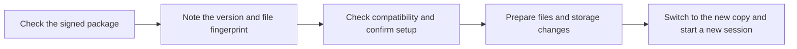

# AppKit hosts

A host is the program that runs a Freenet app for the user. In a browser, the host is the page that Freenet Core, the program that runs a Freenet node, wraps around every web app. On a phone, the host is an app with Core built in through the [mobile SDK](../freenet-mobile/README.md).

AppKit adds what a host needs to run an app from its bundle, the signed package a publisher ships:

- setting the app up the first time it opens
- keeping track of each time the app runs (a session)
- asking the user for permissions and remembering each answer (a grant)
- saving work that has not reached the network yet
- giving the app access to phone features such as notifications

[SDUI](sdui.md) covers screens described as data and the readers that draw them. [Actions](actions-and-delegates.md) covers what buttons do and the app's delegates. [Data](data-and-operations.md) covers saved and unsent changes, and [bundles](bundles.md) covers the package itself. This plan covers installing, sessions, permissions and device access.

## 1. Who controls what

| Who | Responsibility | River example |
| --- | --- | --- |
| Host | Installs apps, sets them up, tracks sessions, checks permissions and saves unsent work | Checks that River may send Alice's reply, and keeps the reply until it reaches the room |
| Host screens | Screens built into the host itself, such as the install screen, permission prompts and recovery settings. Only the host draws them, so users can trust what they say | The prompt that asks Alice whether River may send her notifications |
| Reader | Draws the app's screens from the publisher's screen description and passes button taps to the host, per [SDUI](sdui.md) | Draws the conversation and its message box |

Every request carries who made it, so the host can check the right permission. Two parts add that information:

- Core labels every message sent to a delegate with the app that sent it. The label is the app's Freenet address, or the address of another delegate. The delegate can trust this label because Core adds it, and uses it to decide what to answer. When Bob sends a message, Core labels the request to River's chat delegate as coming from River, per [actions section 3](actions-and-delegates.md#3-delegate-requests-and-results).
- The host adds which user, which installed copy and which session made the request. Only the host can trust these, because they come from the host rather than from Core. A delegate treats any such detail it finds inside a message as an unchecked claim.

Each session remembers the app, its exact version, the user, the installed copy and the permissions it holds, per [bundles section 4](bundles.md#4-installing-a-copy). Each new session gets a new number, and the host ignores requests and replies that carry an older number. In a browser, the app label becomes trustworthy once Core confirms which app is calling, one of the [gates](#gates).

Before any action that needs permission, the host checks that the permission is still granted and that the request targets the right contract or delegate. The delegate then applies its own rules.

## 2. Browser and native hosts

A bundle can hold two kinds of screens, and a publisher can also ship a phone app:

- Web code: pages the publisher writes in HTML, JavaScript or Wasm, loaded by the bundle's `index.html`.
- SDUI: screens described as data in `ui/sdui/ui.json`, which a reader draws.
- Native code: the publisher's own iPhone or Android app.

| Host function | Browser | Phone |
| --- | --- | --- |
| Host | The page Core wraps around every web app. It holds the node's access key and relays the app's messages to the node | SDUI: the Freenet mobile app Native code: the publisher's own app |
| What runs | Web code: the publisher's pages SDUI: the web reader that ships in the bundle Core loads both from the bundle inside a sandbox, a browser frame cut off from other sites and the rest of the browser | SDUI: the reader built into the Freenet mobile app draws the screens with the phone's own buttons and lists, per [SDUI section 7](sdui.md#7-reader-implementations) Native code: the publisher's own screens |
| What buttons do | SDUI: the reader runs the steps the bundle declares, such as "read the room, ask the delegate to sign, send". Heavy work runs in the background Web code: its own code talks to Freenet directly | SDUI: the reader in the Freenet mobile app runs the declared steps Native code: its own code talks to Freenet directly |
| Library for talking to Freenet | SDUI: a browser library built from Freenet's Rust code, bundled with the web reader Web code: Freenet's TypeScript library, or its Rust library compiled into the app | One Freenet library written in Rust, used from Swift on iPhone and Kotlin on Android. It also runs Core inside the app |
| Messages to delegates | SDUI and web code send the same messages to the app's delegates, per [actions section 3](actions-and-delegates.md#3-delegate-requests-and-results) | SDUI and native code send the same messages |
| Sessions | One per open page. Web code and SDUI screens on that page share it | One each time the app starts |
| Confirming which app is calling | Core confirms it, once that [gate](#gates) ships | Core runs inside the app and checks each call directly, per the [mobile SDK plan](../freenet-mobile/README.md#2-embedded-node-and-native-api) |
| Saved work | Browser storage that survives closing the tab, once that [gate](#gates) ships. Until then, saved work lasts only while the tab is open, and the host tells the user so | An on-device database: SQLite on iPhone, Room on Android |
| Protecting keys | Core encrypts keys with a master key kept in the computer's key store or a protected file | Core encrypts keys with a master key kept in the iPhone Keychain or Android Keystore, once that [gate](#gates) ships |
| Permission prompts | Core's page draws them, for web code and SDUI alike. Anything that looks like a prompt inside the sandbox is part of the app | SDUI: the Freenet mobile app draws them Native code: the publisher's app draws its own |
| Network | The sandbox lets the app talk only to its own node. Loading anything from other websites fails, except opening a new window. Payment therefore opens in a new window, and images and media ship in the bundle or come from the node | SDUI: the Freenet mobile app decides, and apps reach the network only through its approved features Native code: the publisher's app decides |

The [mobile SDK plan](../freenet-mobile/README.md#0-feasibility-and-existing-evidence) lists which library each kind of app uses, and [how the phone library is packaged](../freenet-mobile/README.md#3-runtime-and-packaging).

River today is web code. Its screens are written in Rust and compiled to run in the browser, on desktop and phone ([ui/Cargo.toml](https://github.com/freenet/river/blob/main/ui/Cargo.toml)). Its screens and its chat delegate ship inside its bundle ([ui/freenet.toml](https://github.com/freenet/river/blob/main/ui/freenet.toml)). River loads nothing from other websites, so the sandbox's network limit never gets in its way. On a phone, River's message alerts go through the host's notification feature, and copied invite links through its clipboard feature.

The same app opened in a browser and on a phone keeps separate keys and permissions in each. Web code stays under the publisher's control, and Core's existing browser permissions apply to it.

For an app that uses AppKit permissions, Core's page:

- Checks that the app's files match the exact signed version.
- Ties the app's permissions to its connection and starts a session that expires.
- Gives the app storage that survives closing the tab.
- Checks permissions, and rejects fake app labels, reused sessions and old session numbers.
- Applies the same checks to every other way into the node that gives the same access.
- Confirms who each message comes from, matches each reply to its request and cancels work that takes too long.
- Checks delegate answers before the reader shows them or sends them on.

On a phone, each app session gets only the actions its bundle declares.

### Features missing in Freenet for AppKit to work

| Feature | Where | Core today | AppKit needs | Tracked in |
| --- | --- | --- | --- | --- |
| Prompts from delegates | Browser | Core shows a prompt when a delegate asks the user a question | The same prompts | Available |
| Embedding other pages | Browser | One fixed allow-list for every app, built into Core | A permission per app | Declared permissions, below |
| Declared permissions | Browser | Not built yet. The review of an earlier attempt, [#4090](https://github.com/freenet/freenet-core/pull/4090), requires asking again when an app's list changes, and letting users take permissions back | Permissions that are remembered and can be taken back | [#4014](https://github.com/freenet/freenet-core/issues/4014), plan in [discussion #5380](https://github.com/freenet/freenet-core/discussions/5380) |
| Storage that lasts | Browser | Apps lose their data when the tab closes | Storage that survives closing the tab | [#5165](https://github.com/freenet/freenet-core/issues/5165) and [#5254](https://github.com/freenet/freenet-core/issues/5254) |
| Confirming which app is calling | Browser | Core's page hands an app ID to any app that asks for one | Core confirms each app itself | [#5264](https://github.com/freenet/freenet-core/issues/5264) |
| Confirming which app is calling | Phone | The same open work | A direct path inside the app that tags every call with the app, user and session | [#5264](https://github.com/freenet/freenet-core/issues/5264) and [mobile SDK section 2](../freenet-mobile/README.md#2-embedded-node-and-native-api) |
| Delegates on the phone | Phone | Core's phone library reads, writes, updates and follows contracts, with no delegate support yet | Run the app's delegates on the phone | [Mobile SDK section 2](../freenet-mobile/README.md#2-embedded-node-and-native-api) |
| Phone key stores | Phone | Core keeps its master key in Linux, macOS or Windows key stores, or in a file | Keep it in the iPhone Keychain and Android Keystore | [Identity section 2](../identity/README.md#2-protected-keys-and-records) |
| Stop following a contract | Both | The app keeps receiving updates until it disconnects | Stop updates when no screen needs them | Freenet's client library and Core, listed as upcoming |

## 3. Installing and updating

River publishes a new version that adds Carol's "Invite member" screen, per [bundles section 3](bundles.md#3-publishing-and-evidence).

1. Bob's host sees a newer version at River's Freenet address.
2. Before running any of its code, the host checks the publisher's signature and reads the app definition. It runs the safety checks in [bundles section 4](bundles.md#4-installing-a-copy), then checks that its reader supports everything the new screens and actions use.
3. The chat delegate is the same as before, so the host installs the update straight away. It prepares the new files and its own database changes on the side, checks them, then switches to the new copy in one step.
4. Bob still has an unsent reply to Alice. The host starts a new session and ignores late replies meant for the old one. The unsent reply keeps its ID and goes out under the new session.
5. Bob opens the "Invite member" screen in the new version.

The host remembers the newest version it has seen and the version it has installed, and when it saw each. A session uses one version's screens and actions from start to end, and notes exactly which delegates it called. The host runs the [setup steps](bundles.md#2-contracts-delegates-and-initialization) the app definition lists and gives each installed copy and session an [ID](bundles.md#4-installing-a-copy).

| What the host finds | What it does |
| --- | --- |
| A compatible new version | Prepares it, switches to it in one step and starts a new session |
| An older version than the one it has | Keeps what it has and checks again later |
| The same version number with different files | Keeps the copy it accepted and a record of the mismatch. Moves on when a later signed version settles it |
| Screens, actions or delegate messages newer than the host supports | Keeps the working copy and explains which host update the user needs. The Freenet mobile app offers the web app or the publisher's phone app instead, per its [opening flow](../freenet-mobile-app/README.md#2-opening-an-application) |
| Missing files, or an install that stopped halfway | Keeps the last working copy and saved data, then tries again |
| A changed delegate or a new setup step | Shows the install screen with the change, per [bundles section 2](bundles.md#2-contracts-delegates-and-initialization), and switches after the user accepts |
| A new phone feature | Asks the first time the app uses it, per [section 5](#5-permissions-and-device-access) |

When an update changes how data is stored:

- The host updates its own database on the side and checks the result before switching.
- Drafts and private records move from the old delegate to the new one through an [export and import](../migration/README.md#3-delegate-secret-export-and-import), which also decides when the user must approve.
- The [migration plan](../migration/README.md#2-contract-carry-forward) covers moving shared data to a new contract version. The app supplies the conversion and the host runs it.
- Shared data such as the room changes on its own schedule, separately from installs. A cached copy of the app runs only while it understands the current data.
- When an app moves to a new publisher, the host follows [publisher continuity](../migration/README.md#4-publisher-continuity). It asks before moving private data to the new publisher's app, keeps a record of the move and picks up where it left off if interrupted.

The host keeps the working copy, one backup copy and anything still needed for unsent work, and deletes older copies to stay within its storage limit. Going back to an older copy keeps the record of the newest version seen. A newer release that contains old code still goes through the current compatibility checks.

## 4. Saving work and reopening an app

Alice opens "Skate club" on the train. The host shows the installed copy and saved messages straight away, before going online, and the reader marks the conversation as waiting to refresh. Alice writes a reply with no signal.

| What happens | What the host does | What Alice sees |
| --- | --- | --- |
| Alice sends with no signal | Saves the reply to storage that survives restarts, then shows it as pending | Her reply shows as pending |
| Alice switches apps or locks her phone | Saves drafts and unsent work, then follows the SDK's rules for running in the background | Her draft and pending reply stay saved |
| The phone closes the app | Everything saved before that survives | Her reply is still pending when she reopens the app |
| The signal comes back | Starts a new session, rechecks permissions, fetches the latest room and asks the chat delegate whether the reply went through | The reply stays pending until the host knows |
| The room shows her reply | The host and chat delegate confirm it | Her reply shows as sent |

The reply counts as sent once a later read of the room shows it among the recent messages ([version.rs](https://github.com/freenet/river/blob/main/common/src/room_state/version.rs)). The [data plan](data-and-operations.md#3-submitting-updates-and-pending-operations) covers retries and conflicts.

- The SDK starts and stops the node. The host tracks each app's session and combines requests from different screens for the same data.
- The host follows a contract for updates while any screen or pending action needs it, and stops when none do. Until Freenet's libraries can stop following, updates end only when the app disconnects.
- Closing one app leaves other apps running.
- When the app goes to the background, the host saves drafts to the app's delegate, saves unsent work, stops local work and ignores late replies to the old session. Reopening starts a new session. Saved work survives even if the phone kills the app.
- After showing saved data, the host refreshes the app and its active contracts, within the limits in [actions section 4](actions-and-delegates.md#4-limits-and-security). It can restore missing app data through the app's own recovery actions. Data nobody has fetched for a long time ([cold state](https://github.com/freenet/freenet-core/issues/4642)) comes back only if some peer still keeps a copy.
- Importing and exporting local data runs through the host. The app's delegate converts the records, and the host checks that the destination may receive them. The host lists records it cannot import, and imports shared data only when it carries valid signatures.

Drafts and private records live in the chat delegate's storage, and unsent work and cached screens live with the host, per [data section 2](data-and-operations.md#2-values-and-local-storage). The host also keeps installed bundles and where the user was in the app, while the installed copy still has that screen. The [identity plan](../identity/README.md) covers keys and recovery.

## 5. Permissions and device access

Alice turns on message alerts in "Skate club". The reader asks the host to turn on notifications. The host checks whether River has permission, asks Alice if needed, and the phone's notification feature returns her answer. In the browser, River asks for notification permission once and remembers the answer ([notifications.rs](https://github.com/freenet/river/blob/main/ui/src/components/app/notifications.rs)).

- The app definition lists every permission the app may ask for, per [bundles section 1](bundles.md#1-the-archive-and-its-definition).
- On a phone, the host asks the first time the app needs a permission it has not been given. Users see prompts only for features they use.
- In a browser, Core's page reads the same list and decides when to ask, per [#4014](https://github.com/freenet/freenet-core/issues/4014) and [#5254](https://github.com/freenet/freenet-core/issues/5254).
- The host draws the prompt. It names the app and what it wants, and remembers the answer for that app, user and installed copy. That remembered answer is a grant.
- The app keeps the grant until the user takes it back in the host's settings. Taking it back stops the feature right away, and unsent work checks again before it runs.
- If an update adds a permission to the list, the host asks again.

When Bob starts using River:

1. Bob accepts River's install screen. It lists the chat delegate it will install, and notifications as optional.
2. He joins "Skate club" and sends "Skate session Saturday?". He sees no prompt.
3. He turns on message alerts. The host asks for notifications now.

| Situation | Result |
| --- | --- |
| Alice allows notifications | The host sends her alerts for new messages in "Skate club" through the phone's notifications |
| Alice declines | The reader explains why alerts are off and keeps her draft |
| The device has no notifications | The reader explains that alerts are unavailable. River lists notifications as optional, so the room keeps working |
| Alice copies an invite link | The host copies the link to the clipboard under River's clipboard permission ([ui/Cargo.toml](https://github.com/freenet/river/blob/main/ui/Cargo.toml)) |

| Permission | First asked when |
| --- | --- |
| Camera or photos | The app first opens the camera or photo library |
| Notifications | The user first turns on alerts |
| Clipboard | The app first copies something |
| Location and maps | The app first needs the user's location |
| An outside service | The app first uses that service |

Camera, files, notifications, clipboard, maps, contacts and outside links all go through host features that check the permission first. Each one gives a clear answer when the user says no or the device lacks the feature. A photo picker gives the app the chosen photo only, for that action and that session. Link previews, images and outside links follow the host's network rules, including ones a page loads on its own.

Tapping an alert refreshes the app first. When Alice taps a "Skate club" alert, the host fetches the latest conversation before the reader shows it.

Attachments, such as photos in messages, need a separate file store, which [bundles section 4](bundles.md#4-installing-a-copy) places outside AppKit.

## 6. Diagnostics

The host shows a status page that explains delays and helps people report problems. Consumer apps can also show whether a bundle passed its checks and who contributed to it, with the source of that information.

| Status | Example |
| --- | --- |
| Connection | Connected to four peers |
| Running apps | River, following two contracts: the Skate club room and River's own bundle |
| Last refresh | Two minutes ago |
| Unsent work | One reply waiting for confirmation |
| Storage | 38 MB |
| App version | Installed copy checked, and the host supports all its features |
| Permissions | The Skate club room and notifications |
| Problems it can recover from | Room data temporarily unavailable |

When a user exports a report, it includes IDs and error types, and hides private keys, message contents and other private data by default.

## 7. Acceptance

- Tests reject fake app identities, a fake host connection and requests Core does not allow.
- Web code loads its files and makes its allowed requests inside Core's sandbox. Tests cover relative file paths, loading Wasm, reloads, navigation, storage and allowed requests.
- In the browser, SDUI actions run in sessions Core has confirmed and stay within their limits, and the host tells the user how long saved data lasts.
- Before SDUI in the browser gets actions that need permission, permissions are remembered and can be taken back, and tests reject every other way to the same access.
- The Freenet mobile app and publisher phone apps use the same phone library. Tests on real phones show delegates running on the device, apps kept apart, callers confirmed and limits enforced.
- Alice's draft and pending reply survive locking, backgrounding and the phone closing the app, on hosts with storage that lasts.
- Install tests pass for files that match the exact version, an update interrupted halfway, falling back to a working copy, the same version with different files, replayed content, late updates after time offline, and deleting old copies while work is still pending.
- Taking back a permission stops the feature right away, and unsent work checks permissions again.
- Tests cover a locked phone, lost keys, a replaced phone and delegate upgrades through the [export and import](../migration/README.md#3-delegate-secret-export-and-import).
- The browser and phone libraries pass the same message tests. SDUI screens and publisher code produce the same results.
- Measurements cover startup time and the time to show saved data. Tests enforce limits on actions, storage, followed contracts and delegate running time.
- Test cases include harmful bundles, fake messages, actions that take too long, Core stopping midway, late replies, data format changes, fake permission prompts and two apps kept apart.

The [SDUI plan](sdui.md#9-acceptance) owns rendering and accessibility tests. Product plans own onboarding tests, and each app owns its own tests, such as River's invitation and ban flows.
