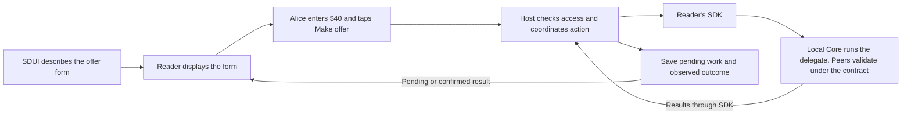

# SDUI

Dependencies: [bundles](bundles.md), [data and actions](data-actions.md), [hosts](hosts.md).

SDUI describes an application's screens as data. A reader turns that description into working controls in a browser, on iPhone or on Android. For example, a listing screen describes a photo gallery, price, amount field and Make offer button. Each reader displays those controls using its platform's layout and accessibility support.

SDUI shares screen definitions across platforms and lets authors build them in EVY Developer. Readers execute declared action steps through their hosts. The web reader uses the Rust-backed browser SDK. Custom web applications use the TypeScript SDK or a linked Rust build. Native readers and custom native applications use the native library with Swift/Kotlin bindings. The [SDK paths table](../freenet-mobile/README.md#0-feasibility-and-existing-evidence) lists every target.

For a $40 skateboard offer:

- The SDUI document describes the amount field, button and displayed offer status.
- The reader shows the form and passes Alice's entered amount to the named action.
- The local delegate applies private-operation policy, checks the amount and prepares the update. The host submits it and tracks the result.
- The host checks permissions, saves pending work and passes approved requests to Core.
- Freenet peers validate and merge the submitted state using the Marketplace contract. Every rule required of all writers belongs in that contract.



The launcher selects the reader implementation. On the browser target the reader is served from a contract and sandboxed like any other web app, and Core's shell is its host. Native readers are installed applications. The publisher supplies SDUI, action definitions and domain artifacts. The [host plan](hosts.md#2-who-controls-what) defines the execution and permission boundaries.

The bundled application definition names its supported interface version, actions, data available to screens and permission requests. The host reads it before executing code. SDUI, action definitions and delegate schemas come from the same verified archive snapshot. The SDUI document describes flows, pages, components, their relationships and themes. A flow can describe buying a skateboard. Its listing page contains the photo, price and offer form.

[EVY Developer](../evy/README.md) handles collaborative editing, conflicts and checkpoint export. A checkpoint saves a version of the application definition and screens. Publication packages its validated contents with the matching action definitions, delegate artifacts and typed schemas. Readers load that published content.

## 1. Standard components

The v1 catalogue uses all 21 existing EVY row types and their component names. AppKit adapts their data connections, actions and device access to the rules in this plan.

- Content: [Text](https://github.com/EVY-Platform/evy/blob/dev/types/schema/sdui/definitions/text.schema.json), [Heading](https://github.com/EVY-Platform/evy/blob/dev/types/schema/sdui/definitions/heading.schema.json), [Button](https://github.com/EVY-Platform/evy/blob/dev/types/schema/sdui/definitions/button.schema.json), [TextAction](https://github.com/EVY-Platform/evy/blob/dev/types/schema/sdui/definitions/text_action.schema.json), [TextExpand](https://github.com/EVY-Platform/evy/blob/dev/types/schema/sdui/definitions/text_expand.schema.json)
- Input: [Input](https://github.com/EVY-Platform/evy/blob/dev/types/schema/sdui/definitions/input.schema.json), [TextArea](https://github.com/EVY-Platform/evy/blob/dev/types/schema/sdui/definitions/text_area.schema.json), [Dropdown](https://github.com/EVY-Platform/evy/blob/dev/types/schema/sdui/definitions/dropdown.schema.json), [InlinePicker](https://github.com/EVY-Platform/evy/blob/dev/types/schema/sdui/definitions/inline_picker.schema.json), [TextSelect](https://github.com/EVY-Platform/evy/blob/dev/types/schema/sdui/definitions/text_select.schema.json), [Calendar](https://github.com/EVY-Platform/evy/blob/dev/types/schema/sdui/definitions/calendar.schema.json), [TimeslotPicker](https://github.com/EVY-Platform/evy/blob/dev/types/schema/sdui/definitions/timeslot_picker.schema.json)
- Collections: [InputList](https://github.com/EVY-Platform/evy/blob/dev/types/schema/sdui/definitions/input_list.schema.json), [ListItem](https://github.com/EVY-Platform/evy/blob/dev/types/schema/sdui/definitions/list_item.schema.json), [Search](https://github.com/EVY-Platform/evy/blob/dev/types/schema/sdui/definitions/search.schema.json), [PhotoGallery](https://github.com/EVY-Platform/evy/blob/dev/types/schema/sdui/definitions/photo_gallery.schema.json)
- Layout: [VerticalContainer](https://github.com/EVY-Platform/evy/blob/dev/types/schema/sdui/definitions/vertical_container.schema.json), [HorizontalContainer](https://github.com/EVY-Platform/evy/blob/dev/types/schema/sdui/definitions/horizontal_container.schema.json), [TabContainer](https://github.com/EVY-Platform/evy/blob/dev/types/schema/sdui/definitions/tab_container.schema.json)
- Device: [Map](https://github.com/EVY-Platform/evy/blob/dev/types/schema/sdui/definitions/map.schema.json), [SelectPhoto](https://github.com/EVY-Platform/evy/blob/dev/types/schema/sdui/definitions/select_photo.schema.json)

On the browser target, PhotoGallery, Map tiles and every other image or media component load only bytes bundled in the archive or served by the node. Core's Content Security Policy blocks other origins, so a listing photo is stored as a content-addressed blob the node serves. Native readers load media through the host's approved adapter.

Each component defines its properties, data connections, user actions and accessibility behavior. It also defines what to show while loading, when empty, after an error and when disabled. Readers support the component versions named in the screen definition. A required unsupported component blocks the page before use. An optional component supplies a safe alternative display.

For example, SelectPhoto requests a device operation through the host. If Alice declines access, the reader explains the denial and keeps her listing draft. If camera capture is unavailable, it may offer photo-library selection when available and authorized. If both are unavailable, it explains that photo selection is unavailable. The [host plan](hosts.md#7-photos-files-and-external-services) owns access checks and device adapters.

## 2. Connecting controls to data and actions

A binding connects a control to a value. The offer amount field reads Alice's local draft. The Make offer button sends that amount and the current listing ID to the declared offer action.

Bindings use typed references to declared views, local form values, page parameters and temporary display state. The schema marks each value as literal text, a reference or an expression. Text containing braces remains literal text when declared as a literal.

### Binding implementation

The following example illustrates how the button supplies arguments to the declared action.

```json
{
  "id": "offer-button",
  "type": "appkit.button",
  "title": { "literal": "Make offer" },
  "actions": {
    "tap": {
      "action": "marketplace.makeOffer",
      "args": {
        "listing": { "ref": "param:listingId" },
        "amount": { "ref": "local:draft.amount" }
      }
    }
  }
}
```

Publication and loading check action names, argument types and data paths against the action schema. The action definition names bounded steps and a typed delegate request for domain preparation. The host checks permissions and validates the delegate result before submission. Contracts enforce shared-state rules.

Display expressions support presence checks, fallback values, boolean comparisons, string checks and locale-aware formatting. They calculate values without side effects. Set limits for input size, nesting and evaluation steps. The host fetches bounded index shards. Application delegates interpret domain records, prepare screen data and calculate business values. Shared test cases define null and missing-value behavior and number conversions.

## 3. Navigation and forms

Alice opens a listing, enters an offer and returns to it later. The reader handles the page transition and restores a compatible saved form. If submission fails, it retains her entered amount and shows the error.

| Screen behavior | Required information |
| --- | --- |
| Open a page | Stable route ID and typed parameters, such as listing ID |
| Choose how to show it | Open a page, replace a page, show a sheet or full-screen view, or select a tab |
| Save a draft | Storage key, initial values and recovery policy |
| Explain invalid input | Declared validation feedback |
| Submit a form | Declared action and one consistent snapshot of the form values |
| Discard a draft | Declared discard policy |

Native readers use platform navigation and emit common navigation events for cross-platform tests. External links use host-controlled URL operations. Saving a form to shared state requires an explicit declared action.

Before restoring a page, the reader checks its route and parameters against the installed copy. Unknown routes return a defined navigation error to the host. Deep links supply navigation arguments. Requested actions pass host permission checks.

## 4. Layout, accessibility and language

The same listing may use a wide layout in a browser and a narrow layout on a phone. Each reader preserves the meaning and behavior of its controls while choosing platform layout details.

| SDUI defines | Reader determines |
| --- | --- |
| Stack direction, alignment and size categories | Platform layout and exact spacing |
| Named window size classes | Current class and response to resizing |
| Space for system controls and keyboard behavior | Platform safe areas and input handling |
| Named theme values | Platform colors, fonts, corner radii and shadows |
| Control purpose and accessible label | Accessible platform control |

Every non-text control needs an accessible label. Define headings, lists, inputs, errors and live updates. Map them to browser ARIA, SwiftUI accessibility and Compose semantics. Preserve keyboard focus and support reduced motion and high contrast. Test equivalent control meaning across platforms while allowing platform layout differences.

Strings use literal text or keys in verified language files. The host supplies locale and time zone. Resolve text in this order:

1. The requested locale.
2. Its language fallback.
3. The application's declared default locale.
4. A missing-key placeholder in development, or declared fallback text in production.

Machine translation requires an explicit user or application policy.

## 5. Validation and failure handling

Check screen definitions during authoring, before publication and before rendering. Collaborative editing contracts also check the structural rules they can enforce.

For example, a new Marketplace screen may require a component that Alice's reader version lacks. The host keeps a compatible installed copy and explains the required update. The [host plan](hosts.md#6-installing-and-updating-applications) defines compatibility checks and installation.

| Failure | Result |
| --- | --- |
| Malformed required component | Block the affected page and return a defined diagnostic |
| Malformed optional component | Display its declared safe alternative |
| Unknown action or wrong argument type | Reject publication or page activation |
| Unsupported interface version | Keep a compatible installed copy and explain requirements |
| Oversized screen description or excessive updates | Stop the offending update and report the limit reached |

Set limits for component count, nesting, text, media, list windows and update rate. Render long lists in limited windows as the user scrolls. Diagnostic IDs identify components while protecting private values.

## 6. Tooling and import

Publish JSON Schema, shared behavior tests and generated TypeScript, Rust, Swift and Kotlin models. Publish a schema comparison that identifies compatible and incompatible changes. Platform tooling supplies generated SDK packages. Application bundles contain the artifacts required to run the application.

The visual playground uses local sample data. Import maps EVY rows to standard components, parses typed values, resolves action references, normalizes entities and validates the checkpoint. Report unsupported behavior so authors can repair it.

Shared test cases cover forms, lists, navigation, permissions, languages and structured Marketplace requests. Component snapshots supplement accessibility and behavior tests.

## 7. Reader implementations

The browser, iPhone and Android readers display the same screen definition. Each implements the required standard component version. Keep generated models, renderers and test fixtures separate from the host's action executor, storage and SDK bindings.

| Reader function | Browser | iOS | Android |
| --- | --- | --- | --- |
| Screen models | Generated TypeScript models | Generated Swift models | Generated Kotlin models |
| Controls | Accessible HTML through React | SwiftUI | Jetpack Compose |
| Receive screen updates | Browser event handling | Async streams and UI actor updates | Coroutines, Flow and UI-thread updates |
| Navigation | Browser history and focus restoration | Platform navigation controls | Platform navigation controls |

### Browser implementation

Use TypeScript, React and Vite, with published npm packages and Bun workspace scripts. Keep the SDUI protocol independent of the rendering framework. The reader entry point accepts a verified application reference and a host adapter supplied by Core's shell.

Package the browser SDK Wasm, JavaScript bindings, CSS, fonts and icons with the reader, or reference content the node serves. The sandbox blocks other origins. Use relative assets for Core container packaging. Test built output through a supported Core shell and a development harness.

Connect SDUI controls to keyboard navigation, focus restoration, responsive layout and browser history. Contain rendering errors with component error boundaries. Stable component IDs generate test IDs. Render long lists in limited windows.

### Native implementation

Map buttons, inputs, lists and navigation to SwiftUI and Compose controls. Apply updates on each platform's UI thread. The [host plan](hosts.md#4-native-hosting) owns action coordination, local storage, protected key integration and Core access through native SDK bindings.

## 8. Preview in EVY Developer

Carol edits the listing page in EVY Developer and previews it with a sample skateboard and offer amount. Preview uses the released reader and declarative executor through a repeatable memory host adapter, with typed delegate-result fixtures. Live integration cases run the actual delegates through Core and the Rust-backed browser SDK. Fake identity, network, payment and signing adapters provide the default preview environment. An explicitly selected development environment supplies live integration tests.

Use the same renderer for authoring preview and released screens. The [EVY preview plan](../evy/README.md#6-preview) defines preview modes. This lets Carol check forms, navigation and errors before publishing a checkpoint.

## 9. Acceptance

| Area | Done when |
| --- | --- |
| Components | Each reader shows the same values and produces equivalent actions, navigation and error results |
| Offer action | The same fixture offer works through an SDUI button, a custom web control and a custom native control |
| Publication | Validation rejects mismatched action/delegate schemas and unsafe required components |
| Multiple targets | Publishing SDUI alongside a custom web target preserves that target's entry point and declared assets |
| Collaborative editing | Builder edits converge under the Developer plan and produce a repeatable checkpoint |
| Accessibility | VoiceOver, TalkBack and browser keyboard and screen-reader tests pass |
| Language and layout | Locale fallback, right-to-left layout and large text pass shared tests |
| Photo selection | Denied access and unavailable device functions show distinct results and preserve the draft |
| Form recovery | A saved offer amount returns when the user resumes a compatible form |
| Resource limits | Readers contain malformed content, excessive expressions and oversized rendering requests |

Run formatting tests with the same locale, time zone and current time on every reader. The [host acceptance cases](hosts.md#9-delivery-and-acceptance) cover execution isolation, permissions and durable storage.

Reference: [EVY source](https://github.com/EVY-Platform/evy).
