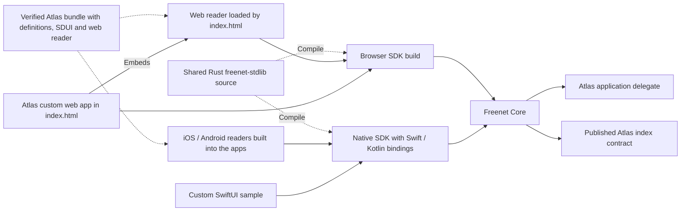

# Atlas sample application

Use Atlas to prove the per-target SDK paths and declarative SDUI before building the generic Freenet mobile app. Bob searches for applications, opens a result and saves it. A publisher adds an application to the index. SDUI and a custom native interface must produce equivalent records through their targets' SDKs and shared protocol fixtures.

## 1. Existing evidence and compatibility

Atlas has a Rust browser interface. The local `atlas-client` work exposes a browser Wasm client, and the local iOS demo reuses that client through `FreenetWebRuntime`. These provide compatibility references. The native SDK and delegate-backed SDUI paths below are planned integrations.

Atlas re-keys its index contract whenever its common or contracts directories change. Its stable identity is a pointer record resolved through the migration library under the root verifying key. Pin the author key, the pointer record and the current index code hash in fixtures, and preserve the original parameter bytes and canonical signed Atlas records. A fresh contract build can address a different index, even when its source appears equivalent. Keep the browser workflows available while validating the proposed SDK bindings.

Atlas pins stdlib 0.8.3, and the inspected Core uses 0.10.0. Bump Atlas to Core's stdlib in phase 0 before any measurement.

## 2. Feasibility and application responsibilities

First exercise reads, subscriptions, updates and delegate requests through the Rust-backed browser build, Swift and Kotlin, and compare them with the TypeScript SDK. Follow the [SDK measurement and compatibility plan](../freenet-mobile/README.md#0-feasibility-and-existing-evidence). Record adapter work, unsupported operations and API changes. Set workload and device budgets before broader adoption.

Then prove `addProducts` through a declarative SDUI action and a custom native control. Use a deterministic fixture before publishing to a test index. The host saves the operation ID and fetches the required state. The Atlas delegate decodes it, checks arguments and prepares canonical signed updates. The host journals the prepared bytes, submits them with current authorization and verifies the result. Prove domain preparation separately from SDK transport. Measure delegate calls, copies and elapsed time.

| Responsibility | Owner | Expected result |
| --- | --- | --- |
| Freenet request encoding and responses | Each target's SDK | Equivalent protocol behavior across the TypeScript SDK, the Rust browser build and native builds, proven by shared fixtures |
| Index decoding and search projections | Atlas delegate for SDUI, and compatible domain code in custom apps | Known records and bounded queries yield equivalent results |
| Canonical update construction | Atlas delegate | Signing inputs and contract updates match existing records |
| Signing | Atlas delegate with SDK-managed keys in Core's secrets store | Requests carry app/user authority and raw seeds stay inside Core. Hardware backing waits on the Core key-encryption-key backend |
| Reads, subscriptions and submissions | Host through platform SDK | Requests stay correlated and within granted scopes |
| Local drafts, saved items and pending operations | App-scoped host storage | Records survive restart and uncertain submission |
| Screens and navigation | SDUI reader or custom native/web UI | Controls invoke compatible domain actions |

Implement the [typed delegate convention](../appkit/actions-and-delegates.md#3-delegate-requests-and-results) for Atlas. The delegate returns typed views or prepared bytes. The host validates each result and any requested resource before continuing. Acceptance covers `loadIndex`, search, refresh and `addProducts`. Supporting these actions in the generic reader requires compatible definitions and delegates.

## 3. Publish the sample bundle

The sample bundle contains Atlas's web app, the web reader build, an application definition, declarative actions, typed schemas, SDUI and required delegate artifacts. Atlas's `index.html` keeps its Rust client and places a `<freenet-web>` element where the SDUI screens go. The web reader uses the Rust-backed browser SDK. The installed native readers and custom SwiftUI sample package the same native SDK and bindings.

Add the definitions, SDUI and reader build to the ordinary website archive and use existing Freenet publication with [bundle validation](../appkit/bundles.md). Test a second variant whose `index.html` loads only the web reader. Preserve the index validator and parameters independently of UI and delegate changes.

Dashed arrows show compilation or distribution. Solid arrows show runtime calls. Domain delegate requests and results travel through Core and the SDK.

The SDUI covers search/results, details, saved items and publisher submission. Route and form state stay in the reader. Host storage retains saved items and operation journals. Atlas delegates supply domain projections and signed updates. Custom native applications may consume the same definitions or implement their own orchestration against those protocols.

## 4. Delivery

| Phase | Delivers | Done when |
| --- | --- | --- |
| 0. Feasibility | stdlib bump to Core's version, then Rust-browser, TypeScript, Swift and Kotlin SDK operations plus one declarative action | Measurements establish adapter work, supported operations, compatibility changes, adoption budgets and the size the web reader adds to each bundle |
| 1. Compatibility fixtures | Pinned author key, pointer record, index code hash and canonical signed records | Tests detect any unintended identity or record change |
| 2. Domain delegate | Typed views and prepared update results | Deterministic and live Core tests cover search, refresh and publication |
| 3. Native proof | Native SDK with a custom SwiftUI sample | Read, refresh and publish work against embedded Core with scoped keys |
| 4. Shared screens | Web, iOS and Android SDUI readers | Equivalent action results and canonical records across targets |
| 5. Bundle installation | Ordinary website container with AppKit definitions | Custom web and reader-only fixtures open in a browser and in the native readers, incompatible updates preserve a usable copy and component migration passes |

Use embedded full-peer operation for early native integration. Complete feasibility before expanding browser SDK migration or consumer-product adoption.

## 5. Acceptance cases

- Bob opens a verified cached index while refresh is pending, and the UI labels its observation time.
- Malformed index records and delegate results cannot substitute publisher authority, target identity or permissions.
- Publication retries preserve operation identity and exact signed bytes after timeout or termination. Changed content creates a successor operation.
- Reopening rejects callbacks from the previous session. Closing one view preserves another view's subscription through host reference counting, since the Core subscription ends with the connection until Unsubscribe ships.
- SDK builds pass shared protocol fixtures. SDUI and custom native actions produce equivalent domain records and signing inputs.
- The TypeScript SDK keeps its API, and the Rust-backed browser build is measured against it.
- A new compatible SDUI action opens without application-specific code compiled into the reader. Unsupported steps and protocols fail before activation.
- The custom web and reader-only fixtures open in a browser, and native readers render both from `ui/sdui/ui.json`. Native links identify separately distributed applications.
- The pinned author key, pointer record and index code hash remain unchanged.
- Measurements separate SDK transport/bindings, Core execution, declarative actions and rendering. Large records and rapid subscription events stay within the agreed budgets.

Use a separate test contract to prove component migration. Change its code, recover predecessor state through the host and application adapter, interrupt the operation, resume it and verify readback. Preserve the published Atlas index throughout. Complete this proof before EVY publication and Marketplace payments.
