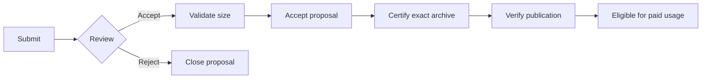
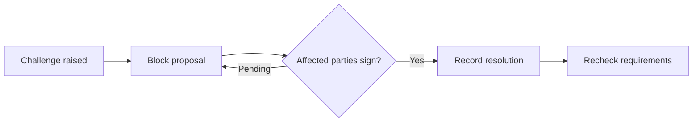
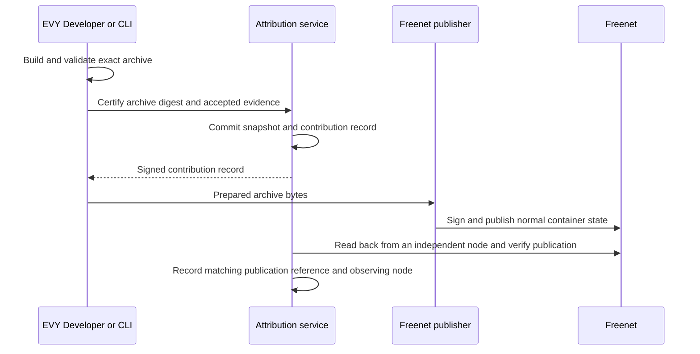

# Attribution

Attribution records who built each application capability, who reviewed the work, and the contribution weight accepted for it. The attribution service owns a transactional database with uniqueness constraints, evidence, signatures, and audit history. It publishes separate signed contribution records for [payments](../payment/README.md) and [remuneration](../remuneration/README.md). Each record identifies exact application contents and their accepted contributions.

Application publishing supports optional attribution. The contributor-funded Marketplace requires this integration. [EVY Developer](../evy/README.md) presents the workflow, while the service owns its decisions.

## 1. Products and identities

A product has an economic `ProductId` mapped to authorized application container identities. The service verifies publisher authority when approving each mapping and retains its signed history. Publisher transfers follow [publisher continuity](../migration/README.md#4-publisher-continuity), and this service approves the successor mapping separately. Marketplace and River have separate products. The generic Freenet mobile app can host both.

| Identifier | Meaning |
| --- | --- |
| ProductId | Economic product identity mapped to authorized containers |
| PublicationRef | Container identity, version and archive digest defined by the bundle plan |
| ContributionRecordId | Immutable signed certification of exact archive or native-build contents |
| CapabilityId | Credited behavior, such as `river.message.send` |
| ProposalId | Submitted work and its revision history |
| AcceptanceId | Accepted evidence revision, size, shares and policy |
| SnapshotId | Immutable resolved contribution weights for a certified artifact |
| ActorId | Contributor signing-key lineage |

Security permissions and credited capabilities have separate identifiers and schemas. Custom web builds, declarative actions, SDUI documents, delegate and contract upgrades, and dedicated native executables each have their own artifact identity. Each contribution record binds its artifact identity, active capabilities, accepted evidence and resolved snapshot. Reviewed web, SDUI and native artifacts may share a snapshot. The artifact identity identifies the certified contents. Domain evidence proves a qualifying use.

## 2. Roles

| Role | Does | Eligible when | Earns |
| --- | --- | --- | --- |
| Contributor | Submits proposals and evidence, and agrees on challenge resolutions | Holds a signing key and proves repository or authoring-checkpoint authority (below) | Their share of the proposal's accepted size |
| Reviewer | Checks delivery against the acceptance criteria and signs acceptance or rejection | Two accepted proposals of their own in this product | A share of the product-wide reviewer pool, 10% of each accepted size |
| Validator | Signs a size estimate and settles size disagreements | Two accepted proposals and two accepted reviews in this product | A share of the product-wide validator pool, 5% of each accepted size |
| Operator | Runs the attribution service and records each product's signed initial role list | Named in the signed product configuration | Nothing |

The attribution service enforces separate contributor and reviewer/validator roles for each proposal. Its audit history records:

- key rotation, role grants, suspension, and signed reinstatement after a false-evidence finding
- every proposal's estimates, assignments, signatures, claims, and resolutions

### Registration

Contributors authenticate signed requests with their key. Repository proposals prove ownership of their linked pull request through this workflow:

| Step | What happens | Carol |
| --- | --- | --- |
| Create a key | The contributor generates a signing key in the builder or host. Every proposal, review, estimate, and resolution is signed with it | The key in Carol's builder |
| Submit a proposal | The contributor signs the proposal and links the pull request. The service returns a one-time PIN derived from the proposal and the key, valid for 24 hours | Carol submits her Invite member screen proposal and receives `AT-7Q4K` |
| Prove PR ownership | The contributor puts the PIN in the pull request description. The repository integration reads it on the next webhook, records "PR ownership verified" for the key in the audit history, and ignores later edits to the description | Carol adds `AT-7Q4K` to her PR description |
| Add a payout identity | Before the first payout, the contributor completes the legal identity and payout details that [remuneration](../remuneration/README.md#6-double-spend-prevention-and-payouts) holds. Accepted units remain contribution weights. Funded balances accumulate separately while payout registration is pending | Carol adds hers after her first accepted proposal |

A visual-authoring proposal binds an exact signed authoring-project checkpoint, its project identity and membership epoch. The service verifies the author's authorized membership and operation signatures against that checkpoint. Changed checkpoint content creates a new evidence revision. This path proves authorship through signed project edits.

For repository proposals, one contributor proves PR ownership. Co-contributors are named in the split and sign the proposal with their own keys. A proposal that links a commit with no pull request carries the PIN in the commit message instead.

Each product publishes a signed bootstrap list of reviewers and validators, allowing its first proposals to proceed. Later eligibility is product-scoped. Every assignment preserves contributor/reviewer separation.

Track each contributor through their signed key history. Accepted work determines reviewer and validator eligibility across that history. Suspension and reinstatement apply to the same identity. A new key with no verified history starts as a contributor.

Key rotation is a statement signed by the old key naming the new one. Recovery of the key itself follows the [identity plan](../identity/README.md). This service accepts a recovery case when the recovered lineage presents the repository identity recorded at registration. The service freezes payout-identity changes while recovery is unresolved and preserves signed identity lineage.

## 3. Enforced workflow

### Proposal to certification

The app builder and linked pull requests use the same workflow and display the same attribution status. A certified and published capability can qualify for paid usage, which [section 6](#6-interface-to-remuneration) defines.

| Stage | Rule |
| --- | --- |
| Submit | Problem, outcome, capabilities, proposed size, contributor split, and exact repository or signed authoring-checkpoint evidence. Prove the corresponding authority through [registration](#registration). Changed content needs a new evidence revision and review |
| Size and shares | Size is one of `1, 2, 3, 5, 8, 13, 21`. Capability shares total 10,000 basis points, and contributor shares within each capability also total 10,000 |
| Review | An eligible reviewer signs against the evidence revision. Rejection closes the proposal, and further work starts a linked successor |
| Validate size | An eligible validator signs an estimate. Agreement accepts the proposed size. On disagreement, a second validator selects one of the two estimates |
| Accept | Requires complete evidence, review, size, allocation, and resolved challenges. Acceptance binds to the evidence revision and policy version |
| Certify | Requires resolved challenges and accepted source-to-artifact evidence. Commit a snapshot and signed contribution record for the prepared archive in one transaction ([bundle integration](#4-bundle-integration)) |
| Observe publication | Verify the published container and match its archive digest to the contribution record before enabling paid use |

An attributed change reaches Accept before it merges. Acceptance requires addressed review feedback, a signed size estimate and a signed resolution for every challenge. The repository integration permits merging once these checks pass. The product publication workflow obtains certification for the prepared archive before signing and publishing it. Paid eligibility also requires verified publication. The acceptance gate applies to changes claiming attribution.

### Challenges

Contributors may claim omitted authorship or challenge proportions, size, evidence, or delivery at any point before certification.

A challenge blocks acceptance and certification until the challenger and all affected contributors named when the challenge opened sign a resolution.

A size resolution selects between the disputed estimates. The builder shows overdue challenges and the contributors responsible for resolving them. A challenger claiming omitted authorship is a party to that resolution. An unresolved proposal stays blocked. Withdrawing a proposal closes it and preserves its evidence.

After certification, accepted units remain in the audit history. Remuneration records payment reversals.

## 4. Bundle integration

[Application bundles](../appkit/bundles.md) defines container publication and exact content references. Attribution owns these records:

| Record | Binding |
| --- | --- |
| Acceptance | Exact source or authoring-checkpoint revision, contribution shares and policy |
| Contribution record | Product, authorized container, exact archive digest and hash profile, included acceptances, active capabilities and snapshot |
| Snapshot | Immutable resolved actor and role weights, capability scope and policy version |
| Publication observation | Verified publication reference, matching contribution record, the observing node and retained publisher evidence |
| Native artifact record | Product, platform/build identity, exact build digest, accepted evidence, capabilities and snapshot |

The contribution record lives separately from the archive it certifies. The service signs all binding fields using a specified, versioned encoding. Repeating an identical certification request returns the existing record. Changed archive bytes require a matching new certification and review of changed evidence. The preparation hook in the bundle plan must preserve bytes through signing and submission.

A failed publish leaves a retryable certification record. After an uncertain publication, read and verify the container. Record its exact publication reference against the contribution record, together with the node that served the read. Core serves GET from locally cached state, so a readback from the publisher's own node proves acceptance there and a read from an independent node proves retrievability at that moment. Paid eligibility requires the independent-node observation. The same certified archive can appear at several container versions, each with its own verified observation. Paid use requires the observation and the product's commercial eligibility decision.

Native builds receive their own artifact certification and publisher/distribution evidence under the product's declared verification policy. They can share contribution weights with a reviewed SDUI bundle. The service validates that mapping. A client-supplied build digest remains a claim until it passes the policy's evidence checks.

Each snapshot records the capabilities present in its certified contents. Contribution history survives capability removal and restored application code. Payments keep their original contribution record and snapshot through updates and publisher transfers. The product's signed settlement configuration selects the eligible record for new paid operations and prevents clients from choosing arbitrary historical weights.

Retain records, snapshots, source mappings, exact artifacts and signed publication evidence through the configured support and transaction-evidence periods. Restore fixtures must verify a historical payment after the live container has advanced and the publisher's primary archive is unavailable.

## 5. Attribution units

Store exact scaled or rational weights, and leave currency rounding to remuneration.

A proposal reserves 85% for contributors, 10% for reviewer weights, and 5% for validator weights. The accepted reviewer earns that review weight. The validator weight is split equally between the validators whose signed estimates determined the accepted size. Product-wide pool weights sum those earned amounts by actor lineage and role. Snapshots resolve pool recipients so remuneration receives explicit weights.

Carol and another contributor, Dave, improve a database path used by ten capabilities, five in Marketplace and five in River. The accepted size is 8 and all ten receive equal shares. Carol supplied five eighths of the work and Dave three eighths.

| Recipient | Units |
| --- | ---: |
| Carol | 4.25 |
| Dave | 2.55 |
| Reviewer pool | 0.8 |
| Validator pool | 0.4 |
| Total | 8 |

Each capability receives one tenth of these weights. The proposal conserves its size across both products. Contributor units measure accepted work. They become funded credits when [remuneration](../remuneration/README.md) validates an eligible paid operation. Funding comes from products with paid operations, such as Marketplace.

## 6. Interface to remuneration

For a verified publication or native artifact and capability, the service returns:

- The matching signed contribution record and its verified publication or distribution evidence.
- Whether the capability exists in those certified contents.
- The immutable snapshot and resolved recipient weights.
- The contribution policy version and the product's current eligibility for new commercial operations.

Historical lookups retain the original evidence and weights. Commercial suspension governs new paid operations. Existing payments follow their recorded terms and settlement policy.

Checkout fixes these bindings as the [payment plan](../payment/README.md#2-checkout-flow) specifies, and delayed processing or application updates retain them. Remuneration stores them with payment IDs and credits, enforces funding caps, and owns reversals and payouts.

## 7. Interfaces and authority

The service exposes signed proposal, review, estimate, challenge, resolution, certification, publication-observation and snapshot operations. EVY Developer and repository integrations use the same API and authoritative status. Generic Freenet publication uses publisher authority. Participating products add this certification workflow before publication.

Artifact validation maps reviewed source revisions or signed builder checkpoints to shipped artifacts. Artifact provenance identifies unattributed work separately from accepted contributions.

## 8. Delivery and tests

| Phase | Delivers | Done when |
| --- | --- | --- |
| Registration | Product roles, actor lineage and evidence ownership | Bootstrap works per product, and self-review and unauthorized recovery fail |
| Workflow | Review, sizing, challenges and acceptance | Changed evidence is reviewed, and unresolved challenges block certification |
| Units | Cross-product shares and resolved role pools | Shares conserve accepted size and reproduce the example above |
| Certification | Exact artifact binding and immutable snapshots | Changed bytes fail, retries return one record, and failed publication can resume |
| Usage lookup | Publication-bound eligibility | Reviewed native and SDUI artifacts sharing a snapshot return the same weights, and absent capabilities fail |
| Recovery | Audit exports, backups and publication reconciliation | Restored history preserves signatures, snapshots and publication bindings |

Retain capability IDs, accepted units and audit history through any future migration into Freenet, coordinated with the [remuneration migration gates](../remuneration/README.md#9-migration-into-freenet). Contract merge is total, so a single contract cannot give one decision point to the uniqueness constraints, the one-time PIN check or the blocking challenge. Those operations stay in the service, or move only with an auxiliary consensus mechanism. The migration moves records, signatures and snapshots.
