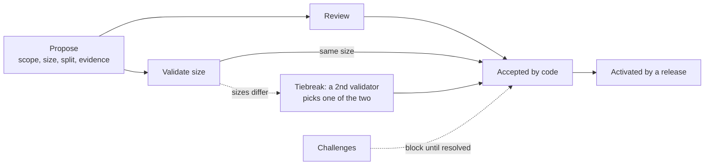

# Product attribution app

## 1. Purpose

Record who built each capability, who reviewed and validated that work, and how much work it took. Attribution is not done through a central authority but it is derived with code from signed records anyone can re-check. Attribution attaches to the product behaviour users receive (never to files, functions, commits) so a code refactor changes nothing.

Payment of product fees against these attributions is planned in the [remuneration plan](../remuneration/README.md).



**Shipping is native; remuneration is optionally layered on top**

Freenet itself imposes no gate: publishing is permissionless, an artifact's address is the fingerprint of its content, and nothing can block a release. The attribution ledger keeps that boundary:

- **Shipping needs no records.** A release adds exactly one record, the signed release record (section 6), which gives the ledger its ordering and its settlement anchor.
- **Display credit needs no records.** An app credits whoever it likes in its own content.
- **Only money needs records.** A contribution that should count toward remuneration passes the machine-checked workflow of section 4; a record that fails any check never merges.
- **Why the workflow exists.** A signature proves who made a statement, not that it is true (the boundary [freenet-core#2776](https://github.com/freenet/freenet-core/issues/2776) draws for author keys). The workflow closes that gap for exactly the records money will hang on. Skipping it costs only eligibility: ship anyway and resubmit later.

## 2. Glossary

| Term | Meaning |
| --- | --- |
| Actor | A participant: contributor, reviewer, or validator (section 3). `ActorId` = Ghost Key-backed signing key (with signed rotation lineage) |
| Product | A user-facing application with its own product key, capabilities, and releases. `ProductId` = product root key (optionally `hash(namespace, root key)`) |
| Product key | A product's signing key: a publisher, never a judge (section 3) |
| Capability | A stable product responsibility such as `marketplace.listing.publish`; not a UI widget or code module. `CapabilityId` = `ProductId` + stable capability name |
| Catalogue | Versioned tree of capability IDs |
| Proposal | A request to add or change product behaviour, filed before the work is accepted. `ProposalId` = `hash(canonical proposal record)` |
| Allocation | The accepted proportions among capabilities and contributors |
| Acceptance | The attribution decision a completed workflow chain determines (section 4). `AcceptanceId` = `hash(canonical accepted allocation and attestations)` |
| Attribution units | Non-currency weights derived from accepted size and allocations |
| Release | A signed record of shipping one product version (section 6). `ReleaseId` = `hash(canonical signed product release)` |
| Generation | A product's release counter; it only counts upward, and it is the only ordering this plan uses |
| Activation | The release that first includes an accepted proposal's units in the snapshot |
| Snapshot | A product's cumulative attribution state as of a release. `SnapshotId` = `hash(canonical ordered cumulative attribution state)` |
| Ledger | The single Freenet contract every product's records merge into (section 9). `LedgerAddress` = resolved via the pointer record under the ledger key |
| Ledger key | The ledger's root key: publishes policy and the contract pointer, nothing else |

## 3. Roles and identity

- **Contributor** creates or joins a proposal and supplies evidence: code, designs, research, testing, documentation, or release operations.
- **Reviewer** checks that the delivered change meets its acceptance criteria and that the evidence is real.
- **Validator** assesses size and proportions: attribution scope, not code quality.

An `ActorId` is a signing key backed by a [Ghost Key](https://freenet.org/ghostkey/) certificate, Freenet's donation-backed identity primitive (mitigating Sybil attacks); the ledger verifies the certificate when an actor first appears in an enforced record. Eligibility to review or validate (section 13) is earned in the one ledger and counts for every product. Two keys are not actors: a product key signs its product's releases, and the ledger key publishes policy and the contract pointer — publishers, never judges.

## 4. Enforced workflow

Every step produces a signed record, the ledger's code enforces every rule below (section 9), and every number is policy, not code (section 13).

**Propose.** A contributor files the proposal before the product accepts the work: the problem, the intended outcome, testable acceptance criteria, a contribution class (documentation, feature, improvement, bug, or security), the affected capabilities and the contributor split in basis points (hundredths of a percent; 10,000 = 100%), a size from `1, 2, 3, 5, 8, 13, 21`, evidence references, and disclosure of related or possibly superseded proposals. Size is a relative weight of contribution to the product, not hours or code volume.

**Join or contest authorship.** Before acceptance, another contributor may claim inclusion with a proposed proportion and evidence, or challenge an omitted contribution or inaccurate allocation. A proposal cannot be accepted while an authorship challenge is open (section 8).

**Review.** The proposer assigns an eligible reviewer who is not a contributor on the proposal, the same way validators are assigned below. The reviewer verifies the code and the acceptance criteria against the linked evidence and signs one verdict: `accepted | rejected`. There is deliberately no changes-requested verdict: a rejection ends the proposal, and the contributor resubmits a fresh one with fresh assignments, so a reviewer's power over a contribution is one verdict — nobody can demand changes round after round.

**Validate size.** One validator checks the proposer's sizing, and a second settles any disagreement:

1. **Assign.** The proposer signs an assignment naming one eligible validator uninvolved in the proposal. Someone has to name the validator because the network cannot: records merge in any order, so "first volunteer" has no meaning, and a "random" pick would be computed from bytes somebody authored — that somebody's choice in disguise. An open choice can be held against its maker: a crony assignment sits in the ledger under the proposer's own signature, challengeable like any other record. Conflicting assignments permanently void the proposal; a replacement is legitimate only once the assignee has signed nothing for `K_assign` generations. Reviewer assignments follow the same rules.
2. **Estimate.** The assigned validator signs their own size for the work, from the same scale.
3. **Compare.** If the validator names the same size, it is accepted. Any other number flags the proposal, and the proposer assigns a second validator the same way to pick whichever of the two sizes is the better fit — never a third.

The proposed size is public, so the validator estimates with the proposer's number in view; the counterweights are that both signatures are permanent public records, a flag costs only a second opinion, and size stays challengeable until activation (section 8).

**Accept and activate.** The completed chain fully determines the acceptance: any client may compute the acceptance record, and the ledger merges it only if it equals that derivation — no discretionary signature anywhere. Units enter the snapshot when a release references the acceptance, and the release names its activation set explicitly for the same reason an assignment names the validator: which records count is always stated, never inferred. The publisher's only discretion is delay: a later release can pick up an omitted acceptance, and nothing can cancel one. Most releases activate nothing, which changes nobody's weights.

## 5. Attribution units

Units are immutable and only accumulate; fraud that survives the workflow keeps its units forever, so the whole defence is concentrated before finality (sections 4 and 8). Two factors, both outside the ledger, change what a contributor earns:

- **Dilution.** New accepted work mints new units beside the old, shrinking every share of that capability.
- **Usage.** The [remuneration plan](../remuneration/README.md) routes each transaction's fee to the capabilities that transaction draws on. A capability nobody uses pays nobody, however many units it holds.

```text
proposal_units    = accepted_size
capability_units  = proposal_units * capability_basis_points / 10_000
contributor_units = capability_units * contributor_basis_points / 10_000
```

Capability proportions must total 10,000 basis points, as must contributor proportions within each capability; the ledger enforces both with integer arithmetic and a published rounding rule so every node computes identical results. Example: an 8-point proposal allocates 75% to listing publication and 25% to seller profiles; two contributors split the listing work 60/40, yielding 3.6 and 2.4 listing units. Units compare accepted contributions within one product; they are not ownership or a promise of payment.

Each acceptance also mints reviewer and validator units at the policy rates (section 13), kept product-wide rather than per capability because those roles protect the whole product. How fees split between contributor, reviewer, and validator pools is the remuneration plan's business; attribution records the weights.

## 6. Records

Every record type the ledger accepts is defined by the step that produces it, and no other type merges. Enforced records also name the policy and ruleset versions they were validated under (section 9). Three carry enough structure to spell out:

**Proposal.**

```yaml
schema: freenet-attribution/proposal/v1
proposal_id: <derived>
product_id: <product root key>
title: <display metadata, excluded from enforcement>
class: capability_improvement
outcome: <user or product outcome>
acceptance_criteria:
  - <testable criterion>
proposed_size: 8
capabilities:
  - id: marketplace.listing.publish
    basis_points: 7500
  - id: marketplace.seller.profile
    basis_points: 2500
contributors:
  - actor_id: <contributor A identity>
    basis_points_by_capability:
      marketplace.listing.publish: 6000
      marketplace.seller.profile: 10000
  - actor_id: <contributor B identity>
    basis_points_by_capability:
      marketplace.listing.publish: 4000
evidence:
  - kind: pull_request
    reference: <repository and PR>
    content_hash: <sha256 of the evidence content>
policy_version: <the policy this proposal binds to>
signature: <proposer signature>
```

`content_hash` is mandatory on every evidence entry: forge links rot, and a challenge years later must be able to re-verify what was claimed. Products may additionally mirror evidence into [freenet-git](https://github.com/freenet/freenet-git).

**Acceptance.** The authoritative attribution decision: accepted size, final allocations, and references to every record it derives from (verdict, assignments, estimate, any tiebreak, resolved challenges), plus policy and ruleset versions. It carries no approval signature (section 4). Source-control metadata is supporting evidence only.

**Release and snapshot.** Every release signs its product, generation, previous release, artifact addresses (already content hashes), activated acceptances, snapshot, and policy version. The snapshot carries the product's cumulative unit totals as of that release. A rollback release restores earlier artifacts, but its snapshot stays cumulative: units activated by the rolled-back release remain, because attribution records that work was accepted, not that code is currently deployed.

## 7. Products, components, and forks

All products share the one ledger; a product is its key, its capabilities in the catalogue, and its releases. Internal repositories, packages, and components have no separate economic identity: work points at the capabilities of the product it changes, product-wide work at `product.reliability`. A library is not automatically a product — it earns attribution when a product using it allocates proposal units to its maintainers, or by becoming a product itself, after which consumers record a dependency reference.

A contribution that affects several products, a shared library being the common case, is one proposal per affected product: size is relative to each product, each proposal runs the workflow on its own, and one product's rejection never touches another's acceptance. Units are never summed or compared across products.

A fork starts a new product in the same ledger: a new key, a recorded origin, and an opening snapshot stating which inherited capabilities and units it recognises; the original product's records are untouched. An app that displays several products presents each product's credits separately and never mixes their units.

## 8. Challenges

Until the release that activates a proposal, any eligible contributor may challenge omitted authorship, wrong proportions, inflated or understated size, false evidence, or incomplete delivery, naming the disputed record and supplying evidence. After activation the units are final (section 5).

Resolution is as automatic as acceptance: a panel of three uninvolved eligible actors rules by majority of signed verdicts — a size question is a choice between the disputed sizes, never a fresh number — and the acceptance derivation consumes the outcome, correcting the allocation or voiding the proposal for false evidence. An actor with two upheld false-evidence findings loses eligibility for `K_suspend` generations.

There is no clock; windows are counted in releases, so a rarely-releasing product leans on explicit resolutions. A challenge opens at a generation that must already exist, blocks acceptance while open, and closes with a resolution — or lapses `K_challenge` generations later, the anti-griefing backstop: visible forever, no longer blocking. Emergencies need no exception: the fix ships immediately (section 1), and the pending acceptance activates in a later release once its challenges close.

## 9. The ledger

The whole app is one ordinary Freenet contract holding every product's records — nothing in Freenet itself changes; its launch parameters are the ledger key, the v1 policy, and the initial eligible set. The contract's code is the only judge: it accepts a record or it doesn't, and any peer can re-check the entire state from the records alone. Order of arrival never matters — duplicates change nothing and invalid records never enter. Beyond the workflow rules of section 4, the code checks every signature (actors on workflow records, with new actors carrying a valid Ghost Key certificate; product keys on releases; the ledger key on policy and the pointer), that releases occupy strictly increasing generation slots per product, that nothing is edited in place or reduces recorded units, and that each release's snapshot equals the totals recomputed from scratch.

Rules only grow. A record is judged forever by the ruleset it names, so no rule change can invalidate history. Numbers (eligibility counts, K values, rates) live in policy, which the ledger key publishes along with the future generation it takes effect from; changing the contract's code is reserved for genuinely new mechanisms. When the code does change, the new contract has a new address, the pointer record under the ledger key names the current one, and release tooling refuses an upgrade that cannot carry every record forward ([freenet-migrate](https://github.com/freenet/freenet-migrate)).

Growth stays bounded because plain shipping adds one release record (section 1), each release checkpoints its product's totals, and workflow records fully absorbed by a checkpointed acceptance move to archive storage, still verifiable by their hashes. Freenet lets unused data expire ([#4642](https://github.com/freenet/freenet-core/issues/4642)), so release tooling re-publishes archives periodically.

If a product key signs two different releases for the same generation, both stay visible and the slot is marked `CONFLICTED`: it never counts as "latest" for settlement, and it resolves when a later generation extends exactly one branch. A conflict means that key signed two competing histories or leaked. Conflicting validator assignments void their proposal instead (section 4).

## 10. Interface to remuneration

Payments are the [remuneration plan](../remuneration/README.md)'s job, but the binding rule between the two plans is fixed here. **Latest at settlement:** a fee distribution uses the snapshot of the product's highest non-conflicted release generation at settlement time; everything in a snapshot is already final (section 8). Two consequences are accepted and mitigated rather than hidden:

- the network syncs gradually, so two observers can briefly disagree about "latest"; every settlement is therefore itself a signed record naming the snapshot it used, making the choice auditable rather than implicit;
- attribution can drift between a transaction and its settlement, so each transaction carries the payer client's release generation as evidence. It is client-asserted and unproven ([#5264](https://github.com/freenet/freenet-core/issues/5264)), so it audits drift disputes but never selects the snapshot.

A transaction is always for exactly one product; remuneration prices the fee before consulting the ledger, and implementation call depth never decides value. Which capabilities a fee routes to is the fee policy's published mapping (the usage gate of section 5).

## 11. Client integration

Any client can host the workflow (a product's visual builder, a CLI, repository automation), and any client must be able to create and verify the same records; none is a trusted authority. A workflow client provides catalogue management, proposal and claim flows, evidence linking, the validation and tiebreak flow, previews matching the ledger's arithmetic exactly, challenge tracking, and attribution history. Repository automation may collect PR evidence and block a release missing required records; a proposal ID in a PR title is a convenience, never the source of authority.

## 12. Security and privacy

- No legal identity, bank, tax, or payout data ever enters the public ledger; a Ghost Key certificate proves a donation (section 3), not who somebody is.
- Compromising a product key affects that product's future releases, and compromising the ledger key affects future policy and the pointer; neither touches recorded units. Other key-compromise scenarios are out of scope.
- No node count, IP address, first-arrival time, GitHub role, or repository ownership grants attribution authority by itself.

## 13. Policy defaults (v1)

Every number here is policy data: versioned, changeable without touching the ledger's code (section 9). Suggested launch defaults:

| Parameter | Default |
| --- | --- |
| Reviewer role eligibility | 2 accepted proposals |
| Validator role eligibility | 2 accepted proposals + 2 accepted reviews |
| `K_suspend` (after 2 upheld false-evidence findings) | 20 generations |
| `K_assign` (a silent assigned reviewer or validator becomes replaceable) | 2 generations |
| `K_challenge` (unresolved challenge lapses) | 3 generations |
| Reviewer units per acceptance | 10% of accepted size, split among reviewers |
| Validator units per acceptance | 10% of accepted size, split among the validators who signed |

## 14. Implementation plan

| Phase | Delivers | Done when |
| --- | --- | --- |
| 1. Records and arithmetic | Record encodings with deterministic bytes (IDs are content-derived); the unit arithmetic and rounding rule; signature, Ghost Key, and key-history verification as a reusable library | Rust, TypeScript, Swift, and Kotlin produce identical bytes and IDs from shared golden fixtures |
| 2. Ledger contract | The full rule set of section 9 from day one: merging, checks, versioning, checkpoints, archives, conflicts | Property tests pass: repeats and reordering never change the outcome, and every checkpoint equals the recomputed totals |
| 3. First product | The catalogue, v1 policy, and initial eligible set as launch parameters; workflow flows in the product's authoring client (section 11); releases activating accepted proposals | The full chain runs end to end on a real product, with no import of history: display credit stays in app content, and historical work seeking eligibility resubmits through the workflow |
| 4. Second product and hardening | A second product in the same ledger; one real contract upgrade end to end; challenge paths (resolution, lapse, conflicting assignments); audits of identity privacy, validator independence, arithmetic, and signature handling | A shared-library contribution is accepted independently by both products (section 7); history survives the upgrade; ruleset v1 freezes when both products pass one conformance suite |

Done when, across all phases:

- a proposal never names a code path;
- a release with no enforced records adds only its release record;
- an incomplete acceptance chain never merges on any conforming node;
- acceptance follows mechanically from the workflow records, with no discretionary signature anywhere;
- no record of any kind reduces or removes activated units;
- an accepted size is always the proposed size or the assigned validator's estimate, never a third number;
- no rule reads a clock;
- an upgrade carries every record forward;
- duplicate records converge, and conflicting releases stay visible as `CONFLICTED`.

## References

- [Freenet whitepaper](https://github.com/freenet/paper-1) (trust section: identity and reputation as application-layer contracts)
- [Remuneration plan](../remuneration/README.md) (the consumer of these records)
- [Stable identity: successor-pointer convention, freenet-core#5194](https://github.com/freenet/freenet-core/issues/5194)
- [Tracking: graceful upgrades, freenet-core#2776](https://github.com/freenet/freenet-core/issues/2776)
- [freenet-migrate](https://github.com/freenet/freenet-migrate) (carry-forward, pointer contract, build guard)
- [Upgrading contracts and delegates, freenet.org manual](https://freenet.org/build/manual/upgrading-contracts/)
- [Is commutativity a crippling limitation? freenet-core#643](https://github.com/freenet/freenet-core/discussions/643)
- [Stranded contract generations, freenet-core#5158](https://github.com/freenet/freenet-core/issues/5158)
- [Over-disk-budget divergence, freenet-core#4868](https://github.com/freenet/freenet-core/issues/4868)
- [Bounded summarize, freenet-core#5238](https://github.com/freenet/freenet-core/issues/5238)
- [Client API authentication and app identity, freenet-core#5264](https://github.com/freenet/freenet-core/issues/5264)
- [Ghost Keys](https://freenet.org/ghostkey/)
- [freenet-git](https://github.com/freenet/freenet-git)
