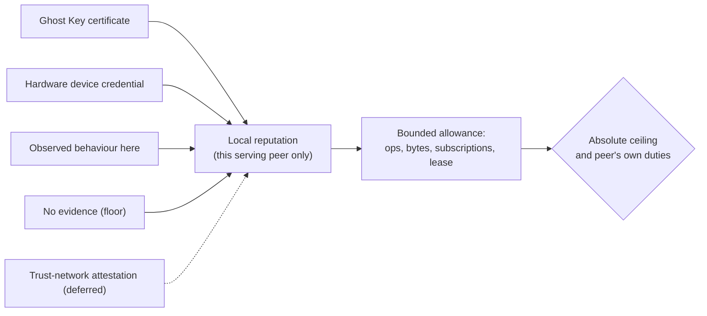
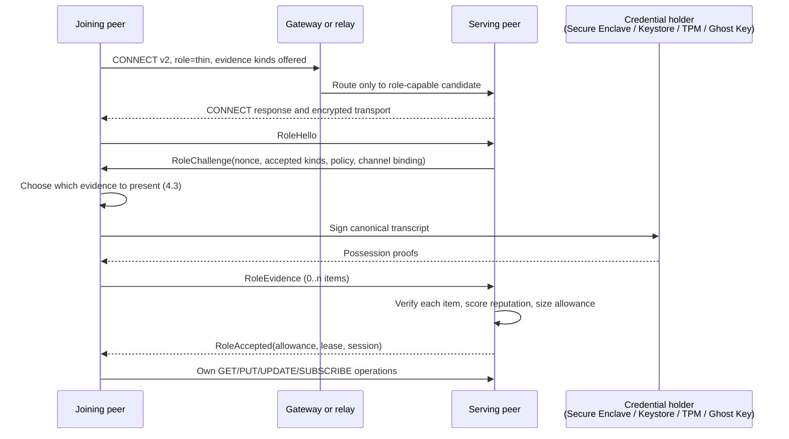

# Duty negotiation

A Freenet peer today must forward other peers' traffic, store data, re-broadcaste updates, or stay offline. That deal is right for desktop machines on home internet, but untenable for lightweight mobile devices or cellular data plans.

Duty negotiation adds a second deal. At connect time a peer may request a role with fewer duties, and the peer serving it answers with a bounded **allowance** (operations, bytes, subscriptions) under a renewable **lease**. The allowance is sized by a locally computed **reputation**: each serving peer decides for itself how much capacity to spend on a duty-free peer, based on whatever evidence the joiner chooses to present, including none.

Two evidence sources ship in v1: [Ghost Keys](https://freenet.org/ghostkey/) (5.1), Freenet's donation-backed certificate, and [hardware-backed identity](../hardware-identity/README.md) (5.2), free to most phone owners, exactly the people unlikely to have bought a Ghost Key. Neither is mandatory: a peer with neither still connects at a small floor allowance, and the serving peer's budget (section 7) remains the hard safety boundary.

The [Freenet Mobile plan](../freenet-mobile/README.md) ships an unmetered version of the duty-free role (a fixed local cap, first come first served) and does not depend on this plan; if that lands first, this plan upgrades it in place rather than adding a second mechanism (section 11). The [hardware-identity plan](../hardware-identity/README.md) is an optional input: Ghost Keys and the floor tier work without it.

## 1. Decisions

- **Plural evidence, one envelope.** One neutral envelope carries zero or more evidence items; new sources (a trust attestation, a ZK proof) plug in without touching the admission machinery.
- **The user chooses what to present, per serving peer** (4.3), including nothing at all.
- Admission runs inside the encrypted transport, before any operation under the requested role; a duty-free connection never enters the ring.
- **Enforcement and reputation are local.** Every serving peer verifies evidence itself and sets its own policy; reputation never leaves the peer, consistent with `docs/design/contract-hardening.md`'s "local-only decisions" position.
- **Issuance is not local, for either source.** Hardware roots belong to Apple, Google/OEMs, and TPM vendors; Ghost Keys to Freenet's donation server. Plurality of issuers is the mitigation (section 8).
- The whole admission path uses `TimeSource` and `GlobalRng`, so it runs under deterministic simulation.

## 2. Roles

v1 defines exactly two roles. The wire format carries the requested role and its capabilities as data, so intermediate roles (store but not forward, forward at a stated rate) can be added later without new machinery; none is designed here.

| Duty | Full peer | Thin peer (v1) |
| --- | --- | --- |
| Forward other peers' traffic | yes | never |
| Store and serve passing data | yes | never |
| Re-broadcast subscribed updates | yes | never; delivery is terminal |
| What it gets in return | unlimited use | a metered allowance under a lease |

The thin role's network mechanics (a leased terminal edge generalizing Core's transient connections) are mapped file by file in the [mobile plan §1.4](../freenet-mobile/README.md#14-extending-freenet-core-generalize-the-transient-path); this plan adds the admission handshake, the reputation computation, and the serving budget around that edge.

## 3. Prior work in Freenet

Freenet has circled Sybil resistance for years. This plan does not pick a winner; it defines the local mechanism that lets several approaches contribute at once.

| Earlier work | Relationship to this plan |
| --- | --- |
| **Ghost Keys** ([#602](https://github.com/freenet/freenet-core/issues/602), repo [freenet/ghostkeys](https://github.com/freenet/ghostkeys)) | **Adopted as a v1 evidence source** (5.1). Payment must never be *required*, so it is one source among several. |
| Trust networks ([#11](https://github.com/freenet/freenet-core/issues/11), [#458](https://github.com/freenet/freenet-core/issues/458), [#443](https://github.com/freenet/freenet-core/discussions/443), [#799](https://github.com/freenet/freenet-core/discussions/799)) | The intended third evidence source, once a peer can verify a sponsorship locally. |
| Anomaly detection ([#686](https://github.com/freenet/freenet-core/issues/686)) | Complementary: behaviour adjusts the allowance after admission (4.1). |
| `docs/design/contract-hardening.md` | House position: local-only decisions, no gossiped reputation, wary of hardcoded budgets. Sections 7.2 and 7.4 answer it. |
| Hosted-mode budgets ([#4561](https://github.com/freenet/freenet-core/issues/4561), [#4737](https://github.com/freenet/freenet-core/issues/4737), PRs [#4573](https://github.com/freenet/freenet-core/pull/4573)/[#4575](https://github.com/freenet/freenet-core/pull/4575)/[#4577](https://github.com/freenet/freenet-core/pull/4577)) | **The model to reuse.** Per-user quotas, rate limits, and TTLs for duty-free users already ship; `ThinServingManager` mirrors them. |
| Rate-limiter starvation ([#4981](https://github.com/freenet/freenet-core/issues/4981), [#5000](https://github.com/freenet/freenet-core/issues/5000), [PR #5027](https://github.com/freenet/freenet-core/pull/5027)) | A named regression class this plan must not repeat (7.5). |
| Client-API passkeys ([#5264](https://github.com/freenet/freenet-core/issues/5264), [#5219](https://github.com/freenet/freenet-core/issues/5219)) | Same instinct, different layer; a plausible future evidence kind for desktops without security hardware. |
| IP-derived ring locations ([`Location::from_address`](https://github.com/freenet/freenet-core/blob/main/crates/core/src/ring/location.rs), [PR #1359](https://github.com/freenet/freenet-core/pull/1359)) | Full peers only; for duty-free peers, IP prefixes stay a budget input, never an identity. |
| Proof-of-work ([#81](https://github.com/freenet/freenet-core/issues/81), [#137](https://github.com/freenet/freenet-core/discussions/137), [#500](https://github.com/freenet/freenet-core/discussions/500)) | Rejected by maintainers as wasteful and biased ([#456](https://github.com/freenet/freenet-core/discussions/456)); punishes exactly the phones this plan serves. |
| Reciprocity ([#80](https://github.com/freenet/freenet-core/issues/80), [#136](https://github.com/freenet/freenet-core/discussions/136)) | Duty-free peers cannot repay, so a budget substitutes; a peer carrying load elsewhere is a future evidence kind. |
| ZK membership ([#601](https://github.com/freenet/freenet-core/discussions/601), [#882](https://github.com/freenet/freenet-core/discussions/882)) | Privacy upgrades that need an enrolment root; either v1 source can become that root. Proof generation currently takes seconds to minutes on a phone. |
| Unlinkability and at-risk users ([#133](https://github.com/freenet/freenet-core/discussions/133)) | The concrete harm behind section 8's linkability limit; drives per-peer evidence choice. |
| Prior mobile intent ([#811](https://github.com/freenet/freenet-core/discussions/811), [#420](https://github.com/freenet/freenet-core/discussions/420)) | Maintainer endorsement of lightweight embedded nodes, the closest prior blessing of a duty-free role. |

## 4. The reputation model

Reputation is one small number each serving peer computes for itself: *how much of my capacity will I spend on this peer?* It is local, private, capped, and revisable. It is never shared with other peers and never a portable score. Network-wide reputation systems ([#11](https://github.com/freenet/freenet-core/issues/11), [#458](https://github.com/freenet/freenet-core/issues/458)) remain separate; when one lands, it becomes another input here.

### 4.1 Evidence sources

Each accepted evidence item yields a bounded grant. Shipping in v1:

| Evidence | Proves | Notes |
| --- | --- | --- |
| **Ghost Key certificate** (5.1) | Someone donated once and controls this key | Works on any device; survives reinstall if the user keeps the key |
| **Hardware device credential** (5.2) | A private key lives in real hardware on a real device | Free on most current phones; assurance tiers may scale the grant |
| **Observed service history** | This peer has connected here before and behaved | Lets an established peer grow toward its ceiling (7.1) |
| **No evidence (floor)** | Nothing | Small allowance, short lease, first shed under pressure; nobody is locked out |

Deferred, designed for but not built (section 3): trust-network attestations, ZK membership proofs, proof of running a loaded full peer, passkeys.

### 4.2 Composition and caps

- Grants add but are capped: both credentials together earn a small corroboration bonus, never a doubled allowance.
- Machine limits and the serving peer's own duties bind before any grant (section 7).
- Grants shrink on abuse and recover with time; one bad session does not permanently exile a device.
- An operator may zero any source. Ghost-Keys-only and hardware-only are both valid configurations.



### 4.3 The user chooses what to present

The joining peer decides, per serving peer, which evidence to include, including none. This is a privacy feature: a credential shown to several peers lets them correlate the sessions (section 8). Clients should present the minimum that yields a workable allowance, prefer different evidence to different peers, and treat the floor tier as a legitimate choice, not a failure.

## 5. Evidence kinds

### 5.1 Ghost Keys

A [Ghost Key](https://freenet.org/ghostkey/) is a signing key blind-signed by Freenet's donation service; the blinding means the issuer cannot link the certificate to the payment. For admission it proves one thing: *someone paid once for this key, and the holder controls it now.* That is a real Sybil cost, works on any device, and is the project's own primitive rather than a vendor's.

Verification is fully local: verify the blind signature against the pinned Freenet issuance key shipped in Core releases, verify the Ghost Key's signature over the transcript every evidence kind signs (6.2), and derive the peer-local pseudonym (6.3) so the raw key never enters logs or storage.

Limits:

- **Reuse is linkable** across peers (section 8); bundled one-time-use keys ([ghostkeys#2](https://github.com/freenet/ghostkeys/issues/2)) are the upgrade path.
- **Fetch the delegate key at runtime**, never bake it in: a re-key once silently broke every integration ([ghostkeys#21](https://github.com/freenet/ghostkeys/issues/21)).
- The vault UI cannot yet revoke an app's granted access ([ghostkeys#25](https://github.com/freenet/ghostkeys/issues/25)).
- **Custody is the user's problem**; hosted nodes reclaim idle keys after 30 days ([#5105](https://github.com/freenet/freenet-core/issues/5105)), so client apps need a backup story.
- **Issuance requires Freenet's donation service**, a central root and a payment step, which is why it cannot be the only source.

### 5.2 Hardware-backed identity

A hardware credential proves that a private key lives in dedicated security hardware on a genuine device, so multiplying peers means buying devices. The [hardware-identity plan](../hardware-identity/README.md) owns everything about the credential: providers (Apple, Android, TPM), the verification library, lifecycle, and limits. Admission consumes only its normalized result (provider, key, credential id, assurance tier) and grants nothing for anything weaker than real hardware. Such a peer is not rejected; it falls back to other evidence or the floor tier.

### 5.3 The evidence envelope

One versioned envelope carries zero or more items, each naming its kind, versions, provider, key, enrolment evidence, freshness proof, and signed transcript hash.

- Canonical byte encoding everywhere; the transcript hashes bytes, never structs or JSON.
- Size caps and cheap checks run before expensive validation, off the network event loop.
- Unknown kinds or providers are ignored with a zero grant; an old peer degrades to what it understands instead of refusing the connection. Malformed items in a known kind still fail closed.

## 6. Connection protocol

Transport and admission stay two layers: the existing UDP handshake establishes encryption, then a role-admission handshake runs inside it before any operation. Evidence goes only to the candidate serving peer, never through gateways or relays, and never in the amplification-exposed introduction packet.

### 6.1 Admission flow

| Step | Carries | Guard |
| --- | --- | --- |
| CONNECT preflight (new versioned variant) | Requested role, supported evidence kinds | Relays route only to role-capable acceptors; a provisional slot is reserved, never a ring slot. Old peers cannot decode the variant, so the joiner fails closed and tries an upgraded gateway |
| `RoleHello` | Versions, evidence kinds offered, size limits | Cheap unauthenticated caps first: slots, prefix, rate, size |
| `RoleChallenge` | Single-use nonce, both transport keys, policy digest, accepted kinds, expiry | The policy digest tells the client which kinds this peer scores, so it can present the minimum (4.3) |
| `RoleEvidence` | The envelope (5.3) | Each credential signs the transcript below; verification runs off the event loop |
| `RoleAccepted` / `RoleRejected` | Role, session, granted allowance, lease / a typed rejection | Empty or unverifiable evidence still yields `RoleAccepted` at the floor tier; rejection is reserved for capacity and protocol violations |

### 6.2 The signed transcript

Every evidence item signs the same bytes, which defeats replay to another peer, reuse under another transport identity, downgrade, and policy substitution:

```text
"freenet/role-admission/v1"
|| server_nonce
|| serving_transport_public_key
|| joining_transport_public_key
|| negotiated_freenet_version
|| admission_protocol
|| requested_role_and_capabilities
|| serving_policy_digest
|| hash(canonical_evidence_set_descriptor)
```

The descriptor covers the ordered evidence set, so an item cannot be lifted from one envelope into another.



### 6.3 Reconnect and caching

Chain validation is expensive, so a peer may cache the normalized result under a peer-local pseudonym: `HMAC(local_admission_secret, kind || provider || credential_id)`. A reconnect always gets a fresh challenge and fresh possession proofs; the cache skips only static validation. Entries expire by TTL and on any policy or root change; a cache failure falls back to full validation, never to a higher grant. The raw credential id never appears in logs, metrics, or gossip.

### 6.4 Failure behaviour

Every admission state has a deadline; verification is bounded in concurrency, bytes, and CPU; pre-active connections cannot issue operations. A protocol violation (duplicate hello, evidence for an unissued challenge, replay) closes the connection. A verification failure on one evidence item is not a violation: it zeroes that item's grant and admission continues with the rest.

## 7. The serving-peer budget

Reputation sizes an allowance; the budget enforces it. A `ThinServingManager` lives beside ring accounting, never inside it; duty-free connections do not count as ring connections.

| Budget domain | Caps |
| --- | --- |
| Admission | Handshakes, concurrent verifications, active duty-free connections, and a separate floor-tier cap so unattested peers cannot crowd out attested ones |
| Per credential | Request, byte, operation, and subscription allowances, scaled by reputation and hard-capped |
| Per source prefix | Sessions and enrolment rate: a device-farm damper, never an identity, because carrier NAT hides many honest phones behind one prefix ([#5051](https://github.com/freenet/freenet-core/discussions/5051)) |
| Lifetime | Lease, idle, and session age, all shorter at lower reputation; a decaying abuse score |

### 7.1 Scheduling and abuse response

1. Reserve the peer's own client operations and ring duties before any duty-free traffic, at every tier.
2. Fair-queue the remaining allowance by credential, then by reputation. One credential opening many transports gains nothing, and a floor-tier flood cannot starve attested peers.

The response to abuse escalates: rate-limit, reduce reputation, shorten the lease, evict with bounded backoff. Penalties decay over time, so a peer that behaves grows back toward its ceiling while an abuser shrinks toward the floor.

### 7.2 Measure before choosing defaults

The RFC must not invent numbers. Measure a real mobile app and adversarial workloads first, then ship safe defaults with operator overrides. The hosted-mode stack already did this for a comparable population; its defaults (a 4 MiB per-user quota, per-user rate limits, a 30-day inactive TTL) are the starting point, and the [mobile plan's Phase 1](../freenet-mobile/README.md#3-delivery-plan) produces the device-side measurements.

### 7.3 The honest claim

The design can claim:

> One accepted credential receives a bounded share from each serving peer; copying a software process does not copy a hardware-held private key; and obtaining a fresh Ghost Key costs a donation.

It cannot claim:

> Every credential is one person, every device has only one credential forever, attested hardware is honest hardware, or a duty-free peer contributes as much as it consumes.

That distinction belongs in the protocol docs, the UI, and the RFC.

### 7.4 Fixed caps versus self-calibration

`docs/design/contract-hardening.md` warns that hardcoded budgets pin the network to fixed assumptions. Compatible: reputation decides a *share*, and whether that share resolves to a fixed number or a self-calibrating threshold is left open (section 13).

### 7.5 Do not repeat the starvation bug

Bounded key-tracking maps here (caches, prefix tables, penalty scores) are the shape that has twice shipped a starvation defect ([#4981](https://github.com/freenet/freenet-core/issues/4981), [#5000](https://github.com/freenet/freenet-core/issues/5000)): a full map rejects new keys while busy keys refresh their TTL forever, silently locking out newcomers. Adopt [PR #5027](https://github.com/freenet/freenet-core/pull/5027)'s remedy, which distinguishes "rate-limited" from "untracked" and fails open on the latter, and name this regression class in the test matrix.

## 8. Limits

| Limit | Consequence |
| --- | --- |
| Issuer trust | Neither evidence kind is issued locally: hardware roots belong to platform vendors ([hardware-identity plan, limits](../hardware-identity/README.md#6-limits)), Ghost Keys to Freenet's donation service. The honest promise is "no single issuer and no mandatory payment", not "no central trust anywhere". Roots ship pinned and signed in Core releases. |
| Linkability | A credential shown to several peers lets them correlate those sessions, both kinds alike. Accepted for v1, mitigated by per-peer evidence choice (4.3); one-time keys and ZK pseudonyms are future work. |
| Eligibility | **Nobody is excluded.** Old devices, VMs, and attestation-less desktops get the floor tier or use a Ghost Key, and are told exactly what evidence was accepted and how to raise the allowance. |
| Vendor dependency | A platform vendor outage degrades new hardware enrolments on that platform only; existing credentials and Ghost Keys are unaffected, and everyone else falls to the floor tier. |
| Credential churn | A replacement credential (reset, reinstall, loss) is a new credential with no merged history; prefix rate limits absorb the churn. Root rotation and revocation arrive as signed policy updates and fail closed for new admissions while existing sessions run out their leases. |

## 9. Optional use by full peers

A full peer already pays with capacity, so reputation stays optional there: an opted-in peer may count a credential as one modest, locally capped signal beside uptime and observed service. Nothing publishes globally, declining costs nothing, and the plan succeeds on duty-free admission alone.

## 10. Implementation map

Two new Core modules carry the work: `role_admission/` (wire types, policy, verifier pool, per-kind verification, cache, reputation computation) and `thin_serving/` (budgets, scheduler, redacted metrics). Ghost Key verification is implemented in-tree; hardware evidence verification comes from the [hardware-identity plan's library](../hardware-identity/README.md#5-verification-library) and its platform adapters. Existing files change:

| Area | Change |
| --- | --- |
| `message.rs` | Versioned `AdmissionMsg` family with bounded decoding |
| `operations/connect.rs` | Role-aware CONNECT variant, capability routing, provisional slot reservation |
| `node/network_bridge/p2p_protoc*` | Admission state, role-gated dispatch, no ring promotion for duty-free edges |
| `ring/connection_manager.rs`, `ring.rs` | The leased terminal edge over the transient registry ([mobile plan §1.4](../freenet-mobile/README.md#14-extending-freenet-core-generalize-the-transient-path)); capability advertisement; duty-free edges stay out of topology counts |
| `config.rs`, `node/network_status.rs` | Per-kind policy, grants, budgets, overrides; non-identifying status |
| `simulation/`, integration tests | Fake evidence sources; Sybil, downgrade, reconnect, starvation, and budget scenarios |
| Docs | Threat model, ring README note, operator doc for policy and roots |

## 11. Delivery

Per `CONTRIBUTING.md`, no implementation before a maintainer-approved issue. House style for identity-layer ideas is a concept post first ([#443](https://github.com/freenet/freenet-core/discussions/443) → [#799](https://github.com/freenet/freenet-core/discussions/799) → [#882](https://github.com/freenet/freenet-core/discussions/882)), then an RFC. Every phase lands test-first.

| Phase | Delivers | Done when |
| --- | --- | --- |
| 0. Approval and spec | Concept discussion, then an RFC issue; section 13 decisions; canonical encodings and conformance vectors | Maintainers approve |
| 1. Admission core | Protocol types, state machine, reputation computation, verifier pool, cache; **floor tier working end to end with zero evidence** | Replay, timeout, downgrade, and containment tests pass under simulation |
| 2. Role-aware CONNECT | Versioned CONNECT variant, capability routing, terminal duty-free edges | Old peers never see new variants; duty-free edges never enter ring selectors |
| 3. Serving budgets | `ThinServingManager`, credential-scoped accounting, two-level scheduler | One credential gets one allowance across transports; duties survive floods; no starvation (7.5) |
| 4. Ghost Key evidence | Certificate verification, transcript binding, runtime vault-key resolution ([ghostkeys#21](https://github.com/freenet/ghostkeys/issues/21)), revocation | A Ghost Key alone yields a workable allowance on any hardware |
| 5. Hardware evidence | Integrate the [hardware-identity library](../hardware-identity/README.md) as it delivers each provider | Each provider passes its device matrix; a de-Googled Android device is admitted |
| 6. Abuse simulation | Credential-Sybil, reset churn, evidence floods, floor-tier floods, slow verifiers, restart | Every hard cap holds without weakening a test |
| 7. Staged rollout | Ship disabled, opt-in observation, testnet, measured production defaults | Maintainers approve the measured defaults |

**Phases 1–3 deliver a working metered thin peer on their own**: a peer connects with no credential of any kind, operates within the floor allowance, and can be measured, which is the precondition for choosing grant numbers (7.2). Phases 4 and 5 are additive; a stall there costs capacity, not the product. If the [mobile plan's Phase 2](../freenet-mobile/README.md#3-delivery-plan) (the unmetered role) landed first, Phases 1–3 extend the same CONNECT variant and terminal edge with allowances, leases, and evidence, rather than shipping a parallel path. Run Phase 6's flood and starvation scenarios against Phase 3 before any credential exists, then re-run as each evidence kind lands.

## 12. Acceptance criteria

Each phase carries its own exit test; beyond those:

- A device with **no** admission evidence connects, operates within the floor allowance, and is told plainly what it would gain from each evidence kind.
- iOS and Android apps each enrol a hardware credential (via the [hardware-identity plan](../hardware-identity/README.md)) and connect through at least two independent serving peers, presenting different evidence to each.
- No raw credential identifier or reputation value appears in logs, metrics, gossip, or contracts.
- Reset, reinstall, platform outage, donation-service outage, root rotation, and revocation behaviour are documented and tested for both evidence kinds.
- Mixed-version peers fail closed without disconnect storms.

## 13. Open decisions for the RFC

1. Should reputation feed into the negociation, or should hardware backed identities and ghost keys feed into reputation?
2. Being a "thin peer" could also be a negative signal in a peer's reputation?
3. Default share of a peer's resources for duty-free traffic; on by default or opt-in; fixed grants or self-calibrating (7.4).
4. Grant ratios between floor, Ghost Key, and hardware tiers; whether donation tiers scale the grant.
5. Whether presenting both kinds earns a corroboration bonus, and how large.
6. How many serving peers one duty-free peer uses, and the default evidence-rotation policy (4.3).
7. Cache, penalty, and decay lifetimes, and which state survives a restart.
8. Whether v1's cross-peer linkability is acceptable.
9. The first release carrying the new wire variants; its compatibility floor freezes once chosen.
