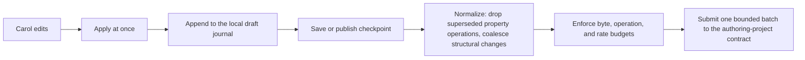

# EVY Developer platform

EVY Developer combines drag-and-drop SDUI authoring with contribution review, attribution, earnings and payout workflows. Its export tools bundle the web app, the web reader, an application definition, declarative actions, domain artifacts and SDUI for ordinary Freenet publication.

The visual builder lets people create, preview, validate and publish AppKit applications by assembling screens, flows, data bindings and actions. The builder uses Freenet container identity and publication interfaces, local project storage, and the attribution service API for contribution review and archive certification. The builder uses React, the AppKit protocols for declared actions and typed delegate operations, and Freenet publication.

Example: Carol wants an "Invite member" screen. Carol drags an input and a button onto a page, binds the input to `local:draft.invitee`, attaches `river.inviteMember` to the button, previews it in a phone frame, and submits a proposal. The attribution service reviews and accepts the work before certification and publication. Carol receives funded credit when a product with paid operations uses the capability, per [remuneration](../remuneration/README.md).

Hand-written definitions and other builders use the same protocol. Every client creates and verifies the same records.

## 1. Technology and repository

Use TypeScript, React, and Vite in a dedicated app-builder repository, with Bun for development and tests. Reuse EVY's drag-and-drop canvas, row and component factories, action editor, design system, and generated schema approach where they match AppKit.

```text
freenet-app-builder/
  app/
    shell/  canvas/  catalogue/  configuration/
    bindings/  actions/  preview/  publishing/  collaboration/
  packages/
    project-model/
    migration-evy/
  tests/
```

Import schemas through released `freenet-appkit` packages. A person composes screens using declared actions built from supported reader steps. Domain behavior uses typed application delegate interfaces. New domain operations require delegate/schema work. New executor primitives require a reader update. Developer interfaces also include contribution workspaces, earnings, payout onboarding, publication history and service clients.

## 2. Project model

| A project holds | In Carol's project |
| --- | --- |
| Application interfaces and their requirements | A web app, with SDUI and native targets added to it |
| Web entry point and built assets | River's Rust web build, with a `<freenet-web>` element on the invite page |
| Declarative actions, typed views and delegate descriptors | Required for SDUI; available to custom applications using the same domain protocols |
| Optional SDUI targets and overrides | Shared screens with platform presentation overrides |
| Artifact hashes, source evidence and prepared archive | Reviewed checkpoint and exact domain artifact digests |
| Product identity and metadata | River container and draft display version |
| Flows, pages, components | The "Invite member" page |
| Routes and parameters | `room/{roomId}/invite` |
| Theme and localization | The River theme, English and French strings |
| Logical contract and delegate bindings | `river.room`, `identity` |
| Sample data and preview scenarios | Alice's room Skate club, an offline scenario |
| Capability catalogue | `river.member.invite` |
| Product proposals, contributor claims, attribution drafts | Carol's proposal for the invite screen |

Local signing keys live in protected native stores or delegates. The payment service holds the payment processor credentials.

## 3. Editing model

Each edit has a stable local operation ID:

| Operation | Carol's edit |
| --- | --- |
| CreateEntity | Adds the invitee input |
| SetProperty | Sets the button title |
| InsertChild | Places the input above the button |
| MoveChild | Swaps their order |
| RemoveChild | Takes the input off the page |
| TombstoneEntity | Deletes the input and keeps a marker |
| RestoreEntity | Undoes the delete |



Undo appends a safe inverse operation. Conflicting values show up with an explicit resolution action. Export application bundles from validated checkpoints. Byte and rate budgets bound [checkpoint traffic](https://github.com/freenet/freenet-core/issues/5153) and [update volume](https://github.com/freenet/freenet-core/issues/5050). The [authoring-project contract](authoring-project-contract.md) defines merge, membership and checkpoint rules.

## 4. Component catalogue and configuration

Configuration controls come from the AppKit JSON Schemas. Complex fields get curated editors:

| Field | Editor |
| --- | --- |
| Bindings and selectors | Picks a data source, then a field |
| Declared actions | Selects supported steps and typed delegate operations, then binds their arguments |
| Routes and parameters | Names the route and types its parameters |
| Typed delegate operations | Adds editors for the application's declared delegate protocol, with its typed arguments and results |
| Responsive layout | Sets behavior per size class |
| Accessibility labels | Requires a label for every non-text control |

The builder explains each term in plain language and shows the underlying technical reference only in an advanced view.

## 5. Data and capability design

Carol selects declared data sources and delegate protocols, then binds controls to typed views and actions. The builder validates each bounded action sequence against reader capabilities and delegate descriptors. Hosts coordinate reads and submissions. Application delegates own domain decoding, projections and prepared updates. Presentation bindings provide bounded formatting and navigation.

```text
Data source: River rooms
Kind: Declared view
Readable views: roomList, members
Actions: inviteMember, acceptInvite
```

Queries follow the [declared-views rule](../appkit/data-and-operations.md#1-reads-views-and-freshness). Definitions bound queries and identify allowed indexes. The host fetches the declared records and delegates interpret the results. The builder exposes the typed query arguments and limits. SDUI expressions perform only bounded presentation formatting and visibility checks over returned views.

## 6. Preview

The builder embeds the released reader and declarative executor with typed delegate-result fixtures through a deterministic memory host adapter, as the [reader preview plan](../appkit/sdui.md#8-preview-in-evy-developer) specifies. Preview uses fake identity, network, payment and signing adapters by default. An explicit development environment supplies live Core/delegate integration through the Rust-backed browser SDK. Shared fixtures check that preview results agree with live domain behavior. Preview modes:

- responsive web sizes plus iOS and Android semantic frames
- light, dark, and high-contrast themes
- offline, loading, stale, empty, error, and permission-denied states
- sample identity and a sample River room, plus typed delegate-result fixtures
- recorded user-flow playback

Mobile frames approximate layout only. Final native conformance runs through real SwiftUI and Compose test applications.

## 7. Validation

Validation runs continuously while Carol edits:

| Check | Example finding |
| --- | --- |
| Action and delegate protocol agreement | An action supplies a different argument type from the declared delegate schema |
| Artifact integrity and source mapping | Candidate bytes differ from reviewed checkpoint |
| Platform profiles and optional SDUI | The requested target lacks a required host operation |
| Schema and component requirements | The button has no title |
| Unknown actions, functions, and component types | `river.inviteMembr` is misspelled |
| Missing data bindings and routes | The invite page has no route |
| Contract and delegate references | The page submits an invitation without declaring the `river.room` contract |
| Unreachable pages and broken references | A page nothing navigates to |
| Accessibility labels and form errors | An icon button without a label |
| Unsupported reader versions | A component newer than the installed readers |
| Oversized inline data or unbounded collection assumptions | A list bound to all messages with no index |
| Attribution readiness | An open challenge, unaddressed review feedback, or missing size validation on a attributed change the archive includes ([enforced workflow](../attribution/README.md#3-enforced-workflow)) |

Each check reports an error or a warning. Errors block publishing. Warnings require acknowledgement or policy approval.

## 8. Attribution workflow

The builder provides the proposal, review, size-validation and challenge screens for the [enforced workflow](../attribution/README.md#3-enforced-workflow). Each submission binds exact reviewed pull request evidence or a signed authoring-project checkpoint, and the service returns the authoritative status. For participating products, certification requires acceptance of every included attributed change. The builder previews the allocation calculations and shows contribution weights for each product.

## 9. Publishing

Export the web app, the application definition, actions, domain artifacts, schemas and optional SDUI into an ordinary Freenet application archive, per [application bundles](../appkit/bundles.md#1-the-archive-and-its-definition). When the project ships SDUI, the export copies the web reader build into `ui/sdui/web/`.

| Project | `index.html` in the export |
| --- | --- |
| Has its own web build | The publisher's page, with a `<freenet-web>` element wherever an SDUI screen goes |
| Has no web build | A page EVY writes that loads only the web reader |

Native distribution links identify separately installed applications. Validate each declared interface against the bundled requirements. The canvas edits SDUI. Publishers edit web source in their chosen tools.

Use the existing Freenet container signing and publication path described by [application bundles](../appkit/bundles.md). Add definition, action, delegate-interface and screen validation plus the prepared-archive input or certification hook required by that plan. Preserve custom web entry points and relative assets. SDUI declares reader requirements. The application definition declares action and delegate requirements.

A participating product's workflow obtains a separate signed contribution record for the prepared archive, then publishes those exact bytes. Follow the [attribution sequence](../attribution/README.md#4-bundle-integration) for acceptance, certification and publication verification. Retain the prepared archive, contribution record and signed envelope for retry. After a timeout, check whether publication succeeded before submitting another version. A changed archive needs matching certification. Read back and verify the published archive, record whether the readback came from the publishing node or an independent node, and check retrieval from an independent node before advertising it. Enable paid use after the services confirm eligibility.

Show project checkpoints, prepared archive digests, contribution records and published container versions as distinct records. Keep publisher signing keys protected. Provide publisher-transfer and status controls through the identity and host rules, and retain archive backups under the publisher's stated retention policy.

## 10. Collaboration and offline use

The builder stores drafts locally and publishes project checkpoints to the [authoring-project contract](authoring-project-contract.md), so Carol can edit on a plane.

Real-time collaboration is optional and opt-in per project. It uses separate bounded collaboration-session shard contracts that participants stop renewing when a session ends, with durable checkpoints in the authoring-project contract. A shard lives while any host retains it, is evicted under budget pressure, and any holder can republish it. Presence updates at a fixed cadence from many members are full fan-out cost, so the session:

- batches at a fixed maximum cadence
- caps participants, operations, and bytes
- checkpoints periodically
- drops local presence hints after a fixed age

Local editing and checkpoint publication work independently of real-time collaboration. Authoring membership controls project changes. Mutable projects and their retention policies are separate from exact published archives.

Large binary assets use content references and upload progress.

## 11. Definition import

The importer applies the [SDUI import specification](../appkit/sdui.md) to EVY exports:

- reads EVY flows, pages, and rows and converts resource references to AppKit logical bindings
- converts bounded presentation expressions to typed syntax and maps domain actions to supported steps and typed delegate operations
- creates explicit implementation tasks for business behavior that needs a delegate change or a new reader primitive
- maps each row type to a standard component or a composition of them
- reports unsupported behavior for Carol to resolve
- preserves stable IDs where possible

## 12. Delivery

Testing includes:

- Playwright tests for creation, editing, undo, conflict, validation, and publishing
- shared AppKit fixture projects
- burst typing and drag tests proving thousands of local edits coalesce into bounded checkpoint batches
- rate, byte, and operation budget tests
- real Freenet contract tests for opt-in collaborative and offline operations
- accessibility testing of the builder itself
- publish-and-open tests using released readers
- custom web packaging and browser opening using the web target's declared artifacts
- embedded-reader tests where adding or updating SDUI keeps the custom web entry point
- reader-only tests where the `index.html` EVY writes opens the SDUI screens in a browser
- migration tests against representative EVY applications
- attribution tests for invalid totals, incomplete chains, size tiebreaks, challenges, and conflicting publications

| Phase | Delivers | Done when |
| --- | --- | --- |
| 1. Extract EVY builder core | Neutral canvas, row catalogue, configuration, and action editor | The core editing model uses product-neutral types |
| 2. Adopt AppKit schemas | Generated controls and validation from released definitions | The builder validates against released schema packages |
| 3. Binding and capability editor | Declared views, bounded actions, delegate descriptors and local presentation state | Unbounded query assumptions are blocked at edit time |
| 4. Local drafts and checkpoint persistence | Offline journals, deterministic coalescing, bounded save and publish batches, optional collaboration sessions | Concurrent edits converge and conflicts are visible, and a burst-edit fixture stays within fixed update-count and byte budgets |
| 5. Real reader preview | Web reader embed plus mobile semantic frames | Preview uses the released reader |
| 6. Publishing workflow | Validate archive, certify when required, sign, publish and verify | A new user publishes a custom web fixture, a reader-only fixture and a custom web fixture that embeds the reader. Certified bytes match published bytes, readback records the publication, and native links identify separately distributed apps |

## 13. Contribution and earnings workspace

The platform shows proposal status, source revisions, review assignments, size estimates, co-contributor signatures, challenges, role eligibility and recovery status. Attribution remains the authoritative workflow service. Allocation previews use its resolved recipient weights.

Contributors see accepted units, archive certifications, pending evidence, funded credits, payable balances, reversals and payout history. Units remain contribution weights. Show the currency and last confirmed service update with each balance. Payout onboarding uses protected remuneration interfaces.

| Authority | Owns |
| --- | --- |
| Publisher signer | Container publication authorization |
| Attribution | Evidence acceptance, contribution weights and snapshots |
| Payments | Checkout, fee receipts and processor-result attestations |
| Remuneration | Allocations, reservations, balances and payouts |
| EVY Developer | Authoring, integrated workflow screens and service requests |

Test stale service status, pending identity recovery, failed publication after certification, missing payout details and payment reversals. The interface shows confirmed outcomes from the owning service. Service outages preserve local authoring and pending requests.

## 14. Proposed Freenet home

Propose the developer platform and its reusable service interfaces for adoption under Freenet Developer. Adoption requires agreement on governance, operations and responsibility for stored data. Keep the versioned interfaces compatible through an ownership transfer.
