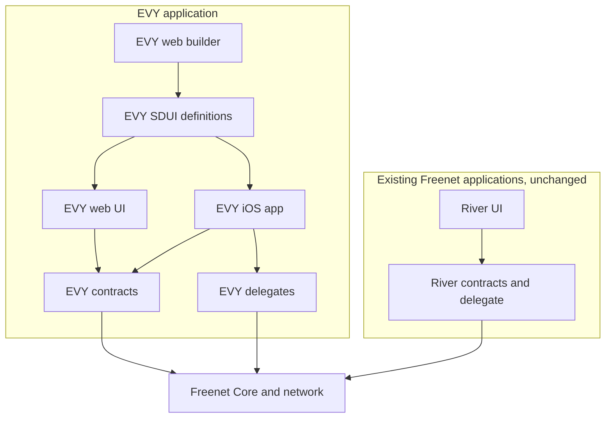
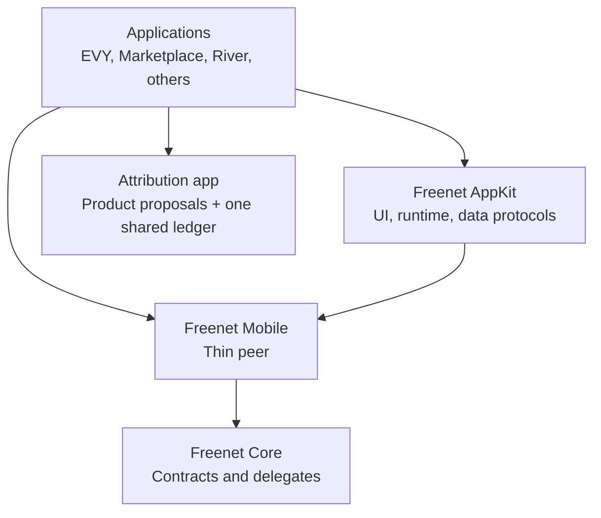

# Freenet and EVY <3

## What is EVY, the Everything App?

https://github.com/EVY-Platform/evy

The purpose of EVY is to enable everyone to connect consumers to services, avoid gatekeepers, grift & profiteering, and compensate contributors fairly.

Imagine drivers delivering food to people without a middleman taking 30%, or selling your used skateboard without your data then being used for ads targeting incessantly. Imagine never having to download apps again, signup, or enter your payment details over and over. Imagine trusting that your data truly remains on your device. Imagine being able to see exactly what the app does, what algorithms exist, and being able to change them if you want.

You don't even have to take our word for it, you can verify yourself as everything is public (code and data).

EVY does this through a simple idea: a super app on your mobile device which acts as your identity and your key. The app is community-built and contributors get paid whenever their functionality is used (when transactions happen in-app), incentivising useful and quality features. Functionality can be added in realtime through a server-driven-UI system, so users immediately get new functionality as it is released, and contributors can easily develop and test their changes. At the same time, the SDUI system ensures a coherent beautiful design system and good UX throughout the app.

The initial launch product is a Marketplace (facebook/craigslist style) because we believe we can build a 10x better product than what is out there. The challenge will be critical mass problem but we believe it can be overcome.

**2 approaches to build EVY with Freenet:**

1. **EVY standalone (safe but monolithic giant):** self-contained architecture in a single app & contracts.
2. **AppKit + EVY (hard but small scalable pieces):** individual re-usable building blocks used throughout freenet and all used together in an EVY native mobile app.

## Goals

- keep network and contract concerns in Freenet rather than recreating them in EVY;
- make mobile use practical without turning phones into always-on network relays;
- retain EVY's existing SDUI, builder, native rendering;
- combine EVY's local-first principles with Freenet's delegates architecture;
- keep all new protocols small, versioned, and independently testable;
- fund development from product fees attributed to contributors, never from ads: contributor remuneration removes any need for advertising, tracking, or data resale on the platform;
- make contributions verifiably trustworthy: credit is derived by contracts from signed, independently reviewed, blind-validated records that anyone can re-check, and no authority can grant or deny it.

## Independent plans EVY consumes

These live outside this folder, are reviewed and built on their own, and EVY is one consumer among any:

| Plan | EVY's use of it |
| --- | --- |
| [Freenet Mobile](../freenet-mobile/README.md) | The Freenet engine inside the iOS and Android apps, foreground-only, no duties for others |
| [Product attribution app](../attribution/README.md) | Contributor credit: EVY registers as one product, with one shallow capability catalogue, in the shared attribution ledger |
| [Remuneration](../remuneration/README.md) | Product fees collected and paid out to contributors against attribution snapshots |

[Duty negotiation](../duty-negotiation/README.md) and [hardware-backed identity](../hardware-identity/README.md) improve the network EVY runs on; EVY requires neither.

## Approach 1. - Standalone app

Build EVY as one self-contained Freenet application from the existing EVY repository, keeping the builder, JSON Schema SDUI, React and SwiftUI renderers, action system, and local-first behaviour.

Plan: [One product repository with internal SDUI, messaging, marketplace, and builder](standalone-evy.md)

## Approach 2. - Integrated building blocks

Extract the generic parts of EVY into reusable Freenet repositories and packages. EVY becomes one product assembled from AppKit, marketplace (which owns its messaging), the [attribution app](../attribution/README.md), and [Freenet Mobile](../freenet-mobile/README.md). An application consists of a signed release record, an SDUI definition contract, data contracts and private delegates, plus attribution snapshot references.

| Plan | Purpose |
| --- | --- |
| [AppKit Foundation and Release Records](blocks-01-appkit-foundation.md) | Pointer-based identity, signed release records, and capability declarations |
| [AppKit SDUI](blocks-02-appkit-sdui.md) | Portable declarative UI format |
| [AppKit Runtime](blocks-03-appkit-runtime.md) | Actions, expressions, navigation, and effects |
| [AppKit Data Bindings](blocks-04-appkit-data-bindings.md) | Contract, delegate, local, and parameter data access |
| [AppKit Web Reader](blocks-05-appkit-web-reader.md) | Browser renderer for SDUI applications |
| [AppKit Mobile Readers](blocks-06-appkit-mobile-readers.md) | SwiftUI and Compose renderers |
| [App Builder](blocks-07-app-builder.md) | Visual creation and publishing of AppKit applications |
| [Marketplace](blocks-08-marketplace.md) | Reusable marketplace contracts and UI modules |
| [EVY App](blocks-09-evy-app.md) | Consumer mobile and web shell combining the components |

## What must still change in Freenet before launch

Audited 2026-08-27 against freenet-core (all issues, PRs, and discussions), paper-1, and the ecosystem repos. **None of these blocks starting the work above** — every plan has a phase that proceeds today — but each must close, or be consciously accepted, before a consumer launch. Status labels: **active** (upstream work in flight), **designed** (RFC or design exists, unbuilt), **unowned** (no tracking issue yet).

### 1. Delegate-secret migration and recovery — *designed, blocked*

Losing the phone loses the user's identity, and a delegate re-key can do the same to a user who did nothing wrong. Addressing and contract-state carry-forward are solved; delegate secrets are the acknowledged unsolved third of the upgrade epic ([#2776](https://github.com/freenet/freenet-core/issues/2776)). Five designs have been disproven; the current RFC ([#5255](https://github.com/freenet/freenet-core/issues/5255)) is blocked on a missing platform primitive (no delegate can deposit bytes into another delegate's secret store), and the node-side copy-forward that was built ([PR #4908](https://github.com/freenet/freenet-core/pull/4908)) was disabled two weeks later as forgeable ([PR #5199](https://github.com/freenet/freenet-core/pull/5199)). The interim path re-runs old delegate WASM, which is what permanently lost three generations of River users' identities ([river#630](https://github.com/freenet/river/issues/630)). Cross-device sync is a separate open RFC ([#4560](https://github.com/freenet/freenet-core/issues/4560)); hosted-mode export/import ([#4381](https://github.com/freenet/freenet-core/issues/4381), shipped) is the nearest working relative. For a marketplace with money attached, launch needs either this solved upstream or an application-level recovery design (mnemonic-derived keys, social recovery) of our own.

### 2. Silent update-delivery loss — *active*

Registered subscribers can miss committed updates with zero logging ([#4681](https://github.com/freenet/freenet-core/issues/4681)); updates racing a forming subscription tree are dropped with no repair ([#4764](https://github.com/freenet/freenet-core/issues/4764), fixed, but the class recurs); SUBSCRIBE can dead-end at hop 0 ([#4414](https://github.com/freenet/freenet-core/issues/4414), fixed); long-lived subscribers flap at 184 reconnects/hour ([#4970](https://github.com/freenet/freenet-core/issues/4970)); and core has no client-facing success metric for PUT/UPDATE/SUBSCRIBE at all ([#5250](https://github.com/freenet/freenet-core/issues/5250)). The interest-sync hardening program is active (e.g. [PR #5243](https://github.com/freenet/freenet-core/pull/5243), [PR #5346](https://github.com/freenet/freenet-core/pull/5346)). The plans already assume app-level reconciliation; launch quality still depends on the upstream floor rising.

### 3. Suspend/resume and reconnect recovery — *active, open*

A NATed peer sat at one connection for 5.5 hours after suspend/resume with subscriptions registered but frozen ([#4951](https://github.com/freenet/freenet-core/issues/4951)); interest entries and the connection set diverge after wake ([#4153](https://github.com/freenet/freenet-core/issues/4153)); and there is no delta-based restart resync, so every cold start ships full state per contract ([#4651](https://github.com/freenet/freenet-core/issues/4651)). This is precisely the thin peer's foreground path, dozens of times a day. Until fixed, the mobile runtime must treat resume as "assume nothing, rebuild everything" and budget the bandwidth for it.

### 4. The thin-peer role needs a maintainer-approved issue — *unowned*

No issue exists for the duty-free terminal edge; the only prior signal is maintainer intent from 2022–23 ([#420](https://github.com/freenet/freenet-core/discussions/420): "a limited node will be running in the device… embedded/used as a library"; [#811](https://github.com/freenet/freenet-core/discussions/811): "Yes, we'll support mobile"). Per CONTRIBUTING.md, feature PRs without an approved issue are auto-closed, so a concept discussion and RFC are step zero for [Freenet Mobile's Phase 2](../freenet-mobile/README.md#3-delivery-plan), and equally for [duty negotiation](../duty-negotiation/README.md#11-delivery) if the network wants the metered version. The mobile plan's Phase 1 (unmodified Core embedded as a normal peer, lifecycle, storage) needs nothing from Core and proceeds regardless.

### 5. Carrier-network reachability — *designed, unbuilt*

Symmetric NAT has no relay fallback ([#2925](https://github.com/freenet/freenet-core/issues/2925): relay-candidate directory considered, unbuilt), carriers sometimes block UDP outright ([#5051](https://github.com/freenet/freenet-core/discussions/5051)), and gateways already churn transient arrivals at a 10:1 expiry-to-promotion ratio ([#4787](https://github.com/freenet/freenet-core/issues/4787)). Many thin peers will realistically be gateway-attached; launch needs either upstream relays or our own serving/gateway capacity, planned as infrastructure.

### 6. Scale and bandwidth — *active, the largest gap*

The network is ~1,300–1,800 peers; the whitepaper's own measurement (§5.7) is a single data point that "cannot distinguish O(log n) from O(√n)", and the simulator cannot form organic topology past N≈16 ([paper-1 PR #2](https://github.com/freenet/paper-1/pull/2)). Baseline cost is 4.32 GB/day/node with 32.7% of update applies healing non-convergent contracts forever ([#5153](https://github.com/freenet/freenet-core/issues/5153), the canonical tracker); ~18× duplicate delivery ([#5147](https://github.com/freenet/freenet-core/issues/5147)); 97% of received contract bytes change nothing ([#4956](https://github.com/freenet/freenet-core/issues/4956)); state size caps storage but not broadcast cost ([#5050](https://github.com/freenet/freenet-core/issues/5050)); gateway event loops saturate under load ([#4145](https://github.com/freenet/freenet-core/issues/4145)). A consumer launch would be the largest load event in the network's history. We should define our own client-side SLIs from day one and treat capacity as a launch gate with numbers, not a hope.

### 7. Merge-law enforcement and clock removal are landing under us — *active*

Contract conformance is becoming enforceable with **removal** as the sanction ([#5320](https://github.com/freenet/freenet-core/issues/5320) RFC; verifier and `fdev` harness merged in [PR #5344](https://github.com/freenet/freenet-core/pull/5344)): canonical byte representation, deterministic summaries, empty self-deltas, terminating reconciliation. Host-clock access is being removed from contracts ([#5465](https://github.com/freenet/freenet-core/issues/5465)). Even the project's own example app currently fails the laws ([#5462](https://github.com/freenet/freenet-core/issues/5462)). Every contract in these plans must pass `fdev` conformance from its first commit. Related: every re-key permanently strands a generation the network heartbeats forever ([#5158](https://github.com/freenet/freenet-core/issues/5158), open, fixes proposed) — until that lands, our release cadence is a network tax, which argues for freezing contract WASM early (the [attribution app's upgrade discipline](../attribution/README.md#9-the-ledger) and the pointer convention of [#5194](https://github.com/freenet/freenet-core/issues/5194) both exist for this).

### 8. Web-app platform gaps gate the web reader — *designed*

Contract apps run in opaque-origin iframes where all origin-keyed storage throws ([#5165](https://github.com/freenet/freenet-core/issues/5165), by design); the fix is per-app real origins ([#5254](https://github.com/freenet/freenet-core/issues/5254), `S-needs-design`, maintainer engaged). The capability manifest was shipped and reverted for CSRF and silent-default-expansion holes ([#4014](https://github.com/freenet/freenet-core/issues/4014), revert checklist in [PR #4090](https://github.com/freenet/freenet-core/pull/4090)). The cross-browser security suite cannot yet block merges ([#5275](https://github.com/freenet/freenet-core/issues/5275)). This is why the mobile readers (plan 06) lead and the web reader (plan 05) follows.

### 9. Client-API identity for native clients — *active design*

The client API issues app identity on request and has no authentication ([#5264](https://github.com/freenet/freenet-core/issues/5264), TOFU + passkeys direction; non-browser clients explicitly unresolved), and safe non-loopback access is a pending proposal ([#5219](https://github.com/freenet/freenet-core/issues/5219)). The phone app embeds Core in-process and never speaks the client API over the network, so the stake here is the [standalone app](standalone-evy.md) — a native client of its own local instance, and exactly the case [#5264](https://github.com/freenet/freenet-core/issues/5264) defers. Register as a stakeholder now so the credential design doesn't settle around `riverctl`/`fdev` alone.

### 10. Cold-state durability — *designed, partial*

There is no re-replication and no durability guarantee for cold state (whitepaper §7.4), and demand-driven eviction deliberately drops zero-demand contracts first ([#4642](https://github.com/freenet/freenet-core/issues/4642) epic; local-pin proposal [#5041](https://github.com/freenet/freenet-core/issues/5041) open). A marketplace's long tail of cold listings and the attribution archive are exactly that shape. Until upstream changes, owner-side periodic re-PUT is our responsibility, and the plans assign it: sellers and index operators re-publish listings and shards ([marketplace §4](blocks-08-marketplace.md#4-discovery-and-search)), and release tooling re-publishes the attribution archive ([attribution §9](../attribution/README.md#9-the-ledger)).

### 11. Known-bug tail on our critical path — *active*

UPDATE cannot be addressed by instance id ([#4978](https://github.com/freenet/freenet-core/issues/4978) — breaks the TS SDK path and blocked the pointer contract's network-mode verification); the npm TypeScript SDK still ships FIFO request/response matching ([#5048](https://github.com/freenet/freenet-core/issues/5048) — fixed in-repo, unpublished); streaming PUT can succeed without ever telling the originator ([#5458](https://github.com/freenet/freenet-core/issues/5458), [#5446](https://github.com/freenet/freenet-core/issues/5446)); PUTs can report timeout while landing ([#3465](https://github.com/freenet/freenet-core/issues/3465)). Cheap to track, expensive to discover in production.

### 12. No peer-to-peer messaging primitive — *proposed, unanswered*

Freenet has contracts and delegates; it has no application datagram or direct peer-message path, and a delegate hop is pinned as *not* a privacy boundary ([PR #5363](https://github.com/freenet/freenet-core/pull/5363)). The ephemeral datagram API proposal ([#4959](https://github.com/freenet/freenet-core/discussions/4959)) has no maintainer response. Messaging therefore runs contract-mediated (inbox contracts) in both approaches ([standalone §2.6](standalone-evy.md), [marketplace §6](blocks-08-marketplace.md#6-trade-messaging)) until and unless that primitive exists — acceptable for marketplace messaging, disqualifying for real-time voice/video.

**Product-side blockers tracked in the plans themselves, not upstream:** the [remuneration plan](../remuneration/README.md) (drafted, awaiting its own review and build), the separate moderation plan ([standalone §2.8](standalone-evy.md), [marketplace §8](blocks-08-marketplace.md#8-moderation-and-abuse)), and an identity-recovery design if item 1 stays unsolved upstream.

## Reference material

- [Freenet whitepaper source](https://github.com/freenet/paper-1)
- [Freenet Core](https://github.com/freenet/freenet-core)
- Mobile discussions [#811](https://github.com/freenet/freenet-core/discussions/811) and [#420](https://github.com/freenet/freenet-core/discussions/420)
- [UI security architecture discussion #5380](https://github.com/freenet/freenet-core/discussions/5380)
- [Ghost Keys](https://freenet.org/ghostkey/) and the [ghostkeys repository](https://github.com/freenet/ghostkeys)
- [Multi-Purpose Trust Network #458](https://github.com/freenet/freenet-core/issues/458)
- [Freenet contracts](https://freenet.org/build/manual/components/contracts/)
- [Freenet delegates](https://freenet.org/build/manual/components/delegates/)
- [Freenet user interfaces](https://freenet.org/build/manual/components/ui/)
- [Freenet TypeScript SDK](https://freenet.org/build/manual/typescript-sdk/)
- [Atlas discovery RFC](https://github.com/freenet/atlas)
- [River](https://github.com/freenet/river)
- [Harvest](https://github.com/freenet/harvest)
- [EVY](https://github.com/EVY-Platform/evy)
