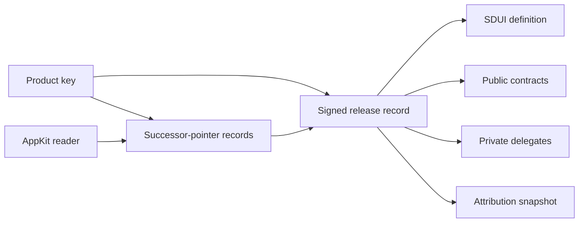

# AppKit Foundation and Release Records

**Parent plan:** [AppKit + EVY](README.md).

The foundation is the small shared layer every AppKit builder, reader, and product understands: how an application identifies itself, declares what it needs, points to its UI and data components, and publishes a signed release. Discovery, UI rendering, messaging, and payments all stay outside it.

It deliberately does **not** define a canonical application identity or a global registry. Freenet already settled identity that survives contract code changes (the successor-pointer convention, [freenet-core#5194](https://github.com/freenet/freenet-core/issues/5194)), holds an explicit position against global naming ([FAQ: naming and Zooko's triangle](https://freenet.org/about/faq/)), and keeps discovery pluralistic ([Atlas](https://github.com/freenet/atlas)). This plan builds on those instead of duplicating them.



## 1. Identity model

Do not use a contract address as the application identity: a contract key is `blake3(blake3(wasm) ‖ params)`, so any rebuild moves it, and every upgrade strands the previous generation ([freenet-core#5158](https://github.com/freenet/freenet-core/issues/5158)). Do not invent a parallel canonical identity either; the ecosystem already settled this ([freenet-core#2776](https://github.com/freenet/freenet-core/issues/2776)):

```text
ProductId    = the product's root verifying key (the product key)
               (optionally hash(namespace, root key) where a
               namespace matters)
Addressing   = successor-pointer records under that key, one per
               long-lived artifact, e.g.:
                 evy.app-definition
ReleaseId    = hash(canonical signed release record)
AppInstanceId = ProductId plus deployment-specific contract params
               (a room, store, or community derives its own keys
               from the owner identity, so instances survive
               re-keys for free)
```

The pointer solves addressing only: it says which code hash is current, nothing about whether state or secrets survived a re-key (state carry-forward is [freenet-migrate](https://github.com/freenet/freenet-migrate)'s job, and delegate-secret migration is still open upstream). And it deliberately does not solve naming: nothing binds a key to a human-meaningful name, so a validly-signed record under a plausible id is still possible. Display names are petnames or discovery metadata, never part of the signed core.

## 2. Release record

Proposed v1 fields:

```yaml
schema: freenet-appkit/release/v1
product_id: <product root key>
release:
  generation: 12
  previous: <release-id>
  artifacts:
    web_reader_bundle: <content-ref>
    app_definition: <contract-ref>
components:
  contracts:
    - id: profile
      reference: <contract-ref>
  delegates:
    - id: identity
      code: <content-ref>
extensions:
  - appkit.sdui.v1
  - marketplace.module.v1
handlers:
  message_types:
    - example.invitation
attribution:
  ledger_pointer: <the attribution app's pointer id, e.g. "attribution-ledger">
  snapshot: <snapshot-id>
  policy_version: <version>
signatures: [...]
```

There is no `name` field and no timestamps in the signed core. Human labels, localised descriptions, and icons are content references outside the signed core and must not affect any capability or compatibility check. Generation ordering replaces wall-clock ordering throughout, matching the [attribution app's no-clock rules](../attribution/README.md#9-the-ledger).

The `product_id`, the pointer records, and the attribution references must all verify against the same product-key lineage. The product key may delegate release signing under the published policy, but it cannot attach another product's snapshot.

## 3. Canonical encoding and signatures

A canonical encoding is required only for content-derived IDs and signatures, not as an identity layer. Use canonical JSON for v1 because AppKit SDUI is already JSON-based and all target languages have mature support. The canonicalisation rules must define key ordering, number representation, Unicode handling, and exclusion of the signature field from the signed payload.

Sign:

```text
hash(
  product_id,
  generation,
  previous_release_id,
  canonical_release_record_without_signatures
)
```

A reader treats two validly signed different records for the same `(product_id, generation)` as an equivocation conflict and does not silently select one; it surfaces both, mirroring the attribution app's [`CONFLICTED` slot rule](../attribution/README.md#9-the-ledger).

## 4. Capabilities and extensions

Capabilities are stable strings with semantic versions:

```text
appkit.sdui.v1
appkit.actions.v1
appkit.bindings.contract.v1
marketplace.module.v1
attribution.product.v1
```

Rules:

- missing required capability: refuse to open and explain why;
- missing optional capability: disable that feature;
- unknown field inside a known major schema: follow the schema's extension rules;
- unknown required action/component: validation failure, not a blank UI;
- readers publish their capability set for builder previews and compatibility checks.

Browser-facing permission declarations (sandbox flags, sensors, storage) are a separate concern with an existing upstream design: the in-tarball `freenet-app.toml` manifest of [freenet-core#4014](https://github.com/freenet/freenet-core/issues/4014), which inherits the signed web-container trust model. AppKit should adopt that mechanism when it lands rather than defining a parallel one; the revert of its first implementation ([freenet-core#4090](https://github.com/freenet/freenet-core/pull/4090)) is the checklist of consent, revocation, and versioning issues any such manifest must handle.

## 5. Artifact references

All artifacts use typed references rather than unlabelled strings:

```text
ContractRef
DelegateCodeRef
WebContainerRef
ContentBlobRef
PointerRef
AttributionSnapshotRef
```

Each reference includes the hash algorithm and expected media/type information where needed. Readers verify content before use and cache only verified bytes. A `PointerRef` names `(author_vk, app_id)` and is resolved through the successor-pointer contract, handling every resolver outcome explicitly (withdrawal, rollback attempt, and timeout are distinct from "no record", per the pointer contract's [consumer rules](https://github.com/freenet/freenet-migrate)).

## 6. Discovery

Do not build a global search index into AppKit. Integrate with [Atlas](https://github.com/freenet/atlas) or another discovery application by publishing signed metadata that points to `ProductId` and `ReleaseId`.

Discovery records may be stale or malicious. The reader still resolves the pointer and verifies the release record and signatures. Users may also open a release directly without discovery.

## 7. Repository and tooling

Inside `freenet-appkit`:

```text
specs/release/v1.schema.json
crates/appkit-release
crates/appkit-validation
packages/release
swift/AppKitRelease
kotlin/appkit-release
cli/appkit-release
```

The CLI supports:

```text
init
validate
canonicalize
sign
verify
compare
inspect
resolve      # pointer resolution for every PointerRef in a record
```

Use JSON Schema for shape validation and explicit semantic validators for generation order, capability names, artifact hashes, product-key lineage, and conflicting fields.

Build on: Rust `serde` with a reviewed canonical JSON implementation and the Freenet key/signature types; the freenet-migrate pointer resolver rather than a bespoke one; pinned TypeScript JSON Schema validators (Ajv) wrapped behind AppKit APIs; generated Codable Swift and Kotlin serialization models; shared signed golden fixtures used by every language implementation. Do not make the release-record parser depend on a renderer, builder, marketplace, or product application.

## 8. Delivery

| Phase | Delivers | Done when |
| --- | --- | --- |
| 1. Identity conventions | Product key as `ProductId`; ledger, definition, and data contracts resolved via successor-pointer records | A reader resolves the current app definition through the pointer after a contract re-key, with no release-record change |
| 2. Release record v1 | Canonical encoding, signatures, extensions, references, and previous-release links | The signed core contains no names, no timestamps, and no payment fields, and binds the attribution snapshot and policy version |
| 3. Validators and codegen | Rust, TypeScript, Swift, and Kotlin types from one schema | All four implementations produce the same canonical bytes and release ID |
| 4. Release tooling | Create, sign, verify, compare, and publish release records | Equivocation cases have public fixtures and surface as conflicts, never as silent selection |
| 5. Reader integration | Pointer resolution, compatibility checks, permission requests before loading | A reader explains every compatibility failure before loading untrusted UI |
| 6. Discovery integration | Atlas or another registry references signed releases without owning them | Atlas can reference an AppKit release without becoming its trust authority |

References:

- [Product attribution app](../attribution/README.md)
- [Stable identity: successor-pointer convention, freenet-core#5194](https://github.com/freenet/freenet-core/issues/5194)
- [Tracking: graceful upgrades, freenet-core#2776](https://github.com/freenet/freenet-core/issues/2776)
- [Upgrading contracts and delegates, freenet.org manual](https://freenet.org/build/manual/upgrading-contracts/)
- [freenet-migrate](https://github.com/freenet/freenet-migrate)
- [Manifest-driven webapp permissions, freenet-core#4014](https://github.com/freenet/freenet-core/issues/4014)
- [Freenet FAQ: naming and Zooko's triangle](https://freenet.org/about/faq/)
- [Atlas](https://github.com/freenet/atlas)

Note: `freenet.toml` (the [fdev build manifest](https://freenet.org/build/manual/manifest/)) is a local build configuration and is unrelated to the release records defined here.
