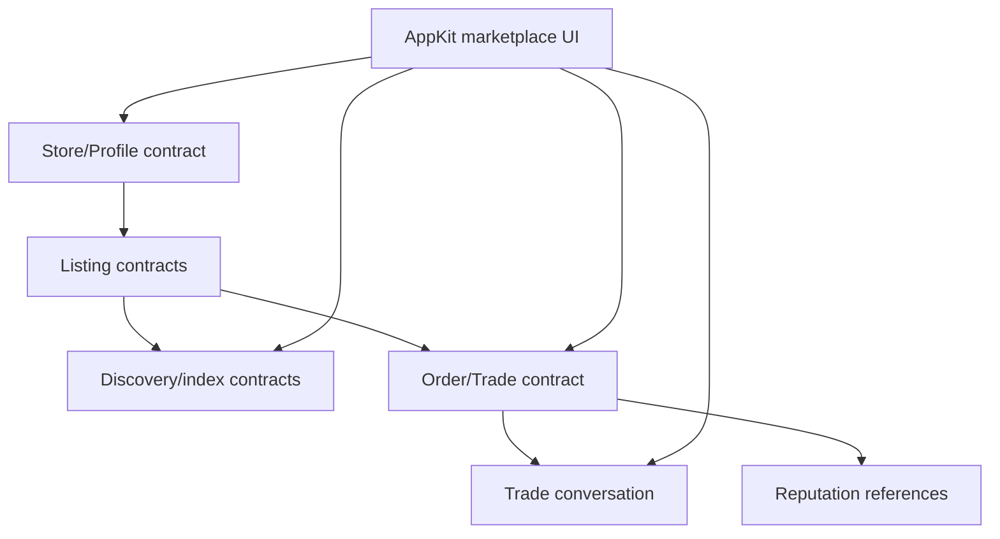
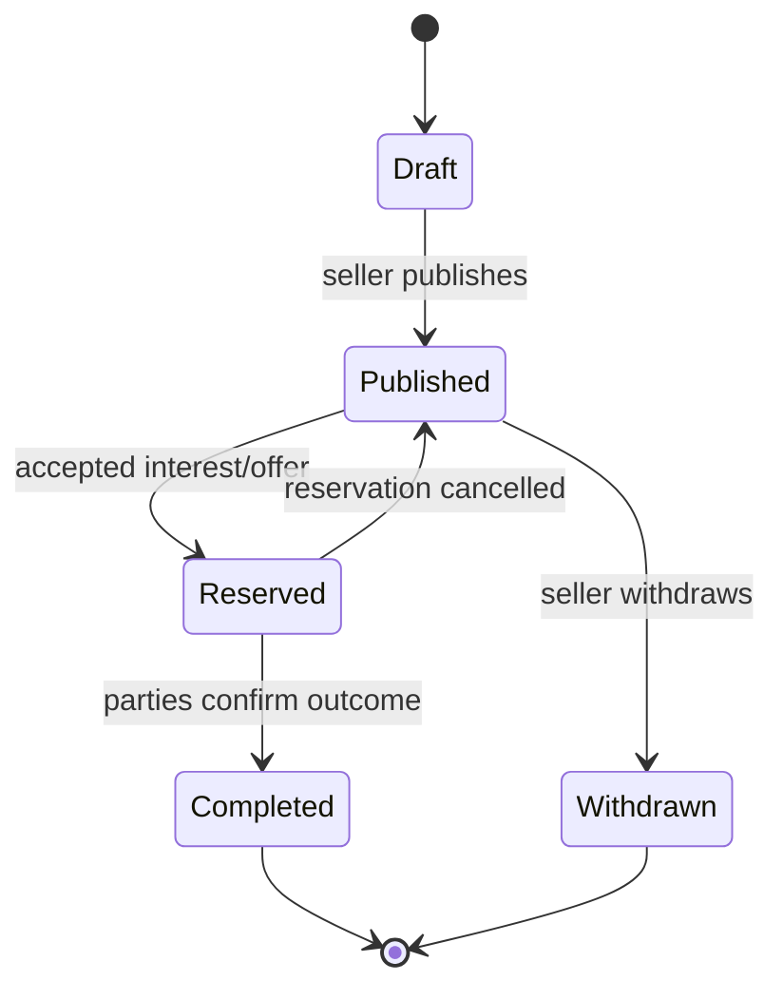

# Marketplace

**Parent plan:** [AppKit + EVY](README.md). **Depends on:** [AppKit Foundation](blocks-01-appkit-foundation.md). **Consumes, built separately:** [Product attribution app](../attribution/README.md), [Remuneration](../remuneration/README.md).

The marketplace is a Freenet product and reusable domain package for discovering listings, contacting sellers, recording order state, and linking reputation. It can publish as an independent product or embed as a shared module in a host like EVY. It publishes AppKit screens and actions but keeps marketplace rules outside AppKit, and it deliberately avoids one global contract holding every listing or message.



## 1. Repository layout

```text
freenet-marketplace/
  common/
  contracts/
    store-profile/  listing/  listing-index/  order/
  delegates/
    marketplace-agent/
  appkit/
    screens/  actions/  extensions/
  messaging/
    payloads/
  sdk/
    typescript/  swift/  kotlin/
  fixtures/
  docs/
```

Use Rust/Cargo for shared types, contracts, and delegates. Publish AppKit definitions/modules and generated client types separately.

## 2. Stores and profiles

A seller store/profile contract contains public seller-selected data and references to active listing/index shards. Private contact, address, identity keys, processor details, and drafts remain in a delegate/local store.

The contract validates updates against the store owner's keys and supports key rotation through signed lineage.

## 3. Listings

Prefer independent listing contracts or bounded listing shards rather than one unbounded marketplace state. A listing includes:

```text
listing ID and owner
version/status
structured title/description/category
price display object, if used
location disclosure level
media content references
availability/quantity
created/updated author timestamps
store/profile reference
signed update history or current-state proof
```

Exact personal location should not be public by default: use coarse public location and private messages for details.



## 4. Discovery and search

Provide explicit index contracts/shards by region, category, or time, or integrate discovery metadata with Atlas where suitable — never a queryable global database ([Data Bindings §3](blocks-04-appkit-data-bindings.md#3-contract-provider-and-declared-views)).

Index entries are hints that point to signed listing contracts; clients verify listing state after opening. Define expiry/refresh and spam policy. Search works over bounded local index state and must not require downloading every listing.

Because nothing can gate publication, the index is the marketplace's only real moderation lever: what an index declines to carry is effectively invisible without being censored. Design index admission as a policy hook from the start, and publish whatever policy an index applies (Section 8).

**Durability has owners.** Cold listings are exactly the state Freenet does not yet keep alive: there is no re-replication, and demand-driven eviction drops zero-demand contracts first ([#4642](https://github.com/freenet/freenet-core/issues/4642); local-pin proposal [#5041](https://github.com/freenet/freenet-core/issues/5041); [README item 10](README.md)). Until that changes, a seller's client periodically re-publishes its own store and listings, and whoever operates an index shard re-publishes that shard.

## 5. Orders

An order contract records a small state machine and signed participant actions. It contains no private chat plaintext and no payment credentials.

Operations:

```text
CreateInterest
MakeOffer
AcceptOffer
Cancel
MarkExchangeComplete
RaiseDisputeReference
Close
```

The contract validates who may perform each transition and handles concurrent incompatible transitions explicitly. Status history is append-only or otherwise auditable.

## 6. Trade messaging

Messaging is a marketplace concern, not a shared protocol. Before building anything, evaluate adopting [Freenet Mail](https://github.com/freenet/mail)'s message design — and possibly its code. It already uses the strongest message-security primitives in Freenet applications: ML-KEM-768 key encapsulation, ML-DSA-65 signatures, ChaCha20-Poly1305 authenticated encryption, HKDF-SHA-256 key derivation, and BLAKE3 content addressing. In plain terms: only the listed recipients can read a message (the key exchange is post-quantum), tampering is detectable, and a message's identifier is the fingerprint of its exact bytes. Whatever ships, fix one versioned suite with no algorithm negotiation and no downgrade path.

Marketplace payload types:

```text
marketplace.question.v1
marketplace.offer.v1
marketplace.offer-response.v1
marketplace.order-status.v1
marketplace.exchange-details.v1
```

Sensitive exchange details are encrypted for the participants. The listing and order point to the thread; they do not duplicate messages.

**Transport.** Freenet has no direct peer-to-peer datagram: the proposal ([#4959](https://github.com/freenet/freenet-core/discussions/4959)) is unanswered, and a delegate hop is explicitly not a privacy boundary ([PR #5363](https://github.com/freenet/freenet-core/pull/5363)). Messages therefore travel contract-mediated — encrypted, signed messages and receipts land in inbox contracts the recipient subscribes to ([README item 12](README.md)). That suits trade messaging and rules out real-time voice or video. A [thin peer](../freenet-mobile/README.md) subscribes only to its own inboxes and relays nothing.

**Design rules that hold regardless of which library implements it:**

- **Timestamps are claims.** A sender-signed timestamp proves who asserted a time, nothing more; contracts have no trusted clock, so it is never proof of freshness, authorization, or global order. Deterministic display order is `(created_at, message_id)`, called presentation order.
- **Delivery is proven, not assumed.** Delivery state lives outside the signed message. "Accepted" and "Read" exist only as receipts signed by the recipient; the sender cannot assert them, and a read receipt is always the recipient's choice.
- **Retention is a request, not erasure.** Every message carries an explicit retain-or-expire policy, and expiry is an instruction: a decentralized network cannot prove every copy was deleted, and no UI may promise otherwise. Inbox contracts also need a bounded retention horizon (a maximum count or epoch) so pruned messages cannot be reintroduced by an old replica.
- **Attachments are separately encrypted blobs.** Content-addressed by ciphertext hash, encrypted with per-attachment derived keys, file names and media types kept inside the encrypted payload — and never executed, rendered, or trusted based on a declared name or type.
- **Keys live in delegates.** Private keys stay in Freenet's delegate secret storage; encryption and signing keys are never reused across purposes; rotation and revocation exist from day one; primitives come from audited, constant-time libraries, never implemented in this project.
- **Contracts verify only what is deterministic:** versions, sizes, hashes, signatures, duplicates, and retention horizons — never wall-clock time or whether a human saw a message.

## 7. Identity and reputation

Identity is adapter-based: a marketplace can require a supported identity capability or accept pseudonymous keys. Reputation is a separate referenced protocol/contract so alternative systems can coexist. The one reputation pattern this plan does adopt — Harvest's feedback tokens — is specified in Section 8.

## 8. Moderation and abuse

**Moderation is a separate plan.** It needs its own threat model, policy, appeals path, and jurisdictional analysis, and it is a launch blocker rather than a nice-to-have: a permissionless marketplace with a public discovery index attracts spam listings, fraud, and illegal content, and transit peers hold copies of state they never chose to host. This section fixes only the shape moderation must take, so the contracts and indexes built now do not foreclose it.

**What is architecturally possible.** Nothing can gate publication — a listing contract is content-addressed and permissionless, and no mechanism revokes it network-wide. Moderation therefore acts at the three layers that *are* available, and the plan should say so rather than imply takedown:

1. **Discovery.** Index contracts decide what is surfaced. Declining to list is not censorship of the underlying contract, and it is the effective lever — which is why Atlas's pluralistic competing-index model matters: users who dislike one index's policy can use another.
2. **Client and host.** A reader filters, warns, or refuses to render; a host application applies its own policy. This is where any per-jurisdiction obligation lands.
3. **Reputation.** Signals attached to a seller identity that clients and indexes consume.

**Feedback tokens (Harvest's design).** Adopt the negative-only, blind-signature feedback-token pattern from [Harvest](https://github.com/freenet/harvest)'s design document, and adopt the reasoning with it:

- A token is a blinded nonce bound to a target contract, blind-signed by the counterparty at transaction time, so only someone who actually transacted can later spend one.
- **Negative-only is structural, not editorial.** Because the seller is the blind-signer, positive feedback is forgeable by construction — a seller can mint praise for themselves. Only the *absence* of complaints carries information, so the protocol records complaints and lets clients weigh silence.
- The reputation set is **grow-only**, which is what makes it a well-formed contract: a monotone set merges commutatively, associatively, and idempotently, satisfying the merge laws Core will enforce with removal ([#5320](https://github.com/freenet/freenet-core/issues/5320)). Any "clear my history" affordance would break that and must not be designed in.
- Ghost Key donation tiers give the identity behind a token an economic cost — the same primitive the [duty-negotiation plan](../duty-negotiation/README.md) uses.

Two caveats carry forward. Feedback *content* is gameable even when the token is not ([harvest#3](https://github.com/freenet/harvest/issues/3) proposes categorical-only feedback for exactly this reason), and Harvest itself is a dormant prototype whose deployed artifacts do not currently work — its delegate cannot instantiate, its bundle carries stale WASM, and the repository has no CI. Take the design; do not take a dependency on the code.

**Light LLM scans.** A small model can triage what token-based reputation cannot: a listing's text and images at publish time, before anything is indexed. Useful and cheap; the constraints are what matter.

- It **cannot live in a contract.** Contract execution is deterministic, has no network access, is losing its clock ([#5465](https://github.com/freenet/freenet-core/issues/5465)), and runs inside a 5-second budget. A model output is not a deterministic function of state, so it can never be a validation rule.
- It runs **client-side at publish** (a nudge to the seller, which a modified client bypasses), **index-side before listing** (an actual gate on discovery), and **viewer-side before render** (the user's own filter). Only the index-side use is enforcement, and only over that index.
- Treat every verdict as **advisory and reviewable**. Publish the categories, keep a human appeals path, log the decision so a wrongly-suppressed seller can contest it, and never let a scan silently delete anything.
- Budget it honestly on mobile: a scan that costs seconds or drains battery will be skipped, and multi-language coverage is uneven.

The two mechanisms complement each other by timing: a scan acts before anything is visible and has no evidence, while feedback tokens act after a transaction and carry real evidence. Neither is sufficient alone, and the separate moderation plan owns how they combine, what an index's published policy looks like, and what happens on appeal.

## 9. Payment boundary

Define only a narrow application interface:

```text
preparePayment(order, terms)
confirmExternalPayment(reference)
recordPaymentStatusProof(reference, status)
```

The implementation may use an external provider, direct exchange, or no in-app payment; everything past this interface (rails, KYC, fees, settlement) is the [remuneration plan](../remuneration/README.md). The order contract never treats an unauthenticated client claim as proof of payment, the rule that plan fixes.

## 10. AppKit modules

Publish reusable flows: browse/search listings, listing detail, create/edit listing, seller store/profile, ask question/start thread, make/respond to offer, order status and participant actions, local drafts and saved searches.

Use standard AppKit components first. Marketplace extensions are justified only where a composed standard UI cannot express the semantic behaviour.

## 11. Mobile behaviour

Through the host app and [Freenet Mobile](../freenet-mobile/README.md), marketplace features follow the foreground-only lifecycle and offline rules of [Freenet Mobile §2.3](../freenet-mobile/README.md#23-lifecycle) and the cached-first model of [Data Bindings §6–7](blocks-04-appkit-data-bindings.md#6-cached-first-reads). Marketplace-specific choices: fetch listing and index contracts on demand; subscribe only to viewed listings, active orders, and open conversations; cache saved/owned listings and active trades; keep search history, drafts, and unread markers local.

## 12. Attribution

As an independent product, Marketplace has its own product key and capability catalogue in the shared attribution ledger; embedded in EVY as a module, an EVY proposal allocates EVY units to its contributors instead. Both rules — and why publishing a module never creates units by itself — are the attribution app's [products, components, and forks](../attribution/README.md#7-products-components-and-forks). Its capability names (`marketplace.listing.publish`, `marketplace.offer.negotiate`, `marketplace.order.transition`) describe product behaviour and must survive changes of screens, contracts, and repositories.

## 13. Delivery

Testing: property and merge tests for each contract; partition and concurrent-transition tests; malicious seller/buyer, replay, duplicate, and oversized-listing cases; encrypted message and attachment fixtures; index staleness and verification tests; AppKit web/iOS/Android end-to-end flows; payment adapter tests kept outside the core suite; feedback-token tests (blind-signature verification, token bound to its target contract, one token per transaction, grow-only merge proven associative/commutative/idempotent, no path that removes a recorded complaint).

| Phase | Delivers | Done when |
| --- | --- | --- |
| 1. Domain types and lifecycle | Store, listing, order, participant, status, and references | Fixtures cover every status transition, valid and invalid |
| 2. Listing and store contracts | Seller-owned data with signed update rules | Invalid transitions and concurrent edits are rejected in tests |
| 3. Discovery and index path | Searchable shards or Atlas-linked discovery | Clients browse without downloading all marketplace data |
| 4. Trade conversations | Object-linked messaging for questions, offers, and status | Messages and private details stay separate from public listings |
| 5. Order state contract | Auditable, participant-signed transition history | Two users publish, discover, discuss, and complete a trade with no central server |
| 6. AppKit modules | Browse, view, create, message, and manage screens/actions | EVY embeds the marketplace; another AppKit host uses it independently |
| 7. Optional integrations | Reputation and payment adapter interfaces | Feedback-token tests pass; a payment adapter can be absent entirely |

References:

- [Harvest](https://github.com/freenet/harvest)
- [Atlas](https://github.com/freenet/atlas)
- [Freenet contracts](https://freenet.org/build/manual/components/contracts/)
