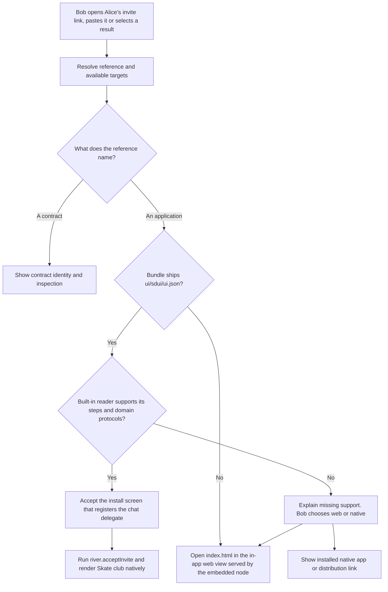

# Freenet mobile app

Build a consumer application that discovers Freenet applications, renders compatible SDUI natively and offers an application's other declared targets. Bob opens the homepage, finds River or opens Alice's invite link, and starts River. The installed mobile app supplies the trusted reader and permission screens. River supplies verified screens, action definitions and domain artifacts. The installed reader packages the native Rust SDK and generated platform bindings.

This is the consumer product built from [hosts](../appkit/hosts.md), [SDUI readers](../appkit/sdui.md), the [mobile SDK](../freenet-mobile/README.md) and [identity/recovery](../identity/README.md). [EVY Developer](../evy/README.md) provides authoring and contributor tools.

## 1. Homepage and discovery

Start with an installed curated bootstrap catalogue and a replaceable search-provider interface. Add Atlas as a provider after the [sample](../atlas-sample/README.md) passes its integration gates. Keep provider choice and catalogue updates visible in settings.

| Home area | Behavior |
| --- | --- |
| Search | Search a chosen provider and show source-labeled results. |
| Installed apps | Open trusted cached bundles and show pending updates. |
| Recent activity | Resume local app routes without exposing private room messages on a locked device. |
| Open a reference | Accept an application or contract link, inspect it and report supported actions. |
| Account and recovery | Show identity coverage, device enrollment and recovery status. |

Search providers limit the number of results per page. Each result includes display metadata, a container reference and an optional exact publication reference. The host resolves and verifies the referenced container before opening it or granting access. River's room list comes from its own `roomList` view and the chat delegate, and the homepage finds applications.

Opening an external deep link can select a route or proposed action. The host validates its arguments, verifies the app and obtains any required user action before sharing private information or spending money. Alice's invite link is one such link. Bob's phone reads River's container key from it, fetches the container, verifies the publisher's signature and shows the install screen, and Bob accepts the invitation before he joins the room.

## 2. Opening an application

Contract references open in an inspection view. Website containers open through Core's web shell inside the app. River's UI ships this way today, as a signed tar.xz in its [web container contract](https://github.com/freenet/river/blob/main/contracts/web-container-contract/src/lib.rs), and it runs in the browser on desktop and mobile. The [bundle plan](../appkit/bundles.md) defines compatibility requirements for web, SDUI and native targets.

Prefer compatible SDUI for the default in-app experience. Every bundle's `index.html` is a web app, so every app also gets an Open web app action. Open the web app in an in-app web view served by the embedded node. The embedded node runs only while the app is in the foreground, and the iOS wrapper stops it when the scene backgrounds, so switching to the system browser would remove the loopback endpoint before the page loads. The existing Atlas demo uses an in-process web view for this reason, and Core's `ios` branch documents the WebView host protocol it uses in `docs/mobile-web-runtime-protocol.md`. Opening the system browser works only against a remote or hosted node, which depends on [hosted mode #4381](https://github.com/freenet/freenet-core/issues/4381).

Web sessions have their own keys, sessions and grants. Ask for enrollment or authorization before handing access from the native app to a web session. Core's shell applies its existing capability-specific controls to the web target. AppKit's operation grants for web targets depend on the permission lifecycle gate in the [host plan](../appkit/hosts.md#gates).

The app's built-in reader renders `ui/sdui/ui.json` natively. The web app shows the same screens through the web reader in `index.html`, alongside any custom pages the publisher wrote. A separately installed native application provides custom screens and packages the same native SDK as the reader. It may use compatible published definitions and delegates. If the built-in reader cannot render the bundle's SDUI, show the web app and any native links from the definition. The user chooses which to open.

Show publisher identity, installed copy, granted access and update status in host-controlled screens. Display these outside publisher-authored UI. A valid publisher signature is evidence of origin, and grants and execution limits still apply.

## 3. Installation, updates and sessions

Installation retains verified bundle metadata, selected artifacts, permission decisions and local data schema state. Use the [host installation rules](../appkit/hosts.md#3-installing-and-updating) for snapshot selection, observed versions and local migration.

- Open a trusted compatible cached bundle while checking for updates within a bounded budget.
- Explain stale observations, unavailable artifacts and incompatible updates separately.
- Show a changed delegate on the install screen before switching copies. Keep a compatible working copy while an update awaits installation.
- Keep app storage and keys scoped to the signed-in user and app identity.
- Run several apps with separate sessions and resource budgets. Share the embedded node through the SDK coordinator.

Session demand, backgrounding and resume follow the [host lifecycle](../appkit/hosts.md#4-saving-work-and-reopening-an-app).

For example, Bob opens the cached "Skate club" conversation in an underground car park. The app shows when it last checked the room contract, and leaves a new message pending until the host obtains enough domain evidence to confirm it, which for River means the message appears in the room state's recent messages.

## 4. Identity, permissions and data controls

Onboarding creates or restores the user's host identity and explains recovery coverage. Applications obtain their own authorized identity context under the [identity plan](../identity/README.md#1-separate-identities-and-authority).

The application definition declares every access an app can request, per [bundles section 1](../appkit/bundles.md#1-the-archive-and-its-definition). The host reads the list at install time and asks for each entry the first time an action step needs it, in a host-drawn prompt that names the app and the access, per [hosts section 5](../appkit/hosts.md#5-permissions-and-device-access). River asks for notifications when Alice turns on message alerts and for the clipboard when she copies an invite link. Provide screens that list each app's grants, storage use, recovery packages and enrolled devices. Revocation invalidates active privileged handles and rechecks queued operations that still require access.

For publisher transfers, show the verified predecessor and successor. Ask before moving private access, and save progress so an interrupted migration can resume.

Separate removing an app from deleting its retained data. Deletion uses the identity plan's [forget operation](../identity/README.md#2-protected-keys-and-records) and first shows the affected drafts, keys, rooms and pending messages, with a recovery export offered.

Native app links open through a trusted external-link action. Treat a publisher's link as a pointer only, and follow the identity plan for any enrollment or export.

## 5. Service surfaces and diagnostics

River turns on message alerts through the host's approved notification adapter and copies invite links through the clipboard adapter. Opening an alert refreshes the verified `conversation` view through the host. Products with paid operations, such as [Marketplace](../marketplace/README.md), open their service through approved adapters that their own plans define. Consumer app management can show source-labeled contribution information, while EVY Developer owns detailed review and earnings workflows.

Diagnostics show the app and installed publication, compatibility, node state, last observation, pending operations and a readable reason for failure, exported under the [host redaction rules](../appkit/hosts.md#6-diagnostics).

The consumer application package contains reusable reader components, host adapters and the bootstrap catalogue. River supplies declarative actions and the chat delegate. The package opens new applications that meet its supported action, component and domain protocol versions. New executor primitives arrive through a reader update.

## 6. Delivery and acceptance

| Phase | Delivers | Done when |
| --- | --- | --- |
| 1. Product shell | Home, installed apps, account and diagnostics | A clean installation can open the Atlas sample from the bootstrap catalogue. |
| 2. Discovery | Replaceable provider and verified reference flow | Opening a result verifies the referenced container before the app's first screen. |
| 3. App management | Updates, storage, revocation and multiple sessions | One app's failure, closure or upgrade leaves other sessions isolated and usable. |
| 4. Recovery | Recovery setup, import and pending-operation restoration | A replacement phone resumes a declared recoverable operation without duplicate submission. |
| 5. Marketplace launch | Commercial adapters and final product acceptance | Buyer and seller complete the Marketplace flow on iOS and Android. |

Test web apps without SDUI, reader-only web apps, custom web apps that embed SDUI screens, native-linked targets, existing website containers, arbitrary contracts, invalid links, no connectivity, stale caches, missing permissions and unsupported components. Confirm that choosing web preserves its container boundary and requires its own grants. Run web handoff tests against the in-app web view, including backgrounding during a web session. Verify accessibility, focus, keyboard input, large text and screen-reader descriptions on real devices.

Apply the SDK's measured device and network budgets and the host's application isolation tests.
