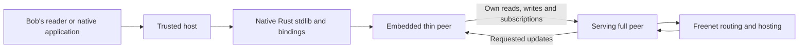
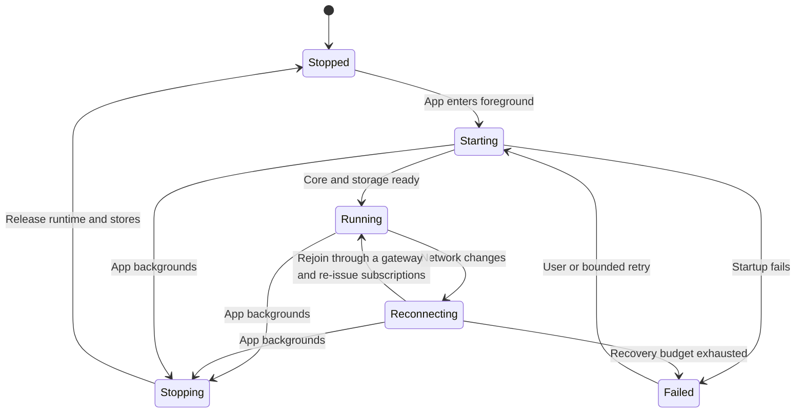

# Freenet mobile SDK

Embed Freenet in iOS and Android applications. When Bob opens Marketplace, the SDK connects his phone, reads the skateboard listing and follows updates to his order. Application delegates interpret domain records for declarative SDUI. Custom applications can also interpret records in their own code. The SDK manages the node and carries authorized requests. Opening a custom web target from mobile uses that target's own session and permissions.

The first native integrations run an embedded full peer. The thin-peer role in [section 4](#4-thin-peer-network-role) is AppKit's proposed Core extension and awaits upstream agreement.

## 0. Feasibility and existing evidence

Each target has its own supported SDK path. Wider consolidation onto one Rust build is optional and follows the measurements below. Equivalent domain behavior across targets comes from shared protocol fixtures rather than from an identical SDK implementation.

| Target | SDK | Status |
| --- | --- | --- |
| Custom JS/TS web app | Existing TypeScript `freenet-stdlib` | Available |
| Rust browser app | Rust stdlib linked into the app's Wasm build | Available |
| Web SDUI reader | Rust stdlib compiled to browser Wasm with JS/TS bindings | Proposed, measured in this stage |
| Native SDUI reader and custom native app | Rust stdlib native library with Swift/Kotlin bindings from `crates/mobile` | Local development work on Core's `ios` branch |

Keep browser networking, native networking, language bindings and lifecycle integration in platform adapters.

| Evidence | What it establishes |
| --- | --- |
| Rust stdlib's browser and native transports | Rust source already supports both environments through separate adapters |
| River browser UI and native CLI dependencies | An existing application uses Rust stdlib in browser and native clients |
| TypeScript SDK source | The supported path for custom JS/TS apps. It stays in place and supplies the comparison baseline for the web reader's Rust build |
| Local Core `ios` branch and `freenet-ios` package | A mobile UniFFI wrapper and iOS packaging exist as local development work |
| Local Atlas iOS demo | Uses a browser client through a WebView. Native compilation of its application behavior needs separate verification |
| Android bindings and device support | Planned packaging and device validation |

Sources: [Rust client API](https://github.com/freenet/freenet-stdlib/blob/main/rust/src/client_api.rs), [TypeScript SDK](https://github.com/freenet/freenet-stdlib/tree/main/typescript), [River browser dependencies](https://github.com/freenet/river/blob/main/ui/Cargo.toml), [River CLI dependencies](https://github.com/freenet/river/blob/main/cli/Cargo.toml), [UniFFI](https://mozilla.github.io/uniffi-rs/latest/). Local evidence describes the inspected development checkouts, with build/device coverage still to verify.

Complete two separate feasibility checks before wider adoption:

1. Exercise reads, subscriptions, updates and delegate requests through the Rust browser build with JS/TS bindings, Swift and Kotlin. Compare request/response encodings, errors, cancellation and callback ordering with fixtures shared with the TypeScript SDK.
2. Prove one Atlas action through declarative SDUI and a custom native interface. Exercise the proposed typed delegate interface, record preparation and readback while preserving the published index identity.

Measure browser startup, compressed download size and memory against the TypeScript SDK. Measure native library size, startup, memory, large-record copying, subscription throughput and lifecycle recovery on target devices. Record the workload, platform, library revision and adapter configuration with every result. Measure embedded Core separately from SDK binding costs. For SDUI, also measure action steps, delegate calls, transferred bytes and response time.

Record the tested Core, stdlib, binding and `freenet-migrate` versions with every result. Core's lockfile pins stdlib 0.10.0, and the [migration library README](https://github.com/freenet/freenet-migrate#status) describes a published runtime targeting 0.8.x plus unreleased APIs. Confirm compatible adapters or aligned dependencies before selecting its runtime policy.

Publish required adapters, unsupported operations and API compatibility changes with the results. Set device and workload acceptance budgets from those measurements before adopting the Rust-backed browser build for the web reader or expanding product adoption. A successful library build establishes compilation. Integration and device results establish usable behavior. If a gate fails, record the required follow-up and keep broader adoption pending.

## 1. Responsibilities

| Part | Owns | Example |
| --- | --- | --- |
| Mobile SDK | Embedded Core, connections, request outcomes, native bindings and node lifecycle | Restart the node when Bob returns to the app. |
| AppKit host | Verified app sessions, grants, scoped storage, runtime limits and application session lifecycle | Permit Marketplace to follow Bob's order. |
| Action executor and domain delegates | Declarative orchestration, decoding and reconciliation | Reconcile Bob's pickup request before the host retries its saved operation. |
| Core | Contract validation and delegate state/secret namespaces | Reject an invalid seller signature. |
| Identity integration | Recovery authority, protected key operations and authorized migration | Restore Alice's access after replacing her phone. |
| Services | Payment and remuneration ledgers and bridge recovery | Publish a verified payment result while Bob's phone sleeps. |

The [actions](../appkit/actions-and-delegates.md), [data](../appkit/data-and-operations.md), [hosts](../appkit/hosts.md) and [identity](../identity/README.md) plans define these interfaces. Hosts retain pending-order journals and use application delegates for domain reconciliation. Payment and remuneration services manage fees.

## 2. Embedded node and native API

The `crates/mobile` package exposes native operations through UniFFI bindings. Extend the existing wrapper with the required native operations. Define separate profiles for local fixtures, full-peer networking and the planned thin-peer role. Use separate stores for fixture and network operation, with host-supplied paths that remain correct after reinstall or container relocation.

The native API must cover:

| Operation | Required behavior |
| --- | --- |
| Start, stop and status | One serialized lifecycle transition, with defined results for repeated calls. |
| Read and publish contract | Validate code, original parameters and returned instance identity. |
| Update contract | Return a correlated outcome and preserve uncertainty after timeout. |
| Subscribe and release | Return owned subscription handles. The host reference-counts demand and releases it when the count reaches zero. |
| Register and call delegate | Require an authenticated app session and declared grant. |
| Observe events | Include request/session identity, typed errors and lifecycle changes. |
| Cancel request | Stop local work where possible and state whether submission may already have happened. |

The mobile crate exposes get, put, update by delta, subscribe and peer counts, with update and status callbacks. Deliver callbacks on the host's expected executor. Core may issue them from its own runtime.

The remaining native operations are feasibility deliverables:

| Deliverable | Why it is needed | Where it lands |
| --- | --- | --- |
| Delegate messaging, register and unregister | Domain delegates run on the device | `crates/mobile` API |
| Full-state update | Recovery republishes whole records | `crates/mobile` API |
| Structured operation events with request and session identity | Hosts correlate callbacks to sessions | `crates/mobile` API |
| Client-side Unsubscribe | stdlib 0.10 has Put, Update, Get and Subscribe. Core lists the Unsubscribe variant as upcoming, and demand is released when the client connection closes | stdlib and Core, tracked upstream |
| Request correlation | The protocol matches responses by variant and contract key and carries no request id, so the mobile client serializes requests | Either serialize per contract key in the SDK, or add a request id to stdlib and track it upstream. Record the choice with the feasibility results |
| Kotlin build script | Only the iOS build script exists | `crates/mobile/scripts` |

Until Unsubscribe ships, a subscription to Core ends with the client connection. The host's reference count decides which screens still need the data.

Create a trusted in-process host-to-Core path for production app sessions. It binds the verified container identity, content reference, user and session to each privileged call. Route application requests through that path. Every privileged call requires caller authentication, including calls over a loopback socket. [Core session admission](https://github.com/freenet/freenet-core/issues/5264) defines that boundary and remains open. Implement and test it before enabling protected operations.

SDK request IDs correlate transport work once the correlation deliverable above lands. Application operation IDs identify actions such as Bob's purchase and survive retries, restarts and device recovery. Return both when relevant so each network request remains linked to the same purchase.

## 3. Runtime and packaging

Compile the shared Rust client into native libraries and generate Swift/Kotlin bindings. Package these with both custom native apps and SDUI readers. The installed SDUI executor coordinates declared actions. Embedded Core executes application contract and delegate Wasm.

Core's iOS contract/delegate profile uses the Pulley interpreter. Device tests verify resource limits and interruption. Distribute contracts and delegates as standard Wasm. Pulley and other compiled caches stay local and include backend and engine version in their identity. The [Wasmtime Pulley guide](https://docs.wasmtime.dev/examples-pulley.html) describes the interpreter target.

| Area | Work |
| --- | --- |
| Engine configuration | Preserve per-target defaults, configure interruption and prove host calls on devices. |
| Module cache | Bound memory and invalidate artifacts built for an incompatible backend or version. |
| Mobile API and bindings | Complete native operations, correlation, owned subscriptions and shutdown behavior. |
| Browser package | Expose the Rust build through JS/TS bindings for the web SDUI reader and compare it with the TypeScript SDK. |
| Node profile and lifecycle | Carry explicit role and storage paths through restart. |
| Apple packaging | Produce reproducible device and simulator packages from the generated Swift bindings. |
| Android packaging | Add a Kotlin build script beside the iOS script, package the selected Android ABIs from the generated Kotlin bindings and validate them on devices. |

Compare contract/delegate returned bytes and errors against desktop fixtures. Test runaway execution, memory growth, engine shutdown, host-call cancellation and repeated startup.

Start the device resource budget from Core's constants and replace each with a measured value:

| Budget item | Starting value | Source |
| --- | --- | --- |
| Memory per Wasm instance | 256 MiB | Core engine limits |
| Maximum contract state | 50 MiB | Core state store |
| Module cache size | Read from cgroup limits, which iOS does not provide. Set an explicit size for mobile | Core module cache |

The SDK bindings share protocol fixtures across browser and native builds. AppKit's [actions plan](../appkit/actions-and-delegates.md) defines declarative execution and typed application delegate protocols separately.

## 4. Thin-peer network role

A thin peer opens a terminal connection to a serving full peer. That connection carries its reads, writes and subscriptions. The full peer performs onward routing, hosting and update distribution.

Add versioned role negotiation and retain the accepted role for the connection's lifetime. Full peers handle onward routing, fallback routing, hosting and subscription roots. Send updates down the edge only for its authorized active subscriptions. Clean up downstream demand on disconnect.

| Core area | Required change |
| --- | --- |
| Connect operation | Negotiate role and protocol compatibility in request and response. |
| Connection manager | Register persistent terminal edges and preserve their negotiated role. |
| Ring | Assign hosting and subscription roots to full peers and maintain serving connections for thin peers. |
| Subscribe operation | Manage terminal subscriptions, downstream delivery and unsubscribe. |
| Connection lifecycle | Preserve role on completion and release state on disconnect. |
| Configuration and node construction | Apply role-specific topology rules and serving-peer settings. |

Thin-peer connections are open to peers with compatible protocols when serving capacity is available.

This role is AppKit's proposed Core extension. File it as a role-design proposal in freenet-core and track negotiation, terminal edges, subscription delivery and carrier acceptance against that proposal. The full-peer baseline stays the supported profile until the proposal lands. Related Core behavior the proposal must preserve: [GET routing for subscribed contracts #4222](https://github.com/freenet/freenet-core/issues/4222) and [placement migration #4440](https://github.com/freenet/freenet-core/issues/4440).

## 5. Connectivity and lifecycle

Use native network-change callbacks to reconnect after Wi-Fi/cellular changes. A peer's ring location is hashed from its external address, and the join verifies it from the observed address. A network change therefore gives the node a new location. Treat reconnect as a rejoin through a gateway followed by re-issued subscriptions, and test it as such. Supported networks must pass direct-transport or fallback tests for carrier NAT and UDP filtering.

Connectivity tests cover [carrier restrictions](https://github.com/freenet/freenet-core/discussions/5051) and serving capacity on mobile networks. A relay fallback for symmetric NAT is open Core work: [#2925](https://github.com/freenet/freenet-core/issues/2925) closed without an implementation and the carrier discussion still asks for one. Recovery after suspend and resume needs the lifecycle coordinator to drive it, per [wake recovery #4951](https://github.com/freenet/freenet-core/issues/4951).

The host saves application journals before teardown. The SDK then finishes or cancels transport work, invalidates old callbacks and releases Core resources. On foreground, the host can show verified cached data while Core starts. It refreshes state and restores subscriptions before the domain delegate reconciles queued writes.

Use a single lifecycle coordinator for start, stop, reconnect and shutdown. Test termination during every transition, calls made during shutdown, port release, store-lock release and repeated restart. Treat a platform notification as a hint to refresh, and read order evidence from the contract.

## 6. Storage and recovery

| Store | Contents | Owner |
| --- | --- | --- |
| Core stores | Validated contract execution state and delegate state | Core/SDK |
| App database | Drafts, verified caches and canonical operation journals | Host, scoped by app and user |
| Protected secret store | Delegate secrets under Core's key encryption key | Core secrets store with a new iOS Keychain or Android Keystore backend |
| Recovery package | Declared keys, encrypted records and coverage manifest | Identity plan under user control |

Core's key-encryption-key backends are systemd credential, file and an opt-in OS keyring for macOS and Windows. Add an iOS Keychain backend and an Android Keystore backend as new Core work. Delegates sign inside Wasm, so delegate keys live in Wasm memory rather than in hardware handles. A hardware-signing adapter is also new Core work. Until both ship, the plan's key-protection claim covers SDK-managed keys wrapped by a platform-protected key encryption key. Provide typed results for locked devices, invalidated keys and unsupported signing algorithms. [Apple key protection](https://developer.apple.com/documentation/security/protecting-keys-with-the-secure-enclave) and [Android Keystore](https://developer.android.com/privacy-and-security/keystore) have different capabilities, so the adapter must match the chosen key algorithm.

The host retains a recovery inventory for application-owned contracts, including original code and parameters, verified copies and operation references. The host coordinates bounded repair after refresh, using application-owned domain adapters and the existing migration library through the boundary proved by Atlas. The SDK matches reads, writes and authorized delegate operations to their requests. The application defines and tests its migration policy. Before republishing an owned recoverable record, it checks identity and merge rules.

For Alice's sale, the retained inventory contains her listing and pickup agreement. The payment service retains payment evidence, and the publisher retains exact archives and signed container envelopes. Each owner keeps a recoverable copy. A successful PUT records submission. Read back and verify the accepted bytes. Core serves GET from locally cached state, including on an isolated node, so record whether the observation came from local storage or from an independently exercised network path. Verify remote retrievability separately before claiming distribution, and retain recovery copies under the stated retention policy. A separate retrieval is a point-in-time observation. Retention and repair handle ongoing durability.

[Identity and sync](../identity/README.md) owns delegate migration and cross-device enrollment. Integrate deferred delegate reads, durable subscription demand and initial-state notifications through the Core dependencies listed in the [identity plan](../identity/README.md#6-delivery-and-acceptance).

## 7. Delivery plan

| Phase | Delivers | Done when |
| --- | --- | --- |
| 0. Feasibility | Rust-backed browser/native bindings and one declarative Atlas action | Measured SDK and SDUI results establish adapter work, compatibility and acceptance budgets. |
| 1. Embedded baseline | Full-peer native API and lifecycle | Reliable real-device read/write/subscribe and repeated start/stop. |
| 2. Native storage and authority | Scoped stores, protected key operations, authenticated host sessions | Access stays scoped to each app, and pending application data survives termination. |
| 3. SDK and reader integration | Shared Rust native libraries, generated bindings and declarative readers | Custom apps and readers pass equivalent action and protocol fixtures on iOS and Android. |
| 4. Thin role and carrier support | Role-design proposal accepted upstream, negotiation, terminal delivery and tested network paths | Thin peers carry their own application traffic, and supported carrier cases meet configured budgets. |
| 5. Production package | Reproducible bindings, diagnostics and device measurements | Mobile packages pass recovery, concurrency and resource tests. |

Phases 2 and 3 proceed alongside phase 4 after the embedded baseline. Marketplace's mobile launch requires the selected production role and supported network profile to pass. If the thin-peer proposal is still open at launch, the full-peer profile is the production role.

Core dependencies for this plan: [session admission #5264](https://github.com/freenet/freenet-core/issues/5264), the Unsubscribe client request, request correlation in stdlib, delegate messaging in `crates/mobile`, iOS and Android key-encryption-key backends, and the thin-peer role proposal.

## 8. Acceptance cases

- Concurrent requests match the correct response, including notifications arriving between responses.
- A timeout after remote acceptance returns an unresolved result and lets the host and domain delegate reconcile before retry.
- Releasing one screen's view leaves another screen's subscription active through host reference counting.
- Reconnect after a network change rejoins through a gateway and re-issues every active subscription.
- Backgrounding during checkout preserves the order reference, and resume obtains the signed payment result.
- A killed process releases ports and storage locks on restart and rejects callbacks from its old session.
- Lost network copies can be repaired from authorized retained data with original operation identities.
- Startup time, peak memory, foreground CPU, idle and active traffic, reconnect latency and bytes per common operation meet the limits for each supported device and network.
- Full-peer and thin-peer profiles each define their resource limits and supported devices and networks.

Regression tests cover [response correlation #5048](https://github.com/freenet/freenet-core/issues/5048), [streaming PUT #5458](https://github.com/freenet/freenet-core/issues/5458), [UPDATE lookup #5475](https://github.com/freenet/freenet-core/pull/5475), [timeout uncertainty #3465](https://github.com/freenet/freenet-core/issues/3465), [wake recovery #4951](https://github.com/freenet/freenet-core/issues/4951) and [missed updates #4681](https://github.com/freenet/freenet-core/issues/4681).
