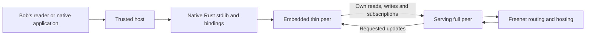

# Thin-peer proposal

Parent: [Freenet mobile SDK](README.md).

A thin peer opens a terminal connection to a serving full peer. That connection carries its reads, writes and subscriptions. The full peer performs onward routing, hosting and update distribution.

## 1. What the whitepaper and Core provide today

The whitepaper's primitives section describes peers and the ring with a single peer role ([peers and the ring](https://github.com/freenet/paper-1/blob/main/sections/03-primitives.tex)). As of 2026-09-22 no freenet-core issue or discussion names a thin or light peer. [Discussion 811](https://github.com/freenet/freenet-core/discussions/811) on smartphone platforms is the nearest thread.

## 2. Proposed role

Add versioned role negotiation and retain the accepted role for the connection's lifetime. Full peers handle onward routing, fallback routing, hosting and subscription roots. Send updates down the edge only for its authorized active subscriptions. Clean up downstream demand on disconnect.

| Core area | Required change |
| --- | --- |
| Connect operation | Negotiate role and protocol compatibility in request and response. |
| Connection manager | Register persistent terminal edges and preserve their negotiated role. |
| Ring | Assign hosting and subscription roots to full peers and maintain serving connections for thin peers. |
| Subscribe operation | Manage terminal subscriptions, downstream delivery and unsubscribe. |
| Connection lifecycle | Preserve role on completion and release state on disconnect. |
| Configuration and node construction | Apply role-specific topology rules and serving-peer settings. |

Thin-peer connections are open to peers with compatible protocols when serving capacity is available.

## 3. Filing and tracking

This role is AppKit's proposed Core extension. File it as a role-design proposal in freenet-core and track negotiation, terminal edges, subscription delivery and carrier acceptance against that proposal. The full-peer baseline stays the supported profile until the proposal lands. Related Core behavior the proposal must preserve: [GET routing for subscribed contracts #4222](https://github.com/freenet/freenet-core/issues/4222) and [placement migration #4440](https://github.com/freenet/freenet-core/issues/4440).

Record the proposal's issue number here once it is filed, and link discussion 811 from the proposal so the mobile context is visible upstream.
