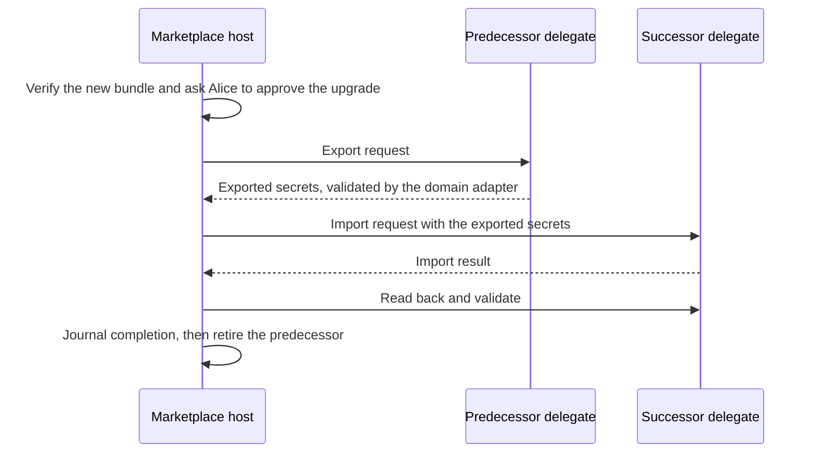

# Identity, recovery and device sync

Alice loses her phone while a skateboard sale is awaiting pickup. Recovery should restore her authority to finish that sale and decrypt its pickup details. The recovery screen must explain which records it can restore and which still require another device or service.

This plan owns user key protection, recovery coverage, delegate migration and opt-in device sync. [Bundles](../appkit/bundles.md) defines container and publication references. This plan owns publisher transfers and approval to move private access. [Hosts](../appkit/hosts.md) enforce access. The [mobile SDK](../freenet-mobile/README.md) integrates Core storage and native key systems.

## 1. Separate identities and authority

| Identity | Example | Who controls it |
| --- | --- | --- |
| Application | Marketplace's full container identity | Its verified container code and publisher-key parameters |
| Publisher signer | The key signing a Marketplace container update | Publisher-controlled signing and tested key backup |
| Application user | Alice's seller identity, a host-layer identity above Core | Alice through her enrolled key and recovery policy |
| Contributor | Carol's accepted work and review roles | Contributor identity plus Attribution's verified registration |
| Device | Alice's phone or laptop | Explicit enrollment by the user |
| Node transport | A peer connecting to the Freenet network | Node installation |
| Delegate | Code and parameters permitted to access a private namespace | Core's delegate key, derived from the code hash and parameters, plus the application's export and import policy |
| Financial account | Carol's payout destination | Financial service onboarding and recovery controls |

Each grant names the full application container identity and requested operation. The host binds it to the signed-in user and current session. Custom web, SDUI and native targets have separate execution contexts. Switching targets requires explicit authorization for access to keys and data.

Keep grants, publisher trust decisions and recovery authority outside application-readable storage. Identity export omits active session tokens. A restored device obtains new sessions through the trusted host.

## 2. Protected keys and records

Wrap Core's key encryption key with an iOS Keychain or Android Keystore backend. That backend is new Core work: Core ships systemd-credential, file and opt-in macOS/Windows keyring backends today. Delegates sign inside Wasm, so delegate keys live in Wasm memory and a hardware-signing adapter is also new Core work. Until both ship, key protection covers SDK-managed keys wrapped by a platform-protected key encryption key. The host returns scoped opaque handles to authorized application operations. SDUI actions and custom native applications reach Freenet through the same native SDK.

Core owns delegate secret namespaces. On a device node the namespace is the node: every app on the node shares the local scope, partitioned only by delegate key, and two apps that bundle the same delegate code and parameters share one secret store. In hosted mode the per-user secret context derives from a token the shell mints into browser local storage. Requests route by delegate key and parameters, with the origin contract as an optional attestation. The enrolled-key user identity in the table above is a host-layer concept that the host enforces.

The production profile requires Core-authenticated app sessions. [Session admission #5264](https://github.com/freenet/freenet-core/issues/5264) remains open, and the shell mints app-identity tokens on request for a supplied contract identity today. Implement and test the selected browser or native admission path before enabling protected operations. Core then binds each delegate request to that admitted session.

Record the key algorithm and recovery method for each key. Hardware-backed signing depends on the device's supported algorithms. For a device key that cannot be exported, define how the user authorizes a successor after losing the device. An encrypted database backup preserves data but requires the corresponding key to open it.

| Record | Storage owner | Recovery rule |
| --- | --- | --- |
| User identity and authorized device list | Identity delegate under user authority | Restore encrypted recoverable key material or authorize a successor using the recovery authority. |
| Delegate secrets | Core secret store | Restore only into the delegate with the same key, through Core's FNSX export bundle. |
| Pickup address and private agreement | Application's encrypted records | Restore content keys and retained encrypted records together. |
| Draft listing | Host's app-scoped database | Include in an explicit application backup. |
| Submitted purchase request | Application operation journal | Preserve canonical payload, original ID, agreement references and observed outcome. |
| Payment result | Payment service and signed contract | Refresh from the authority and reconcile with retained references. |
| Publisher signing key | Publisher's own recovery system | Follow publisher lineage, kept separate from consumer account recovery. |

On locked-device or invalidated-key errors, return a typed access state. Preserve pending operations and the original identity while the user restores access.

An explicit forget operation identifies the selected private records and keys, removes them from the protected local stores and verifies the result. Report any failed deletion. Explain the effect on active orders and which encrypted network copies, exported recovery packages or other enrolled devices remain. Exported copies and shared information remain with their recipients after local key deletion.

## 3. Customer-controlled recovery

Use an encrypted recovery package protected by a customer-held recovery secret as the baseline. For delegate secrets, the package wraps Core's encrypted FNSX export bundle and its import path, keyed to the same delegate key, rather than defining a parallel format. Core's export decrypts each secret to build that bundle, so a hosted operator sees plaintext during export. State that exposure in the hosted profile. Setup includes a recovery check so Alice proves she can reopen a sample package before relying on it. The package carries a format version, its creation time, its coverage and integrity checks.

The package includes:

- The user's recovery authority and identity lineage needed to authorize supported successor keys.
- Recoverable key material, with purpose and namespace recorded for each entry.
- Encrypted private records or verified references to copies whose availability is separately stated.
- Original contract code and parameter references required to locate retained records.
- Application schema versions, pending operation IDs and publication progress.
- A coverage report listing hardware-bound keys, missing records and service-managed accounts.

Use an authenticated encryption format with a versioned, reviewed cryptographic profile. Derive separate keys for separate purposes. Bound sizes before decoding, authenticate the complete metadata and reject unsupported profiles. Keep the recovery secret and any plaintext equivalent separate from the package.

Recovery requires the secret and an available package. Publish the package's storage location and retention responsibility to the user. A lost secret plus loss of all enrolled devices can make the covered identity unrecoverable. Explain that consequence during setup.

Contributor key recovery uses this plan's recovery package. [Attribution](../attribution/README.md) decides which evidence it accepts before it rebinds a contributor lineage, and payout changes remain subject to the financial service's checks. The financial service requires verified recovery evidence before transferring a balance.

## 4. Delegate upgrades

Treat the delegate's full code-and-parameter identity as the access boundary. Requests route by delegate key and parameters. A new delegate version has a new key and starts with an empty secret store.

The baseline is application-controlled migration. The predecessor delegate answers an export request, and the successor imports through the application. The migration library's delegate path follows this shape, so use it where its interfaces fit. Plaintext secrets transit the application during that round trip. State that exposure in the application's privacy documentation. Every AppKit delegate implements this export and import path. A delegate without it strands its secrets on re-key.

| Path | Authority | Executable API | Status |
| --- | --- | --- | --- |
| Application export and import | The application, under the user's approval in the host | Delegate messages through Core's client API and `freenet-migrate` delegate adapters | Baseline |
| Core-mediated provenance, deposit and merge | Core, from node-observed container installation | Proposed in [RFC #5255](https://github.com/freenet/freenet-core/issues/5255), with authorization, deposit and merge work still to define | Separately gated implementation |

The migration record identifies the predecessor, successor, namespace, approving user and migration revision. The host journals it. Preserve a recoverable copy until readback and application validation complete. Resume interrupted migrations idempotently.

Test a malicious successor, copied parameters, a caller-selected namespace, replayed approval and concurrent migrations. Retain original encoding information so an upgrade can find records created under earlier domain protocol versions. Define consent, selection policy and completeness checks before moving secrets.

[PR #5199](https://github.com/freenet/freenet-core/pull/5199) disabled Core's copy-forward of secrets to a successor, and that constraint stays. Regression tests confirm that the application round trip is the only path that moves secrets. Launch gate: whichever approved path protects private access passes these tests before Marketplace enables protected operations.

## 5. Opt-in device synchronization

Build continuous sync as a parallel track based on [RFC #5587](https://github.com/freenet/freenet-core/issues/5587). A user selects which applications and private data join the sync group. Enrollment requires proof from the user's recovery or already authorized device authority.

For example, Alice edits the pickup time on her phone while her offline laptop still holds the previous agreement. Sync preserves both signed proposals and lets Marketplace show the conflict. Marketplace resolves the competing proposals under its agreement rules.

- Authenticate the caller's full delegate identity through Core before binding it to a stable sync namespace.
- Encrypt records before publication and authenticate namespace, revision and encryption-key epoch. That epoch is a counter inside the sync group's records within one contract instance.
- Preserve concurrent siblings and deletion records, so a late device cannot resurrect deleted private data.
- Keep device enrollment, revocation and encryption-key epochs explicit. Removing a device rotates future access under the group's policy.
- Show which earlier material a revoked device could read. Key rotation protects future updates, while earlier copies remain on that device.
- Support bidirectional phone, tablet and desktop updates, including long offline periods.
- Give foreground sync byte, time and retry budgets. Use configurable bounded shards and measure small-record updates on cellular links.
- Publish signed membership transitions and preserve conflicts in competing device-list updates until authorized resolution.
- Keep recoverable encrypted copies and report incomplete synchronization. Network contracts provide best-effort availability.

Resident delegates can continue work only while their hosting peer runs. Mobile background suspension still follows the SDK lifecycle.

## 6. Delivery and acceptance

| Phase | Delivers | Done when |
| --- | --- | --- |
| 1. Caller and key boundaries | Scoped signing, protected stores and Core-authenticated delegate calls | One app cannot claim another app's namespace or use a stale session. |
| 2. Local recovery | Encrypted export/import, key coverage and application journals | Device-loss fixtures recover Alice's order without duplicating her request. |
| 3. Delegate migration | Application export and import round trip and resumable readback | Interrupted upgrades preserve recoverable secrets and reject unauthorized successors. |
| 4. Device sync, parallel track | Enrollment, encrypted records, concurrent changes and revocation | Offline devices converge without losing conflicts, reviving deletions or granting revoked future access. |

Phases 1 through 3 apply to the Marketplace launch profile. Phase 4 has a separate release gate.

Run tests for wrong recovery secrets, corrupt/truncated packages, unsupported versions, device lock, key invalidation, reinstall, interrupted import, explicit key deletion and exhausted storage. Check pending operations against the current contract state before retry. Confirm recovery restores only its declared coverage and that failed deletion remains visible.

Core dependencies include [private cross-peer sync #4560](https://github.com/freenet/freenet-core/issues/4560), [delegate contract operations reaching the network #5542](https://github.com/freenet/freenet-core/issues/5542), [resident delegates #5467](https://github.com/freenet/freenet-core/issues/5467) and [delegate subscription persistence #5493](https://github.com/freenet/freenet-core/pull/5493). All four are open or proposed. Test these integrations through the [mobile SDK acceptance cases](../freenet-mobile/README.md#8-acceptance-cases).

## 7. Publisher continuity

Routine updates retain the container validator code and publisher key. A change to either creates a successor container identity. The initial AppKit transfer convention uses matching statements authenticated by the two containers' normal signatures.

Launch uses the stock website container. Its parameters are a single Ed25519 verifying key, its update rule accepts only a strictly higher version, and each accepted update replaces the whole state. Three consequences follow:

| Container property | Consequence for this plan |
| --- | --- |
| Parameters are one verifying key, hashed into the identity | Adding a recovery key creates a successor identity. Publisher key loss is therefore final, and the publisher recovers from tested backups |
| Whole-state replacement per version | A transfer is the highest-version signed predecessor state a host has observed. Every later predecessor version carries the transfer statement, because a routine update without it would replace it |
| One accepted state per version | Two signed states at one version are a compromise signal. Hosts stop automatic transfer and the publisher resolves it outside the network |

1. Publish and verify the successor container.
2. Publish a higher version of the predecessor containing a transfer statement with the full predecessor and successor identities, a unique transfer ID and purpose.
3. Publish the successor's acknowledgement of those exact fields. The application definition carries the transfer or acknowledgement as optional metadata.
4. The host verifies both signed snapshots, retains the evidence and asks the user before moving private data or permissions.
5. Journal the approved local migration, verify its result and retain recovery evidence. New permission scopes require new grants. Moving delegate secrets uses the [application export and import path](#4-delegate-upgrades).

After a same-version divergence, the publisher publishes a higher predecessor version that names the competing digests and the selected successor. Hosts resume automatic transfer from that version.

A transfer link offers migration. Keep references to the user's current container and data throughout the transfer. Keep previously verified withdrawal records. Running the successor requires user approval, active application status and successful compatibility checks.

Attribution separately authorizes each product-to-container mapping. Existing payments retain their original references through the transfer. Protect publisher keys with tested backups and restore one in a fixture before launch. A custom container validator whose parameters carry a recovery key is a later option that would itself be a successor identity.

Test forged transfers, mismatched acknowledgements, conflicting successors, interruption, copied container parameters and expanded permissions. Restore a publisher backup in a fixture and prove it can sign a valid update to the original container.
