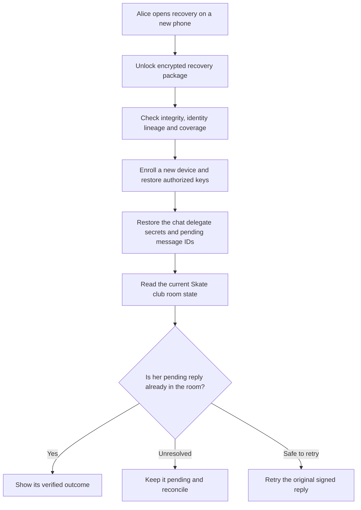

# Identity and recovery

Alice loses her phone while members of "Skate club" wait for her reply. Recovery should restore the room key and signing key the chat delegate holds for her, and the room secret that decrypts the room's messages. The recovery screen must explain which records it can restore and which still require another device or service.

This plan owns user key protection and recovery coverage. The [migration plan](../migration/README.md) owns delegate upgrades and publisher transfers, and [device sync](device-sync.md) is a parallel track with its own gate. [Bundles](../appkit/bundles.md) defines container and publication references. [Hosts](../appkit/hosts.md) enforce access. The [mobile SDK](../freenet-mobile/README.md) integrates Core storage and native key systems.

## 1. Separate identities and authority

| Identity | Example | Who controls it |
| --- | --- | --- |
| Application | River's full container identity | Its verified container code and publisher-key parameters |
| Publisher signer | The key signing a River container update | Publisher-controlled signing and tested key backup |
| Application user | Alice's member identity in River, a host-layer identity above Core | Alice through her enrolled key and recovery policy |
| Contributor | Carol's accepted work and review roles | Contributor identity plus Attribution's verified registration |
| Device | Alice's phone or laptop | Explicit enrollment by the user |
| Node transport | A peer connecting to the Freenet network | Node installation |
| Delegate | Code and parameters permitted to access a private namespace | Core's delegate key, derived from the code hash and parameters, plus the application's export and import policy |
| Financial account | Carol's payout destination | Financial service onboarding and recovery controls |

Each grant names the full application container identity and requested operation. The host binds it to the signed-in user and current session. Custom web, SDUI and native targets have separate execution contexts. Switching targets requires explicit authorization for access to keys and data.

Keep grants, publisher trust decisions and recovery authority outside application-readable storage. Identity export omits active session tokens. A restored device obtains new sessions through the trusted host.

## 2. Protected keys and records

Wrap Core's key encryption key with an iOS Keychain or Android Keystore backend. That backend is new Core work: Core ships systemd-credential, file and opt-in macOS/Windows keyring backends today. Delegates sign inside Wasm, so delegate keys live in Wasm memory and a hardware-signing adapter is also new Core work. Until both ship, key protection covers SDK-managed keys wrapped by a platform-protected key encryption key. The host returns scoped opaque handles to authorized application operations. SDUI actions and custom native applications reach Freenet through the same native SDK.

Core owns delegate secret namespaces. On a device node the namespace is the node: every app on the node shares the local scope, partitioned only by delegate key, and two apps that bundle the same delegate code and parameters share one secret store. In hosted mode the per-user secret context derives from a token the shell mints into browser local storage. Requests route by delegate key and parameters, with the origin contract as an optional attestation. The enrolled-key user identity in the table above is a host-layer concept that the host enforces.

Core-authenticated app sessions are open Core work, [session admission #5264](https://github.com/freenet/freenet-core/issues/5264). The [host plan](../appkit/hosts.md#features-missing-in-freenet-for-appkit-to-work) lists it with the other Core features AppKit needs.

Record the key algorithm and recovery method for each key. Hardware-backed signing depends on the device's supported algorithms. For a device key that cannot be exported, define how the user authorizes a successor after losing the device. An encrypted database backup preserves data but requires the corresponding key to open it.

| Record | Storage owner | Recovery rule |
| --- | --- | --- |
| User identity and authorized device list | Identity delegate under user authority | Restore encrypted recoverable key material or authorize a successor using the recovery authority. |
| Delegate secrets | Core secret store | Restore only into the delegate with the same key, through Core's FNSX export bundle. |
| Private room messages | Room contract, encrypted under the room secret per River's [privacy model](https://github.com/freenet/river/blob/main/README.md#privacy-model) | Restore the room secret with the chat delegate's secrets, then read the encrypted messages from the room contract. |
| Outbound DM plaintext | The chat delegate's secret store | Restore with the delegate's other secrets through Core's FNSX export bundle. |
| Pending reply | Application operation journal | Preserve canonical payload, original ID, room reference and observed outcome. |
| Room members and bans | Room contract state | Refresh from the room contract and reconcile with retained references. |
| Publisher signing key | Publisher's own recovery system | Follow publisher lineage, kept separate from consumer account recovery. |

On locked-device or invalidated-key errors, return a typed access state. Preserve pending operations and the original identity while the user restores access.

An explicit forget operation identifies the selected private records and keys, removes them from the protected local stores and verifies the result. Report any failed deletion. Explain the effect on rooms the user owns or has joined and which encrypted network copies, exported recovery packages or other enrolled devices remain. Exported copies and shared information remain with their recipients after local key deletion.

## 3. Customer-controlled recovery

Use an encrypted recovery package protected by a customer-held recovery secret as the baseline. River's CLI exports and imports a River identity today with `riverctl identity export` and `riverctl identity import`, per [cli/README.md](https://github.com/freenet/river/blob/main/cli/README.md). The host's package adds the coverage, versioning and integrity checks below. For delegate secrets, the package wraps Core's encrypted FNSX export bundle and its import path, keyed to the same delegate key, rather than defining a parallel format. Core's export decrypts each secret to build that bundle, so a hosted operator sees plaintext during export. State that exposure in the hosted profile. Setup includes a recovery check so Alice proves she can reopen a sample package before relying on it. The package carries a format version, its creation time, its coverage and integrity checks.

The package includes:

- The user's recovery authority and identity lineage needed to authorize supported successor keys.
- Recoverable key material, with purpose and namespace recorded for each entry.
- Encrypted private records or verified references to copies whose availability is separately stated.
- Original contract code and parameter references required to locate retained records.
- Delegate protocol versions, pending operation IDs and publication progress.
- A coverage report listing hardware-bound keys, missing records and service-managed accounts.

Use an authenticated encryption format with a versioned, reviewed cryptographic profile. Derive separate keys for separate purposes. Bound sizes before decoding, authenticate the complete metadata and reject unsupported profiles. Keep the recovery secret and any plaintext equivalent separate from the package.

Recovery requires the secret and an available package. Publish the package's storage location and retention responsibility to the user. A lost secret plus loss of all enrolled devices can make the covered identity unrecoverable. Explain that consequence during setup.

Contributor key recovery uses this plan's recovery package. [Attribution](../attribution/README.md) decides which evidence it accepts before it rebinds a contributor lineage, and payout changes remain subject to the financial service's checks. The financial service requires verified recovery evidence before transferring a balance.

## 4. Delivery and acceptance

| Phase | Delivers | Done when |
| --- | --- | --- |
| 1. Caller and key boundaries | Scoped signing, protected stores and Core-authenticated delegate calls | One app cannot claim another app's namespace or use a stale session. |
| 2. Local recovery | Encrypted export/import, key coverage and application journals | Device-loss fixtures recover Alice's rooms and secrets without duplicating a message. |

Both phases apply to the [Marketplace](../marketplace/README.md) launch profile. [Device sync](device-sync.md) has a separate release gate.

Run tests for wrong recovery secrets, corrupt/truncated packages, unsupported versions, device lock, key invalidation, reinstall, interrupted import, explicit key deletion and exhausted storage. Check pending operations against the current contract state before retry. Confirm recovery restores only its declared coverage and that failed deletion remains visible.
