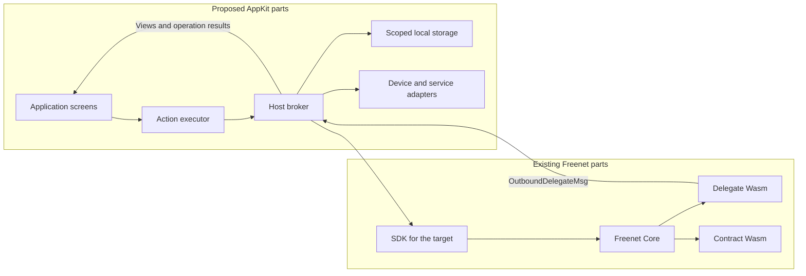

# Refactor plan: data-actions.md into today and proposes sections

Status: executed on 2026-09-22 in [PR #1](https://github.com/EVY-Platform/evy-freenet-plans/pull/1).

Rewrite [appkit/data-actions.md](../appkit/data-actions.md) in the shape [appkit/bundles.md](../appkit/bundles.md) took on 2026-09-22. The intro table lists one row per major change and doubles as the table of contents. Each body section mirrors one row and splits into "What Freenet provides today" and "What AppKit proposes". A reference recap and an acceptance list close the plan.

The current file has ten sections that mix existing Core behavior with proposed AppKit conventions in the same paragraphs. Bob's Make offer example in the intro stays as the running example, and every section gets its own Alice, Bob or Carol example.

## 1. Rules the rewrite follows

| Rule set | Where | What it means for this rewrite |
| --- | --- | --- |
| Plain language | [AGENTS.md](../AGENTS.md) | State what will happen. Cut "Old approach was", "We won't", "We can't". Sentence case headings, straight quotes, no em dashes, no mid-sentence semicolons, no bold labels followed by a colon |
| Wording | The `unslop` skill | Prefer tables, bullet lists and mermaid diagrams over prose. Concrete Alice, Bob and Carol examples over abstract terms. Active voice. Plain words. Cut sentences that could sit unchanged in another project's docs |
| Plan conventions | The 2026-09-22 bundles rewrite | Introduce each identifier in the section that first needs it, with a worked example. Two `###` subheadings per section, named exactly "What Freenet provides today" and "What AppKit proposes". Close with a recap table that links back |
| One canonical home | Sibling plans | Link to the canonical section instead of restating it. The SDK paths table lives in [freenet-mobile](../freenet-mobile/README.md#0-feasibility-and-existing-evidence), browser gates in [hosts section 3](../appkit/hosts.md#3-browser-hosting), delegate upgrades in [identity section 4](../identity/README.md#4-delegate-upgrades), container references in [bundles](../appkit/bundles.md#7-reference-recap) |
| Checker | `python3 maintenance/check-plans.py --strict` | Exit 0 before every commit. It checks relative links, heading anchors, em dashes, curly quotes, mid-sentence semicolons, British spellings and two banned phrasings listed in the script's `banned` table |

Every "What Freenet provides today" sentence cites behavior an engineer can verify in the sources listed in [section 4](#4-source-facts-for-what-freenet-provides-today). Every "What AppKit proposes" sentence describes work AppKit will do.

## 2. Files

| File | Change | Why |
| --- | --- | --- |
| `appkit/data-actions.md` | Rewrite in place | The plan being restructured |
| `appkit/hosts.md` | Retarget the links on lines 149 and 187 | They point at `#5-offline-operations-and-cancellation` and `#10-application-migrations`, which the new headings replace |
| `appkit/bundles.md` | Retarget the link on line 127 | Points at `#10-application-migrations` |
| `marketplace/README.md` | Retarget the link on line 230 | Points at `#10-application-migrations` |
| `atlas-sample/README.md` | Retarget the link on line 29 | Points at `#2-declarative-actions-and-delegate-interface` |
| `README.md` | No change | The roadmap row on line 127 still describes the plan |
| `maintenance/check-plans.py` | No change | The checker already enforces every rule above |

No other file links into `data-actions.md` with an anchor. `evy/README.md`, `reputation-proofs/README.md`, `freenet-mobile/README.md`, `appkit/sdui.md` and `appkit/bundles.md` line 3 link to the file without an anchor and keep working.

## 3. Target structure

### Intro

Two paragraphs, then the table. Paragraph one names the plan's scope and links hosts, SDUI and bundles. Paragraph two keeps Bob's Make offer walk-through from the current intro. SDK paths stay in the [mobile plan](../freenet-mobile/README.md#0-feasibility-and-existing-evidence) and get no paragraph here.

Paste this table after the intro. Every anchor must match the headings in the next subsection.

```markdown
| Section | What Freenet provides today | What AppKit proposes |
| --- | --- | --- |
| [1](#1-who-does-what) | Core's contract and delegate runtimes and delegate secret namespaces | The action executor, the host broker and the application delegate convention |
| [2](#2-declared-actions) | Application code that calls the client API directly | Versioned action definitions with bounded steps, run by the installed executor |
| [3](#3-delegate-requests-and-results) | `ApplicationMessages` with opaque payload bytes and a runtime-attested `MessageOrigin` | A typed request and result protocol inside the payload, with fixtures and correlation |
| [4](#4-reads-views-and-freshness) | `Get`, `Subscribe`, `GetResponse` and `UpdateNotification` keyed by contract, with no timestamps | Logical resources, declared views, value states and host-recorded freshness |
| [5](#5-values-and-local-storage) | Opaque state bytes in Core and the browser storage gates | A shared value model, storage namespaces and cache keys |
| [6](#6-submitting-updates-and-pending-operations) | `Update`, total merge in `update_state` and an `UpdateResponse` summary from the local node | Operation IDs, a durable journal and the lifecycle from Queued to Accepted or Superseded |
| [7](#7-device-and-service-adapters) | The contract sandbox policy and delegate user prompts | Content-addressed blobs, scoped device handles and approved service adapters |
| [8](#8-limits-and-security) | Core's Wasm state, context and deadline limits | Host limits for actions, views, subscriptions and storage, plus session authority |
| [9](#9-application-migrations) | `freenet-migrate` carry-forward, pointer resolution and delegate export and import | Host-coordinated migration with application-owned adapters and per-domain policies |
```

### Headings

```text
## 1. Who does what
## 2. Declared actions
## 3. Delegate requests and results
## 4. Reads, views and freshness
## 5. Values and local storage
## 6. Submitting updates and pending operations
## 7. Device and service adapters
## 8. Limits and security
## 9. Application migrations
## 10. Reference recap
## 11. Acceptance
```

Sections 1 to 9 each carry `### What Freenet provides today` and `### What AppKit proposes`. Sections 10 and 11 have no subsections, as in bundles.

### Where the current text goes

| Current text | New home |
| --- | --- |
| Intro lines 3 to 7 | Intro |
| 1 Responsibilities table | Section 1, split into a today table and a proposes table |
| 1 last paragraph (Core owns secret namespaces, host databases, identity link) | Section 1 today for Core and bindings. Section 5 proposes for host databases |
| 2 first paragraph (versioned definitions, prove with Atlas) | Section 2 proposes |
| 2 interface table | Section 2 proposes, merged with the section 3 operation family table into one step table with a "Detailed in" column |
| 2 paragraph on definitions, caps, new action versus new primitive | Section 2 proposes |
| 2 paragraph on host reads and submits, delegate adapters, signatures | Section 3 proposes and section 6 proposes |
| 2 paragraph on deterministic encoding, typed errors, correlation, byte ownership | Section 3 proposes |
| 2 paragraph on host-assigned container identity, content reference, user, installation, generation | Section 3 proposes, linking [bundles section 4](../appkit/bundles.md#4-host-execution-from-the-definition) and [hosts section 2](../appkit/hosts.md#2-who-controls-what) |
| 2 paragraph on Core attaching the originating contract id | Section 3 today for `MessageOrigin`. Section 3 proposes for delegate policy and unverified copies |
| 2 paragraph on validating arguments, one archive snapshot, recording delegate code | Section 2 proposes for the snapshot. Section 8 proposes for validation |
| 3 mermaid flowchart | Section 1, redrawn with existing and proposed subgraphs |
| 3 operation family table | Merged into the section 2 step table |
| 3 paragraph on logical resources, views, shards | Section 4 proposes |
| 3 value states paragraph | Section 4 proposes |
| 3 freshness paragraph | Section 4 today for the response fields. Section 4 proposes for max age and stale |
| 4 shared values paragraph | Section 5 proposes |
| 4 storage namespaces paragraph | Section 5 proposes |
| 4 cached projections paragraph | Section 5 proposes |
| 4 reference counting and Unsubscribe paragraph | Section 4 today for stdlib 0.10 facts. Section 4 proposes for reference counting |
| 5 operation ID paragraph and journal fields | Section 6 proposes |
| 5 state diagram | Section 6 proposes |
| 5 merge is total paragraph | Section 6 today for merge and the summary. Section 6 proposes for Accepted, Superseded and Rejected |
| 5 retry and repair paragraph | Section 6 proposes |
| 5 Alice lowers her price example | Section 6 example |
| 5 cancellation paragraph | Section 6 today for transport correlation. Section 6 proposes for the durable queue |
| 6 attachments and pickers | Section 7 proposes |
| 7 execution paragraph | Section 8 today for Core limits. Section 8 proposes for host limits |
| 7 limits and security paragraphs | Section 8 proposes |
| 8 completion evidence paragraph | Section 7 proposes |
| 8 checkout paragraph | Section 7 today for popups. Section 7 proposes for the adapter |
| 9 consumer table | Section 1 proposes keeps the memory preview row. The SDK rows duplicate the mobile plan's SDK paths table and are dropped |
| 9 feasibility and acceptance paragraphs | Section 11 |
| 10 predecessor registry paragraph | Section 9 today for the crates. Section 9 proposes for the build check |
| 10 host coordination, recovery policy, delegate migration, fixtures | Section 9 proposes, with the resolver and PR 5199 facts in section 9 today |

## 4. Source facts for "What Freenet provides today"

Verified on 2026-09-22 against freenet-stdlib 0.10.0 from the local cargo registry, freenet-core `ios` branch commit 0e9ced57 at `~/Desktop/Repos/freenet-core`, and freenet-migrate 0.6.0 from the registry. Core's lockfile pins stdlib 0.10.0. Local registry paths sit under `~/.cargo/registry/src/index.crates.io-1949cf8c6b5b557f/`.

### Client API, stdlib 0.10.0

Source: `freenet-stdlib-0.10.0/src/client_api/client_events.rs`, published from [rust/src/client_api](https://github.com/freenet/freenet-stdlib/tree/main/rust/src/client_api).

| Item | Fact | Used in section |
| --- | --- | --- |
| `ClientRequest` | `DelegateOp`, `ContractOp`, `Disconnect`, `Authenticate { token }`, `NodeQueries`, `Close`, `StreamChunk` | 2, 8 |
| `ContractRequest` | `Put { contract, state, related_contracts, subscribe, blocking_subscribe }`, `Update { key, data }`, `Get { key, return_contract_code, subscribe, blocking_subscribe }`, `Subscribe { key, summary }`. No Unsubscribe variant | 4, 6 |
| `DelegateRequest` | `ApplicationMessages { key, params, inbound }`, `RegisterDelegate { delegate, cipher, nonce }`, `UnregisterDelegate(key)`. A source comment records that the predecessor-registering variant was removed in 0.9.0 after [#5198](https://github.com/freenet/freenet-core/issues/5198) and [#5199](https://github.com/freenet/freenet-core/pull/5199) | 3, 9 |
| `ContractResponse` | `GetResponse { key, contract, state }`, `PutResponse { key }`, `UpdateNotification { key, update }`, `UpdateResponse { key, summary }`, `SubscribeResponse { key, subscribed }`, `NotFound { instance_id }`. No timestamp field on any variant | 4, 6 |
| `HostResponse::DelegateResponse` | `{ key, values: Vec<OutboundDelegateMsg> }` | 3 |
| Request correlation | Responses match by variant and contract key. There is no request id. Tracked as [#5048](https://github.com/freenet/freenet-core/issues/5048) | 4, 6 |
| Unsubscribe | Core's `client_events.rs` names `ContractRequest::Unsubscribe` as upcoming near line 2184, and ties the delegate-side unsubscribe variants to [#5600](https://github.com/freenet/freenet-core/issues/5600) near line 1700. A client subscription ends with the client connection | 4 |

### Delegate interface, stdlib 0.10.0

Source: `freenet-stdlib-0.10.0/src/delegate_interface.rs`, published from [rust/src/delegate_interface.rs](https://github.com/freenet/freenet-stdlib/blob/main/rust/src/delegate_interface.rs).

| Item | Fact | Used in section |
| --- | --- | --- |
| `DelegateInterface::process` | Takes `ctx`, `parameters`, `origin: Option<MessageOrigin>` and one `InboundDelegateMsg`. Returns `Vec<OutboundDelegateMsg>` | 3 |
| `MessageOrigin` | `WebApp(ContractInstanceId)` when the runtime resolved the caller's auth token to a contract. `Delegate(DelegateKey)` for a delegate-to-delegate call, which replaces any inherited web app origin. Marked `non_exhaustive` | 3 |
| `ApplicationMessage` | `{ payload: Vec<u8>, context: DelegateContext, processed: bool }`. The payload is opaque bytes | 3 |
| `DelegateContext::MAX_SIZE` | 409,600 bytes | 3, 8 |
| `InboundDelegateMsg` | `ApplicationMessage`, `UserResponse`, `GetContractResponse`, `PutContractResponse`, `UpdateContractResponse`, `SubscribeContractResponse`, `ContractNotification`, `DelegateMessage`, `UnsubscribeContractResponse` (new in 0.10.0), `WakeupFired { tag }` | 3 |
| `OutboundDelegateMsg` | `ApplicationMessage`, `RequestUserInput`, `ContextUpdated`, `GetContractRequest`, `PutContractRequest`, `UpdateContractRequest`, `SubscribeContractRequest`, `SendDelegateMessage`, `UnsubscribeContractRequest` (new in 0.10.0) | 3, 6 |
| Wire rule | New enum variants append at the end. Documented in the enum comments and stdlib's `WIRE-FORMAT.md` | 3 |

### Contract interface, stdlib 0.10.0

Source: `freenet-stdlib-0.10.0/src/contract_interface/`, published from [rust/src/contract_interface](https://github.com/freenet/freenet-stdlib/tree/main/rust/src/contract_interface).

| Item | Fact | Used in section |
| --- | --- | --- |
| `ContractInterface` | `validate_state(parameters, state, related)` returns `Valid`, `Invalid` or `RequestRelated`. `update_state(parameters, state, Vec<UpdateData>)` returns `UpdateModification { new_state, related }`. `summarize_state` returns `StateSummary`. `get_state_delta(parameters, state, summary)` returns `StateDelta` | 1, 6 |
| `UpdateData` | `State`, `Delta`, `StateAndDelta`, `RelatedState`, `RelatedDelta`, `RelatedStateAndDelta` | 6 |
| Key derivation | `ContractKey::from_params_and_code` and `ContractInstanceId::from_params` hash with BLAKE3 in `key.rs`. `DelegateKey` uses the same scheme in `delegate_interface.rs`. The freenet-migrate README states the rule as BLAKE3 over the code hash followed by the parameter bytes | 1, 9 |
| State bytes | `State`, `StateDelta` and `StateSummary` are byte wrappers. Their meaning belongs to the contract | 5 |

### Core, `ios` branch 0e9ced57

| Item | Fact | Source | Used in section |
| --- | --- | --- | --- |
| Contract state limit | `MAX_STATE_SIZE` is 50 MiB | `crates/core/src/wasm_runtime/state_store.rs` line 40 | 7, 8 |
| Secret export limit | `MAX_EXPORT_TOTAL_PLAINTEXT_BYTES` is 256 MiB | `crates/core/src/wasm_runtime/secret_export.rs` line 125 | 9 |
| Guest deadline | Contract and delegate execution has a wall-clock deadline, with the not-started case handled per [#4864](https://github.com/freenet/freenet-core/issues/4864) | `crates/core/src/wasm_runtime/runtime.rs` around line 389 | 8 |
| Update summary | `UpdateResponse { key, summary }` carries a summary the local node computed | `crates/core/src/contract/executor/runtime/contract_ops.rs` lines 68, 139, 216 and `operations/update.rs` line 780 | 6 |
| Contract sandbox policy | Content served from a contract gets a sandbox Content Security Policy that allows the node origin, `blob:` and `data:` for `default-src` and `connect-src`. Popups escape it | `crates/core/src/server/client_api.rs` line 111. Canonical text in [hosts section 3](../appkit/hosts.md#3-browser-hosting) | 7 |
| Delegate prompts | Core renders `RequestUserInput` prompts and shows a `CallerIdentity` of `None` or `WebApp(contract id)`. A delegate caller variant is reserved for [#3860](https://github.com/freenet/freenet-core/issues/3860) | `crates/core/src/contract/user_input.rs` lines 41 to 65 | 7, 8 |
| Delegate output routing | Core delivers a delegate's output to local clients by locality. The source comment states that unattested local clients are not separated from each other | `crates/core/src/contract/delegate_app_registry.rs` lines 260 to 282 | 3, 8 |
| Mobile crate | `FreenetNode` exposes `start`, `stop`, `status`, `api_port`, `set_update_listener`, `get(key, subscribe)`, `put(wasm, params, state, subscribe)`, `update_delta(key, delta)`, `subscribe(key)`, `connected_peers` and `wait_for_peers`. No delegate operation. Local branch only | `crates/mobile/src/api.rs` | 1, 3 |
| Session admission | The shell mints app-identity tokens for a supplied contract identity. Core-authenticated sessions are open work in [#5264](https://github.com/freenet/freenet-core/issues/5264) | [hosts section 3](../appkit/hosts.md#3-browser-hosting) | 3, 8 |

### freenet-migrate 0.6.0 and freenet-migrate-build 0.2.0

Source: `freenet-migrate-0.6.0/src/lib.rs` and module docs. Repository: [freenet-migrate](https://github.com/freenet/freenet-migrate). River pins freenet-migrate 0.5 and freenet-migrate-build 0.2 in `~/Desktop/Repos/river`.

| Item | Fact | Used in section |
| --- | --- | --- |
| Lineage registry | `freenet-migrate-build` generates `Lineage`, `ContractLineageEntry` and `DelegateLineageEntry` consts from a TOML registry at build time. River keeps `legacy_delegates.toml` and `common/legacy_room_contracts.toml` and fails the build when the generated table is empty | 9 |
| Contract carry-forward | `predecessor_ids` rebuilds old ids from code hash and parameters. `ProbeDriver`, `contract_probe` and `migrate_contract` walk predecessors newest first under a `SelectionPolicy`. `CarryForward` runs `verify()` after `merge()`, with `PermissiveValidatorAck` as the loud opt-out. `policy_check` asserts commutative, idempotent and order-invariant merges | 9 |
| Forward discovery | `resolve_app_pointer`, `PointerResolver` and `PointerFloor` read the frozen pointer contract from [#5194](https://github.com/freenet/freenet-core/issues/5194). The author key is the whole trust anchor | 9 |
| Delegate carry-forward | `migrate_delegate_secrets` and `register_delegate_with_migration`, parameterized by `MigrationAuthorization`, over `PredecessorSecretsIo` and `SuccessorSecretsIo`. Delegate-side primitives `handle_export_request`, `import_secrets_once` and `import_predecessor_secrets_once` over the `SecretStore` trait, with a migrated marker against resurrection | 9 |
| Version note | Core pins stdlib 0.10.0. The [mobile plan](../freenet-mobile/README.md#0-feasibility-and-existing-evidence) already records that the migrate runtime targets an older stdlib line and asks for a compatibility check. Link to it rather than restating | 9 |

## 5. Section specifications

Each subsection below gives the content for one new section. "Today" and "Proposes" list the bullets to write under the two `###` subheadings. Keep each bullet to one or two sentences in the plan itself.

### Section 1. Who does what

Today:

- Core runs contract Wasm through `ContractInterface` and delegate Wasm through `DelegateInterface::process`.
- Core owns delegate secret namespaces, as [identity section 2](../identity/README.md#2-protected-keys-and-records) describes.
- Today table with rows for contract and delegate. The SDK's carrier role sits in [hosts section 1](../appkit/hosts.md#1-how-the-parts-fit-together) and the mobile plan.

Proposes:

- Proposes table with rows for the action executor, host, application delegate convention, custom application orchestration and the memory preview adapter from current section 9.
- The redrawn flowchart. Replace the current section 3 diagram with this one:



Example: Bob taps Make offer. The executor runs the declared steps, the host checks Marketplace's grant, Core runs the Marketplace delegate, and peers validate the offer under the Marketplace contract.

### Section 2. Declared actions

Today:

- A web application orchestrates its own requests. Its JavaScript or Rust code sends `ClientRequest::ContractOp` and `ClientRequest::DelegateOp` over the client API and handles the responses itself.
- The website container holds `index.html` and whatever code it loads, per [bundles section 1](../appkit/bundles.md#1-the-website-container).

Proposes:

- Versioned action definitions in the bundle's `actions/` directory reference named resources, input and output schemas and supported step versions. Bounded sequences and conditional branches. Caps on steps, input sizes, expression depth and concurrent requests.
- A new action assembled from supported steps arrives in a bundle. A new executor primitive requires a host update.
- The merged step table. Columns: Step, Returns, Detailed in. Rows: invoke action, read or observe, call delegate, submit, local operation, blob put and get, device or service operation, time and randomness, cancel or close. Fill Returns from the current section 3 table and point Detailed in at sections 3 to 8.
- Definitions and schemas load from one verified archive snapshot. The session records the exact delegate code, parameters and protocol it selected. Hosts adopt updates after the [installation checks](../appkit/hosts.md#6-installing-and-updating-applications).
- Prove the definitions with Atlas before adopting them across products.

Example: Carol's Make offer button names `marketplace.makeOffer` with the listing id and amount. The action's steps read the `listingDetails` view, call the Marketplace delegate to prepare the offer and submit the prepared bytes. Carol ships a new "Counter offer" action from the same steps in the next bundle. A step that opens the camera needs a host update first. The [SDUI plan](../appkit/sdui.md#2-connecting-controls-to-data-and-actions) shows how a screen control binds to this action.

Identifiers introduced: action definition, step version, action protocol version.

### Section 3. Delegate requests and results

Today:

- `DelegateRequest::ApplicationMessages` carries the delegate key, its parameters and a list of inbound messages. `ApplicationMessage` holds opaque payload bytes, a `DelegateContext` of at most 409,600 bytes and a processed flag.
- The delegate's `process` function receives `Option<MessageOrigin>`. `WebApp(contract id)` names the calling web app when the runtime resolved its token. `Delegate(key)` names a calling delegate and replaces any web app origin.
- The delegate replies with `OutboundDelegateMsg` values, which reach the client as `HostResponse::DelegateResponse`. It can also ask Core for contract reads, updates and subscriptions and prompt the user with `RequestUserInput`.
- Core delivers delegate output to local clients by locality, so two unattested local clients share it. Core-authenticated sessions wait on [#5264](https://github.com/freenet/freenet-core/issues/5264).
- The mobile crate has no delegate operation yet. The [mobile plan](../freenet-mobile/README.md#2-embedded-node-and-native-api) lists it as a feasibility deliverable.

Proposes:

- A typed request and result convention inside the payload bytes. Requests carry a protocol version, a request id, typed arguments and bounded record bytes. Results carry a typed projection, prepared operation bytes or a defined error. Fixtures define the exact encodings.
- Deterministic encoding, typed errors, request correlation and ownership of transferred bytes for each language binding. Bound large payloads and measure copying across bindings. Reject conflicting request-id reuse, unknown handles and completions from expired sessions.
- Delegate policy keys on the `MessageOrigin` contract id alone. User, installation and session generation are host bookkeeping that the host enforces before a request reaches Core. A delegate treats copies of those fields inside the payload as unverified data. Link [hosts section 2](../appkit/hosts.md#2-who-controls-what) and [bundles section 4](../appkit/bundles.md#4-host-execution-from-the-definition) for the host-assigned fields.
- Application adapters supply domain codecs, canonical signing inputs and view projections. They validate source identities and signatures required by each domain.
- A delegate's prepared update still passes host authorization and contract validation.

Example: Bob's request is `prepareOffer` version 1 with request id 17, listing id and amount 8000 minor units of USD, plus the listing record bytes the host read. The Marketplace delegate checks the listing's minimum, signs the offer and returns prepared update bytes. Core stamps the message with `WebApp(Marketplace contract id)`. An amount below the minimum returns the typed error `below_minimum`, which the form shows.

Identifiers introduced: delegate protocol version, request id.

### Section 4. Reads, views and freshness

Today:

- `Get { key, return_contract_code, subscribe }` returns `GetResponse { key, contract, state }`. `Subscribe { key, summary }` returns `SubscribeResponse` and later `UpdateNotification { key, update }`. `NotFound` reports a missing instance.
- No response carries a timestamp. Freshness is whatever the client records.
- A subscription ends with the client connection. Core lists `ContractRequest::Unsubscribe` as upcoming, and its delegate-side unsubscribe variants trace to [#5600](https://github.com/freenet/freenet-core/issues/5600).
- Core serves `Get` from local cache when it holds the state, as the [mobile plan](../freenet-mobile/README.md#6-storage-and-recovery) records.

Proposes:

- Definitions bind logical resources such as `marketplace.listings` and `identity.profile` to declared contracts and delegates. Views such as `listingDetails` declare input and output types and a maximum age.
- The host performs bounded queries. The domain delegate interprets the returned records. Large search uses bounded region and category index shards. A delegate may return a proposed shard reference, which the host checks against declared resource and query limits before fetching it.
- Value states `loading`, `ready`, `stale`, `missing`, `error` and `permission_required`, in a table with one Alice example per row. `ready` means a verified snapshot through the selected provider. Permission prompts belong to the host.
- Freshness is the host-recorded time it received the response, or a publisher timestamp the application encodes in contract state and declares in the view schema. `stale` means that time exceeds the view's maximum age, so the screen shows the value with its observation time and the host refreshes it.
- The host reference-counts subscriptions. Releasing a view releases its demand. Other active views keep theirs. When Unsubscribe ships, the reference count decides when to send it. Background shutdown follows the [SDK lifecycle](../freenet-mobile/README.md#5-connectivity-and-lifecycle) and invalidates late callbacks.

Example: `listingDetails` declares a maximum age of five minutes. Alice opens her skateboard listing on the train. The host last received the listing seven minutes ago, so the screen shows the price with "seen 7 minutes ago" and the host refreshes when the network returns.

Identifiers introduced: logical resource, view, maximum age, value state.

### Section 5. Values and local storage

Today:

- Contract state, deltas and summaries are byte wrappers. Their meaning belongs to the contract and the application.
- Core stores contract state up to 50 MiB and delegate state and secrets. The browser sandbox has no durable storage until [#5165](https://github.com/freenet/freenet-core/issues/5165) and [#5254](https://github.com/freenet/freenet-core/issues/5254) land, per [hosts section 3](../appkit/hosts.md#3-browser-hosting). Native stores use host-supplied paths, per the [mobile plan](../freenet-mobile/README.md#2-embedded-node-and-native-api).

Proposes:

- The shared value model: null, missing, booleans, integers, decimals, strings, byte references, timestamps, durations, lists and objects. Shared fixtures define numeric ranges, decimal encoding, comparisons and missing-value behavior. Money is an application domain object with an explicit currency and integer minor units.
- Storage namespaces include user, app identity, installation and schema version. Permission grants live in host-only storage. Route parameters are immutable for a route entry. Session values expire with the session. Drafts follow the declared flow policy.
- Cached projections render with stale metadata. The host refreshes their backing state and notifies only changed views. Cache keys include contract identity and the definition, delegate and schema versions. Sensitive local data is encrypted with platform-backed keys. Recovery coverage is in the [identity plan](../identity/README.md#2-protected-keys-and-records).
- Time and randomness come from the host, with deterministic substitutes in tests.

Example: Alice's 80 dollar price is `{ currency: "USD", minor: 8000 }`. Her draft lives under her user, the Marketplace `app_ref`, her phone's installation id and schema version 3. Reinstalling Marketplace creates a new installation id, so the old draft namespace is unreadable and the host offers recovery instead.

Identifiers introduced: storage namespace, cache key.

### Section 6. Submitting updates and pending operations

Today:

- `Update { key, data }` sends `UpdateData` as state, delta or both. The contract's `update_state` merges it and returns `UpdateModification`. Merge is total: an update merges into whichever replica receives it.
- `UpdateResponse { key, summary }` carries a summary the local node computed. Subscribers receive `UpdateNotification`. A delegate can send `UpdateContractRequest` and receive `UpdateContractResponse`.
- Responses match by variant and key with no request id ([#5048](https://github.com/freenet/freenet-core/issues/5048)). A timeout after remote acceptance leaves the outcome unknown ([#3465](https://github.com/freenet/freenet-core/issues/3465)).

Proposes:

- Allocate and persist the operation id before delegate preparation or other side effects. Correlate retries with that id and make delegate state changes idempotent. Save the exact prepared bytes before submission and before showing the operation as pending.
- The journal record, kept as the current code block: operation id, `app_ref`, originating content reference, action protocol, delegate reference, resource reference, canonical payload, base summary if required, created time, retry policy, status and completion evidence. Link `app_ref` and the content reference to [bundles section 2](../appkit/bundles.md#2-publishing-and-evidence).
- The current state diagram. Accepted means merged locally and later observed in a `GetResponse` or `UpdateNotification`. Superseded means a read shows the contract's merge chose a competing record. Rejected covers local validation failures before submission. Unresolved covers a missing response until reconciliation observes the record or a competitor.
- Retrying the same action preserves its operation id and exact payload. Repair that changes the payload creates a successor operation. The host refreshes state and asks the delegate to reconcile before retrying, and rechecks permissions before queued operations run.
- Cancellation stops local cancellable work. A submitted mutation stays tracked until its outcome is known. Core transport correlation and the durable application queue have separate responsibilities.

Examples: keep both. Bob and another buyer submit conflicting offers, the Marketplace merge rule picks one, and the other reads Superseded. Alice lowers her price offline while her laptop withdraws the listing, and on reconnect the host obtains the delegate's conflict result and keeps her draft for repair.

Identifiers introduced: operation id, journal record, successor operation.

### Section 7. Device and service adapters

Today:

- Content served from a contract runs under Core's sandbox policy. It loads bytes from the node origin, `blob:` and `data:`, and only popups reach another origin. The canonical text is [hosts section 7](../appkit/hosts.md#7-photos-files-and-external-services).
- Contract state is capped at 50 MiB, so a photo pack lives outside contract state.
- Core prompts the user for delegate `RequestUserInput` requests and shows the attested caller. Device access on native has no Core support and belongs to the host.

Proposes:

- Attachments: validate size and media policy before staging, encrypt when the application requires confidentiality, store content-addressed bytes, authenticate metadata and return a verified reference. Publish the reference only after required upload evidence exists. Product policy defines availability repair.
- Pickers return scoped handles bounded by the granted operations, the session and its lifetime. Preview, image loading and external URL actions follow broker policy.
- Checkout requests a payment session through the approved service adapter. Browser hosts open the checkout URL in a popup or redirect. Native hosts open the system browser or an in-app browser session. On return the host refreshes payment state from the service and the order contract. [Payments](../payment/README.md) owns status and terms binding.
- Applications may declare completion evidence for the [remuneration plan](../remuneration/README.md). The adapter forwards it with the operation id and the bindings the payment fixed at checkout. A newer application version submitting evidence for an older operation uses the original bindings.

Example: Alice adds a skateboard photo. The host validates it, stores it as a content-addressed blob the node serves and returns a verified reference the listing embeds. Bob pays through a popup. On return the host reads the order contract and forwards completion evidence with Bob's operation id.

Identifiers introduced: verified content reference, scoped handle, completion evidence.

### Section 8. Limits and security

Today:

- Core caps contract state at 50 MiB and the delegate context at 409,600 bytes, and ends guest execution at a wall-clock deadline. The [mobile plan](../freenet-mobile/README.md#3-runtime-and-packaging) lists the per-instance memory budget and module cache sizing.
- The contract sandbox policy and `Authenticate { token }` bound what a web app can reach. Core delivers delegate output by locality, and Core-authenticated sessions wait on [#5264](https://github.com/freenet/freenet-core/issues/5264).

Proposes:

- The installed executor runs declarative steps under host limits for memory, input and output sizes, subscriptions, storage, action steps, view complexity and event frequency. Schedule bounded work away from the UI thread. Cancel overdue sequences. A failure ends the affected operation or session and preserves its durable journal.
- Every protected operation uses host-assigned session authority and current grants. Delegates apply their own policy to approved calls. Platform networking, native objects and private keys stay behind host interfaces.
- Treat definitions and delegate results as untrusted input. Validate action arguments, delegate results, returned targets and prepared bytes before any side effect. Resource-limit tests cover declarative evaluation and Core execution.

Example: a bundle declares an action with ten thousand steps. Validation rejects it before the executor runs anything. A delegate returns prepared bytes for a contract the definition never declared. The host rejects the submit step and journals the failure.

### Section 9. Application migrations

Today:

- A contract or delegate key is BLAKE3 over the code hash and parameter bytes, so a rebuild creates a new key.
- `freenet-migrate-build` generates the lineage registry from a TOML file at build time, and River's build fails when the table is empty. `freenet-migrate` supplies `predecessor_ids`, `ProbeDriver` and `migrate_contract` with a `SelectionPolicy`, `CarryForward` with its verify-after-merge gate, and `policy_check` merge assertions.
- `migrate_delegate_secrets` and `register_delegate_with_migration` run the export and import round trip through `PredecessorSecretsIo` and `SuccessorSecretsIo`, under a `MigrationAuthorization`. [PR #5199](https://github.com/freenet/freenet-core/pull/5199) disabled Core's copy-forward, and stdlib 0.9.0 removed the predecessor-registering request.
- `resolve_app_pointer` reads the frozen pointer contract from [#5194](https://github.com/freenet/freenet-core/issues/5194). It answers which code hash is current and nothing about data.
- Core's secret export caps plaintext at 256 MiB.

Proposes:

- Record original code hashes, parameter encodings and actual instance references in the registry. Add a build check that requires a predecessor entry when component code changes.
- The host coordinates migration reads, approved imports, publication and readback. Application-owned delegate adapters implement `PredecessorSecretsIo`, `SuccessorSecretsIo` and the contract probe I/O with domain codecs, validation and recovery rules. Atlas proves this adapter boundary. Custom applications link the library from their own code.
- A recovery policy per domain. Snapshot state uses the newest-generation policy. Combining several generations requires tests that prove the application's merge and deletion rules support it, using the crate's `policy_check` assertions. Preserve unresolved predecessor reads for retry. Validate recovered state with the successor's rules, publish it through authorized host operations, then read it back before recording success.
- Shared-state recovery stays separate from host database migration and bundle installation. Mixed-version clients obey the domain's transition rules. Every AppKit delegate implements export and import, per [identity section 4](../identity/README.md#4-delegate-upgrades), so its secrets survive re-key. Use the resolver for successor pointers with its minimum accepted version, and handle stale, unavailable, conflicting and withdrawn results.
- Fixtures cover several skipped versions, late predecessor responses, deletions, conflicting records, interrupted readback and mixed-version participants.

Example: the Marketplace publisher rebuilds the offer contract. The build fails until the registry gains the old code hash. Bob's phone installs the new bundle, probes the predecessor key newest first, carries Alice's listing forward, validates it under the new rules and reads it back. Alice approves the delegate upgrade, the old delegate exports her seller key, and the new one imports it through the Marketplace adapter.

Identifiers introduced: predecessor entry, recovery policy.

### Section 10. Reference recap

| Reference | Status | Names | Explained in |
| --- | --- | --- | --- |
| Contract and delegate key | Existing | One contract or delegate, from code hash and parameters | Section 1 |
| `MessageOrigin` | Existing | The attested caller of a delegate message | Section 3 |
| `UpdateResponse` summary | Existing | The local node's view after a merge | Section 6 |
| Action definition and step version | Proposed | One declared action and the executor primitives it uses | Section 2 |
| Delegate protocol version and request id | Proposed | One typed delegate exchange | Section 3 |
| Logical resource and view | Proposed | A declared contract binding and a typed read over it | Section 4 |
| Storage namespace | Proposed | Where one app's local data for one user and installation lives | Section 5 |
| Operation id | Proposed | One user action across retries, restarts and recovery | Section 6 |
| Verified content reference | Proposed | One content-addressed blob | Section 7 |
| Completion evidence | Proposed | Proof of a qualifying operation for remuneration | Section 7 |
| Recovery policy | Proposed | How one domain carries state across generations | Section 9 |

Add one line after the table: `app_ref`, `publication_ref` and installation and session identifiers belong to [bundles](../appkit/bundles.md#7-reference-recap). Link each "Explained in" cell to the new section anchor.

### Section 11. Acceptance

Bullets, from current sections 7 and 9:

- One Atlas action runs through a declared action and a custom native control with the typed delegate convention, per the [Atlas sample](../atlas-sample/README.md#2-feasibility-and-application-responsibilities).
- A new action built from supported steps runs on the installed executor without an executor update.
- Request correlation, instance-id updates and subscription repair pass the [mobile SDK acceptance cases](../freenet-mobile/README.md#8-acceptance-cases).
- Fixtures cover canonical records, signing inputs, typed errors, schema mismatches, codec errors, stale caches, duplicate responses, request isolation and late completions. Property tests cover domain conversions and reconciliation. Formatting fixtures supply identical locale, time zone and current time.
- Force termination, lock, permission revocation and network change preserve recoverable drafts and operation identity.
- Hosts reject cross-app access, forged caller ids, malformed delegate results, undeclared targets and excessive action work.
- Migration fixtures pass for skipped versions, late predecessors, deletions, conflicts, interrupted readback and mixed-version participants.

Close with the references line: [Rust client API](https://github.com/freenet/freenet-stdlib/blob/main/rust/src/client_api.rs), [delegate interface](https://github.com/freenet/freenet-stdlib/blob/main/rust/src/delegate_interface.rs), [freenet-migrate](https://github.com/freenet/freenet-migrate).

## 6. Tasks

Work on a branch. Run the checker before every commit. Each step is one action.

### 6.1 Prepare

1. Read [AGENTS.md](../AGENTS.md), then load the `unslop` skill.
2. Read [appkit/bundles.md](../appkit/bundles.md) end to end as the format reference.
3. Read [appkit/data-actions.md](../appkit/data-actions.md) end to end and keep it open beside the mapping table in [section 3](#3-target-structure).
4. Run `python3 maintenance/check-plans.py --strict` and confirm it exits 0 before any edit.
5. Create the branch `data-actions-refactor` from `main`.

### 6.2 Skeleton and inbound links

1. Replace the current intro with the three paragraphs and the section table from [section 3](#3-target-structure).
2. Replace the ten current headings with the eleven new headings. Leave the current paragraphs under the closest new heading so no text is lost yet.
3. Add the two `###` subheadings under sections 1 to 9.
4. Run the checker. Expect anchor errors from `appkit/hosts.md`, `appkit/bundles.md`, `marketplace/README.md` and `atlas-sample/README.md`.
5. Retarget `appkit/hosts.md` line 149 to `data-actions.md#6-submitting-updates-and-pending-operations`.
6. Retarget `appkit/hosts.md` line 187 to `data-actions.md#9-application-migrations`.
7. Retarget `appkit/bundles.md` line 127 to `data-actions.md#9-application-migrations`.
8. Retarget `marketplace/README.md` line 230 to `../appkit/data-actions.md#9-application-migrations`.
9. Retarget `atlas-sample/README.md` line 29 to `../appkit/data-actions.md#3-delegate-requests-and-results`.
10. Run the checker and confirm 0 errors.
11. Commit as "Skeleton for the data-actions today and proposes layout".

### 6.3 Sections 1 to 3

1. Write section 1 today from the [section 1 specification](#section-1-who-does-what).
2. Write section 1 proposes, including the redrawn flowchart and the example.
3. Delete the old responsibilities table and the old section 3 flowchart once their rows and nodes have moved.
4. Run the checker.
5. Commit as "Data actions section 1".
6. Write section 2 today.
7. Write section 2 proposes, including the merged step table with its Detailed in column.
8. Add the Carol example.
9. Delete the old section 2 interface table and old section 3 operation table.
10. Run the checker.
11. Commit as "Data actions section 2".
12. Write section 3 today, with every `MessageOrigin` and `ApplicationMessage` fact from [section 4](#4-source-facts-for-what-freenet-provides-today).
13. Write section 3 proposes and the Bob example.
14. Run the checker.
15. Commit as "Data actions section 3".

### 6.4 Sections 4 to 6

1. Write section 4 today.
2. Write section 4 proposes, with the value state table and the Alice example.
3. Run the checker.
4. Commit as "Data actions section 4".
5. Write section 5 today.
6. Write section 5 proposes and the Alice example.
7. Run the checker.
8. Commit as "Data actions section 5".
9. Write section 6 today.
10. Write section 6 proposes, keeping the journal code block and the state diagram.
11. Keep both examples and check that the operation id is introduced here for the first time in the body.
12. Run the checker.
13. Commit as "Data actions section 6".

### 6.5 Sections 7 to 9

1. Write section 7 today.
2. Write section 7 proposes and the Alice and Bob example.
3. Run the checker.
4. Commit as "Data actions section 7".
5. Write section 8 today.
6. Write section 8 proposes and the malicious bundle example.
7. Run the checker.
8. Commit as "Data actions section 8".
9. Write section 9 today, naming the freenet-migrate items from [section 4](#4-source-facts-for-what-freenet-provides-today).
10. Write section 9 proposes and the Marketplace rebuild example.
11. Run the checker.
12. Commit as "Data actions section 9".

### 6.6 Recap, acceptance and final pass

1. Write section 10 with the recap table and the one-line pointer to bundles.
2. Write section 11 with the acceptance bullets and the references line.
3. Confirm no paragraph from the current file remains under a heading other than the one the mapping table assigns. Delete leftovers.
4. Run this scan and rewrite every hit:

```bash
grep -nE "\b(utilize|leverage|robust|seamless|crucial|delve|enhance|foster|showcase|underscore|pivotal|landscape|additionally|in order to|due to the fact|it is important|won't|can't|cannot|no longer|used to|previously|old approach|rather than|instead of)\b" appkit/data-actions.md
```

5. Read every "What Freenet provides today" subsection and confirm each sentence appears in the [source facts](#4-source-facts-for-what-freenet-provides-today) or links to its canonical home.
6. Read every "What AppKit proposes" subsection and confirm each sentence says what AppKit will do.
7. Confirm every section 1 to 9 has one Alice, Bob or Carol example.
8. Run the checker and confirm 0 errors and 0 warnings.
9. Commit as "Data actions recap, acceptance and wording pass".
10. Open a pull request against `main` with the section table in the description.
