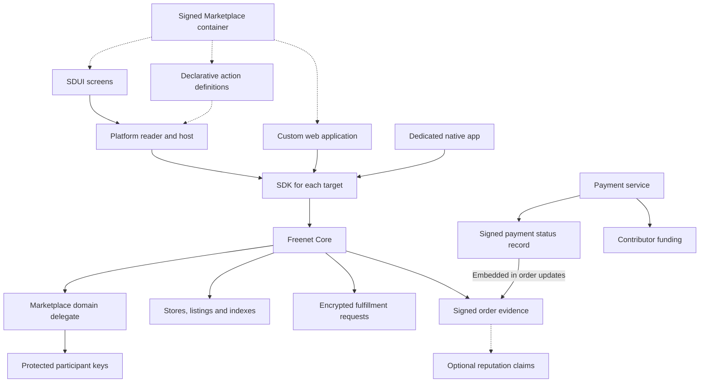
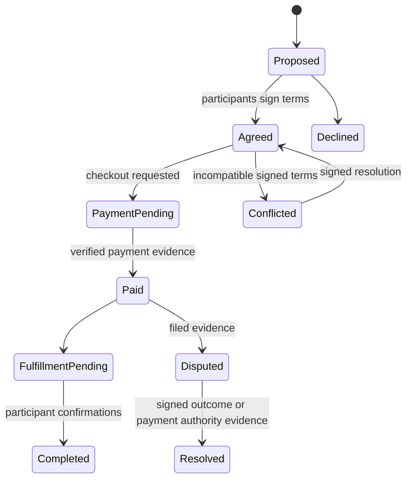
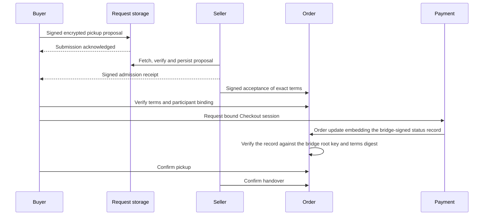

# Neighborhood marketplace

Marketplace is the final product in the roadmap. It runs inside the [Freenet mobile app](../freenet-mobile-app/README.md) and supports nearby discovery, offers, payment, and structured pickup, delivery, and shipping arrangements. Marketplace chooses declarative SDUI for its mobile launch, and declares a custom web target alongside it.

Marketplace uses [bundles](../appkit/bundles.md), [actions and delegates](../appkit/actions-and-delegates.md), [data and pending operations](../appkit/data-and-operations.md), [SDUI](../appkit/sdui.md), [hosts](../appkit/hosts.md), [mobile SDK](../freenet-mobile/README.md), [identity and recovery](../identity/README.md), and the [migration plan](../migration/README.md). [Attribution](../attribution/README.md), [Payment](../payment/README.md), [Remuneration](../remuneration/README.md), and [EVY Developer](../evy/README.md) handle contribution review, payment collection and contributor payouts. [Atlas](../atlas-sample/README.md) proves platform integration before Marketplace starts. [Peer reputation](../reputation-proofs/README.md) is optional.

Alice lists a skateboard for 80 dollars in her suburb. Bob offers 70 and proposes Saturday pickup. Alice signs accepted terms. Bob pays through Checkout after verifying those terms. The app reveals the agreed meeting details only to the participants. They each confirm the exchange. Pending, conflicting, and disputed outcomes remain visible with their evidence.



## 1. Package and execution boundary

```text
freenet-marketplace/
  common/                 canonical types, validation and codecs
  contracts/              stores, listings, indexes, requests, orders, disputes
  delegates/              domain projections, prepared updates, signing and recovery
  actions/                declarative operations and data bindings
  sdui/                   screens, bindings, themes and localization
  web/                    optional custom web UI and built assets
  schemas/                actions, views, events and private payloads
  bundle/                 application definition and prepared archive
  fixtures/               contract, delegate, SDK, host and product scenarios
  docs/                   privacy, moderation and operating policies
```

Readers render SDUI and execute bounded action steps through their hosts. Marketplace delegates decode records, project domain views, prepare canonical updates and perform protected signing/encryption. Contracts enforce shared-state rules. Each target's SDK carries Freenet requests: the TypeScript SDK for the custom web app, the Rust-backed browser build for the web reader, and native libraries for readers and the dedicated native app, per the [SDK paths table](../freenet-mobile/README.md#0-feasibility-and-existing-evidence). Custom applications use the same domain protocols.

The container signature authenticates the archive. Its application definition declares permissions, reader requirements, contract/delegate protocols and action/view schemas. Separate signed contribution records bind the archive digest to accepted work. Publishing works through EVY Developer or command-line tools. Marketplace's SDUI, optional custom web UI and native UI produce equivalent domain actions and views.

## 2. Stores, identity and private data

| Data | Owner and visibility |
| --- | --- |
| Store name, public photo, description, coarse service area and listing references | Seller-signed store contract |
| Listing terms, media references and supported fulfillment modes | Seller-signed listing revision |
| Participant public keys and public order evidence | Visibility declared by the order schema |
| Pickup details, delivery address, shipping address and private fulfillment evidence | Encrypted for the order participants |
| Private keys and recovery material | Delegate or platform-protected storage under the identity plan |
| Drafts, saved searches, cached views and pending operations | App-scoped host storage |
| Payment credentials and processor account details | Payment service and processor |

V1 uses pseudonymous signing identities. A buyer can create a protected application key without an external account. Every authenticated action has a verifiable author. Key rotation and recovery follow the identity plan, with signed lineage and explicit installation enrollment.

A signed store record binds its request endpoint and encryption key to the verified seller identity. The Marketplace delegate verifies the seller's signature before using the endpoint or encryption key. Exact logistics stay encrypted. Document the public metadata separately, including participant keys, request timing, ciphertext sizes and order links.

## 3. Listings and neighborhood discovery

A listing revision contains its seller, stable listing reference, complete terms digest, status, title, description, category, media references, price/currency, availability, quantity, coarse location, fulfillment modes and claimed author times. Delivery terms include service area and fees. Shipping terms include supported destinations and available services.

Each revision has an immutable content digest. An accepted order binds to the exact revision and agreed terms. Seller statements about quantity and availability guide discovery. Concurrent commitments can exceed that quantity.

Indexes expose bounded views by neighborhood/region, category and freshness policy. Atlas is an available discovery provider. Index entries point to signed listing state, which the domain delegate verifies when opening a result. Users can choose indexes and their published moderation policies.

Sellers republish owned stores and listings within foreground budgets. Index operators republish their shards. Cold-state loss appears as stale or unavailable data. Application archive retention follows the bundle plan. Domain-record repair follows the data and actions plan and depends on two open Core items: the [demand-driven hosting, placement and eviction epic #4642](https://github.com/freenet/freenet-core/issues/4642) and the [bounded local contract pin #5041](https://github.com/freenet/freenet-core/issues/5041).

Store and listing contracts have fixed bounds in the v1 wire profile:

| Contract | Writer | Record limit | Capacity | Selection rule |
| --- | --- | --- | --- | --- |
| Store | Seller | 4 KiB per record | 1 profile record plus 256 listing references | Keep the highest signed version per slot |
| Listing | Seller | 4 KiB per revision | 16 revisions | Keep the 16 highest signed versions. Two records at one version are a conflict, retained as the two lowest digests |

## 4. Offers, orders and conflicts

Action definitions expose `makeOffer`, `acceptOffer`, `cancelOrder` and `closeOrder`. Each coordinates host reads, delegate preparation, durable journaling and approved submission. Section 5 defines the fulfillment and dispute actions. Saving a listing remains local until the buyer explicitly submits an offer or request.

An accepted order binds the buyer, seller, originating request, listing revision, quantity, amount, currency, fulfillment mode, charges, verified seller payment beneficiary, contributor-fee terms, agreed terms revision and payment authority. Compute the order terms digest over the complete canonical terms. Signatures and Checkout requests cover that digest. Changed terms require a new signed revision and renewed agreement.

Keep signed events and derive order status from them. Concurrent incompatible events produce `Conflicted`. Resolving an economic commitment requires the affected parties' signed agreement or evidence from the authority defined for that particular payment operation.

Each order is its own contract instance with bounds in the v1 wire profile. Without them a participant could fill an order to the 50 MiB state ceiling and make it unmergeable for every co-host.

| Rule | Value |
| --- | --- |
| Writer set | Buyer, seller and the payment bridge, named in the parameters with the bridge root key |
| Record size | 4 KiB including the signed envelope |
| Count per writer per event kind | 16, with deterministic lowest-digest eviction beyond that |
| Payment status revisions | 32 per payment, per the [payment record rules](../payment/README.md#6-signed-payment-status-record) |
| Disputes | 4 dispute records per participant per order |
| Variants per slot | 2, by lowest digest, retained as conflict evidence |

Two valid states union within these limits because every rule is a deterministic selection over the combined set.



A listing-level allocation view references observed accepted orders. It flags competing commitments across buyers. The view describes observed evidence and its freshness. A partition can hide another order. Resolving competing inventory commitments requires the seller's signed decision. Payment idempotency applies to the bound payment operation.

## 5. Structured fulfillment requests

Marketplace owns the following versioned operations. SDUI invokes their declared action sequences. Hosts coordinate I/O; domain delegates interpret requests and prepare results.

| Action | Required domain meaning |
| --- | --- |
| `proposeFulfillment` | Select pickup, delivery or shipping and propose structured scheduling/service terms for a specific listing/order |
| `respondFulfillment` | Accept, decline or counter the exact proposal digest |
| `proposeReschedule` | Reference the current agreement and propose replacement scheduling terms |
| `cancelRequest` | Withdraw a request under its participant and order rules |
| `recordDispatch` | Attach dispatch evidence and an encrypted shipping reference to an agreed shipping order |
| `confirmFulfillment` | Record a participant's signed confirmation of the agreed handover or delivery |
| `raiseDisputeReference` | Attach a bounded evidence reference to the exact order and terms |

Pickup uses proposed time windows and an encrypted meeting place. Delivery uses a service window, delivery fee and encrypted recipient details. Shipping uses a service choice, shipping charge and encrypted destination. Seller response and participant confirmation are separate signed actions. The UI presents these as request cards and forms.

Each domain record carries its schema version, application identity, logical request ID, author, recipient, order and listing reference, terms revision and causal predecessor. Four rules give it an identity:

1. Derive the record ID from a domain-separated canonical encoding of every unsigned field, excluding the record ID and the signature.
2. Sign the content together with that derived ID.
3. After encryption and envelope signing, derive the storage entry digest from the complete final envelope bytes.
4. Validators recompute each identity at the boundary where it applies.

A retry preserves the logical operation ID and the original signed bytes. A counterproposal creates a new record. Participant journals retain observed conflicting variants within their disclosed evidence limits.



### Public first contact and bounded transport

Each listing advertises a seller-signed current request generation. V1 permits public first contact through a bounded admission contract, then moves the conversation to a continuation page the seller grants. Both contracts merge by deterministic set union followed by their selection rule. These constants form the v1 wire profile, and the maximum canonical state size is tested from the codec.

| Contract | Record limit | Capacity | Selection rule |
| --- | --- | --- | --- |
| Public admission | 4 KiB including signed envelope and padded ciphertext | 64 records | Keep the lowest full content digests |
| Granted continuation | 4 KiB per record | 16 slots per participant | Keep the two lowest storage digests per slot |

This bounds storage and makes replicas converge. Admission remains vulnerable to competition for the available slots. A sender can grind digests or fill the area and displace an honest request. The reader reports `Awaiting seller receipt`, `Request absent from current set`, or `Admission saturated` according to observed evidence. The host keeps the original signed request locally and retries within budgets. Delivery status requires a signed seller receipt. The seller can open a new request generation so clients can retry. A sustained attack can fill that generation too.

Once the seller admits a request, it issues a signed grant bound to the application, page identity and generation, permitted participant writer, order and request ID, slot range, schema version and maximum record size.

A replica can receive continuation records before the grant that authorizes them. Every delta carries the grant record together with the operations that reference it. A delta whose grant is absent is rejected in full, so the sender re-offers it with the grant attached. Discarding only the unauthorized part would lose records that a later grant makes valid.

Two distinct records in one slot prove that its writer signed competing records. Set the slot to `Conflicted` and block the corresponding domain transition. Every retained conflict witness passes the same writer, grant and signature checks as an ordinary record. Extra observed variants can survive in participant journals within disclosed local limits.

Both participants sign a successor-page reference and agreed checkpoint when capacity is exhausted. Recovery and dispute access depend on retained network copies and recovery-covered participant journals.

Full-state and delta validation apply the same encoding, signature, grant, digest and size rules. Property tests must prove associativity, commutativity, idempotence, batch invariance and maximum encoded size for both admission and continuation contracts. Empty bootstrap state has explicit handling. Eviction follows the digest selection rule. Contract expiry requires explicit time evidence or signed participant action.

### Encryption, acceptance and recovery

Use one reviewed, versioned cryptographic profile. Bind routing and context fields to authenticated encryption, derive keys separately by direction, and independently sign domain records. Participant signatures establish authorship. Keep encryption/signing keys in delegates or platform-protected storage.

Limits apply before expensive decoding and decryption. Encrypt permitted attachments separately and address them by ciphertext digest. Keep names, previews and sensitive metadata encrypted. Enforce count, byte and decode limits in the trusted host. Describe ciphertext retention, compromised-key handling and forward-secrecy expectations in the profile.

A signed admission receipt means the recipient verified and persisted the record locally. It differs from accepting the proposed terms, making payment, dispatching goods or confirming delivery. Update the processed-operation marker and resulting local state atomically. Retrying a previously processed record returns the same result. Side effects use their own stable operation IDs.

Sender queues survive restart and uncertain submission. The host re-fetches records, obtains delegate reconciliation results and republishes eligible pending records within its budgets, including a bounded previous-generation window. A local retry deadline stops local attempts. Appointment times express the participants' agreed schedule. Contract expiry requires explicit time evidence or signed participant action.

Recovery, cross-device transfer and the [forget operation](../identity/README.md#2-protected-keys-and-records) follow the identity plan. Confirm persistence of private order evidence before payment. Forgetting an active order warns that its keys or evidence may be needed for fulfillment or a claim. The domain delegate filters records from blocked keys before presentation and acknowledgment. Cache deterministic malformed-record refusals so repeated updates cannot trigger endless key derivation. Per-session CPU, download and storage budgets remain effective during a flood.

## 6. Payments and contributor funding

The payment service creates Checkout sessions, collects fees, processes processor events and signs status revisions. Before opening Checkout, Marketplace verifies the seller statement and confirms that it saved a protected copy. It then requests a session through an approved host operation. The request names the verified order, authorized payer, seller beneficiary, amount, currency and terms digest. The payment service fixes the publication or native artifact reference, contribution record, snapshot and policy bindings for that attempt, as its [Checkout flow](../payment/README.md#2-checkout-flow) specifies. Checkout requires complete, consistent prerequisites. The host opens the payment page returned by the service: a popup or redirect on the browser target, because Core's Content Security Policy blocks every other cross-origin request, and the system browser or an in-app browser session on native.

The bridge-signed status record arrives embedded in an order update, per the [payment record rules](../payment/README.md#6-signed-payment-status-record). The order contract verifies it against the bridge root key in its parameters and the order's terms digest. A paid order's validity rests only on that embedded record.

Use the [Payment state mapping](../payment/README.md#4-payment-states) for pending, action required, authorized, processing, accepted, failed, canceled and expired attempts. Refunded amounts and dispute/chargeback outcomes are additional fields with retained history. Browser return triggers a refresh. Fulfillment policy follows the verified embedded payment record. Reordered webhook revisions and bridge outages retain their explicit states.

The contributor-funded product integrates Attribution and Remuneration. Register stable capabilities such as `marketplace.listing.publish`, `marketplace.offer.negotiate`, `marketplace.fulfillment.agree` and `marketplace.order.transition`. Contribution records cover action definitions, delegates, contracts and SDUI under the allocation policy. Usage evidence identifies validated domain outcomes, and every target supplies the same evidence.

The Payment plan controls fee amounts and processor-cost treatment. Remuneration controls allocation and payout. Financial reconciliation covers refunds, chargebacks, duplicate operation IDs and failed fulfillment. The host stops the application after verifying its withdrawal. The payment service controls new-checkout eligibility. Existing orders retain their payment terms. Trusted host controls can retrieve order status and supported recovery actions while the application session is stopped.

## 7. Moderation, disputes and optional reputation

Marketplace launch requires a documented policy for listing spam, fraud, illegal content, peer exposure, appeals and jurisdictional handling. Indexes control their search results. Hosts apply local display policy. Public contracts can remain independently reachable. Policy records include reasons and versioned rules.

A dispute record contains bounded, signed statements bound to the order, participants, terms and evidence digests. Filing establishes an allegation with authenticated evidence, which the policy and any later signed outcome then resolve. Corrections and resolutions append alongside the record. Disputes live in the order contract under its [bounds](#4-offers-orders-and-conflicts): 4 records per participant per order, 4 KiB each, with lowest-digest eviction beyond that. Append-only merge semantics apply within those bounds while copies are retained, and publishers and participants have explicit republishing duties.

For the v1 pre-signed-claim workflow, the seller supplies a signed statement before payment. It binds the seller, authorized buyer, order ID, complete immutable terms digest, amount, currency, dispute-contract target, statement schema and unique nonce. The buyer verifies those fields and confirms protected persistence before Checkout is available. Filing verifies that exact statement, its target and nonce, the authorized claimant, and payment evidence bound to the same order. The product explains which statement fields become public before collecting them. Test buyer griefing, counterparty substitution, replay, premature filing, refunds and concurrent exposure. Treat a filed statement as an allegation. Apply the dispute policy to its evidence when deciding what happens next.

Optional client/index content classifiers may flag listings for review. Measure target-phone cost and language coverage before enabling them. Human appeals and recorded policy reasons remain required independently of a classifier.

Peer reputation is an optional adapter. Marketplace can issue qualifying positive-event receipts under a published claim policy and consume purpose-bound threshold proofs. The source is Marketplace's own validated activity. Listings, orders and mobile access operate independently of the reputation adapter. Positive activity, public allegations and payment accounting remain distinct facts.

## 8. UI, mobile lifecycle and migration

SDUI covers browse/search, listing details/editor, store profiles, offers, fulfillment forms, request history, payment status, participant confirmations, disputes and saved drafts. Declared actions and typed delegate results supply their views and operations. Data/action and host plans own permission prompts, navigation safety, storage isolation and scheduling.

Subscribe to viewed listings, active orders and pending request generations. Repair those subscriptions after reconnect. Cache saved/owned listings, active trades and durable pending operations. Show stale, pending, conflicted and unavailable states with their observed evidence. Devices that run only in the foreground can serve or repair data while the application is open.

Contract code changes produce new instance identities. Register predecessor hashes and original parameter encodings with the existing migration library, persist actual instance references and implement the [application migration adapters](../migration/README.md#2-contract-carry-forward). Choose a recovery policy per contract. Snapshot records use the newest compatible generation. Combining signed-event histories requires tests for merging, deletion markers and conflicts. Validate recovered state, publish it and verify readback before recording success.

Index/pointer updates follow verified publication. Local bundle installation, shared contract migration and delegate-secret transfer each retain their own progress and recovery evidence. Migration fixtures include a seller who has been offline across several application versions, mixed-version participants, full continuation pages and private key/delegate migration. Every application checks protocol compatibility before adopting published definitions or domain artifacts.

## 9. Harvest lessons

The [Harvest comparison](harvest-comparison.md) explains four design choices. Bind accepted terms to the buyer's own request. Derive identifiers from complete terms, so changing a price or destination creates a new identity. Verify published payment prerequisites independently of a transport response. Embed the payment proof in the order and keep the bridge root key in parameters, so a paid order validates on its own and a bridge-key rotation needs no new contract.

## 10. Delivery and acceptance

| Phase | Delivers | Done when |
| --- | --- | --- |
| 1. Domain and privacy | Signed schemas, visibility table, fulfillment state machines, store/listing/order/dispute bounds and moderation policy | Fixtures cover participant authority, causal conflicts, public/private boundaries and a writer who tries to exceed every bound |
| 2. Listings and discovery | Signed listings, neighborhood indexes and observed allocation view | Concurrent offers remain visible and searches use bounded verified views |
| 3. Request transport | Public admission and authorized continuation contracts | Adversarial merge tests prove size bounds and honest saturation reporting |
| 4. Actions and secrets | Declarative orchestration, typed delegate operations, protected crypto and restart recovery | Web and native fixtures produce equivalent records and uncertain retries preserve operation identity |
| 5. Product UI | SDUI workflows and custom native application conformance | Generic readers run Marketplace without product-specific compiled code |
| 6. Commerce | Checkout, signed status, attribution and remuneration | Bound payments reconcile through refunds, reordering and outages |
| 7. Mobile release | Discovery-to-fulfillment flow inside the generic Freenet mobile app | Offline, migration, privacy and moderation gates pass |
| Optional extension | Private reputation claim adapter | Purpose-bound proof and cost tests pass independently |

Required tests cover:

- Malicious sellers and buyers, copied endpoint identities, substituted terms and signatures over incomplete fields.
- Duplicate or reordered events, commitments to two buyers, offline recipients and loss of every retained copy.
- Admission digest grinding and flooding, slot conflicts, invalid grant scopes, malformed ciphertext and reflected message direction.
- Denied permissions, terminated sessions and crashes between saving a record and acknowledging it.
- Payment return without evidence, repeated Checkout, refunded fulfillment, address privacy and evidence recovery.

Crypto tests use independent known-answer vectors for key agreement, direction-specific derivation, encryption and signatures. Full-state and delta fixtures reject copied grants, page/generation substitution, wrong writers, reflected ciphertext and incomplete signed terms. Deletion tests confirm protected-key removal, report removal failure and preserve the stated backup/network limitations. Migration tests preserve the bytes and encodings needed to read earlier records. Consumer tests reorder asynchronous responses and verify correlation at the consumer. Release readiness requires the preceding platform and commercial gates plus this product's acceptance scenarios.
