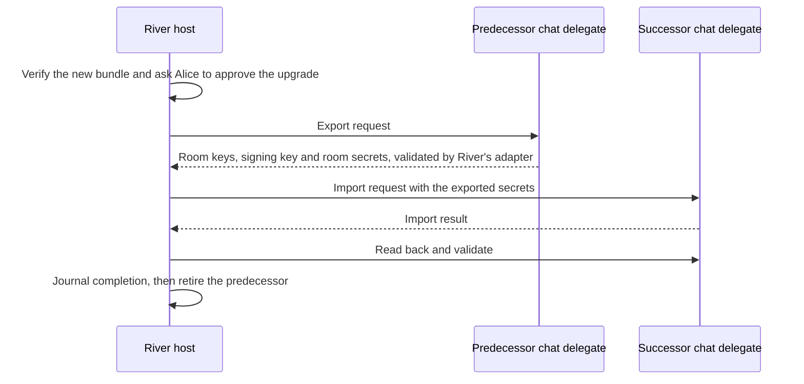

# Upgrades and migration

River rebuilds its room contract and chat delegate. Bob's phone must find Alice's room "Skate club" under the old key, carry it forward under the new rules, move his room keys and signing key into the new chat delegate and keep following the River publisher when its signing key changes. This plan owns those four moves. [Bundles](../appkit/bundles.md) defines the container the publisher signs, [Hosts](../appkit/hosts.md) install the new bundle and run local database migrations, and [Identity and recovery](../identity/README.md) protects the keys that move.

| Section | What Freenet provides today | What AppKit proposes |
| --- | --- | --- |
| [1](#1-component-identity-and-re-keying) | BLAKE3 keys over code hash and parameters, and no upgrade protocol in Core | A predecessor registry per application and a build check that requires an entry |
| [2](#2-contract-carry-forward) | `freenet-migrate` lineage, probe driver and carry-forward gate | Host-coordinated migration with application-owned adapters and a recovery policy per domain |
| [3](#3-delegate-secret-export-and-import) | The export and import round trip in `freenet-migrate`, the FNSX bundle and the disabled node copy-forward | Every AppKit delegate implements export and import under user approval |
| [4](#4-publisher-continuity) | One verifying key per website container and whole-state replacement per version | A mutually acknowledged transfer statement between predecessor and successor containers |

## 1. Component identity and re-keying

### What Freenet provides today

A contract or delegate key is BLAKE3 over the code hash and parameter bytes, the same derivation as the [website container's key](../appkit/bundles.md), so a rebuild creates a new key and leaves state under the old one. Application contracts and delegates choose their own parameter encoding. River's room contract takes `ChatRoomParametersV1 { owner: VerifyingKey }`, so each room is its own instance with its own key, per [FREENET.md](https://github.com/freenet/river/blob/main/FREENET.md). The chat delegate takes empty parameters, so its key is BLAKE3 of the code hash alone, per [legacy_delegates.toml](https://github.com/freenet/river/blob/main/legacy_delegates.toml). Any Wasm change re-keys the chat delegate and the room contract, per [river-publish.md](https://github.com/freenet/river/blob/main/.claude/rules/river-publish.md). Successor pointers come from `freenet-migrate`, a library outside Core that applications link themselves. The [whitepaper](https://github.com/freenet/paper-1/blob/main/sections/07-status.tex) states the consequence: components are content addressed, a new version is published under a new key, and Core has no upgrade protocol.

River keeps its predecessor registry in two files. `freenet_migrate_build::codegen()` turns both into Rust at build time, the build fails when the generated table is empty, and CI fails a pull request that changes Wasm without a new entry, per [delegate-migration.md](https://github.com/freenet/river/blob/main/.claude/rules/delegate-migration.md).

| File | One row per | Fields |
| --- | --- | --- |
| [common/legacy_room_contracts.toml](https://github.com/freenet/river/blob/main/common/legacy_room_contracts.toml) | Previous room contract generation, oldest first | `version`, `description`, `date`, `code_hash` |
| [legacy_delegates.toml](https://github.com/freenet/river/blob/main/legacy_delegates.toml) | Previous chat delegate generation | `version`, `description`, `date`, `code_hash`, `delegate_key`, plus `irregular_key = true` on the V1 row |

River removed the V4 to V6 chat delegate rows because their Wasm fails to deserialize, so the delegate lineage has a gap.

### What AppKit proposes

Record original code hashes, parameter encodings and actual instance references in the registry. Add a build check that requires a predecessor entry when component code changes. River's two files and CI check are the model for both. Fixtures specify each component's parameter encoding, every host derives the same key from those fixtures, and migrations preserve the parameter bytes byte for byte.

The registry rules cover the two cases River's files hold. For a row marked `irregular_key = true`, such as River's V1 chat delegate row, hosts probe the recorded `delegate_key`. That key predates the standard derivation and can't be rebuilt from the code hash, per the comment in [legacy_delegates.toml](https://github.com/freenet/river/blob/main/legacy_delegates.toml). For a lineage with removed rows, such as River's chat delegate lineage without V4 to V6, hosts probe the rows that remain.

Hosts link `freenet-migrate` and resolve the verified code hash with the component's actual parameters, keeping the resolver's minimum accepted version, and handle stale, unavailable, conflicting and withdrawn results. A pointer locates a component. The adapter recovers its data. River's pointer records, `river.room-contract` and `river.chat-delegate`, are the real instance, described in [section 4](#4-publisher-continuity).

## 2. Contract carry-forward

### What Freenet provides today

| Library item | What it does |
| --- | --- |
| `freenet-migrate-build` | Generates the lineage registry from TOML at build time. River runs it over the two files in [section 1](#1-component-identity-and-re-keying) |
| `predecessor_ids`, `ProbeDriver` and `migrate_contract` | Rebuild predecessor IDs from code hash and parameters and probe them newest first under a `SelectionPolicy` |
| `CarryForward` and `policy_check` | Run `verify()` after `merge()`, and assert commutative, idempotent and order-invariant merges |
| `resolve_app_pointer` | Reads the frozen pointer contract from [#5194](https://github.com/freenet/freenet-core/issues/5194) and answers which code hash is current |

The [mobile plan](../freenet-mobile/README.md#0-feasibility-and-existing-evidence) records the stdlib compatibility check the library needs.

### What AppKit proposes

The host coordinates migration reads, approved imports, publication and readback. Application-owned adapters implement the contract probe I/O with domain codecs, validation and recovery rules. Atlas proves this adapter boundary. Custom applications link the library from their own code, as River does.

| Recovery policy | Use it for | Required proof |
| --- | --- | --- |
| Newest generation | Snapshot state, such as a room's current state | The successor's validation rules accept the recovered state |
| Combined generations | Event histories with deletions and conflicts, such as a room's message history with edits, deletions and bans | `policy_check` assertions pass against the domain's real state model |

Preserve unresolved predecessor reads for retry. Validate recovered state with the successor's rules, publish it through authorized host operations, then read it back before recording success.

Shared-state recovery stays separate from the host's own table migrations and bundle installation. Mixed-version clients obey the domain's transition rules.

Example: the River publisher rebuilds the room contract. CI fails the pull request until `common/legacy_room_contracts.toml` gains a row with the old code hash. Bob's phone installs the new bundle, rebuilds the predecessor keys from the old code hashes and Alice's owner key, probes them newest first, carries "Skate club" forward, validates it under the `ChatRoomStateV1` rules and reads it back.

## 3. Delegate secret export and import

### What Freenet provides today

Treat the delegate's full code-and-parameter identity as the access boundary. Requests route by delegate key and parameters. A new delegate version has a new key and starts with an empty secret store.

`migrate_delegate_secrets` and `register_delegate_with_migration` in `freenet-migrate` run the export and import round trip through `PredecessorSecretsIo` and `SuccessorSecretsIo` under a `MigrationAuthorization`, with a migrated marker against resurrection.

River's chat delegate runs its own carry-forward today. On startup it sweeps the registry and carries the user's rooms and secrets forward, per [FREENET.md](https://github.com/freenet/river/blob/main/FREENET.md).

| Path | Authority | Executable API | Status |
| --- | --- | --- | --- |
| Application export and import | The application, under the user's approval in the host | Delegate messages through Core's client API and `freenet-migrate` delegate adapters | Baseline |
| Core-mediated provenance, deposit and merge | Core, from node-observed container installation | Proposed in [RFC #5255](https://github.com/freenet/freenet-core/issues/5255), with authorization, deposit and merge work still to define | Separately gated implementation |

Core encrypts delegate secrets under a node key encryption key with systemd, file and opt-in keyring backends, per [secrets at rest](https://github.com/freenet/freenet-core/blob/main/docs/secrets-at-rest.md). Its export produces an encrypted FNSX bundle and caps plaintext at 256 MiB. A CLI export and import of one delegate's secrets ([#4035](https://github.com/freenet/freenet-core/issues/4035)) and a live import into a user's own peer ([#4592](https://github.com/freenet/freenet-core/issues/4592)) are open.

[PR #5199](https://github.com/freenet/freenet-core/pull/5199) disabled Core's copy-forward of secrets to a successor, stdlib 0.9.0 removed the predecessor-registering request, and that constraint stays.

### What AppKit proposes

The baseline is application-controlled migration. The predecessor delegate answers an export request, and the successor imports through the application. The migration library's delegate path follows this shape, so use it where its interfaces fit. Plaintext secrets transit the application during that round trip. State that exposure in the application's privacy documentation. Every AppKit delegate implements this export and import path. The store holds the application's drafts and private records as well as its keys, so the round trip moves all of them. A delegate without this path strands its secrets on re-key. River's chat delegate holds `rooms_data` with room keys and signing keys, private room secrets and outbound DM plaintext, per its [README](https://github.com/freenet/river/blob/main/delegates/chat-delegate/README.md), so its round trip moves all three. Application-owned adapters implement `PredecessorSecretsIo` and `SuccessorSecretsIo`.

The migration record identifies the predecessor, successor, namespace, approving user and migration revision. The host journals it. Preserve a recoverable copy until readback and application validation complete. Resume interrupted migrations idempotently.

Test a malicious successor, copied parameters, a caller-selected namespace, replayed approval and concurrent migrations. Retain original encoding information so an upgrade can find records created under earlier domain protocol versions. Define consent, selection policy and completeness checks before moving secrets. Regression tests confirm that the application round trip is the only path that moves secrets. Launch gate: whichever approved path protects private access passes these tests before [Marketplace](../marketplace/README.md), the launch product, enables protected operations.

Example: Alice approves the upgrade, the old chat delegate exports her room keys and signing key from `rooms_data`, and the new one imports them through River's adapter.

## 4. Publisher continuity

### What Freenet provides today

Routine updates retain the container validator code and publisher key. A change to either creates a successor container identity. River's web container shows the routine case. Its parameter is the author's 32-byte verifying key, each UI release is a higher signed version, and the deployed key `raAqMhMG7KUpXBU2SxgCQ3Vh4PYjttxdSWd9ftV7RLv` stays fixed, per [FREENET.md](https://github.com/freenet/river/blob/main/FREENET.md).

Launch uses the stock website container, the same contract River deploys and fdev ships as `crates/fdev/resources/website_contract.wasm`. Its parameters are a single Ed25519 verifying key, its update rule accepts only a strictly higher version, and each accepted update replaces the whole state. In River's [web container contract](https://github.com/freenet/river/blob/main/contracts/web-container-contract/src/lib.rs) that state is CBOR metadata holding the version and signature, followed by the tar.xz of the built UI, with a 100 MB cap and a 1 KB metadata cap. Three consequences follow:

| Container property | Consequence for this plan |
| --- | --- |
| Parameters are one verifying key, hashed into the identity | Adding a recovery key creates a successor identity. Publisher key loss is therefore final, and the publisher recovers from tested backups |
| Whole-state replacement per version | A transfer is the highest-version signed predecessor state a host has observed. Every later predecessor version carries the transfer statement, because a routine update without it would replace it |
| One accepted state per version | Two signed states at one version are a compromise signal. Hosts stop automatic transfer and the publisher resolves it outside the network |

River's pointer records are anchored on the publisher's author key. `river.room-contract` and `river.chat-delegate` name the current code hash of the room contract and the chat delegate under the anchor `river:v1:vk:9Ebskq4y7NvJpTQTrF1FAxU8g6bR4Rhe4TRikXba55EJ`. The publisher re-signs them on every re-key, and CI checks their freshness, per [FREENET.md](https://github.com/freenet/river/blob/main/FREENET.md) and [pointer-records.toml](https://github.com/freenet/river/blob/main/pointer-records.toml).

### What AppKit proposes

The initial AppKit transfer convention uses matching statements authenticated by the two containers' normal signatures.

1. Publish and verify the successor container.
2. Publish a higher version of the predecessor containing a transfer statement with the full predecessor and successor identities, a unique transfer ID and purpose.
3. Publish the successor's acknowledgement of those exact fields. The application definition carries the transfer or acknowledgement as optional metadata.
4. The host verifies both signed snapshots, retains the evidence and asks the user before moving private data or permissions.
5. Journal the approved local migration, verify its result and retain recovery evidence. New permission scopes require new grants. Moving delegate secrets uses the [application export and import path](#3-delegate-secret-export-and-import).

After a same-version divergence, the publisher publishes a higher predecessor version that names the competing digests and the selected successor. Hosts resume automatic transfer from that version.

A transfer link offers migration. Keep references to the user's current container and data throughout the transfer. Running the successor requires user approval and successful compatibility checks.

Attribution separately authorizes each product-to-container mapping. Existing attribution credit, such as Carol's for the Invite member screen, keeps its original references through the transfer. Protect publisher keys with tested backups and restore one in a fixture before launch. A custom container validator whose parameters carry a recovery key is a later option that would itself be a successor identity.

Test forged transfers, mismatched acknowledgements, conflicting successors, interruption, copied container parameters and expanded permissions. Restore a publisher backup in a fixture and prove it can sign a valid update to the original container.

Example: the River publisher rotates its signing key. It publishes the successor container, then a higher predecessor version carrying the transfer statement, then the successor's acknowledgement, and re-signs River's pointer records under the new key. The pointer addresses derive from the author key, so rotation moves River's container and both pointers at once, per [FREENET.md](https://github.com/freenet/river/blob/main/FREENET.md). Bob's phone verifies both snapshots and asks him before moving River's grants and his room keys and signing key to the successor.

## 5. Reference recap

| Reference | Status | Names | Explained in |
| --- | --- | --- | --- |
| Contract and delegate key | Existing | One contract or delegate, from its code hash and parameters | [Section 1](#1-component-identity-and-re-keying) |
| Predecessor entry | Proposed | One earlier code hash and parameter encoding of a component | [Section 1](#1-component-identity-and-re-keying) |
| Recovery policy | Proposed | How one domain carries state across generations | [Section 2](#2-contract-carry-forward) |
| Migration record | Proposed | One approved move of secrets from a predecessor to a successor delegate | [Section 3](#3-delegate-secret-export-and-import) |
| Transfer statement | Proposed | A publisher's signed hand-over from one container to its successor | [Section 4](#4-publisher-continuity) |

## 6. Acceptance

- Migration fixtures pass for skipped versions, late predecessors, deletions, conflicts, interrupted readback and mixed-version participants.
- Interrupted delegate upgrades preserve recoverable secrets and reject unauthorized successors.
- Forged transfers, mismatched acknowledgements, conflicting successors and expanded permissions fail the publisher continuity fixtures, and a restored publisher backup signs a valid update to the original container.

References: [freenet-migrate](https://github.com/freenet/freenet-migrate).
