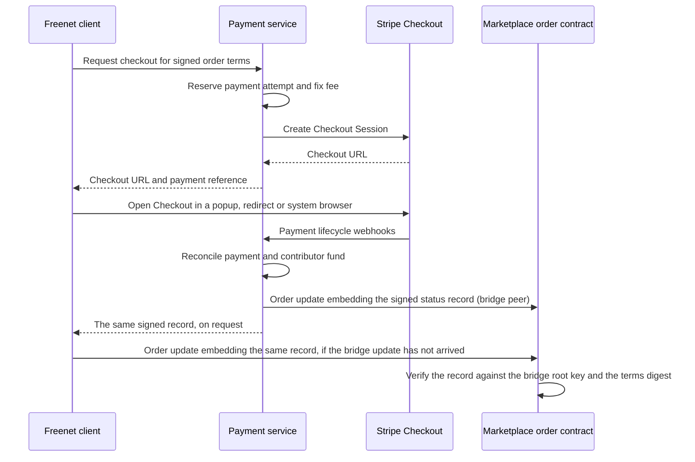

# Payments

The payment service owns Checkout, processor interaction, fee collection and signed payment status. It is one of the three services in the [EVY Developer authority table](../evy/README.md#13-contribution-and-earnings-workspace), alongside attribution and remuneration.

## 1. Purpose

A declarative action or custom application requests checkout through its authorized host service adapter. Every target reaches the same service interface and passes the same checks for content and contribution bindings. The host opens Stripe-hosted Checkout. The payment service creates the checkout session, collects a 1% fee for contributors, receives Stripe webhooks, and signs a payment status record. That record travels embedded in an update to the Marketplace order contract, which verifies it against the bridge root key. A paid order's validity rests only on the record embedded in it.

## 2. Checkout flow



The bridge peer and the client can both submit the order update. Both embed the same signed record, so the contract merges them as one payment revision.

The client sends the product, order, signed terms digest, currency, and a stable checkout request ID. The payment service verifies the terms, seller account, authorized payer, and target contract. It fixes the amount and fee on the server and creates one payment attempt using a durable request reservation and Stripe idempotency key.

At checkout, the payment service records the following against the operation and agreed order terms:

- The exact [publication reference](../appkit/bundles.md#6-reference-recap), or the certified native-build reference for a dedicated app.
- The signed contribution record and attribution snapshot.
- The settlement policy and the product's signed capability-allocation policy.

The service verifies product authority, publication or distribution evidence, and the capabilities covered by the contribution record. The allocation policy determines which record is eligible, which capabilities qualify, their shares and the required completion evidence. Keep these references with the payment for remuneration checks. They stay fixed through application updates and changes of reader.

`application_content_ref` is a tagged reference to either a container publication or a certified native artifact, with the exact fields defined by the bundle and attribution plans. Persist the verified signed evidence alongside its IDs. The service verifies eligibility under the product policy before accepting the submitted digest and contribution record.

Commercial suspension stops new checkout according to the product's service policy. Record the authority and latest verified observation used for that decision. Existing attempts, refunds and settlement retain their original bindings.

The app opens the returned Stripe HTTPS URL in a popup or redirect on the browser target, where Core's Content Security Policy blocks every other cross-origin request, and in the system browser or an approved browser session on native. A return link brings the customer back to the order view. Confirm payment through the payment service's signed status. Keep Stripe secret keys and webhook secrets in the payment service's secrets service.

Bind each attempt to exactly one order and immutable terms digest. Reconcile the service and processor records for an uncertain attempt before creating a replacement. Serialize new attempts for the same order so concurrent clients reuse the active checkout.

## 3. The 1% fee

Set the contributor fee to 100 basis points of the agreed checkout amount. The v1 rule takes it from the seller's proceeds. Show the amount in the terms before checkout. Compute in currency minor units with round-half-up, and store the fee base, computed fee, and policy version. Alice lists the skateboard at 80 dollars and accepts Bob's offer of 70, so the contributor fee is 0.70 dollars.

Use Stripe Connect Checkout with a connected seller destination and `payment_intent_data.application_fee_amount`. Record the application fee against the contributor fund after successful collection. The destination-charge model places Stripe processing fees on the payment service balance. Budget those costs separately so the promised 1% funds contributors. Validate account and region support before launch. See [Stripe's destination-charge guide](https://docs.stripe.com/connect/destination-charges?platform=web&ui=embedded-form).

The payment service records each payment's contributor fee. Stripe holds the money in its account balances.

The payment service reconciles fee receipts and reversals, then sends them to remuneration through a durable queue. Each message contains immutable receipt IDs, revisions and funding adjustments. This lets each service commit and recover its own transactions. Allocation, balances and payouts follow the [remuneration plan](../remuneration/README.md#5-funding-and-allocation).

## 4. Payment states

Preserve processor state and expose a versioned Payment status mapping. A payment can skip states or require another attempt. Use the [Stripe PaymentIntent lifecycle](https://docs.stripe.com/payments/paymentintents/lifecycle) for the processor mapping.

| Payment status | Source and meaning |
| --- | --- |
| Pending | Checkout is open or the PaymentIntent requires a payment method or confirmation |
| Action required | `requires_action`, such as customer authentication |
| Authorized | `requires_capture`, when manual capture is enabled |
| Processing | `processing`, awaiting the processor's result |
| Accepted | `succeeded`, successful payment for the bound terms |
| Failed | A failed attempt, with its failure event retained for retry history |
| Canceled or expired | Canceled PaymentIntent or expired unpaid Checkout Session |

Track refunded amount, partial/full refund state, dispute state, and chargeback outcome as additional fields sourced from the related processor objects. Accepted payment and later reversals both remain in the history. A manual-capture authorization permits only the order actions declared for that state.

## 5. Webhooks and reconciliation

The payment service receives Checkout, PaymentIntent, charge, refund, dispute, and application-fee events. Acceptance tests cover the event types used by each supported payment method. Use [Stripe's webhook guidance](https://docs.stripe.com/webhooks) for signature verification, retries, duplicate delivery, and unordered events.

Verify the raw-body signature and endpoint secret, durably store the event, then acknowledge it. Deduplicate by Stripe account and event ID. Serialize processing per payment and retrieve the relevant current Stripe objects to reconcile delayed or reordered notifications.

Commit the reconciled state, financial entries, and outbound bridge message in one transaction. Assign an increasing per-payment revision under that transaction. Periodically reconcile open payments and missing events against Stripe, using the same update path.

## 6. Signed payment status record

The payment service signs a record containing:

```text
schema_version
product_id, order_id
payment_id, attempt_id, terms_digest
currency, amount_minor, contributor_fee_minor
payment_status, processor_status
captured_minor, refunded_minor, dispute_status
application_content_ref, contribution_record_id, attribution_snapshot_id
allocation_policy_id, settlement_policy_id
revision, previous_record_digest
bridge_key_id, key_succession_chain, signature
```

The payment service retains raw Stripe payloads, customer details, and processor object IDs in its private records. Use opaque public payment IDs in Freenet.

The record is embedded in the order update. The order contract verifies the signature, amount, currency, terms digest and schema deterministically, with no related-contract fetch. Its parameters hold only the bridge root key alongside the order's own fields. Parameters hash into the contract identity, so they hold nothing that rotates.

| Where | What | Why |
| --- | --- | --- |
| Order contract parameters | Bridge root key | Fixed for the contract's life |
| `key_succession_chain` inside each record | Append-only succession records from the root to the signing key, each signed by its predecessor | Validators walk from the root. Earlier records stay verifiable under the key that signed them |
| Order contract state | Payment records by payment ID and revision | Bounded by the Marketplace order profile |

Merge records by payment ID and revision. Retain duplicate revisions once. Retain different signed payloads at the same revision as a conflict, keeping the two lowest digests. Cap revisions per payment at 32 under the [Marketplace order bounds](../marketplace/README.md#4-offers-orders-and-conflicts). Use the highest unconflicted verified revision for display. Before automated order actions, require predecessor recovery for gaps and an authorized signed resolution naming the conflicting digests and replacement chain. Freeze those actions for the affected payment while retaining both records.

An optional standalone payment contract may mirror records for audit. Nothing validates against it.

The marketplace applies its own order transition rules after verifying status and terms. Match amount and currency before treating an order as paid. Record inventory and fulfillment separately. A partitioned client shows the last verified state and pending synchronization.

## 7. Bridge recovery

The payment service runs a Freenet peer and a durable outbound queue. Retry each order update with the same payment ID and revision. Retain signed records and target order bindings for reconciliation and republication.

If Freenet delivery pauses, Stripe collection and webhook accounting continue, and the queue preserves pending status updates. The app shows payment confirmation as pending synchronization until the order contract shows the verified record. The client can fetch the signed record from the service and submit the order update itself. An operator can reconcile payment state with Stripe and republish it after recovery.

Rotate bridge keys by appending a succession record signed by the predecessor key. Every record signed afterwards carries the chain from the root key. The root key in the order parameters stays fixed, so rotation needs no new contract and no consumer migration. Harvest moved its trusted-bridge list out of store parameters into the signed order for the same reason. The payment service signs its record of Stripe results. Freenet consumers verify that signature.

## 8. Delivery

Test checkout from web, SDUI and dedicated native clients against the same order. Concurrent clients share one active attempt. Return links select the order. Signed service status establishes payment. Updating definitions, delegates or a native application during checkout preserves the fixed publication, contribution and allocation bindings.

Checkout requires the signed settlement configuration described in [Remuneration](../remuneration/README.md#5-funding-and-allocation). Missing required terms block checkout.

Moving payment authority into Freenet follows [remuneration section 9](../remuneration/README.md#9-migration-into-freenet), and also needs primitives for authenticated processor events and payout custody. Keep payment IDs and signed history through that migration.


| Phase | Delivers | Done when |
| --- | --- | --- |
| 1. Terms and Checkout | Bound order, stable payment attempt, Checkout URL and 1% fee | Concurrent requests return the same active payment attempt and exact fee |
| 2. Webhooks | Signature verification, durable inbox, status mapping and reconciliation | Duplicate and reordered events yield the same reconciled result |
| 3. Freenet status | Signed revisions embedded in order updates, bridge queue and key succession chain | Each state appears in the correct order contract, wrong-order proofs fail, and a rotated bridge key verifies without a new contract |
| 4. Contributor funding | Fee receipts and fixed operation, publication, contribution-record and allocation-policy bindings | Each payment funds its own validated capabilities once, within its collected fee |
| 5. Recovery and reversals | Retry, outage, manual capture, refunds and disputes | Refunds after acceptance update both marketplace status and contributor funds |
