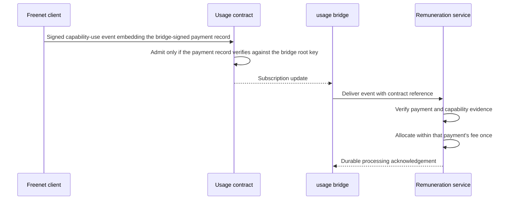

# Remuneration

The remuneration service owns contributor balances, allocations and payouts. It is one of the three services in the [EVY Developer authority table](../evy/README.md#13-contribution-and-earnings-workspace), alongside attribution and payment.

## 1. Purpose

Record capability-use claims in Freenet and notify the remuneration service. The remuneration service verifies paid operations and allocates each payment's 1% contributor fee only to the validated capabilities used in that operation. It owns balances, allocations, payout reservations, and payout execution. [Attribution](../attribution/README.md) identifies contributors. [Payment](../payment/README.md) supplies verified fee receipts.

Attribution units weight accepted work. Usage credits record verified paid usage and its allocation within one payment. Payable balances express funded allocations in a named currency. Usage outside paid operations remains analytics.

## 2. Usage flow



The host records a usage claim when verified domain evidence meets the action's declared completion condition. Application delegates supply domain interpretation and authorized signing through Core. The host or authorized delegate signs and queues the claim. A custom web client with its own integration submits equivalent domain evidence, and the service applies the same attester, certified-content, funding and policy checks to every path. A usage contract stores the event, and the bridge subscribes to its updates. The bridge notifies remuneration and saves its delivery position. It periodically checks the contract for events it has yet to deliver.

## 3. Usage record

```text
schema_version
usage_event_id
product_id
application_content_ref
contribution_record_id
capability_id
operation_id
payment_id
event_kind
evidence_reference_or_digest
producer_key
signature
```

Derive `usage_event_id` from the product, capability, operation ID, and event kind. Preserve that ID through offline retries. `application_content_ref` is the payment's original publication or native artifact reference. `contribution_record_id` identifies its signed certification under [bundle integration](../attribution/README.md#4-bundle-integration). Use a canonical, domain-separated encoding for the event ID and product-scoped operation IDs. Claims for remuneration require a payment ID bound to the same order and operation. Keep customer content and private identity in their authorized stores.

The contract admits an event only when it embeds the bridge-signed payment record for its payment ID and that record verifies against the bridge root key in the contract parameters. Only events for real payments are valid, so a device key alone gains no write access. The contract also checks schema, signature and product scope. The remuneration service checks the capability ID against the signed contribution record bound to the payment ([attribution section 4](../attribution/README.md#4-bundle-integration)).

The usage contract uses the same admission shape as the [Marketplace admission contract](../marketplace/README.md#5-structured-fulfillment-requests):

| Rule | Value |
| --- | --- |
| Record size | 4 KiB including the embedded payment record and signature |
| Records per epoch instance | 4,096 |
| Eviction | Deterministic. Keep the lowest full content digests |
| Variants retained per event ID | 2, by lowest digest, as explicit conflict evidence |
| Instance boundary | One contract instance per product and epoch. Parameters are the product, the epoch number and the bridge root key |

A usage epoch is a contract instance, not a partition inside one contract. A saturated epoch stops growing, and the bridge opens the next epoch and records the boundary. Merge events within an instance as an idempotent set. Two individually valid states union within the limit because eviction is deterministic over the combined set. Allow delayed events into the epoch named in their payment record.

Each product defines the qualifying capabilities, completion evidence, authorized attesters, and allocation weights for each operation type. The [checkout bindings](../payment/README.md#2-checkout-flow) fix that policy and the certified content reference for the payment. Verify completion against domain records, such as the order's validated state transition. Payment evidence proves funding. Completion evidence proves qualifying capability use. Claims stay pending until both checks pass.

Credit requires validated completion evidence. Repeated renders, new event IDs and replayed notifications for the same payment and capability resolve to one allocation. The contract's admission check is the embedded payment record. The service then checks the producer key against the policy bound at checkout, since that policy lives in the payment service. Domain evidence establishes eligibility, which the service checks against the fixed policy.

## 4. Bridge and credit accounting

1. Read the event from its contract and verify its signature, completion evidence, and payment-to-operation binding.
2. Ask the attribution service to verify the original content-to-contribution mapping, publication or native distribution evidence, and included capability ([attribution section 6](../attribution/README.md#6-interface-to-remuneration)).
3. Require that answer to name the contribution record, snapshot and policy version bound to the payment at checkout. A mismatch rejects the claim with a recorded reason.
4. Verify the collected contributor fee against reconciled processor records, then apply the payment's fixed allocation as section 5 defines.
5. Commit the payment and event IDs, evidence decision, snapshot, policy, and credit entries in one database transaction. Enforce the payment's fee cap across all allocations.
6. Acknowledge processing after commit. Retry with the same event ID.

Store uniqueness constraints on event IDs, processor fee receipts, and payment-capability-recipient allocations. Two bridge workers receiving the same claim produce one credit result. Retain pending, credited, rejected, and conflicted states with reasons. After application withdrawal or commercial suspension, process existing payments under their recorded settlement policy. Late events retain their payment, content, contribution-record and policy bindings and follow the published claim cutoff.

Each payment funds its own qualifying usage. Fabricated activity can recover at most that payment's contributor fee through remuneration. Processing costs and fraud losses still require payment controls, funded separately by the payment service's operating budget. Payment controls also cover processor losses and subsidies.

## 5. Funding and allocation

Each successful eligible checkout contributes the 1% fee defined in the [payment plan](../payment/README.md#3-the-1-fee), under the bindings it fixed. Track currencies separately in integer minor units.

Reserve each payment's available contributor fee once. Divide it across the operation's qualifying capabilities using the weights fixed at checkout, then across their contributors, reviewers, and validators using the bound attribution snapshot and policy. Total allocations must stay within that payment's collected fee after reversals.

Remuneration owns allocated, reserved, payable and paid balances. Payment supplies the fee receipt. For a partial refund, calculate the cumulative refunded proportion of the original contributor fee with round-half-up, cap it at the original fee, and subtract reversals already recorded.

Use deterministic remainder allocation with stable recipient ordering. Record fee receipts, credit entries, policy, arithmetic, and remaining balance per payment. Keep pending capability shares reserved against their originating payment. Return unclaimed shares to the original contributor-fee payer after the bound claim cutoff. Preserve receipt lineage for every return. Keep allocations with empty or missing recipient weights pending against that payment until the weights are resolved or the funds are returned. Payout batches may combine funded balances while preserving each payment's allocation.

Require one signed, versioned settlement policy with these fields:

| Fields | Purpose |
| --- | --- |
| Capability weights, attribution snapshot and role shares | Determine each recipient's allocation |
| Payout schedule and minimum payout by currency | Determine when a balance can be paid |
| Claim cutoff and unclaimed-fee return rules | Determine when unused funds return to the payer |
| Payout delay and reversal reserve | Define when funds become payable and how much to retain for reversals |

The service operator approves these values before launch. Checkout requires every field. Each payment keeps its policy through delayed completion, client updates and later policy changes.

Attribution supplies the recipients and weights for each role pool. Payment supplies immutable fee receipts and funding adjustments. Remuneration reserves funds and records payout state. Append allocation entries and preserve the underlying credits.

## 6. Double-spend prevention and payouts

The remuneration service's transactional ledger owns fund reservations and payout state. Atomically reserve fee receipts and payable balances before creating a payout request. Unique constraints prevent reuse in a second settlement.

Release payable amounts only after processor settlement and the policy's payout delay, retaining the required reversal reserve. Use stable payout IDs and processor idempotency keys. After a timeout, reconcile the existing processor operation before retrying. Persist pending, processing, paid, failed, and reversed outcomes. Release a reservation only after the processor confirms the relevant failure or cancellation.

Keep legal identity, payout endpoints, tax records, and processor credentials in the remuneration service's protected services. Contributors view credits, payable funds, and payout history through the remuneration service. Record currency conversion separately if a contributor selects it.

Persist transfer recovery separately from the payout record. A refund or chargeback appends a funding adjustment. Apply the published reserve and recovery policy to unsettled funds or future allocations. Reconcile a reversal that arrives after payout against the original receipt and settlement.

## 7. Recovery and authority

The remuneration service runs the usage bridge, durable queues, database backups, and reconciliation jobs. Retain recoverable event archives and republish active Freenet state as needed. Test outages across both sides of the bridge.

During a service outage, clients continue to record capability use and show queued credit processing. Recovery resumes from durable cursors and deduplicates every event. Credit and payout displays include their last confirmed service update.

The remuneration service signs auditable statements of credit and settlement results. Keep the financial ledger and contributor allocations in the remuneration service. Freenet usage records supply the event trail.

## 8. Delivery

Shared fixtures submit the same operation from SDUI, web, native and two devices. Test fresh event IDs against the same payment, application updates and publisher transfers between checkout and fulfillment, changed policy, key recovery, missing weights and reordered funding reversals. Every case preserves the original payment binding and one funded allocation.


| Phase | Delivers | Done when |
| --- | --- | --- |
| 1. Usage events | Contract schema, payment-record admission, capacity profile and declared completion-evidence actions | One completed operation records one stable event through retries, and an event without a valid payment record fails admission |
| 2. Credit bridge | Payment binding, completion evidence and transactional credits | Replays with new IDs count once, and unrelated capability or payment claims fail |
| 3. Funding | Per-payment fee receipts and fixed allocations | Allocations and remainders reconcile per payment, and manufactured usage receives at most its own fee |
| 4. Payouts | Reservations, recipient registration and processor reconciliation | Racing workers and timeout retries produce one payout |
| 5. Recovery | Outage, late-event, refund and chargeback handling | Event history survives bridge recovery and reversals remain auditable |

## 9. Migration into Freenet

Move accounting when Freenet has primitives for exclusive fund reservation, double-spend prevention, final settlement decisions, and recoverable financial history. Preserve usage IDs and ledger lineage. Prove replay and concurrent-spend safety before transferring authority. Fiat collection and payout also need an agreed network primitive and processor integration, as the payment plan describes.
