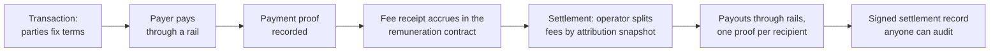

# Remuneration

Freenet products will move money: a buyer pays a seller, and part of the price (the product fee) funds the people who built and maintain the product. The [product attribution app](../attribution/README.md) records who those people are and their relative weights; this plan is the other half: how fees are collected, split, and paid out.

It is currency-agnostic. The same records work whether value moves as card payments, bank transfers, stablecoins, Bitcoin, or cash handed over in person, and nothing in the protocol ever converts between currencies or prefers one.

This plan stands alone and nothing else requires it. It consumes a product's attribution snapshots when they exist, and falls back to policy-named recipients when they don't. Products keep working with no payments at all; the [marketplace plan's payment boundary](../evy/blocks-08-marketplace.md#9-payment-boundary) is the first intended consumer.

## 1. Why Freenet cannot hold the money

Money needs one property Freenet deliberately does not provide: a single agreed order of events. To stop the same coin being spent twice, everyone must agree which of two spends came first. Freenet contracts have no clock and merge concurrent updates in any order with the same result. That design makes the network resilient, and it makes a balance stored in a contract unsafe, because two conflicting spends would both look valid. The [whitepaper](https://github.com/freenet/paper-1) acknowledges this: double-spend-safe transfer cannot be a single contract.

So the responsibilities split three ways:

- **Freenet keeps the books.** What should be paid, what was claimed paid, and how fees were distributed are signed records anyone can re-check.
- **Rails move the money.** A rail is any existing payment system: a card processor, a bank transfer, a blockchain, cash.
- **Operators bridge the two.** A settlement operator holds fees between collection and payout. The books keep it honest: every step leaves a signed record, so cheating is provable even though it is not preventable (section 6).



## 2. Currency-agnostic amounts

An amount is a pair: an asset identifier and an integer count of that asset's smallest unit.

```text
asset   "iso4217:USD" | "iso4217:EUR" | "btc:sat" | "eth:usdc" | ...
units   integer minor units (cents, satoshi); never floating point
```

- The protocol never converts. Totals, splits, minimums, and audits are all computed per asset; there is no protocol exchange rate and no unit of account.
- Conversion is a rail-level event, recorded when it happens: amount in, amount out, and who chose the rate. The record makes a conversion auditable; the protocol does not judge it.
- A contributor whose product collects euros and satoshi is owed euros and satoshi, unless they opt into a recorded conversion.

## 3. Three record kinds

| Record | Says | Comes from |
| --- | --- | --- |
| **Terms** | What should be paid: price, accepted assets, the fee and the fee-policy version it was computed under | The product's published fee policy plus the transaction parties' signatures |
| **Payment proof** | Value moved on a rail | The rail (section 4); graded by how independently checkable it is |
| **Settlement** | How collected fees were distributed: the snapshot used, per-recipient amounts per asset, payout proofs, carried-over remainders | The settlement operator's signature |

Payment proofs come in two grades, and the grading is honest labelling, not a ranking of worth:

- **Grade A, cryptographically verifiable.** Anyone can re-check it offline or against public data: a Lightning payment preimage matching the invoice hash, an on-chain transaction reference.
- **Grade B, attested.** Someone signed a claim that it happened: a processor receipt, a bank-statement match, a countersigned cash handover. Auditable and disputable, not independently provable.

A card payment can only ever be grade B, and that is fine. The rule that matters is fixed here and holds everywhere: **a contract never treats a payer's own claim as proof of payment.** Proof comes from the rail or the counterparty, never from the person who benefits from asserting it.

## 4. Payment rails

A rail is an adapter with four operations; anything that can implement them can carry value for a Freenet product:

```text
quote(terms)               what paying these terms costs on this rail
collect(terms)             payer pays; returns a payment proof
payout(recipient, amount)  operator pays out; returns a payout proof
verify(proof)              grade A: re-check locally; grade B: check the attestation
```

| Rail | Proof grade | Notes |
| --- | --- | --- |
| Card processors | B | Receipts are operator attestations; chargebacks exist and are recorded as reversal events that adjust future settlements |
| Bank transfer | B | Reference-matched statements, attested by the operator |
| On-chain crypto (BTC, stablecoins) | A | Transaction reference re-checkable by anyone with chain access |
| Lightning | A | Payment preimage matches the invoice hash |
| Cash in person | B | Countersigned receipt between the parties |

Rail choice is per transaction and per payout. A product declares which rails its operator supports; how a fee is physically carved out is the rail's business (some split at source, others collect the full price and forward the principal), and either way both legs produce proofs.

## 5. The fee pipeline

1. **Terms.** A transaction (a marketplace order, a paid feature) fixes the price, the accepted assets, and the fee, computed from the product's published, versioned fee policy (basis points of the price, a flat amount, or zero). The fee policy also maps each transaction kind to the capabilities it draws on (a completed sale might route across listing publication, discovery, and order handling), and terms carry that mapping's result, so every fee is usage-routed by construction. Terms name the policy version so an audit can recompute both the fee and its routing years later.
2. **Payment.** The payer pays through a rail. The principal goes to the seller; the fee goes to the product's settlement operator. The payment proof is recorded against the transaction, where order contracts and product flows can react to it.
3. **Accrual.** Each fee receipt merges into the remuneration contract: product, amount, asset, transaction reference, policy version. The contract holds records, never funds.
4. **Settlement.** On the cadence policy sets, the operator computes the split:
   - first across pools: contributor, reviewer, and validator pools, the operator's declared fee, and recorded rail costs, all versioned policy data;
   - then by usage: each receipt's contributor share divides among the capabilities its terms name, and within each capability among that capability's units in the attribution snapshot selected by the binding rule the [attribution app fixes](../attribution/README.md#10-interface-to-remuneration) (the snapshot of the highest non-conflicted release). Reviewer and validator pools are product-wide and ride on every receipt. A capability no receipt names in the settled range receives nothing: attribution units are permanent, and this usage gate is the only way they ever stop earning. A product with no attribution records names fixed recipients in policy instead.
5. **Payout.** The operator pays each recipient above the per-asset minimum through a rail the recipient registered (section 7), then signs one settlement record: snapshot id, per-recipient amounts per asset, payout proofs, and carried-over dust. Where a rail yields only grade-B proof, the recipient's countersigned receipt upgrades the audit trail.

**The remuneration contract.** One Freenet contract holds every product's receipts and settlements, found through a pointer under the ledger key and following the same no-clock, checkpoint, and upgrade discipline as the [attribution ledger](../attribution/README.md#9-the-ledger). Its code enforces:

- every record is signed by its claimed key, and fee receipts reference real terms;
- settlement arithmetic re-derives exactly: per asset, payouts + operator fee + rail costs + carry-over = fee receipts in the settled range, with each receipt's contributor share routed to the capabilities its terms name, all under the same rounding rule attribution uses;
- **a settlement embeds the weights it used, and their hash must equal the SnapshotId it names.** Snapshot ids are content hashes, so a forged split fails validation with no cross-contract read;
- settlements occupy strictly increasing slots per product, so the same receipts cannot be settled twice;
- reversals (chargebacks, failed payouts) are records that adjust future settlements; nothing edits history.

**Public and private.** Public by construction: fee totals, pool splits, and per-recipient amounts. There is no hiding them anyway, since attribution weights are already public and audits need the amounts. What never appears in any record: payout endpoints (bank details, addresses), legal identity, tax data. Recipients register endpoints encrypted to the operator and hold them in their own delegates.

## 6. Settlement operators

The operator is the one trusted component, kept deliberately small: custody between collection and payout, rail accounts, and the compliance duties (KYC, tax) that rails impose. Trust is bounded four ways:

- **Everything is provable.** The records let anyone re-derive every settlement; theft or mis-splitting is visible in public arithmetic.
- **Exposure is bounded.** An absconding operator costs at most the fees collected since the last settlement; settlement cadence is policy, so products bound that window deliberately.
- **The role is replaceable.** Policy names the operator key and the product key can rotate it; receipts and settlements before and after remain valid.
- **The role is plural.** Several operators can serve one product (per rail or per region), each settling the receipts it collected.

Alternatives considered: an on-network currency needs the global ordering Freenet doesn't provide (section 1); contract escrow fails for the same reason, since a contract that can't hold funds can't release them; a trust-minimized crypto-only deployment (every movement grade A and on-chain) is compatible with this design as a choice of rails and operator, not a different protocol.

## 7. Payouts and recipients

- A recipient is an ActorId from the attribution ledger (key rotation follows its lineage rules) or a policy-named key.
- Per-asset minimum payout thresholds keep rail fees from eating small amounts; below-threshold entitlements carry over and are listed in each settlement, so dust never silently disappears.
- Unreachable or unregistered recipients keep their entitlement for a policy-set number of settlements; after that, policy decides (return to the pools, or donate) and the outcome is recorded either way.

## 8. What this plan is not

- **Not a currency or token.** Nothing here mints, stakes, or trades anything.
- **Not escrow.** Contracts never hold funds, so they cannot release or freeze them.
- **Not pricing.** What a product charges is product policy; this plan makes whatever it charges auditable.
- **Not a promise that attribution units are money.** Units become money only when fees exist and a settlement includes them, and the [attribution app](../attribution/README.md) says the same.

## 9. Delivery

| Phase | Delivers | Done when |
| --- | --- | --- |
| 1. Records and arithmetic | Terms, receipt, and settlement encodings; the per-asset amount type; split arithmetic sharing attribution's rounding rule; golden fixtures | Independent implementations produce identical settlement bytes from the same inputs |
| 2. Remuneration contract | Merging, the checks of section 5, checkpoints, the same upgrade discipline as the attribution ledger | A forged split, a double-settled receipt, and an over-payout each fail to merge in tests |
| 3. One grade-A rail end to end | Lightning or an on-chain stablecoin rail; collect, accrue, settle, and pay out on a demo product with a real attribution snapshot | An outside auditor re-derives the settlement from public records alone, and every proof re-verifies |
| 4. One grade-B rail and operator tooling | A card-processor rail, reversal handling, recipient registration, operator tooling | A chargeback adjusts a future settlement without editing history; a recipient disputes a payout using records alone |
| 5. Hardening | Multiple operators, dust and unreachable-recipient policies exercised, operator-rotation drill, third-party audit tooling | Rotating the operator mid-cycle loses at most the declared in-flight window |

## 10. Open questions

1. Default pool split (contributors, reviewers, validators, operator fee): policy data that needs real products to price.
2. Settlement cadence without a clock: per release generation, threshold-triggered, or operator-attested calendar dates.
3. Whether grade-A proofs should verify inside the contract (embedding chain proofs) or stay client-audited; start client-audited.
4. Operator accountability beyond evidence: bonds, insurance, or multiple co-signing operators.
5. How a payer proves fee payment to an order contract without revealing which rail they used.
6. Whether entitlements can be redirected (payroll-like flows) or stay bound to the ActorId lineage.
7. How capability routings for new transaction kinds get contested: the mapping is public, versioned product policy, but a mapping that steers fees toward favoured capabilities is a governance question the records expose without settling.

## References

- [Freenet whitepaper](https://github.com/freenet/paper-1) (double-spend and ordering constraints)
- [Product attribution app](../attribution/README.md) (the weights this plan pays against, and the snapshot binding rule)
- [Marketplace payment boundary](../evy/blocks-08-marketplace.md#9-payment-boundary) (the first intended consumer)
